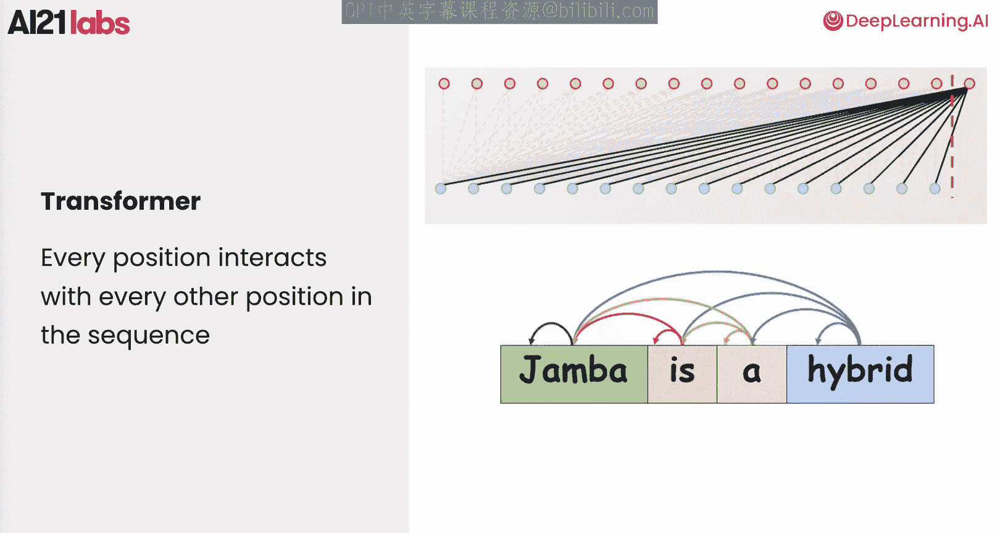
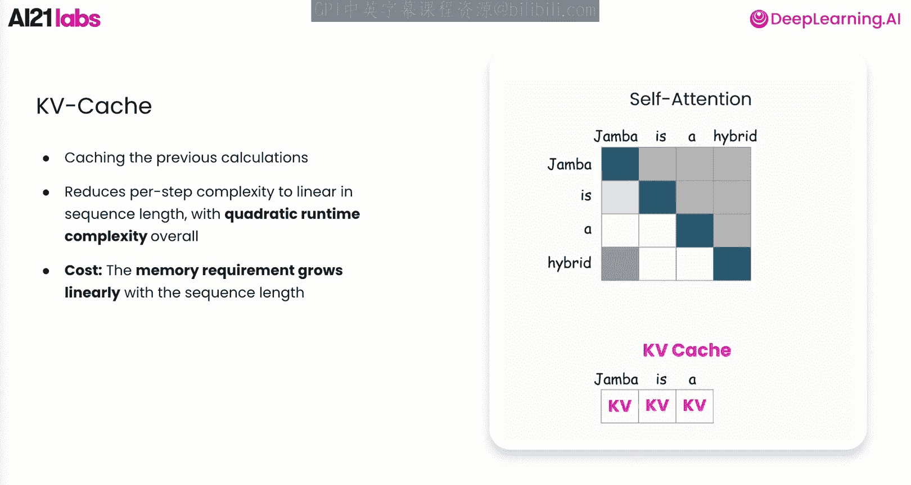
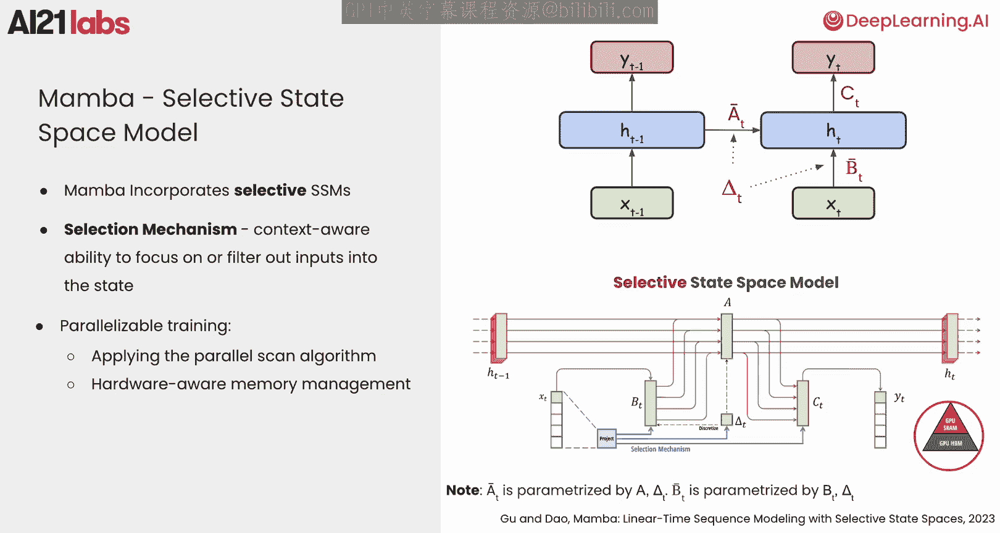
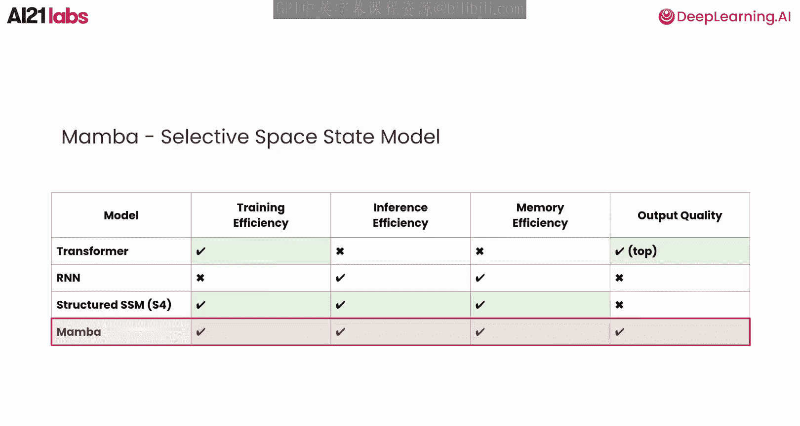
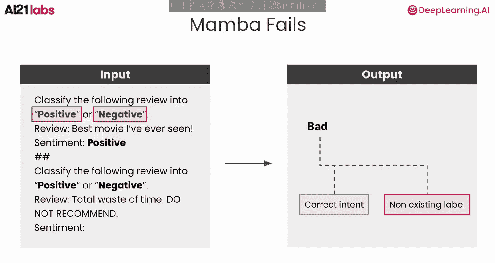
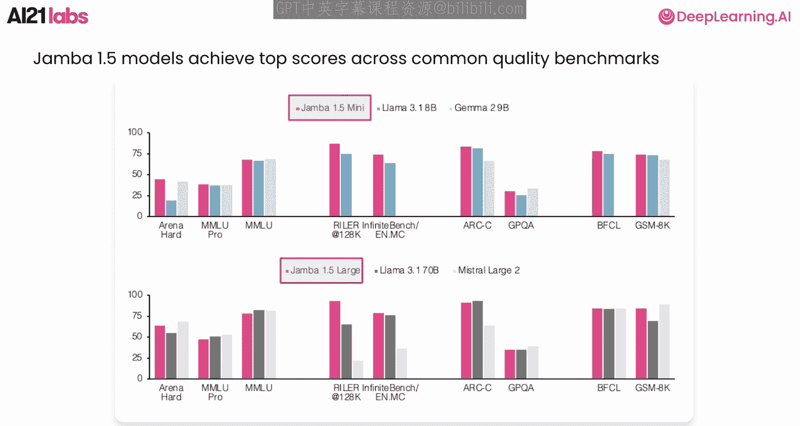
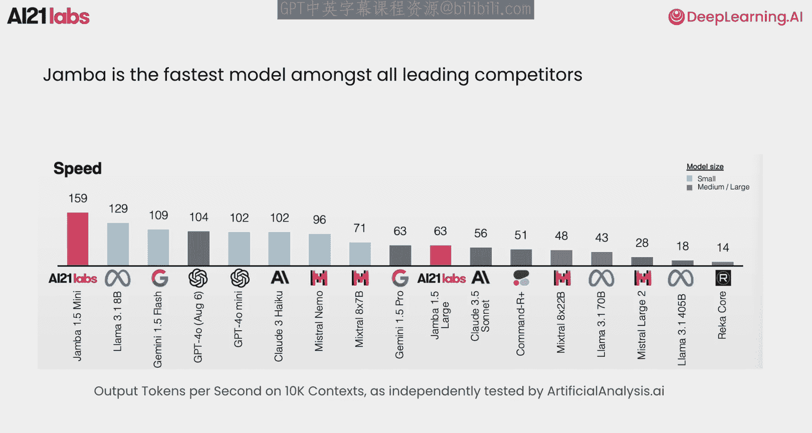

# 004：Jamba的提示与文档处理

在本节课中，我们将深入探讨Transformer、状态空间模型及其演变过程。理解这些基础将有助于我们看清Jamba如何在其之上构建，并解决大语言模型架构中的关键挑战。

## Transformer架构概述

上一节我们介绍了课程背景，本节中我们来看看Transformer架构的细节。Transformer是当前语言模型的主流架构。

该架构基于注意力机制，序列中的每个词元都会与所有其他词元进行交互，使模型能够捕捉词元之间的复杂关系。它会创建一个矩阵，将每个词元与其之前的所有词元进行比较。

矩阵中的权重由词元对之间的相关性决定。由于序列中所有词元之间的成对交互，其计算复杂度是二次的。

## Transformer的推理过程

现在，让我们看看Transformer如何进行推理。在生成每个词元时，模型会计算序列中所有过去词元的注意力。每个生成的词元随后都会被包含在输入中，并为每个词元重复此过程。

为了避免在每一步生成时都重新计算所有先前词元的注意力，我们使用KV缓存。K缓存存储了先前词元在注意力计算中使用的向量表示，使我们能够专注于计算新词元的注意力。

使用KV缓存后，每一步的时间复杂度与序列长度呈线性关系，但整体上仍具有二次复杂度。然而，这种方法带来的代价是内存需求随序列长度线性增长。重新访问整个上下文会带来巨大的内存和计算需求，并导致推理速度变慢，难以扩展。

对于长序列，这些需求会造成重大限制。为了克服这一点，我们正在探索一种能更高效管理上下文的替代方法。

## 状态与状态空间模型

为了探索这种方法，让我们首先定义“状态”的概念。状态代表存储相关过去信息的内部记忆，帮助模型对未来词元做出准确预测。

不同的模型根据其架构以不同方式处理这种记忆。Transformer通过其注意力机制创建了一种状态形式。它们实际上记住了历史中的每一个细节，我们可以将KV缓存解释为Transformer的状态。然而，这种方法效率很低。

Transformer的一种替代方法是采用固定的状态表示。这些模型将过去信息压缩成一个固定且可管理大小的状态，并在每一步应用。例如，无论上下文是200个词元还是200,000个词元，它都被压缩成相同大小的状态。我们将这些模型称为基于状态的模型。

在推理过程中，基于状态的模型只需要处理先前的状态 `H_{t-1}` 和当前输入词元 `x_t` 来将状态更新为 `H_t`，然后生成下一个输出 `y_t`。接着重复相同的过程以生成未来的输出。

这种方法极大地减少了计算需求。它能随输入长度高效扩展，避免了计算的二次增长。具体来说，这种方法每一步需要恒定的推理时间，并且具有恒定的内存复杂度，不随序列长度变化。这比基于注意力的架构的时间和内存复杂度要高效得多。

## 循环神经网络

如果这个概念看起来很熟悉，那是因为它位于RNN（循环神经网络）的核心，这是一种实现固定大小状态概念的传统架构。

RNN的核心组件是循环单元，它包含一个作为模型内部记忆的隐藏状态。让我们看看使用RNN生成词元的过程。模型使用词元“jamba”作为输入来更新隐藏状态，然后生成输出词元。这个隐藏状态携带了所有先前词元的压缩信息，以帮助生成下一个词元。

这意味着无论序列长度如何，内存需求都是恒定的，且时间复杂度随序列长度线性增长，这要高效得多。然而，由于信息被总结成固定大小，RNN可能会失去捕捉长距离依赖关系的能力，使其效果不如Transformer。此外，由于时间步之间的依赖关系阻碍了并行化，它们的训练成本高昂，限制了训练效率。

以下是Transformer和RNN的对比：
*   **RNN**：计算效率更高，但质量较低，且在训练时难以扩展。
*   **Transformer**：质量高，但计算和内存效率低。

有趣的是，RNN在Transformer之前就已出现，但由于其缺点，它们未能完全实现状态模型的潜力。

## 结构化状态空间模型

结构化状态空间模型，也称为S4，提供了一种更有效的状态管理方式，通过对模型参数和处理状态施加某种结构，使用线性操作。

下图展示了S4模型如何进行推理。`A_bar`、`B_bar` 和 `C` 是模型在每一步使用的参数，用于在给定输入词元 `x_t` 的情况下生成输出词元 `y_t`。模型通过分别使用 `A_bar` 和 `B_bar` 线性组合先前状态和当前输入来更新其状态。`A_bar` 帮助确定随着时间推移，从状态中要忘记和记住什么；`B_bar` 帮助确定要从新输入中记住什么。更新状态后，模型使用 `C` 将当前状态映射到输出。`C` 帮助确定如何使用更新后的状态来生成下一个词元。

`A_bar` 和 `B_bar` 的形式依赖于一个名为 `Δ`（Delta）的参数，它代表步长。它本质上控制了依赖先前状态与当前输入之间的平衡。

S4模型的一个显著特点是其双重表示。它们既可以作为线性循环运行，也可以作为一维卷积运行。通过使用卷积，S4引入了在保持RNN高效推理的同时大规模训练LLM的可能性。

让我们回到与RNN的对比。S4在推理和训练上都很高效，这是它们相对于RNN的关键优势。然而，其质量仍然落后于Transformer。主要原因是S4中的状态与输入无关。让我们再次查看结构化S4的图示。`A_bar`、`B_bar`、`C` 和 `Δ` 都是学习到的常数。这意味着在每一步，模型都以相同的方式处理每一个输入。

再次考虑这个短语：“Jamba is hybrid.”。在结构化S4中，所有这些词元对模型将用于生成下一个词元的状态贡献相同。然而，词元“Jamba”和“hybrid”对于生成下一个词元更为相关。

## 选择性状态空间模型与Mamba

选择性S4通过使所有参数依赖于输入来解决这个问题。这种选择性概念使模型能够根据输入与任务的相关性来聚焦或过滤输入。因此，通过选择，状态变得更具表现力，在保持简洁的同时只关注最重要的细节。

Mamba是一种状态空间模型，它将选择性S4整合到一个循环架构中，根据当前输入选择性地处理信息。这种选择机制使Mamba具有上下文感知能力，使其能够自适应地确定哪些信息应存储在状态中以供未来预测。通过将结构化状态空间建模与选择性过滤过程相结合，Mamba在高效状态管理和目标信息保留之间取得了平衡。

现在，如果你查看Mamba论文，你会看到这张图，它比你目前看到的简化图示展示了更多细节。例如，`A_bar_t` 不仅依赖于我们之前讨论的 `Δ_t`，还依赖于另一个矩阵参数 `A`。在本课中，我们不会深入探讨 `A` 实际代表什么，但如果你想了解更多关于 `Δ_t` 和 `A` 如何与 `A_bar_t` 相关的信息，我鼓励你查看Mamba论文。

请注意选择机制如何专门应用于 `Δ_t`，这也间接影响了 `A_bar_t`。`B_bar_t` 依赖于两个参数 `B` 和 `Δ_t`。请注意选择机制如何应用于 `Δ_t` 和 `B`。最后，两个 `C` 是等价的。请注意选择机制也应用于 `C`。

然而，选择机制破坏了计算卷积的能力，而这正是结构化S4训练中实现并行化的关键。Mamba的另一个重要贡献是其在训练期间保持并行化的能力。这是通过应用并行扫描算法和硬件感知内存管理来实现的。

再次，我鼓励你查看Mamba论文以获取更多细节。最终，我们得到了一个强大的架构，在训练效率、推理速度和内存占用方面表现出色，同时还能提供高质量的性能。这就是为什么Mamba在Transformer力不从心的地方取得了成功，特别是在处理长上下文和实际生产工作负载方面。

## Mamba的局限性与Jamba的诞生

但不幸的是，Mamba也有其缺点。当某些操作需要对特定词元进行仔细处理时，Mamba会表现不佳。隐藏状态的紧凑表示是不够的。

这时就需要注意力机制。一个例子是从上下文中复制特定的单词或句子。如这篇论文所示，Mamba在预测重复的单词序列方面不太成功。这是一个从输入中复制很重要的例子，Mamba的表现会比Transformer差。模型需要将电影评论分类为正面或负面。

这是一个示例输出。Transformer在此类任务中表现出色，不仅能成功识别评论的意图，还能输出正确的标签。然而，即使Mamba成功识别出正确的意图，它也经常输出一个不存在的标签，因为它没有关注上下文中找到的确切标签选项。

为了在获得这些架构优势的同时减轻其缺点，我们实现了自己新颖的架构，称为Jamba。Jamba代表“联合注意力与Mamba”，它结合了注意力层和Mamba层。

## Jamba架构详解

在Transformer和Mamba组合的基础上，我们还使用了一项称为混合专家的附加技术，它允许我们在每个词元上仅使用一部分模型权重，这部分权重由路由器选择。每个这样的部分称为一个专家。这样，我们可以在不牺牲速度或成本的情况下提高质量。我们将Transformer、Mamba和MoE的组合称为Jamba块，它创建了一个强大而灵活的架构。

这种灵活性使Jamba能够平衡有时相互冲突的目标：低内存使用、高吞吐量和高质量输出。因此存在一个权衡：添加更多的Transformer层有助于解决我们讨论的Mamba问题，但也会增加复杂性。关键是找到最优的数量。

在我们进行的应用中，如论文中详述，我们发现7个Mamba层和1个注意力层的比例在质量和效率上达到了最佳平衡，同时在内存占用方面也高效得多。

回到我们的对比表格，我们可以看到Jamba实现了与Transformer相媲美的顶级性能，同时在所有方面都保持了高效率。通过基准测试来支持这一点，我们可以看到Jamba 1.5模型在常见的质量基准测试中取得了顶级分数。

此外，Jamba是所有主要竞争对手中最快的模型，在不影响性能的情况下为效率设定了新标准。

## 总结

在本节课中，我们一起学习了Jamba的Transformer、Mamba和混合专家组件的混合结构，使其能够自适应地管理资源，同时保持性能，使其成为可扩展语言建模的强大选择。

