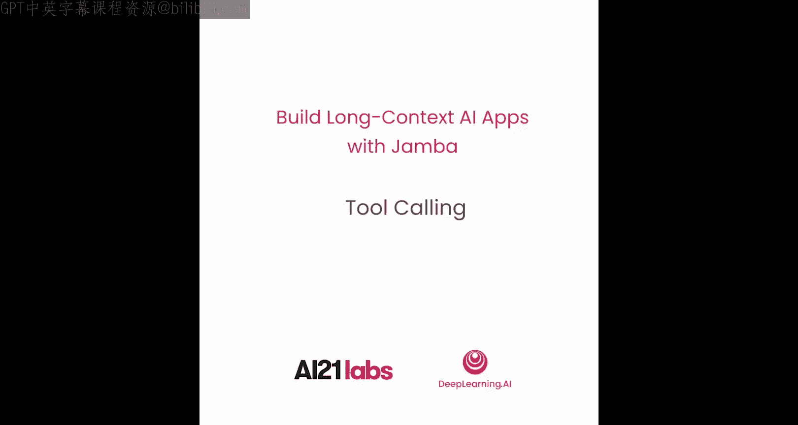
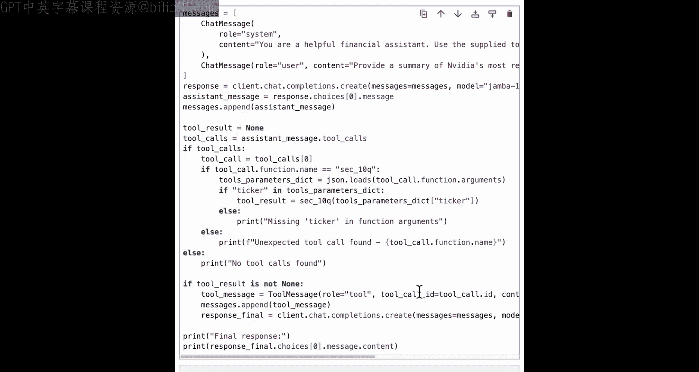

# 005：工具调用 🛠️



在本节课中，我们将学习Jamba模型的核心功能之一：工具调用。你将了解工具调用的概念、工作流程，并通过动手实践掌握如何让Jamba模型与外部函数和API协同工作。

## 概述


工具调用功能使Jamba模型能够与外部工具（如API或自定义函数）进行交互，从而获取实时数据或执行特定计算，以生成更准确、更丰富的回答。这对于构建功能强大的AI应用至关重要。

## 工具调用工作流程

上一节我们介绍了工具调用的概念，本节中我们来看看其具体的工作流程。

当用户向Jamba模型发送查询时，模型会判断是否需要使用可用的工具来提供最佳答案。如果不需要使用任何工具，Jamba模型将直接生成回复。如果需要使用工具，Jamba模型会根据用户查询，为正确的工具提取合适的参数。这些参数随后被用于调用工具，工具返回的结果会发送回Jamba模型，以生成最终的响应。

## 代码实践：算术工具调用

现在，让我们进入代码实践环节。首先，我们需要设置环境并导入必要的库。

```python
import warnings
warnings.filterwarnings('ignore')

from ai21 import AI21Client
from ai21.models import Tool, ToolChoice
import os

# 设置API密钥并创建客户端
client = AI21Client(api_key=os.environ["AI21_API_KEY"])
```

我们知道，大语言模型并不擅长精确的算术计算。因此，我们可以为Jamba模型提供乘法（`multiplication`）和加法（`addition`）这两个算术函数，供其在需要时调用。

以下是这两个函数的定义：

```python
def multiplication(a: float, b: float) -> float:
    """Multiply two numbers."""
    return a * b

def addition(a: float, b: float) -> float:
    """Add two numbers."""
    return a + b
```

接下来，我们需要让Jamba模型知道这两个函数是可用的。我们可以使用AI21 SDK中的`Tool`定义来描述这些函数。

以下是定义工具的方法：

```python
# 定义乘法工具
multiplication_tool = Tool(
    type="function",
    function={
        "name": "multiplication",
        "description": "Multiply two numbers together.",
        "parameters": {
            "type": "object",
            "properties": {
                "a": {"type": "number", "description": "The first number."},
                "b": {"type": "number", "description": "The second number."}
            },
            "required": ["a", "b"]
        }
    }
)

# 定义加法工具
addition_tool = Tool(
    type="function",
    function={
        "name": "addition",
        "description": "Add two numbers together.",
        "parameters": {
            "type": "object",
            "properties": {
                "a": {"type": "number", "description": "The first number."},
                "b": {"type": "number", "description": "The second number."}
            },
            "required": ["a", "b"]
        }
    }
)

# 将工具放入列表
tools = [multiplication_tool, addition_tool]
```

现在，让我们测试一个不需要调用工具的问题。

```python
messages = [
    {"role": "user", "content": "What is the capital of France?"}
]

response = client.chat.completions.create(
    model="jamba-1.5-large",
    messages=messages,
    tools=tools
)

print(response.choices[0].message.tool_calls)  # 输出应为 None
```

如你所见，对于“法国首都是什么”这个问题，模型没有调用任何工具，这是符合预期的。

现在，让我们问一个需要计算的问题。

```python
messages = [
    {"role": "system", "content": "You are a helpful assistant."},
    {"role": "user", "content": "Please multiply 123 and 456 for me."}
]

response = client.chat.completions.create(
    model="jamba-1.5-large",
    messages=messages,
    tools=tools
)

# 检查响应
assistant_message = response.choices[0].message
print(assistant_message.tool_calls)
```

在响应中，你会看到`tool_calls`部分包含了调用的函数名（`multiplication`）和参数（`{"a": 123, "b": 456}`）。这表明Jamba模型正确地识别出需要使用乘法函数。

以下是执行工具调用并获取最终响应的完整步骤：

```python
# 1. 从模型响应中提取工具调用信息
tool_call = assistant_message.tool_calls[0]
func_name = tool_call.function.name
func_args = tool_call.function.arguments  # 这是一个JSON字符串

# 2. 根据函数名调用对应的本地函数
import json
args_dict = json.loads(func_args)

if func_name == "multiplication":
    result = multiplication(args_dict["a"], args_dict["b"])
elif func_name == "addition":
    result = addition(args_dict["a"], args_dict["b"])

# 3. 将工具执行结果封装成消息
tool_message = {
    "role": "tool",
    "tool_call_id": tool_call.id,
    "content": str(result)
}

# 4. 将初始的助手消息和工具消息一起发送回模型，获取最终回答
final_messages = messages + [assistant_message] + [tool_message]

final_response = client.chat.completions.create(
    model="jamba-1.5-large",
    messages=final_messages,
    tools=tools
)

print(final_response.choices[0].message.content)
```

## 代码实践：调用外部API

除了自定义函数，工具调用更常见的用途是连接外部API。让我们看一个从美国证券交易委员会（SEC）获取公司10-Q季度报告摘要的例子。

首先，我们假设有一个能获取SEC文件的函数。

```python
def sec_10q_fetch(ticker: str) -> str:
    """
    Fetches the full text of the most recent 10-Q report for a given company ticker from the SEC website.
    """
    # 这里是模拟实现。实际应用中，你会调用真正的SEC API。
    # 例如，使用 `requests` 库访问 EDGAR 数据库。
    return f"Full text of the most recent 10-Q report for {ticker}. (This is simulated content.)"
```

接着，我们为这个函数定义工具。

```python
sec_tool = Tool(
    type="function",
    function={
        "name": "sec_10q_fetch",
        "description": "Fetch the most recent 10-Q filing for a public company by its stock ticker symbol.",
        "parameters": {
            "type": "object",
            "properties": {
                "ticker": {"type": "string", "description": "The stock ticker symbol of the company (e.g., AAPL, TSLA)."}
            },
            "required": ["ticker"]
        }
    }
)

tools_sec = [sec_tool]
```

现在，我们可以要求Jamba模型为我们总结一家公司最近的10-Q报告。

```python
messages = [
    {"role": "system", "content": "You are a financial analyst assistant."},
    {"role": "user", "content": "Please summarize the most recent 10-Q report for Meta Platforms, Inc. (META)."}
]

response = client.chat.completions.create(
    model="jamba-1.5-large",
    messages=messages,
    tools=tools_sec
)

# 检查模型是否调用了工具
assistant_message = response.choices[0].message
if assistant_message.tool_calls:
    tool_call = assistant_message.tool_calls[0]
    func_name = tool_call.function.name
    func_args = json.loads(tool_call.function.arguments)
    
    # 调用SEC函数
    if func_name == "sec_10q_fetch":
        sec_content = sec_10q_fetch(func_args["ticker"])
        
    # 创建工具消息
    tool_message = {
        "role": "tool",
        "tool_call_id": tool_call.id,
        "content": sec_content
    }
    
    # 获取最终摘要
    final_messages = messages + [assistant_message] + [tool_message]
    final_response = client.chat.completions.create(
        model="jamba-1.5-large",
        messages=final_messages,
        tools=tools_sec
    )
    
    print("Summary:")
    print(final_response.choices[0].message.content)
```

通过这几行代码，Jamba模型就能够指向正确的函数，从SEC网站获取文档，并为你生成摘要。

## 总结

本节课中，我们一起学习了如何使用Jamba模型进行工具调用。我们了解了其工作流程，并通过算术计算和调用SEC API两个实例，掌握了定义工具、让模型识别工具、执行工具调用并整合结果生成最终响应的完整过程。这是构建能够与外部世界交互的AI应用的关键技能。



在下一节课中，你将学习如何扩展大语言模型的上下文窗口大小。