# 006：扩展上下文窗口大小 📈

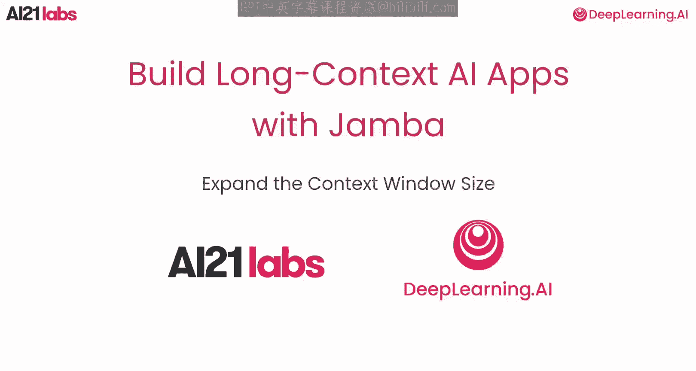

在本节课中，我们将聚焦于长上下文能力。我们将探讨支持、训练和利用长上下文所需的条件，并学习评估长上下文模型的性能指标。

## 长上下文能力与应用场景 🚀

上一节我们介绍了课程概述，本节中我们来看看长上下文能力如何释放大型语言模型的全部潜力，使其在一系列复杂任务中表现出色。

以下是长上下文模型的主要应用场景：

*   **文档处理与推理**：在处理金融协议或法律合同等文档时，长上下文模型能保持关键上下文和细节，进行有效推理。
*   **检索增强生成**：在RAG流程中，长上下文模型增强了检索信息的整合能力，提高了找到既准确又上下文连贯的答案的几率。
*   **多轮对话历史**：这些模型可以保留多轮交互历史，确保对话的一致性和自然性。
*   **上下文学习**：与微调不同，我们可以将数千个示例直接嵌入上下文。这种方法成本效益高且灵活，无需重新训练即可快速适应新任务。
*   **智能体与高级推理**：长上下文模型对于智能体需求以及思维链等高级推理任务至关重要。它们可以支持决策制定和复杂问题解决所需的大量令牌选择。

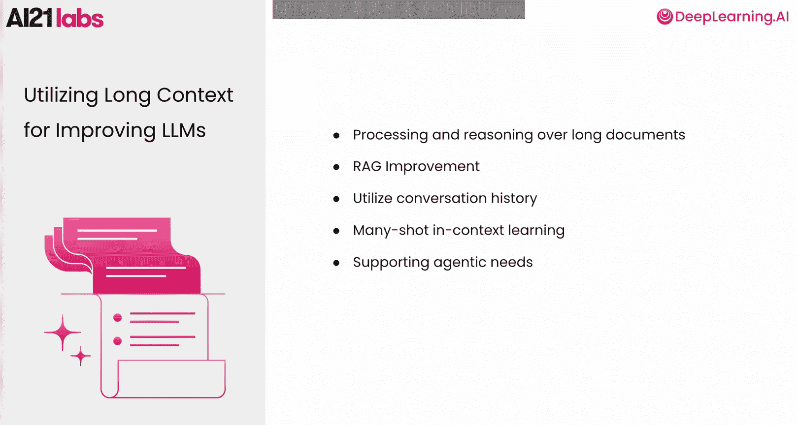

## 训练长上下文模型的挑战 ⚠️

了解了长上下文的应用价值后，我们来看看训练一个长上下文模型面临的一系列重大挑战。

以下是训练长上下文模型的主要挑战：

*   **巨大的计算成本**：更长的序列会显著增加训练时间，仅使用长上下文数据训练模型会变得极其昂贵。
*   **Transformer架构的固有局限**：作为大多数LLM的骨干，Transformer架构在扩展到长上下文时面临固有的限制。这些问题因计算瓶颈而加剧，GPU内存对模型能处理的上下文长度施加了严格限制。
*   **数据挑战**：没有足够自然产生的长上下文数据可用于有效训练。
*   **长短上下文平衡**：在训练期间平衡长上下文和短上下文是另一个关键障碍。过度强调长上下文可能会损害短上下文任务的性能，而过于依赖短上下文数据则会限制模型泛化到更长序列的能力。
*   **评估困难**：评估长上下文模型尤其具有挑战性。标准评估方法通常无法完全捕捉这些模型在真实场景中表现的复杂性。模型处理长上下文的能力并不一定等同于其在实践中有效利用这些信息的能力。

## 应对挑战的整体方案 🛠️

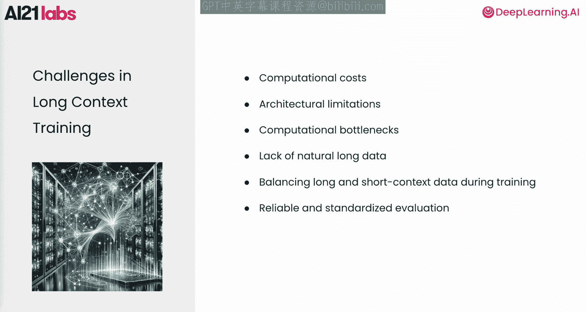

面对上述挑战，需要在架构、数据策略、训练基础设施与方法以及评估方法上进行创新。我们必须从各个方面着手，才能充分释放长上下文的潜力。

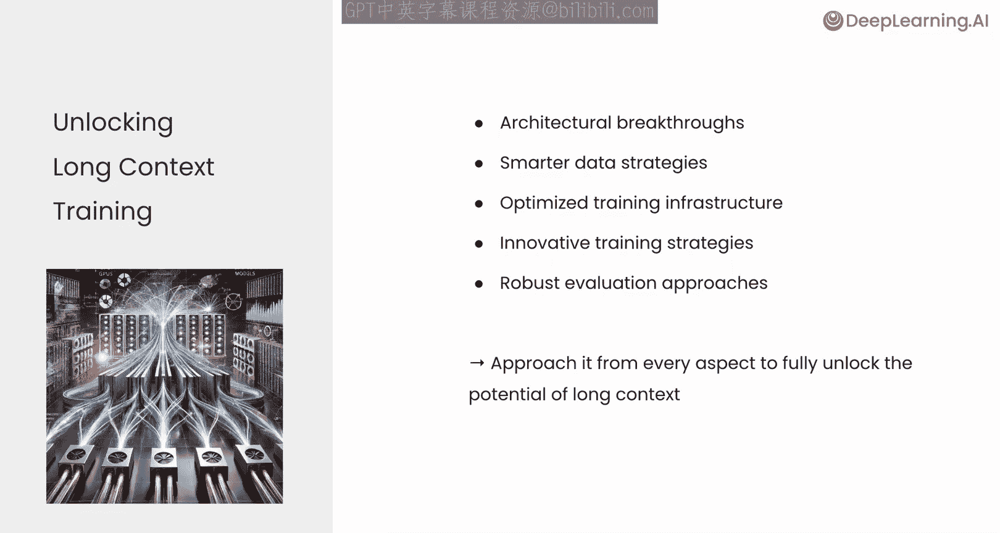

## 长上下文LLM的架构考量 🏗️

在探讨应对方案时，我们首先看看长上下文LLM的架构考量，了解推动进展的挑战与创新至关重要。

*   **纯Transformer架构的局限**：纯Transformer架构在扩展到长上下文时面临重大障碍。它们需要大量的内存和计算资源，这限制了其高效扩展的能力。虽然稀疏注意力等技术可以扩展上下文，但它们通常以质量下降为代价。
*   **Mamba架构的优势**：为了克服这些限制，业界转向创新架构。Mamba架构效率极高，不仅因为它支持并行化，还因为其基于状态的设计显著降低了计算和内存复杂度。这种组合实现了更快的训练和更低的资源使用，使其特别适合处理长上下文。
*   **Mamba的潜在不足**：然而，Mamba并不总能匹配Transformer的最高质量输出。例如，在需要整合整个上下文信息的任务中，Mamba可能难以有效压缩所有必要信息。
*   **Jamba混合架构**：Jamba混合架构将Mamba与Transformer层集成，结合了Mamba的效率和扩展上下文能力，以及Transformer提供高质量响应的能力。这种协同作用确保了卓越的性能，同时保持了训练的计算效率和资源友好性。回到长上下文的例子，注意力机制可以被视为执行“检索电话簿”的功能，恢复在压缩过程中可能丢失的重要信息。

## 优化训练基础设施 ⚙️

为了应对长上下文训练日益增长的计算需求，调整基础设施以支持高级并行化至关重要。

以下是几种关键的并行化技术：

*   **全分片数据并行**
*   **张量并行**
*   **序列并行**
*   **专家并行**

其中，**序列并行**对于长上下文训练至关重要。它通过沿Transformer层的序列维度在多个GPU上分布计算和激活内存来工作。这种方法不仅减少了内存占用，还通过优化先前未被并行化的Transformer部分来提升性能。

## 数据收集与生成 📊

接下来我们讨论数据收集与生成。数据的质量直接影响长上下文模型的有效性。

我们主要关注两种关键的数据源类型：

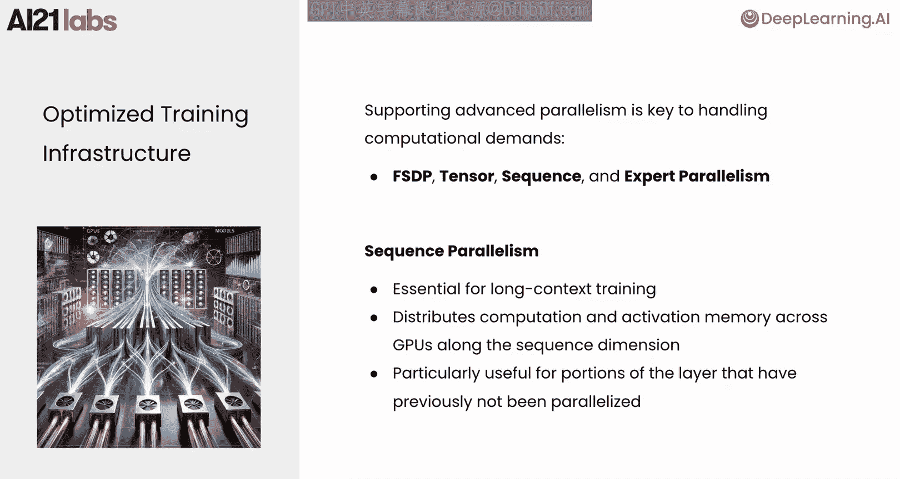

*   **自然长文档收集**：例如书籍和代码库。这些来源提供了丰富、连续的上下文，与长上下文模型的需求高度契合，提供了深度和复杂性。
*   **合成数据生成**：通过生成多样且相关的数据来补充自然数据，我们可以填补空白，并进一步大规模地训练模型。

## 长上下文LLM的训练阶段 🧑‍🏫

在选择了架构、优化了基础设施并准备好数据之后，我们现在可以深入探讨训练过程。让我们从审视训练长上下文LLM的基本阶段开始。

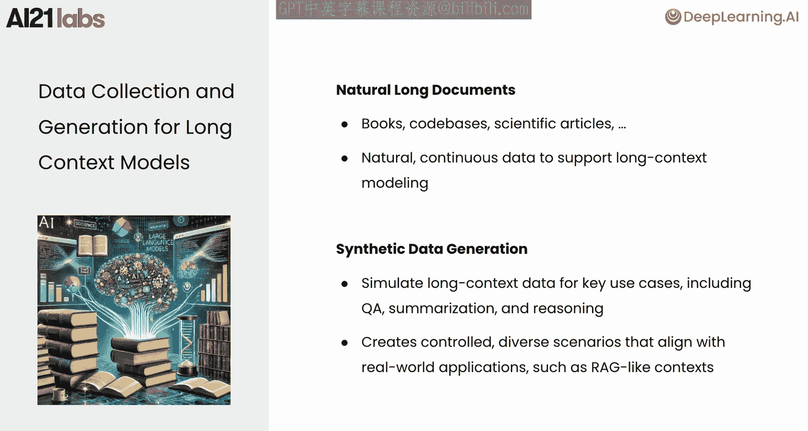

这些阶段大致可分为**预训练**、**中期训练**和**后训练**。

1.  **预训练**：模型学习预测序列中的下一个令牌，这使其能够深入理解语言和通用知识。
2.  **中期训练**：在训练长上下文模型时，在预训练和后训练之间引入了一个中期阶段。在此阶段，预训练继续进行，但使用高比例的长文档，以强调模型的长程能力。此阶段结束时，我们得到一个**长基础模型**。
3.  **后训练**：后训练通过在有监督微调数据上进行指令调优，使基础模型与人类指令对齐。在某些情况下，也会应用偏好优化来进一步提高性能。本节课我们只关注后训练阶段的SFT训练。

后训练的目标是同时实现两个目标：
*   第一，为模型提供技能和对话能力。
*   第二，保留预训练中获得的能力，特别是中期训练中发展的长上下文能力。

在此阶段结束时，我们得到一个**长指令LLM**，它能够遵循不同上下文长度的指令。

## 平衡长短上下文数据 ⚖️

在中期训练和后训练期间，平衡短上下文和长上下文数据是优化长上下文语言模型的关键。

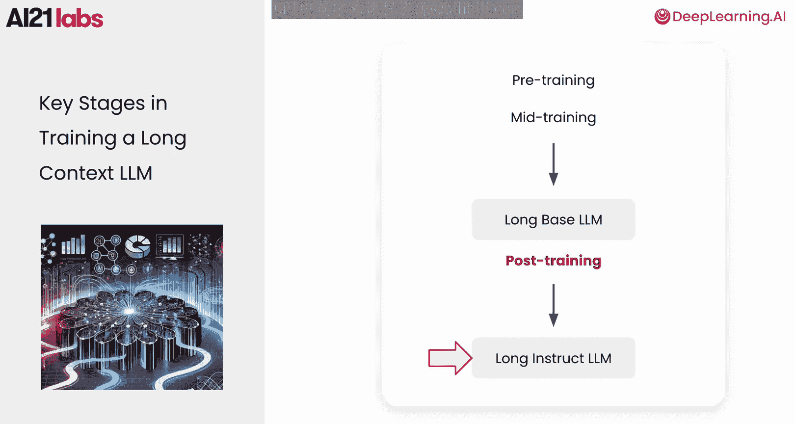

在中期训练中，较高比例的长文档构建了长上下文能力，但纳入短上下文数据可确保模型保留处理短任务的多功能性。在后训练中，主要使用短上下文数据集会带来挑战，仅对短上下文数据进行微调可能会降低长上下文性能。仔细的数据混合和性能监控对于保持平衡至关重要。

现在，让我们探索另一种训练策略：**长度课程学习**。

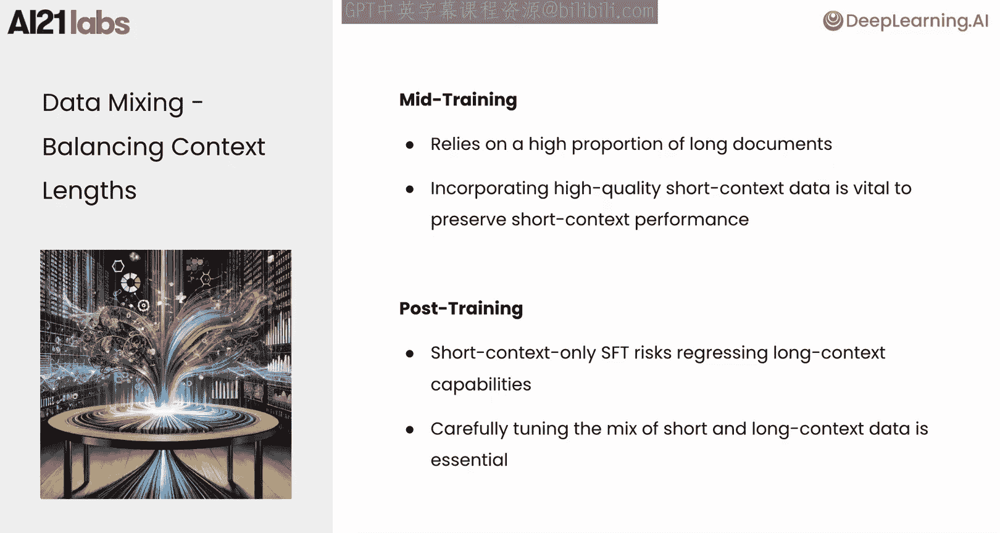

## 长度课程学习策略 📚

长度课程学习是一种在模型训练期间逐步增加上下文长度的技术。

其核心理念是逐步扩展模型处理更长上下文的能力。例如，从静态的32K上下文窗口开始，然后逐步增加到64K、128K，依此类推。这种渐进式增加有助于模型适应处理更长的数据序列，同时保持其对较短上下文的理解。

以Llama预训练为例，上下文窗口从8K开始，分六个阶段逐步增加，最终达到128K。通过遵循这种方法，模型能够以可控的方式构建长上下文熟练度，确保在不同上下文长度下的稳定性和一致性能。

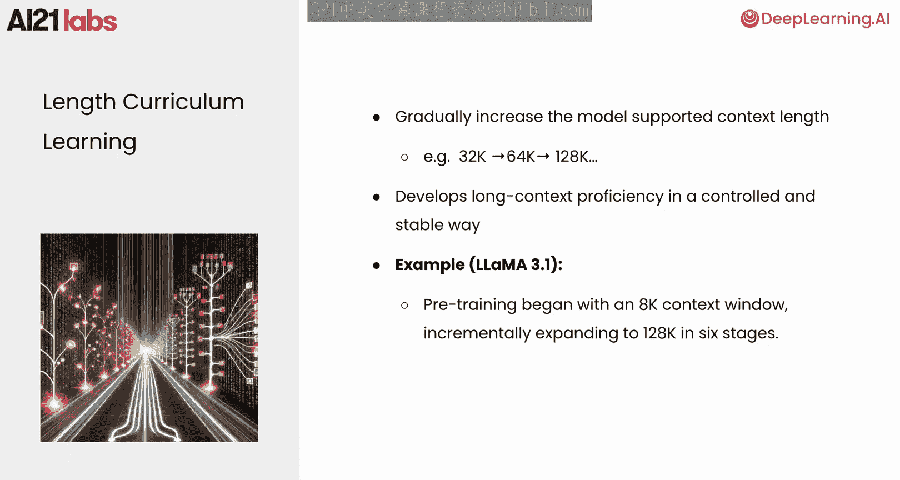

## 长上下文模型的评估 📋

回顾了训练方面后，我们现在转向长上下文模型的评估。全面的评估需要兼顾**有效性**和**效率**。

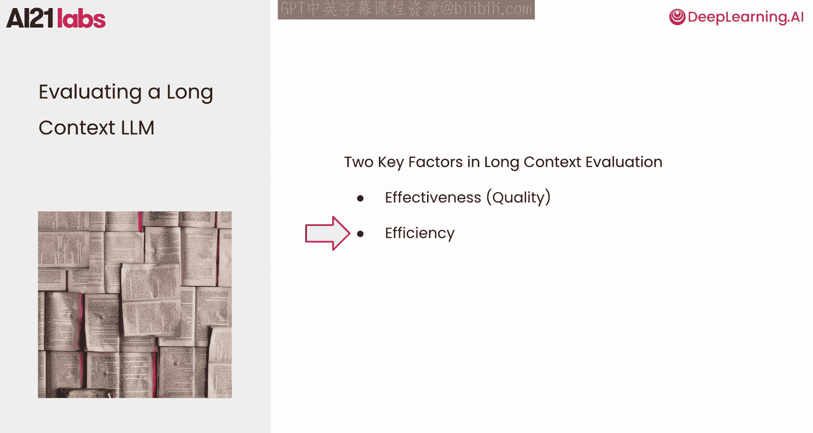

模型必须利用完整的上下文来产生高质量的输出，适当地利用和整合相关信息。另一方面，模型在实际使用中也必须高效。这意味着它在生成答案时不应太慢，并且在资源消耗上不应过于昂贵。

## 声明上下文长度 vs. 有效上下文长度 🔍

我们现在进入评估长上下文质量的一个重要区分：**声明上下文长度**与**有效上下文长度**。

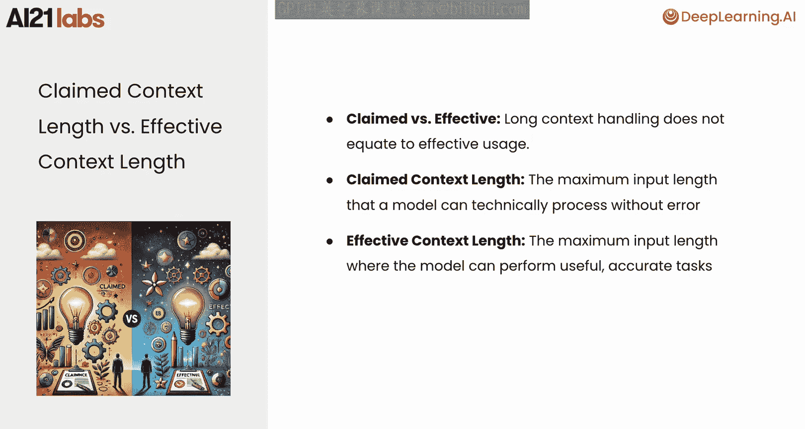

*   **声明上下文长度**：指模型技术上可以无错误处理的最大输入长度，即模型的输入限制。
*   **有效上下文长度**：指模型仍能准确有效地执行任务、将相关信息整合到其输出中的最大输入长度。

理解这种区别很重要，因为长上下文能力不仅关乎处理更大的输入，还关乎模型利用这些输入中的信息产生高质量结果的能力。

## 综合评估基准 🎯

为了确保我们有效地评估长上下文模型，选择一个能真正捕捉模型在真实任务中能力的综合基准非常重要。

*   **Needle in a Haystack基准**：这是一个传统的长上下文评估基准。它侧重于测试在长上下文中检索特定位置信息的合成任务，但可能无法完全捕捉现实世界应用的复杂性，使其对于实际用例来说不够全面。
*   **RULER基准**：来自Anthropic的RULER基准是一个更强大的选择。该基准在四个对现实世界性能至关重要的关键领域评估长上下文模型：**检索**、**多跳推理**、**聚合**和**问答**。RULER基准也突出了声明上下文长度和有效上下文长度之间的区别。它将有效上下文长度定义为模型达到大于或等于85%准确率的最长上下文窗口，提供了一个更有意义、更实用的模型真实能力衡量标准。从这里我们可以看到，并非所有声明上下文长度都是真正有效的。然而，Jamba始终兑现其承诺的上下文长度。

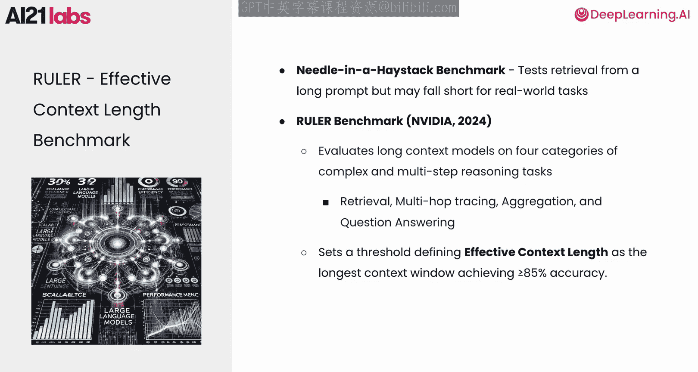

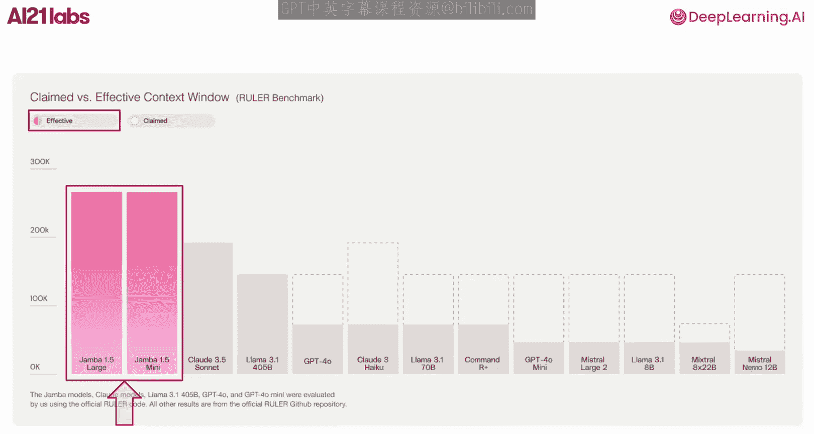

## 效率评估指标 ⚡

现在，让我们转向长上下文模型的效率评估。评估效率时，我们关注两个关键方面：

*   **延迟**：LLM在收到查询后生成响应所需的时间。
*   **吞吐量**：LLM在给定时间内可以处理的查询数量。

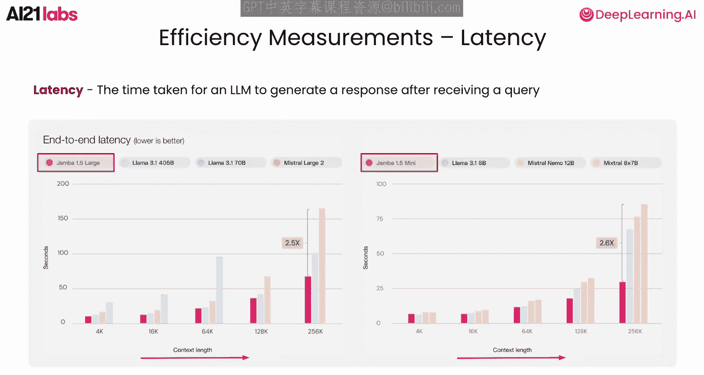

优化延迟和吞吐量对于确保模型即使在重负载下也能保持响应迅速和高效至关重要。在延迟方面，随着上下文长度的增长，Jamba的表现优于竞争对手，显示出显著改进。在吞吐量方面，Jamba也处于领先地位。有趣的是，随着上下文长度的增加，Jamba与其他模型之间的性能差距会扩大。

## 总结 ✨

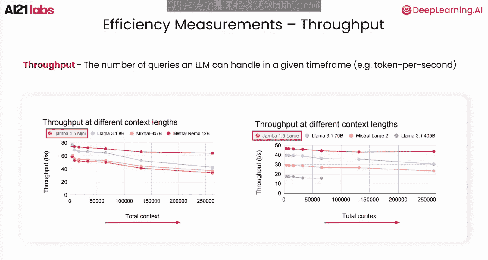

本节课中，我们一起学习了扩展LLM上下文窗口如何解锁新的应用并增强其在复杂、冗长输入上的性能。我们探讨了扩展上下文长度所涉及的关键挑战，并回顾了成功训练和评估这些模型所需的关键组件。通过优化架构、数据、训练和评估，我们正在推动LLM走向更广泛的高性能应用。