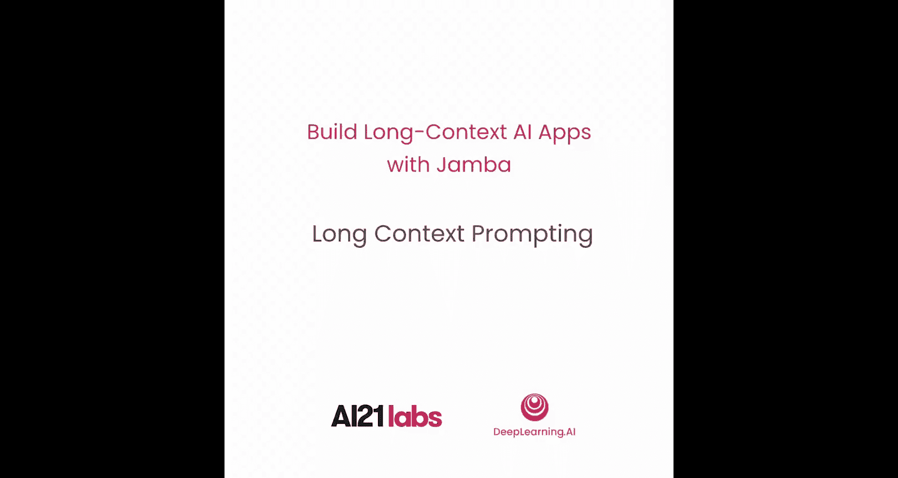
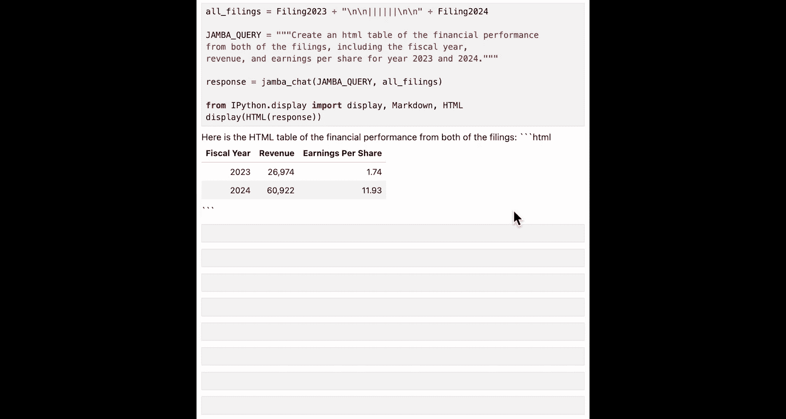

# 007：长上下文提示工程 🚀



在本节课中，我们将学习如何利用Jamba模型的长上下文能力，通过简单的提示工程来处理长文档。我们将探索如何将完整文档文本直接包含在提示中，并生成结构化输出。

---

## 概述


上一节我们介绍了如何扩展Jamba模型的上下文窗口。本节中，我们将采用不同的方法来处理贷款文档，即**将完整文本包含在提示中**，从而利用Jamba模型的长上下文能力。这种方法与使用`document`参数的效果非常相似。

以下是几种可以考虑在提示或`document`参数中包含长上下文的场景：
*   例如，总结一份完整的长文档以提取见解。
*   比较多个文档。
*   分析长聊天记录或通话记录，其中相关信息可能分散在整个内容中。
*   在涉及多步推理的系统中，当您有包含多轮工具调用消息的长聊天历史时。

现在，轮到您来处理一些示例了。

---

## 准备工作

首先，执行两行快速代码以忽略任何不必要的警告。

```python
import warnings
warnings.filterwarnings('ignore')
```

导入与之前实验相同的库，并加载已为您设置好的API密钥，然后创建AI21客户端以开始工作。

```python
import os
from ai21 import AI21Client

client = AI21Client(api_key=os.environ.get("AI21_API_KEY"))
```

您可以加载我们在之前实验中用过的Nvidia 10-K文件。

```python
# 假设已定义加载文件的函数
nvidia_10k_2024 = load_nvidia_10k_2024()
```

---

## 基础长上下文问答

现在，您可以要求Jamba模型帮助您处理2024年的Nvidia 10-K文件（这是一个非常长的文件），只需使用简单的系统消息和提示，而无需进行任何分块处理。

为了使操作更简单，您可以创建一个简单的函数来直接与您的文档聊天。

```python
def jamba_chat(system_message, user_message, document_text):
    messages = [
        {"role": "system", "content": system_message},
        {"role": "user", "content": f"Document: {document_text}\n\nQuestion: {user_message}"}
    ]
    response = client.chat.completions.create(
        model="jamba-1.5-mini",
        messages=messages,
        max_tokens=500
    )
    return response.choices[0].message.content
```

在这个`jamba_chat`函数中，Jamba模型的任务是基于提示中提供的文档来回答您的问题。在您的工作流程中，数据中心系统和产品是主要的驱动因素。

---

## 生成结构化JSON输出

对于从大模型获取结构化输出，**JSON格式通常是必要的**。类似于`jamba_chat`函数，您可以创建这个`jamba_json`函数。

```python
def jamba_json(system_message, user_message, document_text, json_schema):
    messages = [
        {"role": "system", "content": system_message},
        {"role": "user", "content": f"Document: {document_text}\n\nInstruction: {user_message}"}
    ]
    response = client.chat.completions.create(
        model="jamba-1.5-mini",
        messages=messages,
        response_format={"type": "json_object", "schema": json_schema},
        max_tokens=1000
    )
    return response.choices[0].message.content
```

在`jamba_json`函数中，您在系统消息和提示中提供指令，并在Jamba模型调用中的`response_format`参数里指定JSON对象。

现在是时候编写您的查询，要求Jamba模型为您创建JSON输出了。

```python
# 定义查询和JSON模式
query = """
请从提供的10-K文件中提取以下财务信息。
"""
json_schema = {
    "type": "object",
    "properties": {
        "fiscal_year_end_date": {"type": "string"},
        "revenue": {"type": "number"},
        "gross_profit": {"type": "number"},
        "net_income": {"type": "number"},
        "earnings_per_share": {"type": "number"},
        "revenue_by_segment": {"type": "object"},
        "revenue_by_georegion": {"type": "object"}
    },
    "required": ["fiscal_year_end_date", "revenue", "gross_profit", "net_income", "earnings_per_share"]
}

# 调用函数
json_response = jamba_json(
    system_message="你是一个财务分析助手。请严格根据提供的文档回答问题。",
    user_message=query,
    document_text=nvidia_10k_2024,
    json_schema=json_schema
)
print(json_response)
```

在这个例子中，我们要求Jamba模型生成JSON输出，包含财年结束日期、收入、毛利润、净收入、每股收益、按业务部门的收入以及按地理区域的收入。您可以将查询和文档发送到`jamba_json`函数，现在Jamba模型已经以JSON格式为您提供了答案。

---

## 跨多文档分析

正如我们在前面课程中讨论的，**借助长上下文窗口，您可以包含多个长文档**，并要求Jamba模型根据提供的所有文档提供答案。

例如，我们可以合并2023年和2024年的10-K文件，并传递给`jamba_chat`函数。

```python
# 加载2023年文档
nvidia_10k_2023 = load_nvidia_10k_2023()
combined_docs = nvidia_10k_2023 + "\n\n---\n\n" + nvidia_10k_2024

comparison_query = """
请比较2023年和2024年Nvidia 10-K文件中的关键财务数据。
请生成一个包含以下信息的HTML表格：财政年度、总收入、毛利润、净收入、研发费用。
"""

html_table_response = jamba_chat(
    system_message="你是一个数据分析师，擅长比较和总结财务信息。",
    user_message=comparison_query,
    document_text=combined_docs
)
```

在您请求创建包含以下财务信息的HTML表格后，您可以使用IPython的显示模块来呈现HTML表格。

```python
from IPython.display import HTML
HTML(html_table_response)
```

---

## 总结



本节课中，我们一起学习了如何**使用Jamba模型通过简单的提示工程来处理长文档**。我们实践了将完整文档放入提示的直接方法，创建了用于问答和生成JSON输出的辅助函数，并探索了如何利用长上下文能力来分析和比较多个文档。在下一课中，您将使用RAG工具进行更深入的实践。