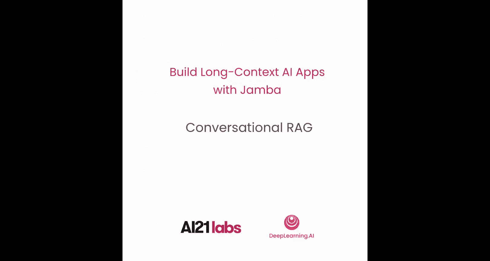
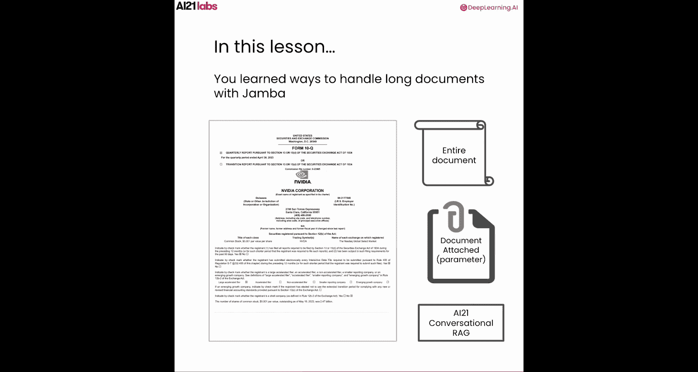

# 008：对话式RAG与自定义RAG管道构建 🧠

在本节课中，我们将学习如何使用AI21的对话式RAG工具，并构建一个自定义的RAG（检索增强生成）管道来处理长文档。我们将探索如何利用Jamba模型的长上下文窗口来提升RAG应用的性能。

## 概述

在之前的实验中，我们已经学习了如何使用Jamba模型通过`document`参数或在单个提示中处理长文档。然而，根据不同的用例和数据，您可能需要考虑将Jamba与RAG管道结合使用，以在响应质量、延迟、成本等关键指标之间取得平衡。Jamba模型的长上下文窗口可以有效提升RAG管道的性能。

## 提升RAG性能的潜在方法

Jamba的长上下文能力可以通过以下几种方式优化RAG管道：
*   我们可以包含更多数量的最相关检索片段。
*   我们可以使用更长的文本片段。
*   我们可以将长的多轮对话历史包含进来。
*   我们可以利用包含相邻片段或完整文档的检索策略。

在本实验中，我们将通过两种不同的方式使用Jamba构建RAG管道。首先，我们将使用AI21构建的一个开箱即用的RAG工具——AI21对话式RAG。然后，我们将使用LangChain和AI21 Jamba模型构建一个简单的RAG管道来结束本课程。

## AI21 对话式RAG架构解析

在开始使用AI21对话式RAG之前，让我们先了解其工作原理。

整个流程始于用户查询，该查询与聊天历史记录结合后被发送到执行引擎。执行引擎会判断当前查询是否需要额外的组织数据来回答。

如果不需要，查询和聊天历史将直接发送给LLM（本例中为Jamba）以生成答案。如果需要额外的组织数据，用户查询将被提取并“去语境化”，形成一个独立的、用于检索相关片段的问题。

检索完成后，查询和检索到的文本片段将被用于生成一个“有根据的”答案。为了进一步提高答案的准确性和质量，系统会使用一个“评判”模型来验证生成的答案。如果原始答案未通过验证，将触发重新生成。最后，经过验证的答案将与聊天历史记录“再语境化”，并连同引用一起发送回给用户。

总而言之，AI21对话式RAG是一个易于使用的开箱即用RAG引擎，同时其每个步骤的参数也是可定制的，例如：
*   检索片段的最大数量。
*   检索阈值。
*   检索策略和搜索方法。
*   使用完整的对话历史来生成响应，以实现多轮问答体验。

现在，让我们深入实验，通过代码查看一切是如何运作的。

## 实验：使用AI21对话式RAG

与之前的实验一样，我们首先使用这两行代码来忽略不必要的警告。

首先，导入AI21库并加载API密钥以创建AI21客户端。API密钥已为您设置好，无需担心。

AI21对话式RAG主要需要您提供两样东西：您希望答案基于的文档，以及您想问的问题。本例将使用2024年英伟达10-K年度收益报告。要上传文件到对话式RAG，我们可以从工具中导入文件上传函数。文件已为您上传，因此您可以跳过此步骤。如果您上传了自己的文件，请在使用完毕后记得用这两行代码删除它。

一旦文件与对话式RAG共享，索引过程将自动为您完成。

现在，您可以使用`conversational_rag_response`函数来发送查询。这个简单的函数会附加每一轮的用户查询和助手响应，并包含整个聊天历史记录，为您的查询提供更多上下文。这里，我们只返回LLM的响应。您也可以从AI21对话式RAG获取引用，包括检索到的文本片段及其所在文件。

如果您想调整任何RAG参数，例如检索片段的最大数量、检索阈值和策略、搜索方法、每个步骤的LLM选择、模型温度和提示模板等，请随时在工具文件中进行更改。

现在，是时候开始提问了。假设您只想快速获取这份10-K文件的摘要。

您可以继续跟进并提出更详细的问题。如果您问了一个文档无法回答的问题，例如询问一项投资决策，对话式RAG将不会为您提供答案。

为了让实验更有趣，您可以在Notebook中部署一个Gradio应用，开始与AI21对话式RAG聊天。要创建Gradio应用，您可以将函数指向我们之前定义的`conversational_rag_response`函数，并添加一些预填充的示例。

尽管对话式RAG不会直接为您做出投资决策，但您仍然可以使用它来提取非常具体的财务信息，以帮助您做出明智的投资决策。例如，您可以询问英伟达在可持续发展方面采取的行动，并快速从中获得答案。

现在，您可以快速阅读关于英伟达可持续发展倡议的内容。您也可以了解公司的风险、资本配置、现金流等方面。或者，您也可以添加自己的问题。

## 构建自定义RAG管道

好了，为了结束本课程，您将使用LangChain和AI21 Jamba模型创建一个简单的RAG管道，在这里您可以自定义管道中的每一步。

使用LangChain构建RAG管道需要准备几样东西：
*   您需要一个LLM，这里将是AI21 Jamba模型。
*   您需要为文档建立索引，这包括文本分块、嵌入模型以及用于存储嵌入向量的向量数据库。
*   当您提出包裹在提示模板中的问题时，最相关的文本片段将被用来帮助回答问题。

让我们开始吧。首先，选择Jamba 1.5 Large模型作为LLM。然后，加载英伟达10-K文件。将文档分割成较小的块，每个块2000个令牌，重叠400个令牌。

下一步，您将使用来自Hugging Face的嵌入模型和Chroma向量数据库。至此，索引部分已经完成。

这里有一个简单的提示模板，您可以用它来向Jamba模型提供指令，并将您的文本和问题包含在内。您可以用自己的指令自定义这个提示模板。

为了检索最相关的文本片段，您将使用最大边际相关性检索器，并检索前10个最相关的片段。

好了，我们已经到了构建您自己的RAG管道的最后一步。使用LangChain，您可以将每个组件（包括检索器、提示和LLM）缝合在一起，创建您自己的RAG链。现在，您的RAG管道已经准备好回答问题了。

如果您想查看RAG管道中检索到的所有文本片段，您也可以查看检索器针对您的问题返回的结果，以查看为您检索到的所有文本片段。如果您有一系列问题要问，您可以批量发送您的问题列表，一次性获取所有答案。

完成本课程后，别忘了清理向量数据库。

## 总结

在本节课中，我们学习了如何使用AI21对话式RAG，以及如何使用LangChain和Jamba模型构建RAG管道。至此，我们的课程结束。

通过本课程，您学习了三种使用Jamba处理长文档的不同方法：
*   您可以在提示中包含整个长文档的文本。
*   您可以使用`document`参数附加文档。
*   您可以使用不同的RAG工具，包括AI21对话式RAG。

我鼓励您使用自己的文档，结合在整个课程中学到的不同技术和工具，构建您自己的生成式AI应用。