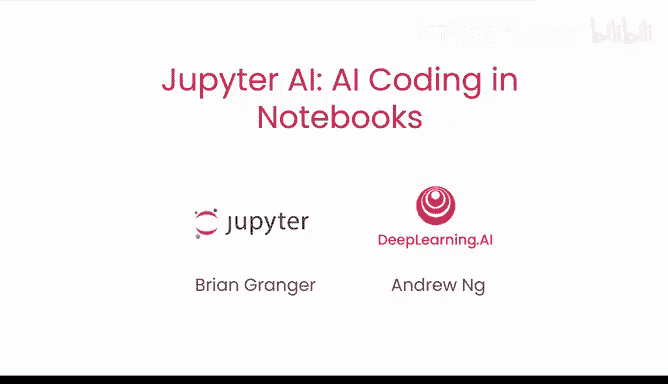
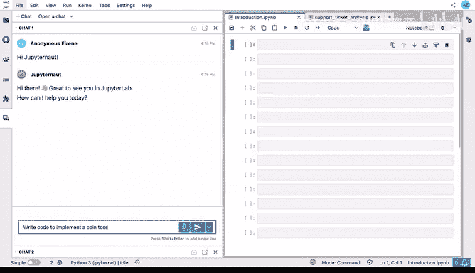
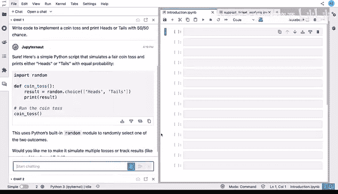
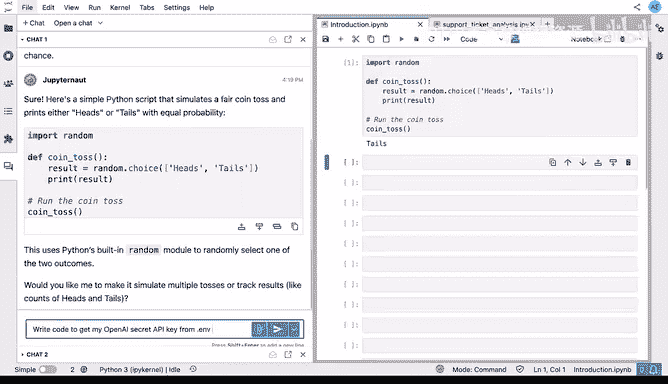
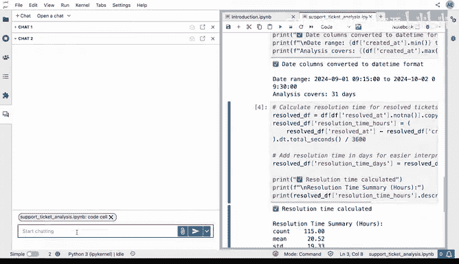
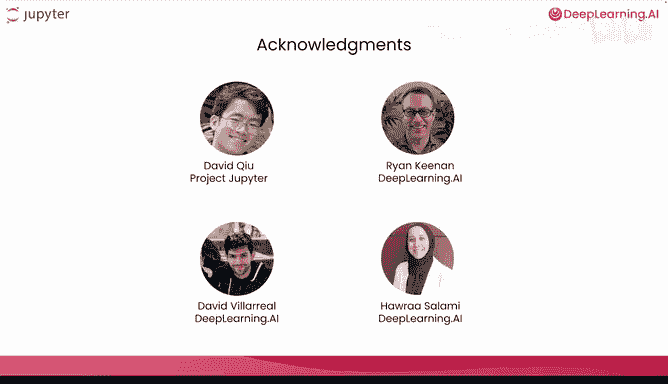

# 001：课程介绍 🚀

在本节课中，我们将要学习 Jupyter AI 的基本概念、核心功能以及本课程的整体安排。Jupyter AI 是一个旨在将人工智能深度集成到 Jupyter 笔记本环境中的开源框架，它将改变我们编写代码的方式。

---

## 从手动编码到AI辅助编码的演进

手动编写每一行代码的传统编码方式正在变得过时。

因此，编码笔记本必须从手动编码演进到使用人工智能为你编码。

## 欢迎来到 Jupyter AI

我们很高兴与 Jupyter 项目的联合创始人 Brian Granger 一同介绍 Jupyter AI。

你可以在 DeepLearning.AI 网站上使用它，也可以在本地计算机上运行它。

Jupyter Notebook 是人工智能开发和数据科学的主力工具，我们在 DeepLearning.AI 也广泛使用它们。将笔记本完全带入 AI 编码时代，对许多人来说将是一大进步。很高兴能与 Brian 一起教授这门课程。

感谢 Andrew。当我们在 2011 年创建 IPython Notebook（后来在 2014 年更名为 Jupyter Notebook）时，我们的使命是创建一个由社区驱动的开源工具生态系统，服务于数据科学、科学研究和教育。

Jupyter Notebook 长期以来一直是这类工作的默认原型设计环境。

但事实证明，过去几年出现的大多数 AI 编码助手，在 Jupyter Notebook 环境中都难以良好运行。

因此，我们构建了 Jupyter AI。这是一个专门为将 AI 集成到 Jupyter Notebook 和 JupyterLab 中而设计的开源框架。

## Jupyter AI 的核心功能

Jupyter AI 能很好地完成你可能已经从其他 AI 辅助编码工具中熟悉的任务，例如编写代码和回答关于代码的问题。

但它不止于此，还拥有专门为编码笔记本工作而设计的功能。

让我为你展示。使用 Jupyter AI，你会在笔记本旁边看到一个名为 “Jupyter Chat” 的聊天机器人。

我可以打招呼说“你好，Jupyter Chat”并得到回复。或者，更实用一点，我可以说：“编写代码来实现抛硬币，并以 50/50 的概率打印正面或反面”，它就会生成代码。

我不需要手动复制粘贴代码到笔记本中，只需点击一下，就可以将代码插入我的笔记本。看，它运行了。

或者，如果我忘记了调用 OpenAI API 的语法，我也可以问它。我还可以让它编写标准代码来获取我的 OpenAI 秘密 API 密钥，然后调用 API。

如果我在查看别人的笔记本，我可以将一个单元格拖到这里，然后问：“这个单元格是做什么的？” 甚至可以问：“这个整个笔记本是做什么的？” 从而快速获得总结，帮助我理解笔记本。

所有这些功能都与 Jupyter 深度集成，使得在笔记本中使用 AI 编码的工作流程变得更加容易。

你可以将 Jupyter AI 视为你在 Jupyter 中所做一切工作的 AI 协作者，无论是在 Jupyter Notebook 中探索数据、原型化 LLM 工作流程，还是构建集成到 JupyterLab 聊天体验中的自定义智能体。

## 课程内容与结构概述

事实上，Jupyter AI 的功能远不止我们今天有时间涵盖的这些。但本课程将为你提供一个良好的开端。

我在想，也许我们在这门课程之后需要开设一门后续课程。Jupyter AI 中有很多令人兴奋的功能我们今天没有时间涵盖，例如自定义智能体、工具调用以及智能体间的协作。

这听起来很棒。即使在本课程中，我认为你也会学到很多。

以下是本课程三个核心练习的简要介绍：

*   **练习一**：你将学习如何使用聊天界面生成代码并就代码提问，例如，生成一个调用 OpenAI API 的代码。
*   **练习二**：你将使用 Jupyter AI 构建一个聊天应用，该应用可以利用在线图书 API 帮助你寻找好书。通过这个练习，你将学习更高级的提示策略。
*   **练习三**：你将创建一个用于检索和分析股票数据的工作流程，并了解使用 Jupyter AI 进行数据分析的一些最佳实践。

本课程的设置与我们其他短期课程略有不同。它并非为每一课都安排一个带视频的并排笔记本。相反，我会在视频中演示每个练习，然后你自己进行动手实践，可以使用相同的提示词构建与我演示的相同应用，也可以修改提示词以构建符合你自己喜好的定制化应用。

## 致谢与总结

许多人共同努力创建了这门课程。我要感谢 David Q 以及所有为 Jupyter AI 做出贡献的人，还有来自 DeepLearning.AI 的 Ryan Kean、David Viaro 和 Harrasami。

本节课中，我们一起学习了 Jupyter AI 的诞生背景、核心定位及其作为 Jupyter 环境内 AI 协作者的主要功能。我们还预览了本课程将通过三个动手练习，引导你从基础代码生成进阶到构建实际应用。

让我们继续观看下一个视频，开始使用 Jupyter AI。

