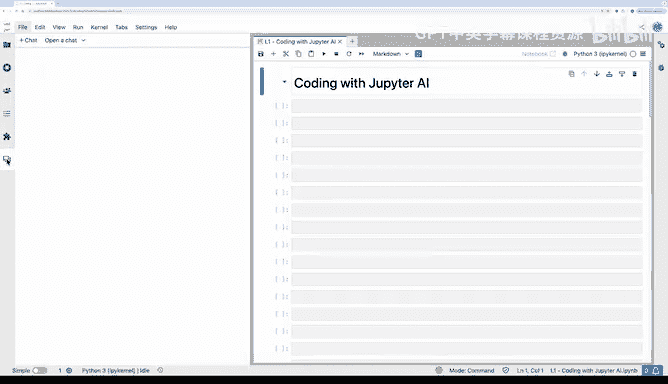
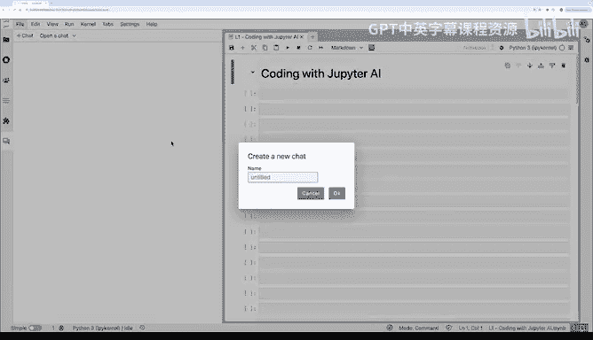
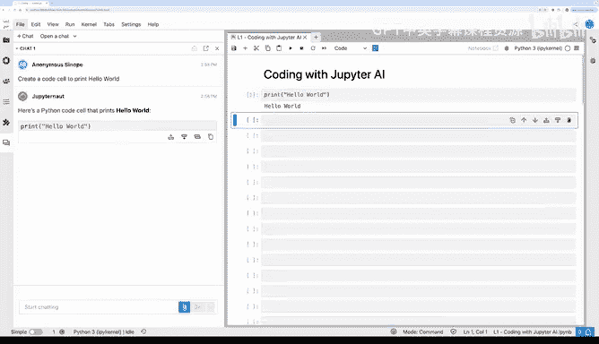
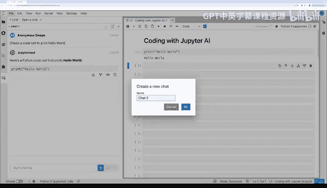
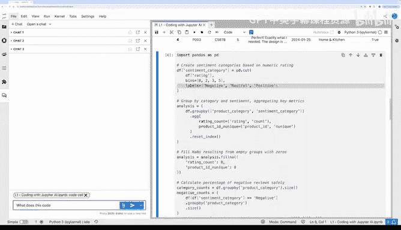
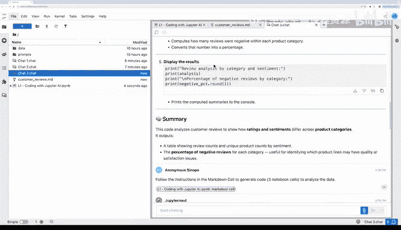

# 002：使用Jupyter AI进行编程 🚀

在本节课中，我们将学习Jupyter AI的基础知识，包括如何使用聊天功能生成代码、如何询问关于代码的问题，以及如何为聊天模型提供额外的上下文。我们将通过几个示例来演示这些功能，包括调用OpenAI API和执行基础数据分析。

---

## 启动聊天窗口 💬

上一节我们介绍了课程概述，本节中我们来看看如何开始使用Jupyter AI。首先，我们需要打开聊天窗口。

以下是启动新聊天的步骤：
1.  在Jupyter界面中，寻找并点击**气泡图标**。
2.  这将打开聊天环境。
3.  点击 **“+ 新聊天”** 按钮开始一个新对话。
4.  为聊天命名，例如“chat1”。

## 第一个示例：Hello World 👋

现在，让我们从一个简单的“Hello World”示例开始，体验代码生成功能。

我输入提示：“创建一个打印‘hello world’的代码单元格。”
Jupyter AI会花一点时间生成代码单元格。
生成代码后，无需手动复制粘贴。我可以选择右侧笔记本中的一个单元格，然后选择将生成的代码**插入到活动单元格上方、下方**，或者**替换活动单元格**。
我选择将其插入到活动单元格上方，然后运行它。成功打印出“hello world”。

## 第二个示例：调用OpenAI API 🍪

接下来，我们看一个更复杂的例子：使用OpenAI的API来生成有趣的幸运饼干消息。

我新建了一个聊天（chat2），并输入了以下提示：
“创建一个使用OpenAI的GPT-4模型来编写有趣幸运饼干消息的代码单元格。使用Python的`.env`文件加载我的秘密API密钥。”
然后，我提供了生成幸运饼干消息的具体提示词。

运行后，Jupyter AI生成了一段代码。我快速浏览后，将其插入并运行。
代码成功执行，并输出了一个消息：“你的圣诞节像Wi-Fi。哦，这很好。只有我知道密码。”这很有趣。

我建议你在观看本视频后，立即在随附的Jupyter笔记本环境中尝试这个过程。点击气泡图标打开聊天环境，尝试像我一样生成代码，或者尝试生成不同的功能代码。

## 第三个示例：用于数据分析 🔍

现在，我想展示第三个也是最后一个示例：使用Jupyter AI进行数据分析。

假设已经有一个Jupyter笔记本，其中包含两个单元格。第一个单元格加载了一个`customer_reviews.csv`数据文件，第二个单元格包含一些分析代码。
运行这些代码后，可以看到分析结果。

如果我想理解这段代码具体在做什么，可以**选中这个代码单元格**（注意是点击单元格左侧区域选中整个单元格），然后将其**拖拽到聊天窗口**并提问：“这段代码做了什么？”

借助这个上下文，Jupyter AI告诉我，该代码单元格对数据框`df`执行了多步骤数据分析：它将每条评论分类为负面、中性或正面，然后创建新的情感类别并进行分组等。
这是一种无需阅读所有Python代码就能快速理解分析内容的便捷方法。

## 编写复杂分析代码 📝

假设你想自己编写代码，或者让AI为你编写代码来执行更复杂、更高级的分析。

我在这里做的是，提供了一个相当详细的规范或提示词，描述了我希望代码执行的复杂分析过程。
这个提示词写在了一个Jupyter笔记本的Markdown单元格中。我发现，在Markdown单元格中编辑这样的长提示词，比在聊天窗口的小输入框中键入要方便得多。

这个长提示词规定了分析步骤：
1.  提取评论列表。
2.  检查评论。
3.  打印总结并将其保存到特定文件中。

然后，我可以将这个Markdown单元格拖到聊天窗口，并说：“按照Markdown中的指示，生成三个笔记本单元格来分析数据。”
我告诉AI删除Markdown中的指令，并编写代码来执行分析。

AI生成了三个代码单元格。快速浏览后，看起来没问题。
第一个单元格提取了50条评论。
第二个单元格将使用GPT-4模型生成分析。
第三个单元格将把所有分析保存到`customer_reviews_analysis.md`文件中。
运行后，检查文件浏览器，确认它确实按照长提示词生成了分析并保存了Markdown文件。

## 聊天记录的保存与复用 💾

我想指出Jupyter AI的一个巧妙功能：我们进行的聊天（chat1, chat2, chat3）实际上都被保存为文件。
例如，点击`chat3.md`，这就是我们刚才进行的完整对话历史记录。
这便于日后回溯聊天内容，甚至可以将这些聊天记录作为未来与聊天机器人对话的上下文。

---

本节课中我们一起学习了Jupyter AI的基础操作：如何启动聊天、生成简单和复杂的代码、利用上下文理解现有代码，以及如何通过详细的提示词指导AI完成复杂的数据分析任务。同时，我们也了解了聊天记录会被保存，便于后续查阅和使用。希望你能在平台上亲自尝试这些功能，我们将在下一个视频中探讨更高级的Jupyter AI代码编写技巧。