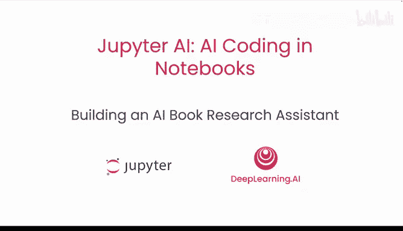
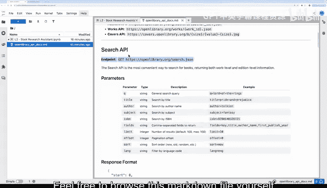
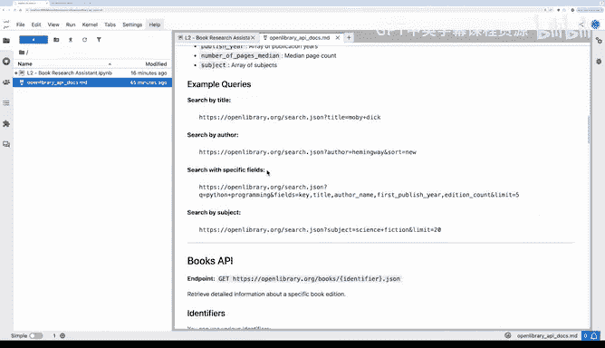
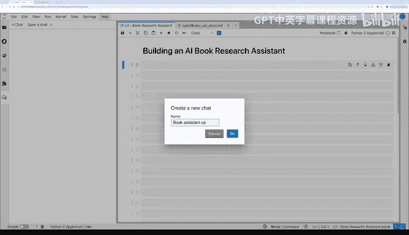
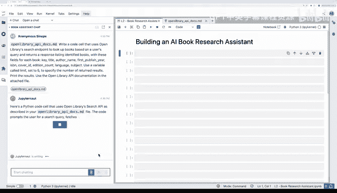
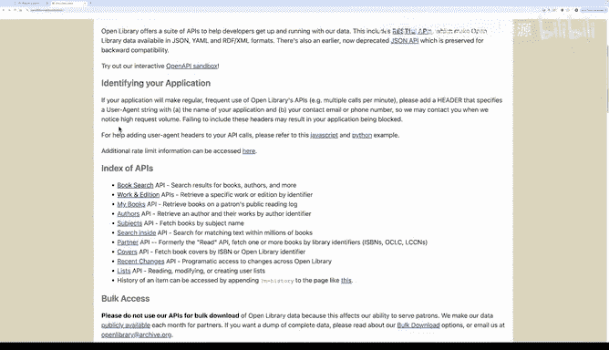

# 003：构建AI图书研究助手 📚



在本节课中，我们将学习如何更高级地使用Jupyter AI作为编程助手。我们将通过一个具体项目——利用Open Library API构建一个图书推荐助手——来演示最佳实践。核心在于，当AI模型不熟悉某个API时，我们可以通过为其提供API文档作为上下文，来引导它生成正确的代码。

---

## 概述

我们将使用互联网档案馆的Open Library API来搜索图书信息。为了让AI模型理解如何使用这些API，我们将创建一个包含详细使用说明的Markdown文档，并将其作为上下文提供给模型。此外，我们还将学习如何组织代码、将API调用封装为函数，并最终将该函数作为“工具”集成到一个AI驱动的聊天助手中。

---

## 第一步：准备API文档

为了让AI模型了解Open Library API的用法，我创建了一个Markdown文档。该文档详细说明了各种API端点的使用方法，例如图书搜索API。

以下是该文档的核心内容示例：

```markdown
# Open Library API 文档



## 搜索图书
端点：`https://openlibrary.org/search.json`
参数：
- `q`：搜索查询词（例如，“lord of the rings”）
- `limit`：返回结果数量
```



你可以自由浏览这个Markdown文件以了解所有细节。接下来，我们将把这个文档提供给AI模型。



---

## 第二步：让AI生成搜索代码

现在，我们将在Jupyter AI聊天界面中附加上一步创建的API文档，并给出指令。

**指令如下：**
“请编写一个代码单元格，使用Open Library的搜索端点查找图书。返回一个响应列表，列出每本书的关键信息（如标题、作者名）。将结果数量限制为5条。请使用附加文件中的Open Library API文档。”



执行该指令后，AI生成了调用API的代码。我们将这段代码复制到笔记本中，并尝试搜索“science fiction”来测试它。

```python
import requests

def search_books(query, limit=5):
    url = "https://openlibrary.org/search.json"
    params = {'q': query, 'limit': limit}
    response = requests.get(url, params=params)
    if response.status_code == 200:
        data = response.json()
        books = data.get('docs', [])
        results = []
        for book in books[:limit]:
            title = book.get('title', 'N/A')
            author = book.get('author_name', ['N/A'])[0]
            results.append({'title': title, 'author': author})
        return results
    else:
        return f"Error: {response.status_code}"

# 测试函数
results = search_books("science fiction")
for book in results:
    print(f"Title: {book['title']}, Author: {book['author']}")
```

运行代码后，我们成功获取了关于科幻小说的前5条结果。

---

## 第三步：将代码封装为函数

上一节我们获得了可工作的代码，本节中我们来看看如何将其转化为一个可重用的函数。我们希望将这个搜索功能包装成一个函数，以便后续可以将其作为“工具”提供给AI助手调用。

我们可以通过提示AI来完成这个任务。提示如下：
“请将上面的代码包装成一个名为 `search_books` 的函数。为其添加良好的文档字符串。函数的输入参数是查询词 `query`，并将返回结果数量的默认值设为10。输出一个JSON字符串格式的结果。”

AI根据提示生成了封装好的函数代码，其中包含了清晰的文档说明。我们将新生成的函数定义复制到笔记本中并测试。

```python
import requests
import json

def search_books(query, limit=10):
    """
    使用Open Library API搜索图书。

    参数:
        query (str): 搜索关键词。
        limit (int): 返回的最大结果数，默认为10。

    返回:
        str: 包含图书标题和作者的JSON格式字符串。
    """
    url = "https://openlibrary.org/search.json"
    params = {'q': query, 'limit': limit}
    response = requests.get(url, params=params)

    if response.status_code == 200:
        data = response.json()
        books = data.get('docs', [])
        results = []
        for book in books[:limit]:
            title = book.get('title', 'N/A')
            # author_name 是一个列表，取第一个作者
            author_list = book.get('author_name', [])
            author = author_list[0] if author_list else 'N/A'
            results.append({'title': title, 'author': author})
        return json.dumps(results, indent=2)
    else:
        return json.dumps({"error": f"API请求失败，状态码: {response.status_code}"})

# 测试新函数
results = search_books("science fiction")
print(results)
```

测试成功，函数返回了10本图书的信息。

---

## 第四步：将函数作为工具集成到AI助手

我们已经有了一个可用的搜索函数，接下来需要让AI助手能够调用它。我们将使用一个名为 `ai-suite` 的开源库，它简化了让大语言模型使用工具的过程。

由于 `ai-suite` 是一个较新的库，AI模型可能不熟悉其语法。与其编写完整的API文档，我们发现提供一个简单的代码示例通常就足够了。

以下是我们提供给AI的 `ai-suite` 使用示例：

```python
# ai-suite 工具调用示例
from ai_suite import ToolSet, chat_with_tools

# 1. 定义可用工具
tools = ToolSet()
# 假设我们有一个搜索函数
tools.add_tool(search_books, description="根据关键词搜索图书")

# 2. 创建聊天处理器
def chat_handler(user_message):
    response = chat_with_tools(user_message, tools)
    return response
```

我们将包含此示例的单元格拖入聊天界面，并给出指令：“请参考此示例，创建一个名为 `chat_with_tools` 的简单聊天处理器函数。该函数接收用户消息，并可以使用上面定义的 `search_books` 工具。”

AI生成了集成代码。我们将其复制到笔记本中并运行，从而定义了 `chat_with_tools` 函数。

---

## 第五步：测试与调试AI助手

现在，让我们来测试这个集成了搜索工具的AI助手。我们输入查询：“请推荐一些关于龙的书籍。”

在测试过程中，为了确认AI确实调用了我们定义的函数（而不是仅凭自身知识编造答案），我们在 `search_books` 函数中添加了一个打印语句作为调试信息。

修改函数的提示如下：“请修改 `search_books` 函数，在开始执行时添加一个打印语句，输出状态信息‘正在搜索图书...’。”

AI生成了修改后的代码。我们更新函数定义后再次进行测试。这次，在返回结果之前，我们看到了“正在搜索图书...”的调试信息，这证实了函数被成功调用。

---



## 总结

在本节课中，我们一起学习了如何利用Jupyter AI构建一个智能图书研究助手。我们经历了完整的流程：
1.  **准备上下文**：为AI编写API文档，指导其生成正确代码。
2.  **生成与封装**：让AI生成API调用代码，并将其封装成可重用的函数。
3.  **工具集成**：使用 `ai-suite` 库将函数作为“工具”提供给AI助手。
4.  **测试与迭代**：测试助手功能，并通过添加调试信息等方式迭代改进代码。

你可以访问课程提供的Jupyter Lab环境，亲自动手实践，并尝试使用Open Library的其他API来构建功能更复杂的助手，例如在检索到图书列表后进一步查询某本书的详细信息。希望你能享受使用Jupyter AI构建应用的乐趣，并发现一些你想阅读的好书！