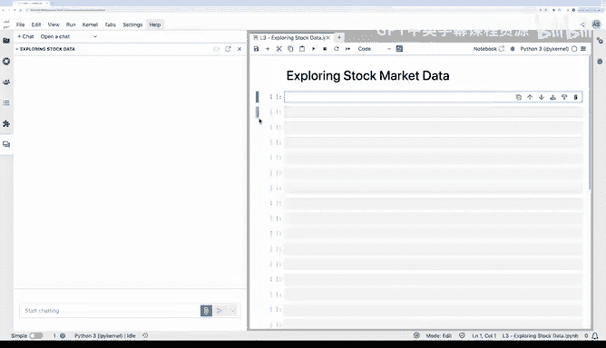
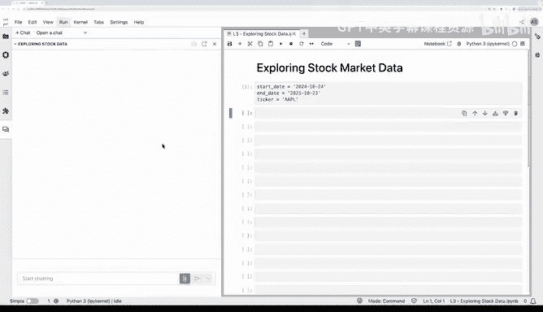
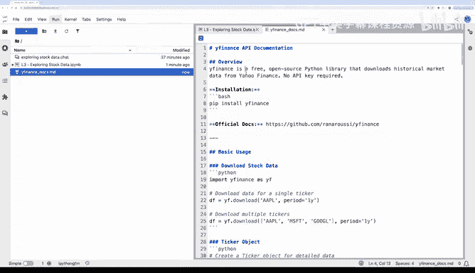
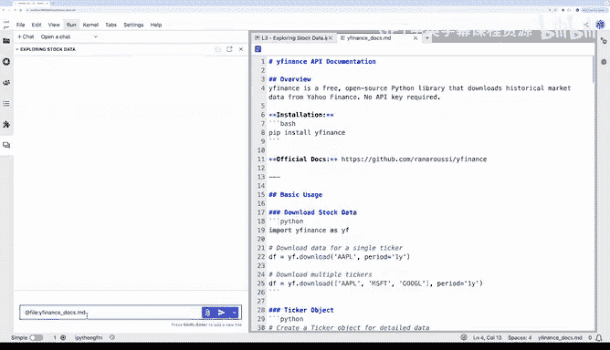
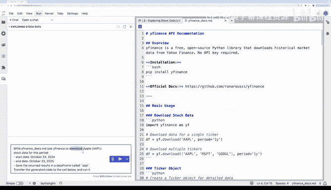
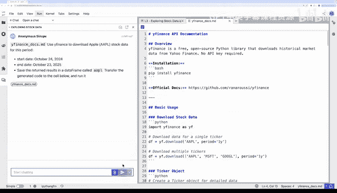

# 004：探索股票市场数据

在本节课中，我们将学习如何使用 Jupyter AI 进行数据分析和可视化。具体来说，我们将通过 API 调用获取股票数据，并利用 Jupyter AI 协助完成分析与可视化任务。

## 获取股票数据

首先，假设我们想分析苹果公司（Apple）在 2024年10月24日 至 2025年10月23日 期间的股票数据。为此，我们定义了分析周期的起止日期，并指定了苹果公司的股票代码 `AAPL`。

为了获取这些股票数据，我们将使用 `yfinance` 这个 Python 包，它可以从雅虎财经获取金融数据。这与你在之前练习中看到的方法类似。

我已经准备了一个包含 `yfinance` 文档的 Markdown 文件。

在聊天窗口中，我将附加这个 Markdown 文件，然后要求 Jupyter AI 使用 `yfinance` 下载我感兴趣时间段内的苹果股票数据，并将结果保存到一个数据框中。

以下是生成的代码。我将点击此处将代码转移到单元格并运行它。

这是数据框的前五行。每一行显示了特定一天的四种价格类型：

*   **Open**：当天市场开盘时的价格。
*   **High**：当天交易期间达到的最高价格。
*   **Low**：当天交易期间达到的最低价格。
*   **Close**：当天市场收盘时的价格。
*   **Volume**：当天交易的股票数量。

现在，你可以看到每一列都有两个索引：价格类型和股票代码。如果你打印数据框的列，可以更清楚地看到这一点。

由于我们只关注苹果股票数据，我想移除第二个索引。因此，我告诉 Jupyter AI 我的列是多级索引的，并询问如何将其扁平化。

好的，让我们将生成的代码应用到数据框上。很好。现在，我的数据框是单级索引了。

## 初步数据探索

在加载数据之后，你可能希望快速探索数据框的形状和各列的值。Pandas 数据框有许多方法可以帮助快速探索，但假设我忘记了语法。所以，我将要求 Jupyter AI 显示数据框的形状和统计摘要。

很好。让我们获取代码并运行它。行数是 249，这代表了分析期间内的交易日数量。这是合理的，因为交易日不包括周末和节假日。从各列的计数中，我可以看到没有缺失值，其余的统计数据看起来都很好。

## 计算总回报率

现在，让我们计算第一个指标：总回报率，以了解过去一年价格的总体变化。为此，我将使用收盘价，因为它通常被用作分析股票价值随时间变化的参考点。

因此，我将要求 Jupyter AI 使用数据框中的收盘价，根据起始价格和结束价格计算总回报率（百分比）。

让我们找出过去一年的总回报率：12.61%。过去一年的总体回报是正的，但这并不意味着收盘价一直处于上升趋势。所以，让我们通过绘制图表来查看收盘价的每日波动。

## 可视化收盘价趋势

我将要求 Jupyter AI 帮助我编写代码来可视化苹果的收盘价。我指定要使用 `matplotlib`，并澄清了一些要求，如轴标签、网格和适当的颜色。

让我们运行生成的代码。这是生成的折线图。

你可以看到，在三月和四月期间存在下降趋势，但之后更多的是上升趋势。现在，我很好奇想了解更多关于这个最低点和最高点的日期。

## 识别关键日期

我将要求 Jupyter AI 帮助我找到这些确切的日期，并将它们标记在同一张图上。

好的。所以，最高价格出现在 2025年10月21日，最低价格出现在 2025年4月8日。

为了获取一些背景信息，我将使用 `Serper` 对这些日期进行网络搜索，查找相关新闻。`Serper` 是一个 API，允许你以编程方式访问谷歌搜索结果。

因此，我将要求 Jupyter AI 帮助我处理语法，依靠底层模型（在本例中是 GPT-4）的内部知识。由于 `Serper` 需要 API 密钥，我在此说明 API 密钥保存在 `.env` 文件中，并要求它为每个日期返回新闻摘要。

让我们生成代码。这是代码。让我将其转移到这个代码单元格，然后运行它。

从返回的结果来看，最高价格似乎是由 iPhone 17 销售和积极的公司盈利报告推动的。而最低价格则发生在与关税相关的担忧期间。在同一时期，股票价格出现了较高的波动。

## 量化波动性

为了量化这一点，我将计算一个波动性指标。波动性有不同的衡量标准。最简单的方法是找出每日百分比变化的标准差。这可以是整个期间的总体衡量，也可以是基于滚动窗口的衡量。让我们两者都计算。

首先，我将要求 Jupyter AI 帮助我找到总体波动性。这是代码。让我们运行它。总体波动性约为 2%。例如，你可以找到另一家公司或某个基准（如代表美国整体股市的标普 500 指数）的波动性，并进行比较。

最后，我将要求 Jupyter AI 帮助我基于 20 天的窗口找到滚动波动性，识别高波动性时期，并将这些日期保存在一个数据框中，以便稍后在我的见解总结中使用。

很好。让我们转移并运行这段代码。正如我所料，高波动性日期主要发生在四月。

## 生成分析报告

现在，我想将所有计算出的指标整合到一份报告中，以总结这些见解。为此，我将进行一次 LLM 调用来生成报告，并请 Jupyter AI 帮助我处理语法。

因此，我将要求它生成代码，使用 GPT-4 模型，输入股票代码、起止日期、总回报率、波动性指标以及最高和最低日期的新闻摘要，并提供一个见解总结。

让我们运行代码，这是生成的总结。你可以考虑额外的分析步骤和要计算的指标，以及如何自动化整个工作流程。现在，请在本视频之后的下一个练习中尝试相同的步骤，然后我和 Andrew 将在最后一个视频中与你见面。

## 课程总结

在本节课中，我们一起学习了如何利用 Jupyter AI 进行股票数据分析。我们从获取数据开始，逐步完成了数据清洗、初步探索、关键指标计算、趋势可视化、关键日期识别、背景信息搜索、波动性量化，并最终生成了分析报告。这个过程展示了 Jupyter AI 如何辅助数据科学家高效地完成从数据获取到洞察呈现的完整工作流。