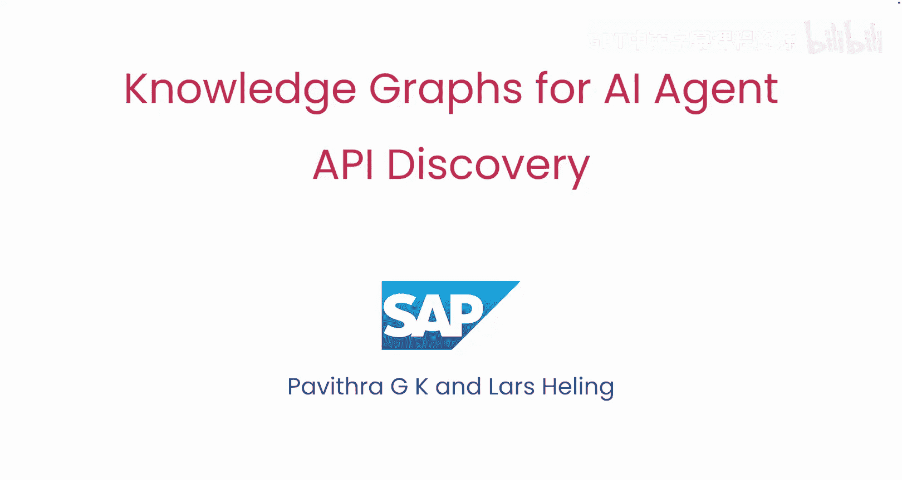

# 001：课程介绍 🧠

在本节课中，我们将要学习如何利用知识图谱来解决AI智能体在复杂业务流程中面临的API发现与调用顺序难题。课程由SAP Business AI的两位专家——业务知识图谱负责人Perfka GK和高级知识工程师La Healing——共同讲授。

## 概述

大型企业可能拥有成千上万个由不同团队开发的API，这些API旨在支持企业内部的各种任务，例如购买或退货、申请差旅批准、申请数据访问的IT批准等。虽然为AI智能体构建大量API是件好事，但这实际上使得智能体难以确定在执行业务流程时应该使用哪些API以及以何种顺序调用它们。

## 知识图谱的核心作用

为了解决这个问题，我们将使用知识图谱。其核心思路是：将原始的API规范导入知识图谱，从而获得所有API的结构化视图。更重要的是，我们会在图谱中添加信息，以指明调用API的正确顺序。

### 一个具体例子

假设一个智能体的任务是“购买一件商品”。它可能会搜索并找到“采购订单API”作为最相关的API，并试图直接调用该API来下单。然而，在一个大公司里，智能体可能不知道，它首先需要调用另一个API来创建“采购申请”，该申请需要经过IT部门批准后，才能最终调用“采购订单API”来下单。

这个“先创建采购申请，再获取IT批准，最后下订单”的流程信息，可能并不包含在单个API的定义中。如果没有这类信息，你的知识图谱和智能体理解并执行重要业务流程的能力将是不完整的。

## 扩展知识图谱：从列表到网络

正如Andrew所说，为了捕捉这种流程信息，你需要用**过程数据**来扩展知识图谱。这将使你的图谱从一个简单的API列表，转变为一个描述它们在真实流程中如何连接的**网络**。这样，智能体就能意识到，在调用创建订单的API之前，需要先调用采购申请API。

## 实现步骤：从语义检索到流程整合

为了给智能体提供执行给定任务所需的正确API，我们将遵循以下步骤：

上一节我们介绍了知识图谱如何结构化API信息，本节中我们来看看如何为智能体找到并组织这些API。

**以下是实现智能体API发现的两个关键步骤：**

1.  **语义检索**：首先，我们将对所有API及其规范进行**嵌入**，并使用**相似性搜索**来找到最佳匹配。例如，如果智能体想创建采购订单，它会检索到语义上相关的API，如“采购订单API”。
2.  **图谱扩展搜索**：然而，直接调用检索到的API可能并不正确，因为业务流程可能要求先调用“采购申请API”以获得经理批准。为了解决这个问题，我们将在知识图谱上进行扩展搜索，以查找并包含业务流程所需的相关API。这将为智能体提供所有必要的API以及它们应该被调用的顺序。

## 课程目标与展望

在最后一课中，我们将把所有内容整合起来，构建一个能够执行真实任务并遵循正确流程顺序的AI智能体。

本课程的创建离不开许多人的努力。特别感谢SAP团队的Tristph Meyer、Felix Sasaki和Johannes Hoofffat，以及来自Deep Blalinda AI的Eshma Gvari。

## 总结

本节课中我们一起学习了企业拥有复杂且重要的业务流程，而构建能够执行这些流程的生成式AI劳动力是AI社区未来工作的一个重要部分。正确地实现这一点是一个至关重要的问题。

下一课将是知识图谱的入门介绍，我们将了解什么是知识图谱，以及如何使用它们来帮助智能体理解并遵循复杂的多步骤流程。让我们进入下一个视频，开始学习吧。