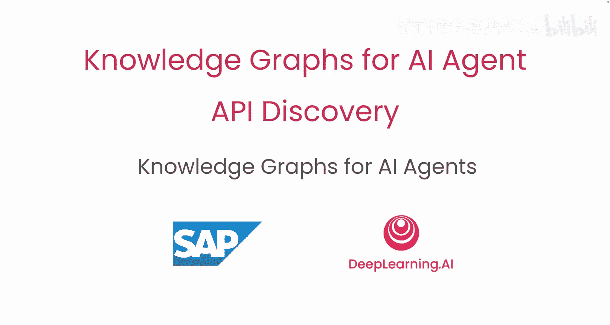
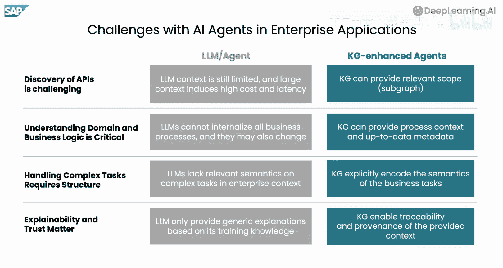
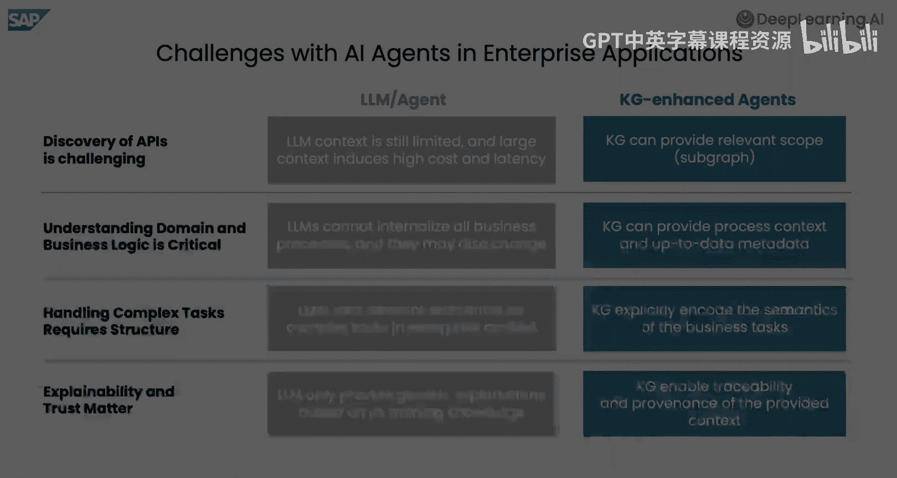

# 002：知识图谱基础 🧠



在本节课中，我们将要学习什么是知识图谱，了解构建它们的多种方法，并探讨它们如何在企业应用场景中，帮助AI智能体更好地发现和执行API。


## 概述

知识图谱是一种以图结构表示结构化信息的方法。它通过节点代表实体，边代表实体间的关系，将信息组织成一个互联的网络。这种结构不仅有助于人类理解复杂关系，更能为AI系统提供丰富的上下文和语义信息，从而提升其执行任务的准确性和效率。

## 知识图谱的实践应用

为了了解知识图谱在实践中的应用，我们可以进行一次快速的网络搜索。例如，搜索“SAP”。


在搜索结果中，除了匹配的网站列表，你还会看到一个关于实体“SAP”的全面概览，这便来源于知识图谱。这里展示了诸如描述、关联网站等属性，以及与其他实体的关系，例如其总部位于“沃尔多夫”。点击“沃尔多夫”，会跳转到该城市对应的知识图谱条目，再次看到其描述和与其他实体（如所属地区）的关系。

## 技术基础

现在我们已经看到了知识图谱的实际应用，让我们深入一点来理解其技术基础。

一个知识图谱以图的形式表示结构化信息，其中**节点**代表实体，**边**代表这些实体之间的关系。

知识图谱主要由两个部分组成：
1.  **模式或本体**：定义了知识图谱中出现的实体类型、它们的属性以及实体之间的关系。
2.  **实例数据**：构成图谱的具体实例，遵循模式的定义。

通常，表示知识图谱有两种主要方法：**标签属性图**和**资源描述框架**。虽然两者都建模实体和关系，但它们在结构、表达能力和适用场景上有所不同。在本课程中，我们将使用RDF作为基于图的数据模型来表示知识图谱。

资源描述框架是一种基于图的数据模型，由万维网联盟标准化。RDF不强制要求模式，这使其非常灵活，易于集成来自异构数据源的数据。SPARQL是RDF的标准查询语言，具有明确定义的语义，类似于关系数据模型中的SQL。

RDF的基本构建块是**三元组**。一个三元组由**主体**、**谓词**和**客体**组成。每个三元组都可以表示为RDF图中的一条带标签的有向边。

例如，边 `(SAP, 位于, 沃尔多夫)` 就表示“SAP位于沃尔多夫”这一事实。

## 知识图谱示例

理解了RDF图的基本元素后，让我们来看一个与我们之前网络搜索实验类似的知识图谱示例。

我们首先从一个代表SAP的节点开始。在RDF中，**统一资源标识符** 用于唯一标识图中的资源。我们可以为SAP实例添加属性，例如其成立年份、名称，并声明它是一个公司。RDF中属性的值被称为**字面量**。

我们可以进一步扩展图谱，将SAP链接到图中的其他节点，例如其CEO“克里斯蒂安·克莱因”和总部所在地城市“沃尔多夫”。

知识图谱的一个优势是能够**推断**出数据中未明确陈述、但可以从本体定义中推导出的事实。例如，通过定义“位于”是一种可传递的关系，我们就可以推断出“SAP位于德国”。

RDF图通常以机器可读的格式序列化，例如 `.nt` 或 `.ttl` 文件。如下所示，文件中的一个示例三元组表明SAP的CEO是克里斯蒂安·克莱因。

```turtle
<SAP> <CEO> "Christian Klein" .
```

## 构建知识图谱的方法

有多种方法可以构建知识图谱。

以下是几种主要的数据源类型及其处理方法：

*   **结构化源**：拥有固定的模式，同一类型或类别的实体使用相同的属性进行描述，例如关系数据库。这里会使用R2RML等映射规则来构建知识图谱。
*   **半结构化源**：拥有灵活的模式，同一类型或类别的实体可能以不同方式描述，例如XML文档。这里同样使用映射规则来构建知识图谱。
*   **非结构化源**：完全没有固定模式，例如自然语言文本或图像。可以使用自然语言处理等技术从这类数据源构建知识图谱。

在本课程中，你将使用结构化源来构建一个示例知识图谱。

## 知识图谱构建流程概览

以下是构建知识图谱的高级流程概述：

1.  **步骤0：定义用例**：定义用例、范围以及需要通过图谱回答的业务问题。这决定了需要提取哪些元数据、建模什么内容等。
2.  **步骤1：数据采集**：从整个企业生态系统中收集数据，这构成了知识图谱的基础。这是连接各种系统并提取其有价值的业务数据的奠基阶段。每个源系统都有自己的“语言”并以不同方式组织数据，例如CSV、XML、JSON等。
3.  **步骤2：数据分析与标准化**：分析和标准化数据，确保其“知识图谱就绪”。可以将其视为将不同的方言翻译成一种通用语言，包括去重、解决不一致性和验证数据质量，以确保知识图谱建立在可信信息的坚实基础上。
4.  **步骤3：数据建模**：这是魔法发生的地方。在这里，你将干净的数据转换为标准化的RDF三元组。每一条业务信息都被表示为主体-谓词-客体的陈述，直接反映了相关底层系统中的关系。
5.  **步骤4：价值实现**：在这里，你利用知识图谱的互联特性来交付价值。这些对源系统及其新连接的统一表示，使得分析和洞察能够从作为互联整体的源元数据中衍生出来。

## 知识图谱赋能AI智能体

现在你知道了什么是知识图谱以及构建它的各种方法，让我们看一个在企业环境中如何将知识图谱与AI智能体结合使用的例子。

假设有一个用户请求：“为采购组002和采购组织3000创建一份购买5支铅笔的采购订单”。你希望一个AI智能体来完成这个请求。如果没有上下文，这对智能体来说并非易事，因为企业系统环境可能非常复杂，有数千个可能相关的不同API。

因此，我们在系统环境中构建一个API知识图谱，并用业务流程信息对其进行丰富，从而为智能体提供正确的上下文，以完成用户请求。

在拥有复杂且不断演进的API的大型企业环境中，AI智能体面临几个挑战。知识图谱可以有效应对这些挑战：

以下是知识图谱如何帮助AI智能体应对企业环境挑战：

*   **挑战一：API发现效率低**：大语言模型通常需要花费大量时间在试错过程中寻找正确的API，这会显著降低效率。
    *   **知识图谱的解决方案**：知识图谱围绕业务流程和对象组织API，缩小了搜索空间，使规划更高效，减少了不必要的重新规划，从而整体上加速了执行。
*   **挑战二：缺乏深度上下文**：虽然大语言模型和RAG等检索系统擅长提取相关内容，但它们常常忽略更深层次的结构和上下文，特别是在涉及领域特定逻辑或API元数据时。
    *   **知识图谱的解决方案**：知识图谱提供了缺失的上下文。因为它们是结构化的且语义丰富，反映了API、业务流程和数据模型之间的关系。这对于确保回答的准确性和避免幻觉特别有帮助，尤其是在动态或定制的业务环境中。
*   **挑战三：处理复杂任务能力有限**：对于简单的读取操作，大语言模型通常能应对。但当任务变得更复杂时，例如按正确顺序执行一系列API调用或理解允许的固定值，它们就开始力不从心。
    *   **知识图谱的解决方案**：知识图谱提供了内置的结构，可以映射这些依赖关系和序列，逐步指导智能体，减少出错机会。
*   **挑战四：推理过程不透明**：AI智能体通常基于学习到的模式或检索到的片段生成答案，但很少提供它们如何得出答案的可见性。这使得解释结果或追溯到源逻辑变得困难，尤其是当同一查询返回不同结果时。
    *   **知识图谱的解决方案**：知识图谱通过使推理过程透明化来改变这一点。你可以精确追踪使用了哪些API、使用了什么过滤器、系统返回了什么、源系统是什么等等。这些能力在企业环境中至关重要，因为信任、可审计性和可重现性是不可妥协的。




## 总结


本节课中，我们一起学习了知识图谱的基础概念。我们了解到知识图谱是一种用图结构（节点和边）表示实体及其关系的技术。它可以通过结构化、半结构化和非结构化数据源构建。在企业应用中，知识图谱通过为AI智能体提供丰富的、结构化的上下文信息，显著提升了其在复杂系统环境中进行API发现、任务规划和执行的效率与准确性，同时增强了整个过程的透明度和可追溯性。