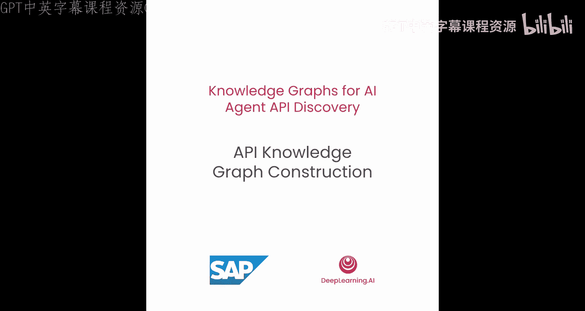
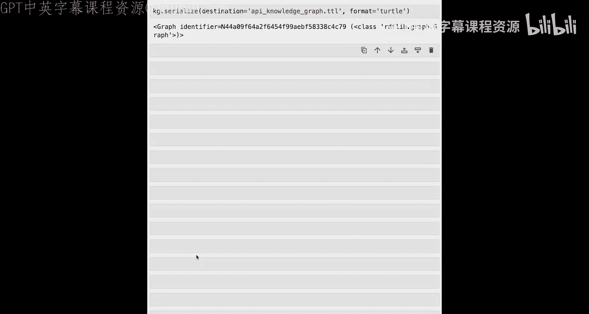

# 003：API知识图谱构建 🧱



在本节课中，我们将学习如何从一个关于API服务及其端点的示例数据集构建知识图谱。具体来说，你将了解一种声明式的知识图谱构建方法。


## 概述

我们将从查看输入数据开始，然后学习如何为知识图谱建模数据，即引入知识图谱模式。最后，你将学习一种声明式的方法，按照模式将输入数据映射到知识图谱。虽然本课程使用OData API及其EDMX规范，但该方法并不局限于OData，也可应用于其他API规范。

现在，让我们进入实践环节，构建第一个知识图谱。

## 导入必要包

我们首先导入所有必要的包。使用 `pandas` 读取CSV文件，`RDFLib` 构建知识图谱，`networkx` 和 `matplotlib` 用于可视化知识图谱，以及一些辅助函数将RDF图转换为networkx图。

```python
import pandas as pd
from rdflib import Graph, URIRef, Literal, Namespace
import networkx as nx
import matplotlib.pyplot as plt
# 假设有一些辅助函数，例如 `rdf_to_networkx`
```

## 加载输入数据

让我们从CSV文件读取输入数据，了解每个API概念的信息。

### 1. 读取服务数据

首先，我们从CSV文件读取服务信息。我们定义其为逗号分隔文件，可以指定版本列的数据类型为字符串，并定义如何处理数据中的空值。

```python
services_df = pd.read_csv('services.csv', sep=',', dtype={'version': str}, na_values=[''])
print(services_df.head(1))
```

我们查看CSV文件的第一行。可以看到API服务的名称、版本和描述。例如，有一个版本为4.0的采购订单API，描述为“用于采购订单的OData服务”。

### 2. 读取实体类型数据

接下来，查看实体类型。同样从CSV文件读取，处理空值。对于实体类型，有名称和该实体类型所属的服务。

```python
entity_types_df = pd.read_csv('entity_types.csv', sep=',', na_values=[''])
print(entity_types_df.head(1))
```

例如，有一个“采购申请项目类型”，属于采购申请API。

### 3. 读取属性数据

现在，查看为这些实体类型提供更多信息的属性。再次读取CSV文件，处理空值。对于属性，有属性所属的服务、属性所属的实体类型、属性名称、更描述性的标签、属性类型、最大长度、是否是实体类型的关键属性以及是否可被UI应用程序选择。

```python
properties_df = pd.read_csv('properties.csv', sep=',', na_values=[''])
print(properties_df.head(1))
```

例如，属性“现金折扣”，标签为“现金折扣百分比”，类型为十进制。

### 4. 读取导航属性数据

接下来，加载导航属性。我们读取CSV文件，并查看前两行以理解导航的类型。

```python
navigations_df = pd.read_csv('navigations.csv', sep=',', na_values=[''])
print(navigations_df.head(2))
```

导航属性为服务定义，有名称、导航起始的实体类型、导航目标的实体类型以及多重性。例如，从采购订单项目导航到采购订单的多重性为“1”，表示一个采购订单项目恰好属于一个采购订单。而从采购订单导航到采购订单项目的多重性为“*”，表示一对多关系。

### 5. 读取实体集数据

最后，查看实体集。加载CSV文件，查看第一行。实体集是特定实体类型实体的逻辑容器。每个实体类型恰好属于一个实体集。

```python
entity_sets_df = pd.read_csv('entity_sets.csv', sep=',', na_values=[''])
print(entity_sets_df.head(1))
```

这里有实体集的名称、所属的服务以及所属的实体类型。

### 数据统计

现在，简要查看刚刚导入的数据的统计信息。我们建立一个简单的字典，将加载的类型映射到每个对应数据框的行数。

```python
data_stats = {
    'Services': len(services_df),
    'Entity Sets': len(entity_sets_df),
    'Entity Types': len(entity_types_df),
    'Navigations': len(navigations_df),
    'Properties': len(properties_df)
}
print(data_stats)
```

可以看到有39个服务，总共101个实体集和对应的实体类型，1206个导航属性，以及为这101个实体类型定义的超过2000个属性类型。

## 定义知识图谱模式

在理解了输入数据之后，下一步是为我们的知识图谱定义模式或本体。知识图谱模式定义了图内的结构和关系。它指定了可以存在于图中的实体类型（节点）和关系类型（边）。模式充当蓝图，提供了被建模领域知识的正式表示，并支持对知识图谱进行高效查询、推理和推断。

所有数据API都使用实体数据模型进行描述，我们从该模型派生出知识图谱模式。让我们看看这个模式。

*   **服务**：主要入口点。服务以机器可读的形式宣传其具体数据模型，允许通用客户端以定义良好的方式与服务交互。
*   **实体类型**：用于描述API服务端点提供的数据结构的基本构建块。
*   **属性**：定义实体类型实例将包含的数据的形状和特征。属性具有数据类型、最大长度等，并指示它们是否是实体类型的关键属性。
*   **导航属性**：实体类型上的可选属性，允许从关联的一端导航到另一端。
*   **实体集**：实体类型实例的逻辑容器。每个实体类型链接到恰好一个实体集。

## 使用SPARQL进行映射

接下来，你需要定义映射，以使用此模式将输入数据转换为知识图谱。在本课程中，你将使用SPARQL（RDF的标准查询语言）来定义这些映射。

如果你不熟悉SPARQL，这里有一个快速介绍。SPARQL是RDF的标准查询语言，你可以将其视为RDF的SQL，可能会注意到一些语法上的相似之处。

让我们看一个示例SPARQL查询。查询的主要部分是 `WHERE` 子句，它定义了应在RDF图中匹配的图模式。此类图模式的核心组件是三元组模式。三元组模式类似于RDF三元组，但也允许使用应在图中匹配的变量，变量以问号开头。

此外，SPARQL支持各种查询形式。本示例使用 `SELECT` 查询形式来检索解决方案映射，类似于SQL。`SELECT` 查询的结果可以表示为一个表，其中列对应于查询中的变量，行对应于解决方案。

在本课中，你将使用 `CONSTRUCT` 查询形式来构建图。在 `CONSTRUCT` SPARQL查询中，你可以在 `CONSTRUCT` 子句中使用三元组模式来定义要构建的图的形状。你还可以在查询的 `WHERE` 子句中使用 `BIND` 语句来创建要添加到图中的实体的唯一标识符。

在我们的映射函数中，图模式中的变量被CSV文件列的值替换。也就是说，CSV文件的每一行都会得到一个实例化，该实例化被添加到我们的知识图谱中。

## 在笔记本中实践

现在，让我们回到笔记本，在实践中完成这个步骤。

### 1. 构建服务的三元组

我们可以设置第一个 `CONSTRUCT` 查询，为服务数据生成RDF三元组。这对应于你刚才看到的查询。

```sparql
CONSTRUCT {
    ?service a :Service ;
             :description ?description ;
             :version ?version ;
             :name ?name .
}
WHERE {
    BIND(URI(CONCAT("http://example.org/service/", ?name)) AS ?service)
}
```

现在，让我们看一下转换函数，它接收输入数据框和查询作为输入，并为这些输入生成RDF三元组。

```python
def transform(df, construct_query, first_row_only=False):
    result_graph = Graph()
    query_graph = Graph()
    query_graph.parse(data=construct_query, format='sparql')
    headers = df.columns.tolist()
    data_iter = df.head(1).iterrows() if first_row_only else df.iterrows()
    for index, row in data_iter:
        init_bindings = {var: Literal(row[col]) for var, col in zip(['?'+h for h in headers], headers)}
        for triple in query_graph.query(construct_query, initBindings=init_bindings):
            result_graph.add(triple)
    return result_graph
```

让我们仅为服务数据框的第一行执行该函数并打印结果。

```python
sample_service_triples = transform(services_df.head(1), service_construct_query)
print(sample_service_triples.serialize(format='turtle'))
```

你看到使用Turtle序列化创建的结果三元组。我们为采购订单创建了一个服务，并添加了描述、名称和版本的三元组。

接下来，我们处理整个数据框，并将构建的三元组添加到我们之前定义的知识图谱 `kg` 中。

```python
kg = Graph()
service_triples = transform(services_df, service_construct_query)
kg += service_triples
print(f"知识图谱大小（添加服务后）: {len(kg)}")
```

通过处理服务的整个数据框，我们创建了一个包含156个三元组的知识图谱。

### 2. 处理剩余数据框

让我们继续处理剩余的数据框。

以下是实体集的 `CONSTRUCT` 查询。我们再次调用转换函数，并在将实体集添加到知识图谱后打印知识图谱的大小。

```python
entity_set_construct_query = """
CONSTRUCT {
    ?entity_set a :EntitySet ;
                :belongsTo ?service ;
                :containsEntityType ?entity_type ;
                :name ?name .
}
WHERE {
    BIND(URI(CONCAT("http://example.org/entityset/", ?name)) AS ?entity_set)
    BIND(URI(CONCAT("http://example.org/service/", ?service_name)) AS ?service)
    BIND(URI(CONCAT("http://example.org/entitytype/", ?entity_type_name)) AS ?entity_type)
}
"""
entity_set_triples = transform(entity_sets_df, entity_set_construct_query)
kg += entity_set_triples
print(f"知识图谱大小（添-加实体集后）: {len(kg)}")
```

如你所见，知识图谱的大小增加了。我们现在有超过400个三元组。

类似地，我们将处理实体类型、属性和导航属性，每次处理后都打印知识图谱的大小。最终，我们得到了一个更大的知识图谱，拥有超过14000个三元组，这是因为有超过2000个属性，它们为图添加了相当数量的三元组。

## 可视化知识图谱

现在，你已成功构建了业务API的知识图谱。我们的AI智能体已经可以利用它与单个API进行交互。然而，它仍然缺乏这些API如何在业务流程中使用的上下文。

考虑采购申请和采购订单的实体集，它们在直接材料采购过程中存在依赖关系。让我们通过绘制由这两个实体集诱导的子图来可视化这种不连通性。

首先，我们使用SPARQL查询从图中检索采购订单和采购申请的实体集节点。

```python
def get_entity_set_node(graph, entity_set_name):
    query = """
    SELECT ?entity_set WHERE {
        ?entity_set a :EntitySet ;
                    :name ?name .
        FILTER(?name = "%s")
    }
    """ % entity_set_name
    result = list(graph.query(query))
    return result[0][0] if result else None

po_node = get_entity_set_node(kg, "PurchaseOrder")
pr_node = get_entity_set_node(kg, "PurchaseRequisition")
```

接下来，我们构建由这两个节点从知识图谱中诱导出的子图。

```python
def get_subgraph(graph, central_node, depth=2):
    # 这是一个简化示例，实际中可能需要更复杂的遍历
    # 这里假设有一个辅助函数 `expand_graph` 来获取特定深度内的邻居
    subgraph_nodes = expand_graph(graph, central_node, depth)
    subgraph = graph.subgraph(subgraph_nodes)
    return subgraph

po_subgraph = get_subgraph(kg, po_node)
pr_subgraph = get_subgraph(kg, pr_node)
combined_subgraph = nx.compose(po_subgraph, pr_subgraph)
```

为了可视化该图，我们使用networkx库。

```python
def visualize_graph(graph):
    pos = nx.spring_layout(graph, seed=42)
    node_colors = []
    node_shapes = []
    for node in graph.nodes():
        if 'PurchaseOrder' in str(node):
            node_colors.append('lightgray')
        elif 'PurchaseRequisition' in str(node):
            node_colors.append('lightblue')
        else:
            node_colors.append('white')
        # 根据节点类型分配形状（示例）
        if 'Service' in str(node):
            node_shapes.append('o') # 圆形
        elif 'EntityType' in str(node):
            node_shapes.append('s') # 方形
        elif 'Property' in str(node):
            node_shapes.append('^') # 上三角
        elif 'Navigation' in str(node):
            node_shapes.append('v') # 下三角
        else:
            node_shapes.append('o')
    nx.draw(graph, pos, with_labels=False, node_color=node_colors, node_shape=node_shapes[0], node_size=300)
    plt.show()

visualize_graph(combined_subgraph)
```

在此可视化中，蓝色节点对应于采购申请API，灰色节点对应于采购订单API。你还可以看到不同形状的节点。例如，中心的圆形节点对应于实际的API服务，它连接到表示为方形节点的不同实体类型。对于每个实体类型，你可以看到许多用上三角形表示的属性。此外，你看到连接不同实体类型的较大的下三角形，这对应于不同实体类型之间的导航。

如你所见，采购申请API在知识图谱中并未连接到采购订单API。我鼓励你尝试在知识图谱中搜索其他实体集并绘制它们，以查看它们在知识图谱中的结构表示。

## 序列化知识图谱

目前，知识图谱是一个保存在内存中的RDFLib图。为了共享和重用知识图谱，你可以使用任何RDF序列化将其具体化到磁盘上。在这里，我们使用你在上一课中已经见过的Turtle格式序列化知识图谱。

```python
kg.serialize(destination='api_knowledge_graph.ttl', format='turtle')
print("知识图谱已保存到 'api_knowledge_graph.ttl'")
```

生成的知识图谱将存储到磁盘，我们可以在下一课中使用它。

## 总结



在本节课中，我们为API数据构建了一个知识图谱。你看到了它是如何不连通的，API之间没有连接。在下一课中，你将学习如何集成业务流程数据，以便根据API服务在业务流程中的使用情况来连接这些API服务。