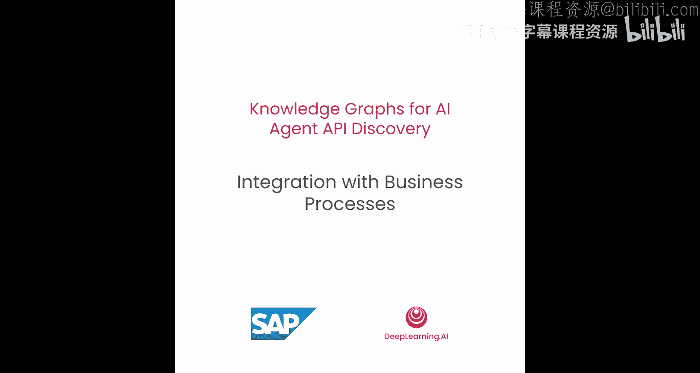
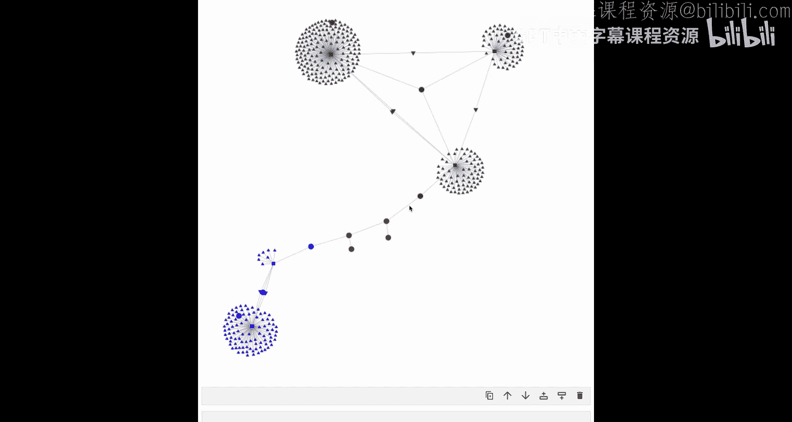
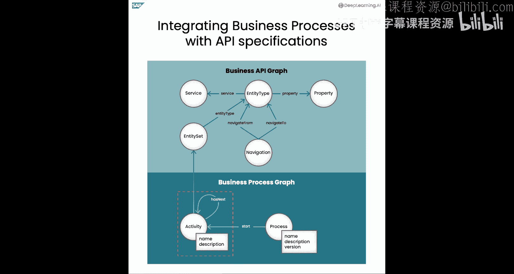
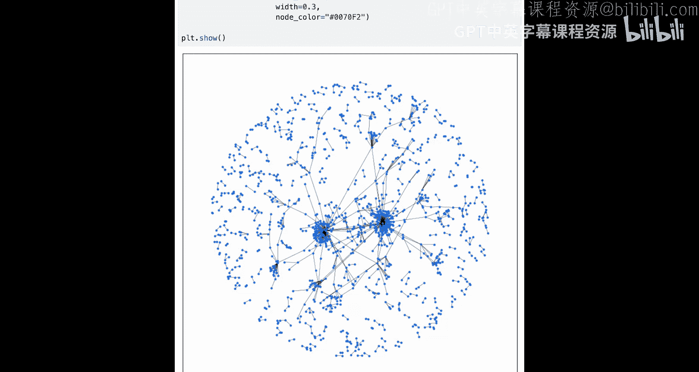
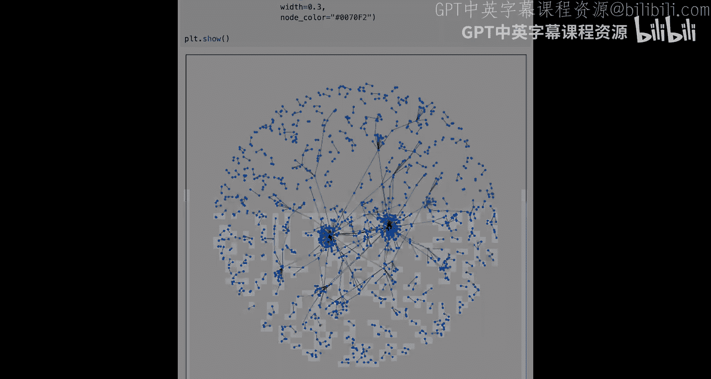

# 004：与业务流程集成




在本节课中，我们将学习如何将业务流程数据扩展到知识图谱中，以更好地连接API服务，并提供关于流程中依赖关系的上下文信息。

## 概述

上一节我们介绍了如何构建包含API元数据的基础知识图谱。本节中，我们将探讨如何集成业务流程数据，从而在API之间建立有意义的连接，使AI智能体能够理解服务在特定业务上下文中的依赖关系。

## 业务流程的核心概念

为了将流程数据集成到图谱中，我们首先需要理解两个核心概念：**流程**和**活动**。



*   **流程**：定义了一组按特定顺序执行以完成某个业务目标的**活动**集合。一个流程包含名称、描述和版本信息，并链接到该流程的起始活动。
*   **活动**：代表流程中的一个具体步骤。每个活动有名称和描述，并链接到流程中的下一个活动。



为了将流程图谱数据与API数据连接起来，我们可以在适用的情况下将**活动**链接到对应的**实体集**。例如，“创建采购申请”这个活动可以链接到“采购申请”实体集。为简化起见，本课程我们省略了分支、循环等复杂流程，仅关注顺序执行的简单流程。

## 业务流程示例

现在，让我们来看一个具体的例子。考虑一个用于**直接物料采购**的简单流程，该流程通常由采购员执行。

1.  首先，创建一个**采购申请**。
2.  在该申请获得批准后，基于此申请创建一个新的**采购订单**。
3.  最后，经过一些潜在的中间步骤后，**采购订单**被关闭。

在这个流程中，“创建采购申请”和“创建采购订单”这两个步骤可以链接到知识图谱中相应的实体集。通过这种连接，AI智能体可以推导出：在此特定流程的上下文中，**采购订单实体集依赖于采购申请实体集**。

接下来，让我们进入实践环节，看看如何将流程数据与上一课创建的API数据和知识图谱进行集成。

## 实践：集成流程与API数据

我们将通过代码演示如何将业务流程数据整合到已有的API知识图谱中。

### 1. 导入必要的包

首先，我们导入所需的软件包，这些包与上一课使用的相同。

```python
# 导入必要的库，例如用于处理RDF图的rdflib
import rdflib
from rdflib.namespace import RDF, RDFS
```

### 2. 加载上一课的知识图谱

为了将流程数据链接到已有的业务API知识图谱，我们首先从上一课导入这个图谱。

```python
# 创建一个空的API知识图谱
api_kg = rdflib.Graph()
# 读取并解析上一课保存的文件
api_kg.parse("api_knowledge_graph.ttl", format="turtle")
# 打印图谱中的三元组数量
print(f"API知识图谱包含 {len(api_kg)} 个三元组。")
```
运行结果应显示超过14000个三元组，这与上一课图谱的大小相符。

### 3. 加载业务流程图谱

对于本课，我们已经从BPMN图中提取了一些流程并将其转换为RDF格式。BPMN（业务流程模型与标记法）是定义业务流程的标准。

```python
# 创建一个空的流程知识图谱
process_kg = rdflib.Graph()
# 从Turtle文件解析业务流程数据
process_kg.parse("business_processes.ttl", format="turtle")
# 打印业务流程图谱的大小
print(f"业务流程图谱包含 {len(process_kg)} 个三元组。")
```
我们的业务流程图谱大约有150个三元组。让我们查看一下其中包含哪些流程。

### 4. 查询业务流程

我们使用SPARQL查询来检索业务流程图谱中的流程。

```python
# 定义SPARQL查询，选择所有流程及其名称
query = """
PREFIX kg: <http://example.org/kg#>
SELECT ?process ?processName
WHERE {
    ?process a kg:Process .
    ?process kg:name ?processName .
}
"""
# 在流程知识图谱上运行查询
results = process_kg.query(query)
# 打印所有流程的名称
print("知识图谱中的流程包括：")
for row in results:
    print(f"- {row.processName}")
```
以下是查询结果示例。这些流程包括直接物料采购、库存领用、外部运输计划等，这些是大多数公司中常见的流程。

### 5. 合并知识图谱

现在我们已经看到了一些流程，我们可以简单地将业务流程图谱添加到上一课的业务API图谱中，从而得到一个组合知识图谱。

```python
# 创建一个新的空图谱作为合并后的图谱
combined_kg = rdflib.Graph()
# 将API图谱和流程图谱合并到新图谱中
combined_kg += api_kg
combined_kg += process_kg
# 打印合并后图谱的大小
print(f"合并后的知识图谱包含 {len(combined_kg)} 个三元组。")
```
如你所见，合并后的知识图谱大小正好等于两个独立图谱（API知识图谱和流程知识图谱）大小之和。与上一课类似，你可以将知识图谱序列化为Turtle语法并写入磁盘。

### 6. 探索流程与API的连接

合并图谱后，我们可以查询知识图谱，并发现流程与API之间的连接。在流程图谱中，活动可以链接到相应的API实体集（如果适用）。

以下是一个SPARQL查询，用于检索“直接物料采购”流程的活动，以及链接到实体集的活动。

```python
# 查询特定流程的活动及其链接的实体集和服务
connection_query = """
PREFIX kg: <http://example.org/kg#>
SELECT ?activityName ?entitySetName ?serviceName
WHERE {
    # 找到“直接物料采购”流程
    ?process a kg:Process ;
             kg:name "Procurement of Direct Materials" ;
             kg:hasStartActivity ?startActivity .
    # 使用属性路径查询获取该流程的所有后续活动
    ?activity kg:next* ?startActivity .
    ?activity kg:name ?activityName .
    # 检查活动是否链接到实体集
    OPTIONAL {
        ?activity kg:linksToEntitySet ?entitySet .
        ?entitySet kg:name ?entitySetName ;
                   kg:belongsTo ?service .
        ?service kg:name ?serviceName .
    }
}
"""
# 在合并图谱上运行查询
connection_results = combined_kg.query(connection_query)
# 打印结果
print("流程活动及其连接的实体集和服务：")
for row in connection_results:
    if row.entitySetName:
        print(f"活动 '{row.activityName}' 链接到服务 '{row.serviceName}' 中的实体集 '{row.entitySetName}'")
    else:
        print(f"活动 '{row.activityName}' 未链接到实体集")
```
我们能看到类似以下的结果：活动“创建采购申请”链接到“采购申请API”服务中的“采购申请”实体集；活动“创建采购订单”链接到“采购订单API”服务中的“采购订单”实体集。

### 7. 可视化连接关系

让我们回顾一下上一课中看到的断开连接的图谱。如你所见，API之间没有连接，“采购申请API”信息和“采购订单API”信息是孤立的。

现在你将看到这些服务如何通过流程连接起来。与上一课类似，你首先从知识图谱中获取节点。但现在，你只需要“采购订单”节点或“采购申请”节点中的一个作为起始实体集，因为实体集现在可以通过流程信息相互访问。

```python
# 查询“采购订单”实体集作为起始点
start_query = """
PREFIX kg: <http://example.org/kg#>
SELECT ?entitySet
WHERE {
    ?entitySet a kg:EntitySet ;
               kg:name "Purchase Order" .
}
"""
start_result = list(combined_kg.query(start_query))
purchase_order_uri = start_result[0][0] if start_result else None
print(f"起始实体集URI: {purchase_order_uri}")
```
现在，你可以通过以“采购订单”实体集URI为种子节点来绘制连接图。我们再次将RDF图转换为networkX图以便可视化，并构建由该节点诱导出的子图。

```python
import networkx as nx
import matplotlib.pyplot as plt

# 将RDF子图转换为networkX图（此处为示意，实际转换需要更多代码）
# nx_graph = convert_rdf_to_networkx(combined_kg, seed_node=purchase_order_uri, depth=3)
# 绘制图形
# ... 可视化代码 ...
```
最终生成的图谱将是连通的。图中，蓝色部分代表“采购申请API”的信息，灰色部分代表“采购订单API”的信息，而红色的节点则是来自业务流程的**活动**，正是这些活动使我们能够连接“采购订单”和“采购申请”的实体集。

### 8. 查看完整知识图谱

在创建了结合API信息和业务流程信息的知识图谱，并看到它们如何通过流程活动连接之后，让我们看一下整个知识图谱的全貌。

虽然模型或模式相当简单，只包含少数几个概念，但包含实际API定义和流程的**实例数据**的知识图谱则要大得多且复杂得多。因此，我们只可视化包含100条随机边的图谱子集。

```python
# SPARQL查询，随机选择100条边
sample_query = """
SELECT ?s ?p ?o
WHERE {
    ?s ?p ?o .
}
ORDER BY RAND()
LIMIT 100
"""
# 获取边列表并绘制（此处为示意）
# sampled_edges = list(combined_kg.query(sample_query))
# ... 使用networkX绘制采样后的图 ...
```
该图展示了知识图谱的规模和复杂性，并且它甚至只显示了100条边，这仅占整个图谱的约0.7%。由此可见，整个知识图谱过于庞大和复杂，无法将其全部内容作为上下文提供给AI智能体。

## 总结





本节课中，我们一起学习了如何将**业务流程数据**集成到API知识图谱中。我们介绍了流程和活动的核心概念，并通过实践演示了如何加载、合并流程与API图谱，以及如何通过流程活动在原本孤立的API服务之间建立有意义的连接。最后，我们看到完整的知识图谱规模庞大，直接将其全部提供给AI智能体是不现实的。在下一课中，我们将学习如何利用语义嵌入技术，从知识图谱中智能地发现仅与当前任务**相关的API**。