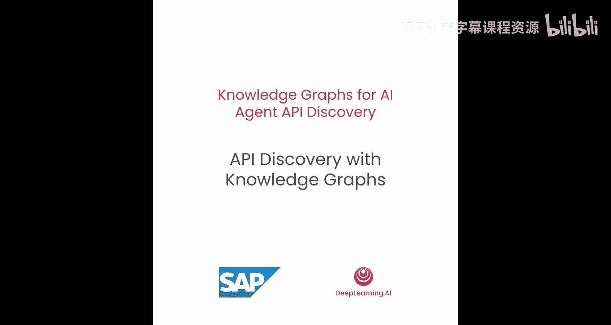
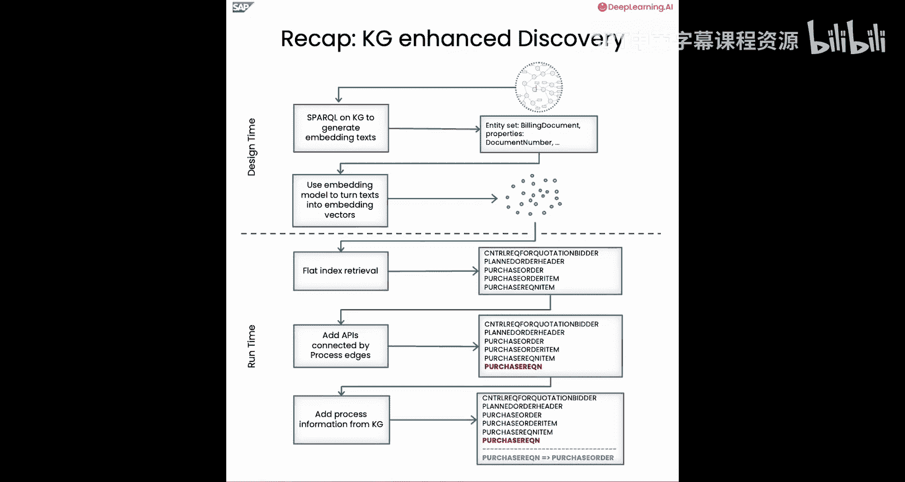
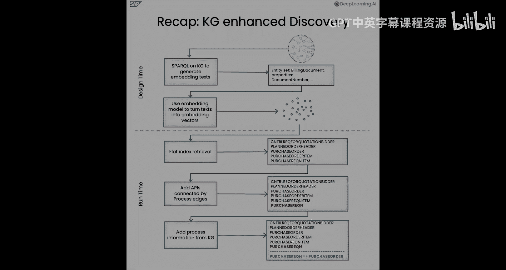

# 005：使用知识图谱进行API发现 🔍



在本节课中，我们将学习如何利用知识图谱来帮助AI智能体发现API。我们将回顾之前构建的知识图谱，并学习如何通过两个关键步骤——设计时准备和运行时查询处理——来增强API发现过程，从而更智能、更准确地为智能体提供相关的API信息。


---

## 设计时：初始检索准备

在上一节中，我们构建了一个整合了API及其相关业务流程信息的图谱。本节中，我们来看看如何为API发现做准备。以下是设计时需要完成的步骤：

1.  **从知识图谱中检索实体集及其属性**：首先，我们需要从图谱中获取所有实体集（如“采购订单”）及其标签和属性。
2.  **将检索到的文本转换为嵌入向量**：接着，使用嵌入模型将这些文本信息转化为向量表示，以便后续进行语义相似度搜索。

---

## 运行时：接收并处理用户查询

在运行时，当接收到用户查询时，我们将执行以下步骤来发现最相关的API：

1.  **基于嵌入向量的初步检索**：首先，根据用户查询的嵌入向量，在索引中进行初步检索，得到一个相关的实体集列表。
2.  **添加通过业务流程边连接的API**：然后，利用知识图谱中的业务流程依赖关系，将与初步检索结果相关的其他API（例如，创建“采购订单”前所需的“采购申请”）也加入候选列表。
3.  **基于业务流程信息丰富检索结果**：最后，将相关的业务流程信息附加到检索到的实体集上，为AI智能体提供更完整的上下文。

---

## 开始实践：导入必要包

与之前的课程一样，我们首先导入所有必要的Python包。本节引入了一些新工具：

```python
# 导入用于语义相似度搜索的FAISS索引类
from faiss import IndexFlatL2
# 导入用于显示循环进度的工具
from tqdm import tqdm
# 导入OpenAI的文本嵌入模型
from langchain.embeddings import OpenAIEmbeddings
# 导入参数化SPARQL查询的辅助函数
from helper_functions import parameterize_sparql_query
```

设置好数据框的显示格式后，我们初始化嵌入模型。

---

## 初始化嵌入模型

我们使用OpenAI的`text-embedding-3-large`模型来初始化一个嵌入模型：

```python
embedding_model = OpenAIEmbeddings(model="text-embedding-3-large")
```

接着，加载我们在之前课程中构建的知识图谱。在实际业务场景中，我们可能面对成千上万个API，直接将所有选项提供给大型语言模型通常因令牌限制和延迟问题而效率低下。因此，我们需要将API选择空间缩小到一个与用户查询相关的小型子集。

---

## 为何需要增强检索？

简单的平面检索能在一定程度上减少API数量，但存在两个问题：

1.  **假阴性问题**：有些相关的API可能因为与用户查询的语义相似度不够高，在检索步骤中被遗漏。通过利用知识图谱中的业务流程边进行第二步增强检索，这些API仍然可以被找到。
2.  **假阳性问题**：在检索到的API端点列表之上添加业务流程信息，有助于智能体排除不相关的假阳性结果。

---

## 为实体集构建嵌入文本

在构建实体集的嵌入文本之前，我们首先需要从知识图谱中检索每个实体集的所有属性。

以下是一个SPARQL查询示例，用于检索与“采购订单”实体集相关的所有属性：

```sparql
PREFIX rdf: <http://www.w3.org/1999/02/22-rdf-syntax-ns#>
PREFIX aud: <http://example.org/auditor/>
SELECT DISTINCT ?entitySet ?propertyLabel
WHERE {
    # 绑定到特定的实体集（例如采购订单）
    BIND(aud:PurchaseOrder AS ?entitySet).
    # 确保绑定的URI被声明为一个实体集
    ?entitySet rdf:type aud:EntitySet.
    # 获取实体集的名称
    ?entitySet aud:name ?entitySetName.
    # 获取该实体集对应的实体类型
    ?entitySet aud:hasEntityType ?entityType.
    # 获取该实体类型的所有属性及其标签
    ?entityType aud:hasProperty ?property.
    ?property aud:label ?propertyLabel.
}
```

执行此查询后，我们将获得一个字典，其中包含实体集名称及其对应的属性标签列表。

---

## 生成嵌入向量并建立索引

接下来，我们将每个实体集及其属性名称连接成一个文本字符串，然后使用嵌入模型将其转换为向量：

```python
# 假设 `entity_texts` 是包含所有实体集文本的列表
embeddings = []
for text in tqdm(entity_texts):
    vector = embedding_model.embed_query(text)
    embeddings.append(vector)
```

获得所有嵌入向量后，我们使用FAISS库来建立索引，以便进行高效的相似度搜索：

```python
import faiss
import numpy as np

# 将嵌入向量列表转换为numpy数组
embedding_array = np.array(embeddings).astype('float32')
# 创建FAISS索引（使用L2距离）
index = faiss.IndexFlatL2(embedding_array.shape[1])
index.add(embedding_array)
```

最后，我们将索引和对应的实体集URI保存到磁盘，供后续使用。

---

## 执行查询与初步检索

现在我们已经创建了索引，可以定义一个函数来查找给定查询的最相似实体集：

```python
def find_similar_entities(query, top_k=5):
    # 将用户查询转换为嵌入向量
    query_embedding = embedding_model.embed_query(query)
    query_embedding = np.array([query_embedding]).astype('float32')
    # 在索引中搜索最相似的top_k个实体
    distances, indices = index.search(query_embedding, top_k)
    # 返回对应的实体集URI
    return [entity_uris[i] for i in indices[0]]
```

让我们用一个示例查询来测试：“为采购组002和采购组织3000创建一份购买五支铅笔的采购订单”。

执行此函数后，我们可能会得到一系列与“采购订单”相关的实体集。但需要注意的是，初步检索可能会遗漏“采购申请抬头”这个重要的前置实体集。

---

## 利用业务流程边增强检索

为了解决假阴性问题，我们需要从知识图谱中获取与已检索实体集相连的业务流程边。

以下SPARQL查询用于查找与给定实体集有流程依赖关系的其他实体集：

```sparql
PREFIX pr: <http://example.org/process/>
SELECT DISTINCT ?sourceEntity ?targetEntity ?sourceName ?targetName
WHERE {
    {
        # 查找以给定实体集为起点的流程边
        ?sourceEntity pr:hasNext ?targetEntity.
        ?sourceEntity aud:name ?sourceName.
        ?targetEntity aud:name ?targetName.
        FILTER(?sourceEntity IN (<...URI列表...>))
    } UNION {
        # 查找以给定实体集为终点的流程边（反向依赖）
        ?targetEntity pr:hasNext ?sourceEntity.
        ?sourceEntity aud:name ?sourceName.
        ?targetEntity aud:name ?targetName.
        FILTER(?targetEntity IN (<...URI列表...>))
    }
}
```

执行此查询后，我们可以获得一个扩展的实体集列表，其中包含了通过业务流程连接的相关API。在我们的例子中，“采购申请抬头”就被成功添加进来。

---

## 整合：知识图谱增强的API发现流程

现在，我们将平面检索和业务流程依赖检索结合起来，形成一个完整的API发现函数：

```python
def enhanced_api_discovery(user_query, top_k_initial=5):
    # 1. 基于嵌入的初步检索
    initial_entities = find_similar_entities(user_query, top_k=top_k_initial)
    # 2. 获取业务流程依赖
    process_entities = get_process_dependencies(initial_entities)
    # 3. 合并结果并去重
    all_relevant_entities = list(set(initial_entities + process_entities))
    # 4. （可选）从图谱中获取这些实体的业务流程信息
    business_process_info = get_business_process_info(all_relevant_entities)
    return all_relevant_entities, business_process_info
```

使用相同的示例查询调用此函数，我们现在不仅能得到与“采购订单”相关的实体集，还能获得“采购申请抬头”以及“采购订单依赖于采购申请”这样的业务流程信息。

---

## 总结

本节课中我们一起学习了如何利用知识图谱进行API发现：

*   **在设计时**，我们通过查询知识图谱，将实体集的属性转化为文本表示，并计算其嵌入向量以建立索引。
*   **在运行时**，发现过程从基于嵌入向量的初步检索开始，得到一个实体集列表。
*   为了弥补初步检索可能遗漏相关API的不足，我们**添加了通过业务流程边连接的API**（例如，成功添加了“采购申请”）。
*   最后，我们**利用知识图谱中的业务流程信息丰富了检索到的实体集**，为AI智能体提供了更全面的上下文。





在下一节课中，我们将应用本节构建的发现机制，让AI智能体实际执行API的发现与调用。🚀