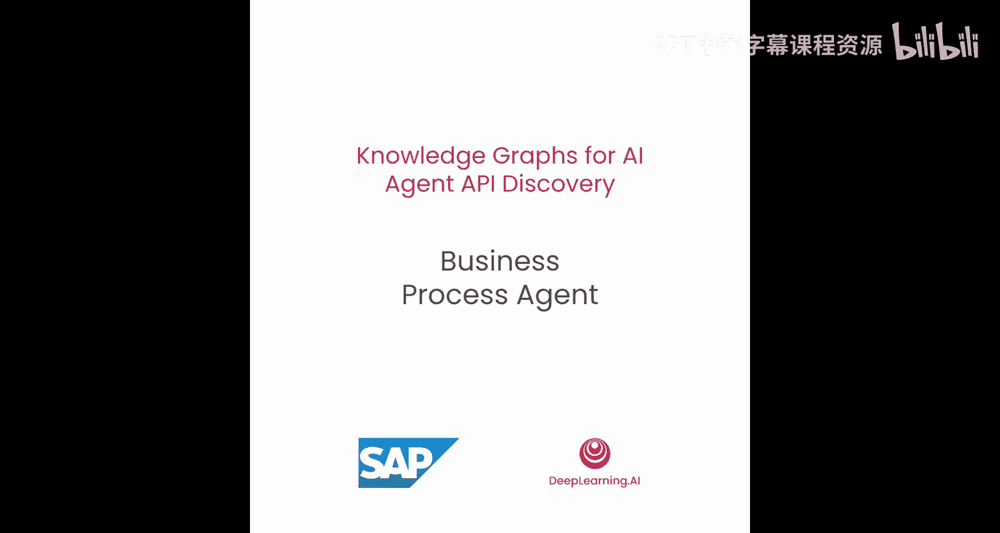
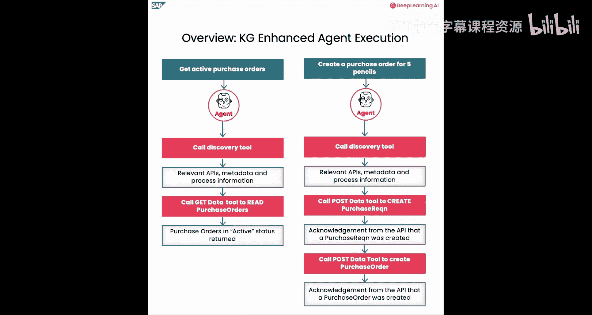
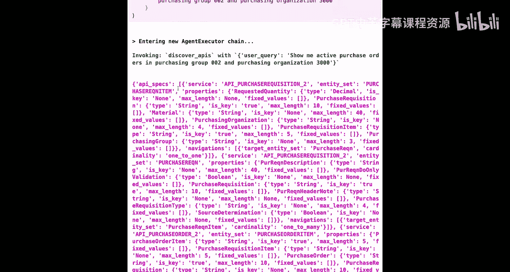
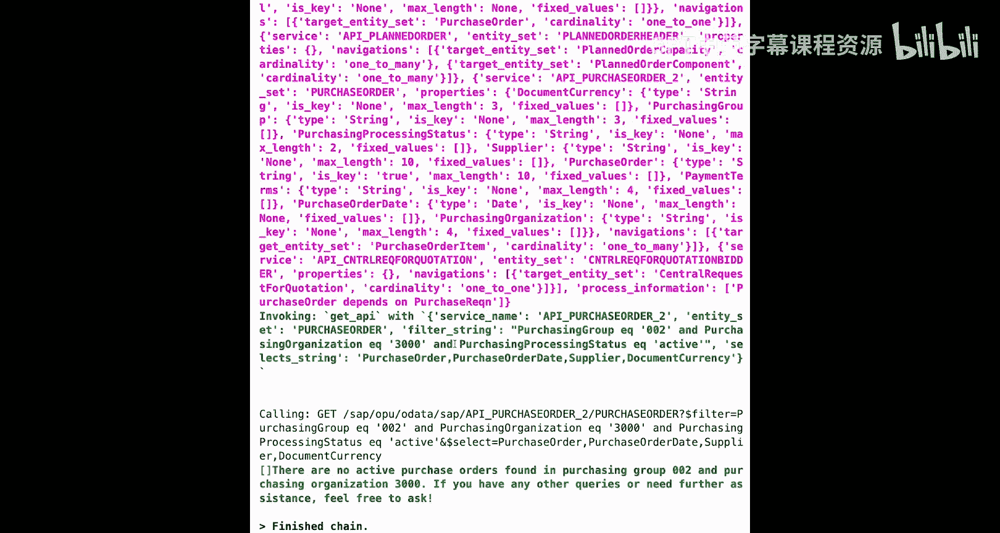
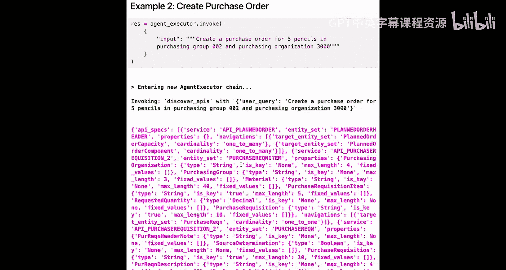
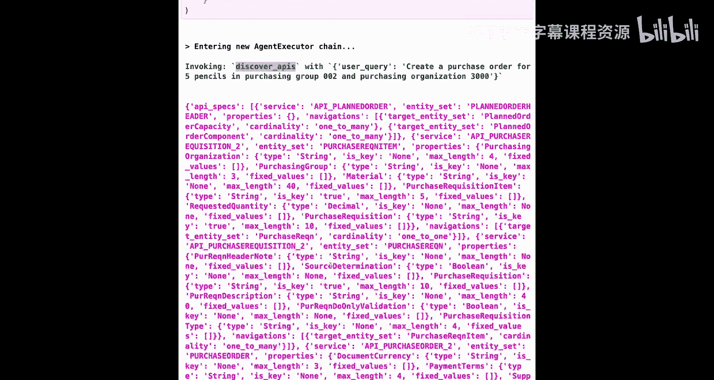
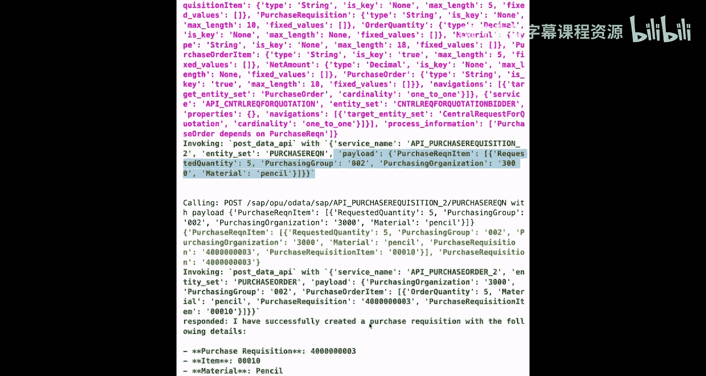
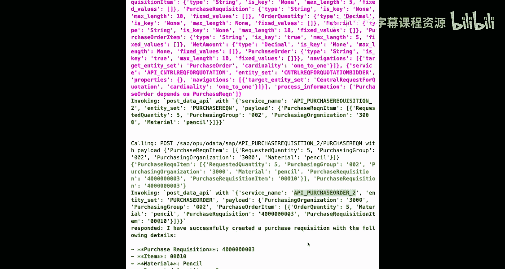
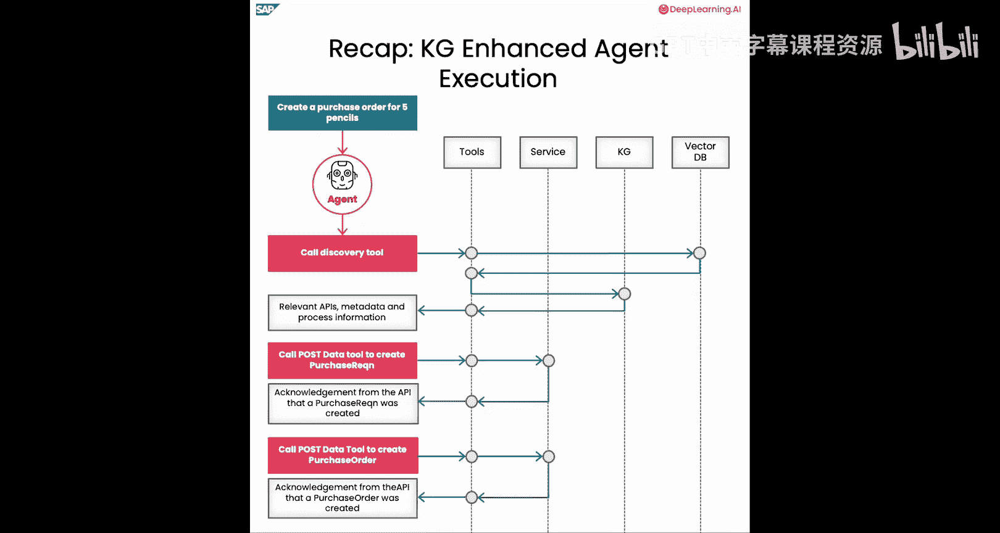

# 006：构建业务流程智能体

## 概述



在本节课中，我们将学习如何利用上一节课构建的知识图谱，创建一个能够自动发现并执行API以完成用户查询的AI智能体。我们将定义三个核心工具，并演示智能体如何遵循业务流程规则来执行“获取采购订单”和“创建采购订单”等任务。


---

## 准备工作

上一节我们介绍了如何基于语义嵌入和业务流程关系从知识图谱中发现相关API。本节中，我们来看看如何利用这些发现来驱动一个智能体。

首先，导入所有必要的包。

```python
# 导入自定义辅助函数，用于参数化SPARQL查询和获取OpenAI API密钥
from helpers import parameterize_sparql_query, fetch_openai_key
```

接下来，设置我们将要使用的大语言模型和嵌入模型。

```python
# 设置LLM和嵌入模型
llm = ChatOpenAI(model="gpt-4", temperature=0)
embedding_model = OpenAIEmbeddings()
```

然后，加载我们在前几节课中创建的知识图谱。



```python
# 加载知识图谱
knowledge_graph = load_knowledge_graph("path_to_graph")
```

---

## 定义发现工具

为了定义发现工具，我们需要获取实体集的属性（properties）和导航链接（navigation links）。以下辅助函数负责获取并合并这两类信息。

```python
def fetch_entity_specification(entity_set_name):
    """
    获取指定实体集的属性和导航链接。
    """
    properties = get_properties(entity_set_name)
    navigations = get_navigations(entity_set_name)
    return combine_specs(properties, navigations)
```

让我们用一个示例查询来尝试这个函数。这里我们获取“采购订单”实体集的规范。

```python
# 示例：获取采购订单实体集的规范
po_spec = fetch_entity_specification("PurchaseOrder")
print(po_spec)
```

在结果中，你会看到：
*   一个服务于“采购订单”的服务。
*   实体集的名称及其属性，例如 `PurchasingProcessingStatus`（采购处理状态）、`PurchasingGroup`（采购组）等。
*   `PurchaseOrderNumber` 是这个实体集的键（key）。
*   我们还检索到了该实体集的导航链接，例如与 `PurchaseOrderItem` 的一对多关系，这意味着一个采购订单可以包含多个采购订单项。

现在，我们拥有了定义发现工具所需的所有必要元素。为此，我们首先加载上一课创建的实体集嵌入索引。

```python
# 加载实体集嵌入索引
entity_set_index = load_entity_set_index()
```

同时，导入之前定义的用于发现API和流程的辅助函数。

```python
from helpers import discover_apis_and_process
```

回想一下，`discover_apis_and_process` 函数返回一个匹配的实体集列表及其业务流程信息。

让我们用一个示例查询来测试它。

```python
# 示例：为查询“显示活跃的采购订单”发现API和流程信息
matches = discover_apis_and_process("show me active purchase orders", entity_set_index, knowledge_graph)
print(matches)
```

在列表中，你可以看到匹配的实体集，包括 `PurchaseOrder`、`PurchaseOrderItem`、`PurchaseRequisition` 和 `PurchaseRequisitionItem`。此外，我们还检索到流程信息：`PurchaseOrder` 依赖于 `PurchaseRequisition`。

效果很好。你现在拥有了工具发现所需的所有关键元素。现在，我们准备将其定义为一个工具，供后续的智能体使用。

```python
from langchain.tools import tool

@tool
def discover_apis_tool(user_query: str) -> str:
    """
    发现工具：接收用户的自然语言输入，识别相关实体集，并返回其API规范（包括业务流程信息）。
    """
    relevant_entities = discover_apis_and_process(user_query, entity_set_index, knowledge_graph)
    return format_api_specs(relevant_entities)
```

---

## 准备API执行（模拟服务）

现在我们有了发现工具，接下来为API执行做准备，这里使用模拟服务。

我们导入用于获取、提交和显示模拟数据服务的辅助函数。

```python
from mock_services import get_mock_data, post_mock_data, display_mock_db
```

首先，查看模拟数据库的内容。先看采购申请。

```python
# 显示采购申请模拟数据
display_mock_db("PurchaseRequisition")
```

你会看到有两个采购申请，编号分别以1和2结尾。第一个采购申请有一个“尺子”的物料项，第二个采购申请有两个物料项（编号10和20），分别是“铅笔”和“钢笔”。

现在，看看采购订单数据集是什么样的。

```python
# 显示采购订单模拟数据
display_mock_db("PurchaseOrder")
```

这里我们有三个采购订单，编号以1、2、3结尾，每个订单对应特定数量的“尺子”、“铅笔”和“钢笔”。需要注意的是，采购订单中的每个物料项都引用了采购申请中对应的物料项。例如，`PurchaseOrder1` 的物料项10引用了上面看到的 `PurchaseRequisition1` 的物料项10。同样，`PurchaseOrder2` 的物料项10引用了 `PurchaseRequisition2` 的物料项10（对应铅笔）。

让我们看看用于提交数据的模拟服务。

```python
# 模拟提交采购订单
new_po = post_mock_data(service="PurchaseOrder", payload={"items": [{"material": "mouse"}, {"material": "keyboard"}]})
print(new_po)
```

对于与采购订单实体集相关的服务，这个特定函数会向采购订单API发起一次调用，包含物料项级别的请求，执行此调用，并返回新创建的采购订单（在这个例子中，是编号以4结尾的采购订单）。与之前的结果相比，我们现在有了一个新的采购订单，以及调用中请求的两个新物料项“鼠标”和“键盘”。

接下来，调用获取数据的模拟函数来检索符合特定条件的第一个采购订单。

```python
# 模拟获取采购订单数据
filter_criteria = "PurchasingGroup eq '005' and PurchasingOrganization eq '3000'"
result = get_mock_data(service="PurchaseOrder", filter_string=filter_criteria)
print(result)
```

这个函数显示了对服务的OData调用，匹配感兴趣的过滤条件，并返回匹配的采购订单（在本例中，是第一个采购订单，其采购组和采购组织符合请求）。

现在你知道了这两个模拟函数的作用，让我们为智能体定义工具。

```python
@tool
def get_data_tool(service_name: str, filter_string: str) -> str:
    """获取数据工具：用于执行GET请求，例如处理与获取采购订单相关的查询。"""
    return get_mock_data(service_name, filter_string)

@tool
def post_data_tool(service_name: str, payload: dict) -> str:
    """提交数据工具：用于执行POST请求，例如基于知识图谱中的业务流程信息创建采购申请和采购订单。"""
    return post_mock_data(service_name, payload)
```

---

## 创建并运行智能体

我们现在拥有了所有必要的构建模块。接下来开始创建智能体。

我们将使用LangChain预定义的智能体循环（Agent Loop）。



```python
from langchain.agents import create_react_agent, AgentExecutor
```

现在，你需要做的就是提供之前定义的工具以及提示词（prompt）。

在提示词中，我们告诉智能体：基于用户查询发现API和业务流程信息，然后根据业务流程调用API。我们还必须告诉智能体如何使用导航链接在单次调用中创建抬头（header）和行项目（item）级别的对象。



```python
# 定义智能体提示词
agent_prompt = """
你是一个能够发现并执行API的助手。
首先，使用发现工具来查找与用户查询相关的API及其业务流程信息。
然后，根据发现的业务流程规则，调用相应的GET或POST数据工具来执行操作。
特别注意：当创建涉及抬头和行项目的对象（如采购订单）时，请利用API规范中的导航属性，在单个API调用中构建完整的嵌套结构。
始终遵循业务流程中定义的依赖关系（例如，创建采购订单前需先创建采购申请）。
用户查询：{input}
"""
```

现在，让我们把所有东西整合在一起。我们提供之前定义的工具以及刚刚准备的提示词。

```python
# 创建智能体
tools = [discover_apis_tool, get_data_tool, post_data_tool]
agent = create_react_agent(llm=llm, tools=tools, prompt=agent_prompt)
agent_executor = AgentExecutor(agent=agent, tools=tools, verbose=True)
```

让我们用一些示例查询来尝试运行这个智能体。

第一个查询与获取活跃采购订单有关。

```python
# 示例查询1：获取活跃采购订单
result1 = agent_executor.invoke({"input": "Show me active purchase orders for purchasing group 005 and organization 3000"})
print(result1['output'])
```

如你所见，智能体首先使用查询调用 `discover_apis_tool`，获取匹配的API实体集列表及其属性、导航链接，并最终确定流程信息。然后，它调用 `get_data_tool`，传入与采购订单相关的服务名称，并直接传递用户查询中的过滤字符串（在本例中，它寻找处理状态为“active”的采购订单）。随后它报告说，在该特定采购组和采购组织中，没有活跃的采购订单。

这里，模型使用了字面值“active”，而不是对应的技术状态码（如“02”），因此它无法获取到活跃的采购订单。

我们可以灵活地添加所谓的“固定值帮助映射”，将状态描述映射到状态码。现在让我们把这个添加到知识图谱中。

```python
# 向知识图谱添加状态码映射
status_mappings = [
    {"description": "In Process", "code": "01"},
    {"description": "Active", "code": "02"},
    {"description": "Completed", "code": "03"}
]
add_fixed_values_to_graph(knowledge_graph, "PurchaseOrder", "PurchasingProcessingStatus", status_mappings)
```

这里我们添加了一组相关的状态码，例如“01”代表处理中，“02”代表活跃等，并将其关联到采购订单实体集，最终添加到图谱中。

现在，让我们尝试用智能体再次运行相同的查询。

```python
# 再次运行相同的查询
result1_updated = agent_executor.invoke({"input": "Show me active purchase orders for purchasing group 005 and organization 3000"})
print(result1_updated['output'])
```

这次，智能体成功地将采购处理状态映射到了“02”，而不是之前的“active”，现在能够正确找到两个处于活跃状态的采购订单。这展示了知识图谱提供的灵活性：它可以动态地使用相应的业务条目扩展图谱，并将它们映射到智能体的用例中。

现在，让我们看另一个更复杂一点的例子，这次是关于创建采购订单。



```python
# 示例查询2：创建采购订单
result2 = agent_executor.invoke({"input": "Create a purchase order for 5 laptops, referring to a new requisition"})
print(result2['output'])
```





在这里，智能体必须确定需要先创建一个采购申请，然后创建一个引用该采购申请的采购订单。



如你所见，智能体首先进行发现，获取正确的API及其属性、导航和业务流程信息规范。这次，它识别出应该使用业务流程信息，即创建采购订单前应先创建采购申请。因此，它首先调用 `post_data_tool`，服务名称为“PurchaseRequisition”，在单个有效负载中创建了采购申请。然后，以此作为参考，再次调用 `post_data_tool`，使用采购订单API，创建了一个新的编号以5结尾的采购订单，引用了新创建的采购申请（Ref3）。

让我们查看一下模拟数据库，看看最后一次调用后发生了什么变化。

```python
# 查看更新后的采购申请数据
display_mock_db("PurchaseRequisition")
```

你可以看到一个新的编号以3结尾的采购申请及其物料项10。

```python
# 查看更新后的采购订单数据
display_mock_db("PurchaseOrder")
```

这里有一个新的编号以5结尾的采购订单。重要的是，它引用了刚刚创建的编号以3结尾的采购申请。这基本上证明了智能体遵守了业务流程规则：创建采购订单前必须先创建采购申请。

---

## 总结智能体工作流

让我们用最后一个关于创建采购订单的例子来总结智能体的工作流。

1.  **用户输入**：用户输入被传递给智能体。
2.  **发现API**：智能体决定调用发现工具，以查找与给定用户输入相关的API和流程信息。
3.  **查询知识库**：发现工具调用向量数据库（本例中只是一个本地内存索引）来检索相关的实体集。
4.  **获取元数据**：该工具查询知识图谱以获取业务流程信息、其他相关实体集及其元数据。
5.  **信息返回**：所有这些信息都返回给智能体。
6.  **决策与执行**：智能体拥有所有相关信息后，决定首先需要调用POST API来创建采购申请。它调用相应的 `post_data_tool`，执行API，并将新创建的采购申请返回给智能体。
7.  **最终执行**：最后，智能体再次执行POST API，创建一个引用新采购申请的采购订单，并将结果返回。

---

## 本节课总结



在本节课中，我们一起学习了如何构建一个业务流程驱动的AI智能体。我们定义了三个核心工具：**发现工具**、**获取数据工具**和**提交数据工具**。智能体能够理解用户的自然语言查询，利用知识图谱自动发现相关的API和业务流程规则，并正确地按顺序执行这些API来完成任务，例如先创建采购申请再创建采购订单。我们还看到了知识图谱的灵活性，例如通过添加固定值映射来帮助智能体更准确地理解业务术语。通过这种方式，我们实现了从知识发现到自动化执行的完整闭环。