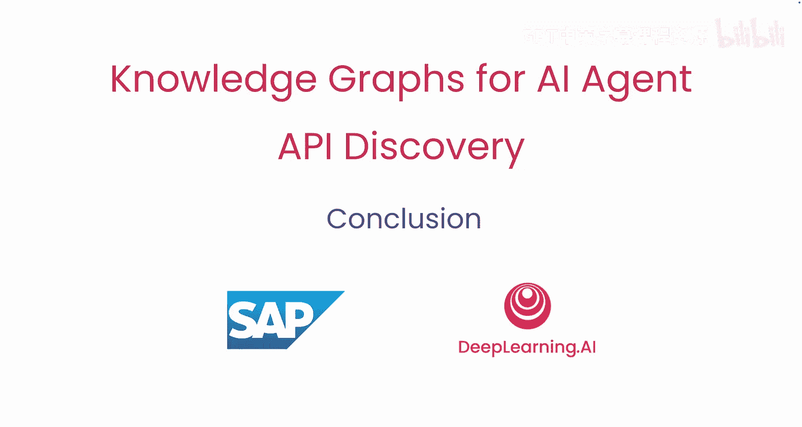

# 007：课程总结 🎓

在本节课中，我们将对《用于AI智能体API发现的知识图谱》这门课程进行总结，回顾所学到的核心知识与技能。

---

恭喜你完成本课程。你学习了知识图谱如何为企业数据带来结构和意义。

上一节我们介绍了知识图谱的实际应用，本节中我们来看看其核心价值。知识图谱连接了API与业务流程，为AI智能体提供了相关的业务上下文。

你学习了如何利用知识图谱，帮助智能体更智能地发现API并与之协作，从而执行具体操作。

现在，你已经掌握了坚实的基础，可以构建能够在真实企业环境中工作的AI智能体。

从这里出发，尝试将所学知识应用于你自己的数据。进行测试并探索知识图谱如何助力你的AI应用。

再次感谢你的参与。我们期待看到你未来的构建成果。😊

---

本节课中我们一起学习了知识图谱在构建智能AI智能体中的关键作用，包括如何为数据赋予结构、连接不同业务组件，以及为智能体提供行动所需的上下文。你已准备好将这些概念付诸实践。