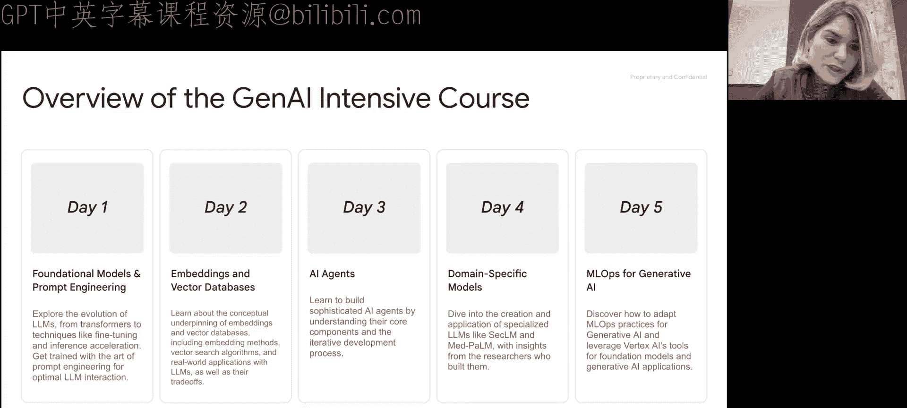
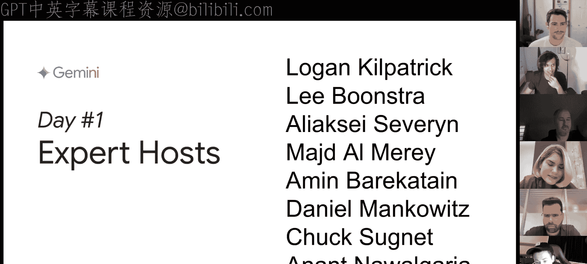
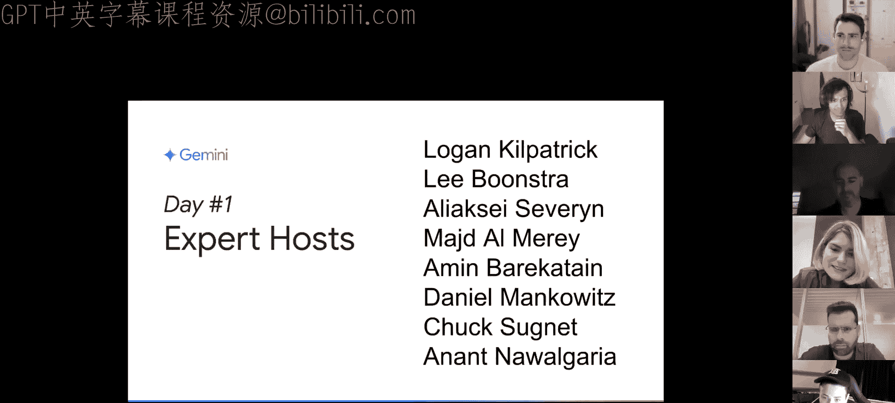
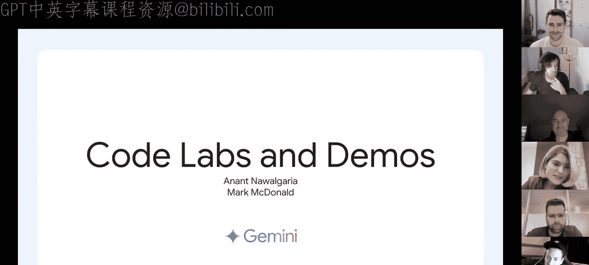
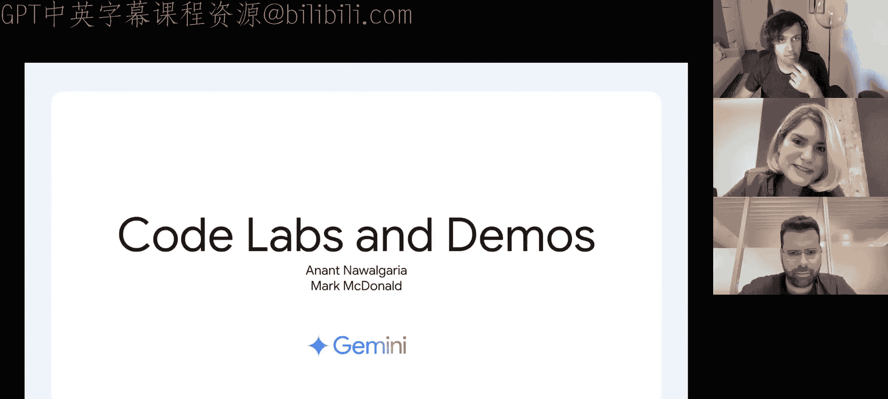
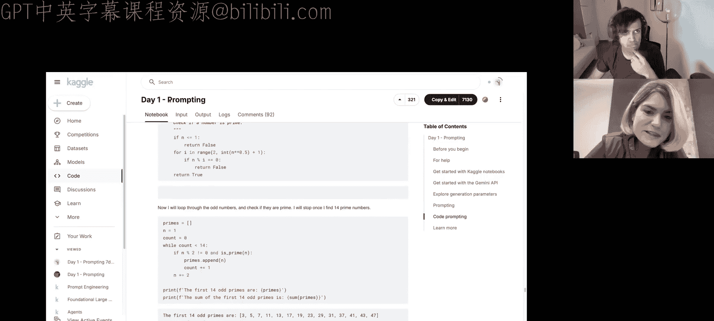
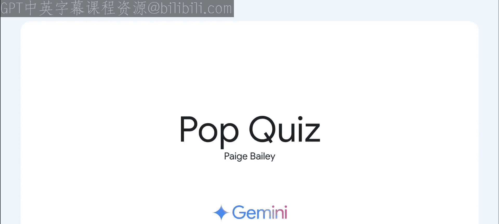
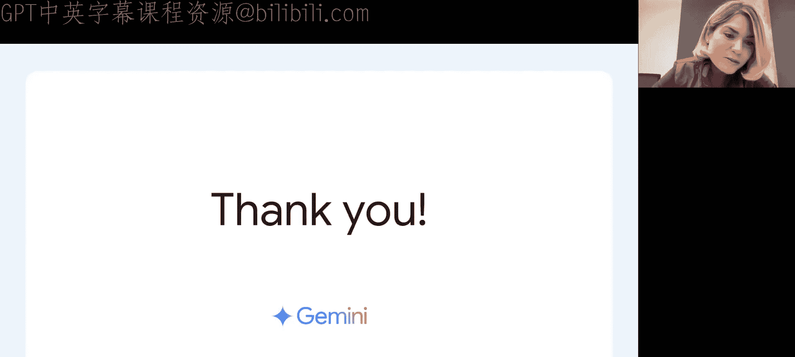

# 001：基础模型与提示工程 🚀

## 概述
在本节课中，我们将要学习生成式人工智能的基础知识，特别是大型语言模型的工作原理以及如何通过提示工程来有效地使用它们。课程内容包括基础模型概述、提示工程技术、代码实践演示以及一个随堂测验。

---

## 课程介绍与问答环节

大家好，欢迎来到由Kaggle和Gemini团队赞助的生成式AI五天强化课程的第一天。

这个为期五天的虚拟课程旨在让你全面了解生成式AI及其在AI应用中的使用方法。今天，我们有多位出色的特邀演讲者，他们将讨论基础模型和提示工程。尽管今天早上的直播遇到了一些小问题，但我们已经将视频内容整理好，确保你能获得流畅的学习体验。课程内容包括课程概述、问答环节、代码实验的简要介绍以及本系列课程结束时的随堂测验。

这个为期五天的生成式AI课程将为你提供每日作业，形式包括白皮书和播客。这些资料解释了生成式AI模型、向量数据库、智能体等各种技术和工具如何协同工作的“是什么”和“怎么做”。配套的Colab笔记本旨在向你展示如何使用我们的生成式AI以及其他开源工具。我们还为你准备了一个很棒的Discord频道，供你讨论、集思广益，并与我们的特邀演讲者直接进行问答交流。我们希望你能借此机会深入我们创建的所有内容，并学习围绕生成式模型的一些基本且重要的前沿概念。

正如我提到的，这是一个为期五天的项目，从11月11日持续到11月15日。今天是第一天，我们将讨论所有关于基础模型和提示工程的内容。那么，事不宜迟，让我们开始第一天的问答环节。

---

大家好，欢迎各位。我们很高兴今天能和大家一起开始生成式AI强化课程的第一天。今天有很多内容要涵盖，我将直接进入主题，包括回答大家在Discord上提出的精彩问题、邀请一些令人兴奋的特邀演讲者谈论他们的工作、演示一些Colab笔记本和示例，最后进行一个随堂测验。今天能在这里见到大家，我们感到非常兴奋。大家在Discord上提出的精彩问题让我们备受鼓舞，看到每个人都如此热衷于学习更多关于大语言模型、多模态模型和生成式AI的知识，我感到非常激动。我叫Paige，将是本周的主持人，今天有很多同事和我一起，希望稍后我们能进行一些有趣的讨论。

这个为期五天的生成式AI强化课程结合了每日作业、我们一直在讨论的Discord主题以及这些现场问答环节。从11月11日到11月15日，我们将每天进行这些活动。课程内容涵盖从基础模型和提示工程到嵌入和向量数据库、AI智能体、领域特定模型，乃至用于长期维护这些模型系统的MLOps。今天的内容全部关于基础模型和提示工程，因此我们邀请了许多多年来以此为业、堪称专家的朋友，他们将在你阅读所有精彩资料、参与聊天主题和讨论时，帮助解答你的问题。考虑到时间，为了确保我们有充足的空间讨论大家的所有问题，这个问答环节将延续你在Discord上看到的所有讨论。我要感谢我们出色的生成式AI Discord版主Pollong、Mark、Eric、Iwin、Miles以及其他许多深入参与并帮助确保社区活跃的朋友们，无论是用表情符号还是文字感谢他们。我知道他们一直在各个时区忙碌工作，生成式AI的太阳永不落山。

那么，第一天，我们的专家主持小组包括：AI Studio的产品负责人Logan Kilpatrick、Lee Boonetra、Alexi Severin、Majid Amin Barakton、Daniel Mankoitz、Chuck和Anant。我很高兴今天能有大家在这里。例如，我们有从事人类反馈强化学习工作的专家，有致力于Gemini应用模型推理、使其性能高效的技术总监，还有来自我们CTO办公室的技术总监等等。接下来，我将开始向Logan提出第一个问题。Logan，很高兴见到你，你好吗？

我很好，很兴奋能听到大家的问题，同时也期待听到其他小组成员的问题。

非常棒。ML开发者团队最近发布了很多新功能，感觉我每天登录LinkedIn或Twitter（或者现在叫X）时，似乎都有新的产品发布。告诉我你最兴奋哪些功能，哪些已经发布或即将发布？

这是个好问题。我认为目前最引人注目的两个功能是：大约两周前，我们推出了“基于Google搜索的Grounding”功能，这非常令人兴奋。我想在接下来的五天里，这肯定会成为一个热门话题。大语言模型存在幻觉问题，而Grounding通过利用Google的搜索索引，将一些信息引入来“锚定”用户向LLM提出的问题，从而提供更可靠的答案。这非常有趣。如果你在Google上搜索“grounding with Google”，你会在开发者端和企业端找到一些相关链接。我对这个功能感到兴奋，很乐意多谈谈它。另一件事是，上周五我们推出了OpenAI兼容性功能，我也非常兴奋。对于已经在使用OpenAI SDK和库的开发者来说，现在只需更改大约三行代码，就可以尝试使用Gemini模型。我很高兴能为那些对使用Gemini感到兴奋的开发者减少障碍，希望我们能收到关于这次发布的很多积极反馈。

我个人对OpenAI API兼容性功能感到非常兴奋。将原本倾向于使用OpenAI API的笔记本转换为使用Gemini，并进行比较，变得非常直接。这绝对是两个令人兴奋的新功能，我鼓励大家去看看OpenAI兼容性功能以及AI Studio中的搜索Grounding功能。我认为特别酷的是，你甚至可以将搜索Grounding功能与我们的一些较小模型一起使用，比如Gemini 1.5 Flash和Gemini 1.5 8B。我一直很喜欢这两个模型用于我的项目，特别是那些需要代码执行或超快速推理的任务。请简单介绍一下这两个Flash系列模型，以及如何以非常小的成本实现如此多的功能？

是的，经过内部大量工作，我们推出了Flash 8B模型，这是目前存在的最小的Gemini托管模型，拥有80亿参数。它真正推动了“每美元计算智能”的边界。我想我们已经看到了一些相关的推文，Paige你和我都转发过。它的价格是每百万输入token 0.23美分，每百万输出token 1美分。只需几美分，你就能获得绝对惊人的智能量。我认为这些小模型之所以有趣，是因为很多AI的前沿用例实际上受到成本和token成本的限制。开发者实际上存在一种内在的抑制因素去构建某些功能，因为构建的AI功能越多，支付的成本就越高。我认为Flash 8B就是一个很好的例子，它试图突破这个边界，消除障碍，让开发者能够真正构建他们感兴趣的东西，而不必担心承担额外的成本。

太棒了。最后一个问题，然后我们将邀请更多人来讨论，特别是生成式AI的生产应用。DeepMind的多模态模型，我特别想到用于视频生成的Imagine和Veo，用于音乐生成的Lyria，它们解锁了一些非常有趣的新应用，尤其是与Gemini模型结合时。对于这种多模态输出场景，你最喜欢的应用是什么？你如何看待将这些模型与Gemini API结合使用？

这是个非常好的问题。我认为……文本作为模型的输出机制，开发者已经发现了许多有趣的应用，比如构建聊天应用、处理数据等等。但在多模态输出创作（包括图像、视频等）的实际生产用例方面，我们实际上还处于相当早期的阶段。感觉我们还没有普遍接触到这些模型，因此开发者还没有足够的时间来构建真正有趣的东西。我个人感到兴奋的是，利用这些模型“让文本活起来”。世界上有很多文本，而人类在很多情况下天生是视觉动物。我认为，如果可能的话，就像我们之前在NotebookLM中看到的那样，如果你能将大量书面内容以音频形式呈现，在某些情境下，体验实际上会好上10倍。我可以想象，将你拥有的海量文本文档库以视频形式呈现，而不仅仅是音频作品，这将是一个疯狂的未来世界。我认为，正是像Imagine和Veo这样的模型，才能使这个愿景得以实现。这将非常令人兴奋。

是的，我也很喜欢这个用例，关于如何通过视频、音频、图像为文本文档甚至GitHub代码库注入活力。到目前为止，我最喜欢的用例是制作书籍预告片：导入PDF书籍，自动将其分割成不同的提示，然后创建一个短视频来描述这本书。我非常喜欢，并且希望看到更多这方面的应用。非常感谢，这真是太棒了。我将提出下一个问题，这个问题是关于人类反馈强化学习的，我将请Alexi上台。Alexi，如果我没记错的话，你是Gemini应用RLHF的负责人，对吗？

正确。

太好了，谢谢。我真的很想了解更多关于Gemini应用如何使用RLHF来改进其响应的信息。这个过程是如何工作的？你们如何利用用户反馈来随时间改进模型或应用体验？

是的，这是一个非常大的话题，所以也许从高层次上简单说一下LLM是如何进行微调的会比较好。如今，对最先进的LLM进行后训练的事实标准方法是分两步进行：SFT和RLHF。SFT是监督微调，我们使用演示数据。通常，为了获得好的结果，这些数据需要质量极高，并且大多是由人类专家制作的，因此获取成本相当高。RLHF是一种强大的技术，用于使模型与人类偏好保持一致。可以理解为让响应更安全、更有帮助或更符合事实。它比SFT更复杂一些，但简而言之，我们使用一组输入提示，从我们试图微调的模型中生成响应，然后使用另一个称为奖励模型的模型来分析哪些响应是好的，哪些是坏的，并奖励好的响应。这个奖励模型可以根据不同类型的偏好数据进行微调，通常是人类偏好数据，这就是“人类反馈强化学习”中“人类反馈”的含义。这些数据可以来自人类专家评分员，就像SFT数据一样，也可以来自用户反馈。因此，用户与Gemini聊天机器人（在桌面或移动设备上）互动时给出的“踩”的反馈，实际上会随着时间的推移带来更好的模型性能，你是这个意思吗？

是的，它帮助我们生产出被用户认为更有帮助的模型。这可以说是使我们的模型与人类偏好保持一致的主要机制之一。

太棒了，听到这个真的很令人兴奋。我知道大家通过阅读课程资料，一直在学习关于RLHF和利用人类反馈改进模型的知识。下一个问题来自我们Google的一位同事。我一直想知道，既然大语言模型从海量数据源中学习，那么它们仅仅是内插其训练数据，还是能够超越训练数据，做出新的发现？Amean，你来回答这个问题怎么样？另外，欢迎回来。我记得你之前在Google DeepMind工作，现在是不是创办了自己的公司？

不，实际上我以前在DeepMind工作，但现在为一家名为Quadrupture的新公司工作。是的，我实际上换了行业。

是在金融行业和量化研究领域吗？

是的，量化研究。如今，你基本上可以将AI应用于任何领域，金融也是一个非常非常有趣的应用领域。

非常酷。那么，告诉我关于模型做出新发现的事情，你认为它们能做到吗？还是它们只是下一个token预测器？

是的，这是一个哲学性的有趣问题，但我相信这个问题的答案是肯定的，模型绝对可以超越其训练数据。能让它们做到这一点的技术是可用的搜索。我们看到的第一个例子是我们在2023年底在DeepMind做的名为“FunSearch”的工作。在FunSearch中，我们基本上使用LLM在Python编程语言的空间中搜索，比如说，一个非常困难的问题，比如一个NP难问题。它的工作方式是，我们将一个大语言模型与一个高效的评估器配对，该评估器会为每个解决方案提供反馈，说明它有多好。然后，通过一个迭代算法，它成功地发现了计算机科学和数学中一些未解决问题的新解决方案。核心思想是，LLM会为特定问题提出解决方案（比如一段代码），然后评估器会给出一些分数，说明该解决方案有多好。接着，一个进化算法会选择LLM迄今为止发现的最佳解决方案，呈现给LLM，并要求它进行改进。在某种程度上，它是在进行一种自动化的“少样本提示”：我们向它展示好的解决方案，要求它改进；LLM提出新的东西，我们再次展示并要求改进。这个过程重复了大约十万次，然后最初可能只是“return 0”的代码会演变成非常有趣和复杂的东西，实际上会为一些未解决问题带来新的解决方案。由于这些解决方案以前从未被人类发现过，这在一定程度上表明LLM发现了一些训练数据中没有的新东西。这个概念在AI历史上已经被研究了很多，最近在现代LLM中变得非常流行，它被称为“测试时计算”或“推理缩放”等其他术语。它的工作方式是，当你向LLM提出一个问题时，你允许LLM进行思考，LLM会生成多种场景和推理链，然后它有一个机制来理解哪一个更有可能，接着它会迭代重复这个过程。通过在推理时模拟不同的可能性，它基本上是在进行搜索，通过这种搜索，它能够发现新的东西，因为它可以引导自己的知识。

非常酷。这让我想到，我们才刚刚开始触及大语言模型能够完成或实现的事情。对接下来的几年感到非常非常兴奋。

确实，就像Richard Sutton在《苦涩的教训》中总结得最好：我们有两种可以无限扩展的技术。第一种是学习，这已经被海量数据和早期几代模型所破解。第二种技术是搜索。我认为我们现在正处于人们开始扩展搜索、在推理时投入计算资源的时刻，这将解锁大量新的能力，特别是推理能力，这将非常令人兴奋。

非常感谢。我认为这也很好地引出了我们的下一个问题，这个问题来自我们的Discord应用，我想这是给Majid的，他是Gemini应用的推理负责人。

太好了。这个问题实际上是关于：大语言模型可以用来训练小模型吗？我们能否从大模型中获取一些知识，并用它来改进小模型？比如我们嵌入在Google许多产品界面中的那些模型。你对这个问题有什么看法？

当然可以，绝对可以。这是一个非常好的问题。这种技术被称为“蒸馏”，它是一种非常流行的推理优化技术。主要思想正如你所说，你会从一个可能因服务成本太高但质量非常好的大模型中获取知识，然后将这些知识“蒸馏”到一个小模型中。这个小模型可以保留大模型的大部分知识和质量，但其大小适合部署服务。是的，正如我所说，这种技术叫做蒸馏。在蒸馏方面有很多积极的研究和实践。有多种方法可以将知识从大模型蒸馏到小模型。其中一种叫做“数据蒸馏”，你使用大模型为小模型生成大量合成训练数据，然后直接用这些数据训练小模型。另一种方法更精细，我们试图使小LLM的token分布更接近大模型，这就是我们所说的“知识蒸馏”。我们在与这门课程一起发布的白皮书中也讨论了这些类型。我要提到的第三种类型是“策略蒸馏”，这又回到了你之前和Alexi关于RLHF的讨论。我们可以使用相同的强化学习框架，但在这种情况下，我们使用教师模型（即大模型）来有效地为小模型的输出评分，并使用这些分数来训练并使小模型与大模型对齐。所以，蒸馏有多种类型，根据用例和需求，它们都在实践中使用。实际上，我认为在Demo的课程中，将会展示其中一个案例。我认为Geco论文的作者之一将会展示如何使用LLM来生成更好的嵌入模型。你会使用LLM来为段落生成查询，然后在那些查询上训练嵌入模型，你会得到性能好得多的嵌入模型。我记得对于相同大小的嵌入模型，使用蒸馏后性能提升了大约7倍。我认为那篇论文的作者Jhu Lee明天会在向量和嵌入课程中出现。

非常酷。我认为你刚才讨论的内容对我们第一个随堂测验的参与者也会非常有帮助，测验将在本小时结束时进行。所以希望大家都在认真听讲，内容是关于使用蒸馏改进小模型以及改进模型的各种机制。非常感谢。下一个问题，我相信是给你的，Anant。评估大模型有哪些方法？我们有这些创建出来的模型，有些是大版本，有些是小版本，你如何为特定任务选择应该使用哪一个？

好问题，Paige。是的，感谢社区提出这个问题。提醒一下，我们将在第5天更详细地介绍大语言模型的评估，甚至会有来自DeepMind的人展示他们的相关研究。那么，直接进入问题。评估大语言模型并非易事，因为它取决于评估的任务以及你所说的“评估”是什么意思。当然，有经典的自然语言指标，比如BLEU、ROUGE分数，你可以使用这些。这是一种方法，你有一个参考，比如一个黄金标准或真实答案，你可以看到LLM生成了什么，然后将生成的响应与人工策划的真实答案进行比较，看看它在多大程度上匹配。这是经典的方法。然而，考虑到LLMs所执行任务的复杂性，并不总是有这样的真实答案。即使在某些任务上有，例如摘要，写摘要的方式有多种，所有这些方式可能都是有效的，但真实答案可能只是其中一种情况。因此，这也不是评估此类情况的有效方法。所以，我们还可以做的是使用LLM作为评估器，让一个LLM评估另一个LLM生成的响应有多好。你可以以逐点方式或成对方式进行评估。逐点方式就是，给出响应和提示，让LLM在1到5的范围内对这个响应进行评分，并说明原因。成对方式则是比较两个响应，并说明对于这个提示，哪一个响应更好，以及为什么。我们实际上已经提供了这种功能，你可以立即使用。在我们的Vertex AI套件中，通过Vertex AI生成式AI评估服务，你可以尝试基于LLM的评估器评估，也可以尝试使用参考点的计算指标，如ROUGE和BLEU。你今天就可以试试。

当然。我也看到一些相当令人印象深刻的开源库在进行自动评分和评估。我对Promptfoo感到非常满意，它也支持Gemini API和其他一些产品。很高兴知道既有Vertex AI选项，也有开源库来进行这些评估，无论是人工评分还是自动评估。非常棒。

下一个问题来自red365：有人能解释一下为什么在第一个思维链提示中，它也在逐步解释，而不是直接回答吗？Lee，我看到你在点头，你想回答这个问题吗？

是的，我可以稍微谈谈这个，因为我在写的白皮书中也有类似的例子。首先，对于电话会议上的各位，思维链提示是一种提示技术，你试图让LLM生成中间步骤。通常，你可以通过提供如何进行推理的示例来实现这一点。你提供的示例不是直接放在Colab里的，而是尝试想出另一个具有类似推理技巧的示例。然后你看它是否会展示这些步骤。这个具体问题，感谢大家参与Colab，我看到有人说，嘿，因为在问题中，你必须先输入一个我们不使用提示的示例，然后之后我们会在示例中展示一个使用思维链提示的示例，这样你就能看到区别。但问题是，有些人在第一个示例中已经解决了中间步骤，而它本不应该。如今模型变得如此出色，我们很难再展示这些缺陷了。但你可能能够通过重新提交问题来复现它，或者通过更改top-k、top-p或温度来获得输出中更多的变化。我也在聊天中看到有人说，切换到旧的Gemini模型可以展示如何展示这个缺陷，然后你可以用思维链来修复它。这很酷。

非常酷。我喜欢对思维链本身的详细描述，以及你如何看到它在模型输出中的表现。这非常非常酷。我个人发现，特别是对于编码任务，思维链提示或要求模型解释其推理过程非常强大，通常能带来显著更好的结果。这非常酷。

下一个问题来自Uung Hue，大概是这样的：微调模型中的枚举模式是否设计为返回枚举值？Daniel，顺便说一句，很高兴见到你，欢迎回来。电话会议上的各位，Daniel和我以前在DeepMind一起工作过，现在我相信你已经创办了自己的公司，或者你的公司还处于保密阶段，所以我不会剧透，但很高兴你能来。你想回答这个问题吗？

当然可以。很高兴见到你，老伙计。是的，谢谢邀请我。关于枚举模式，我认为这在很大程度上取决于你想做什么。如果你在微调你的模型，并且希望它输出枚举值，这在很大程度上取决于你如何构建你的数据。例如