# 002：嵌入与向量数据库

在本节课中，我们将要学习嵌入和向量数据库的核心概念。我们将了解什么是嵌入，它们如何将复杂数据转化为数值向量，以及向量数据库如何高效地存储和检索这些向量。课程内容包括概念讲解、代码实践、专家问答和随堂测验。

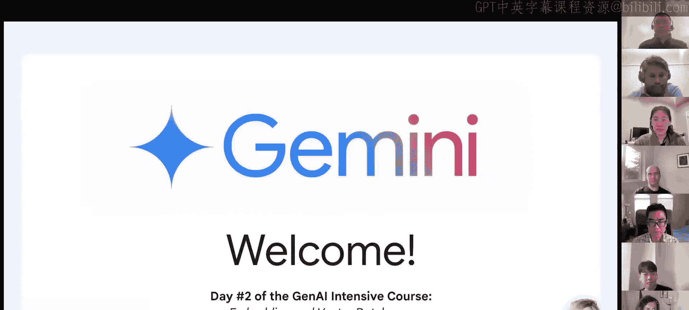

大家好，欢迎回到生成式AI强化课程的第二天。今天我们将深入探讨嵌入和向量数据库。我们很高兴看到昨天围绕基础模型和提示工程技术展开的精彩讨论。今天，我们安排了一系列精彩的环节，包括代码实验、与谷歌工具构建者的问答，以及课程结束时的随堂测验，请大家务必集中注意力。

这个为期五天的生成式AI强化课程由Kaggle和Gemini团队赞助，还包含一个Discord频道，用于讨论直播内容、与嘉宾和社区互动以及进行问答。请务必登录并提问，您的问题可能会被选中在未来的课程中解答。

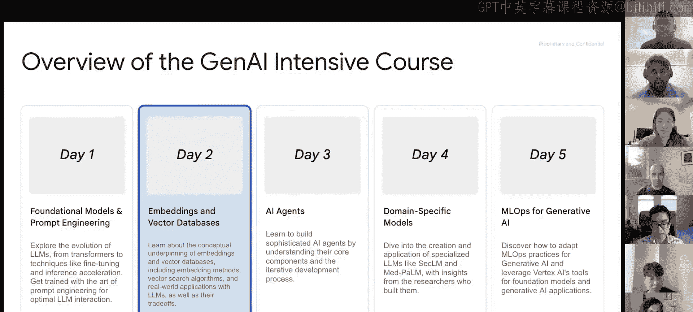

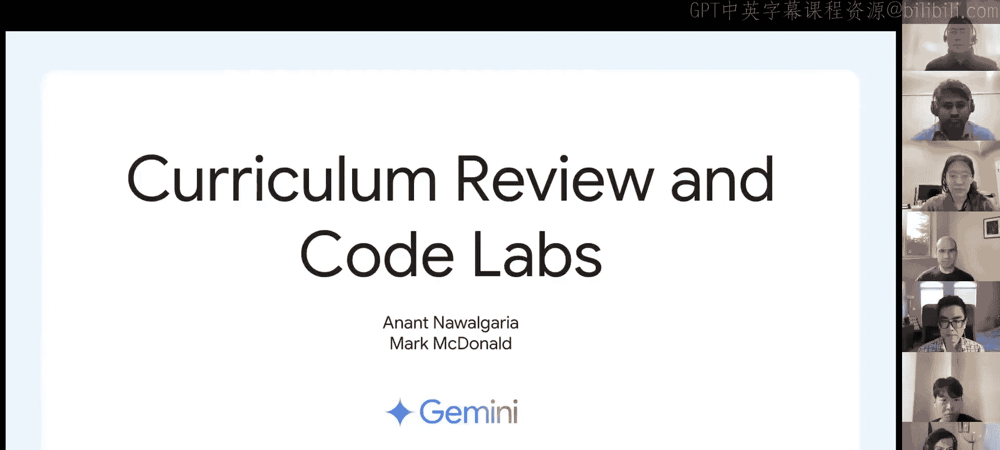

在学习作业和探索精彩内容时，请务必查看所有可以在线运行的代码实验，它们以Kaggle内核的形式提供，同时也可以阅读我们分享的一些白皮书。今天是课程的第二天，希望你已经阅读了关于嵌入和向量数据库的白皮书，探索了一些代码实验。接下来，我们将向你展示其中的一些内容，你还会学习嵌入和向量数据库的概念基础，以及如何利用它们将专业数据和令人兴奋的生产技术引入你的大型语言模型应用。

现在，我将把时间交给AO，他将带领我们回顾第二天的精彩课程内容和代码实验。

---

## 嵌入与向量数据库概述

在开始代码实验之前，我想先带大家回顾一下你们在白皮书（可能还有播客）中阅读过的内容。

在白皮书中，我们首先探讨了什么是嵌入以及不同类型的嵌入。在机器学习领域，我们经常需要处理各种不同的数据类型：文本、图像、音频等等。许多应用都可以受益于将这些不同数据类型的对象表示为紧凑、固定的数值形式，这种形式能够捕捉它们之间的语义含义和关系。这本质上就是嵌入。

**嵌入** 是将复杂数据转化为语义数值向量的过程，这些向量可以用于下游任务。

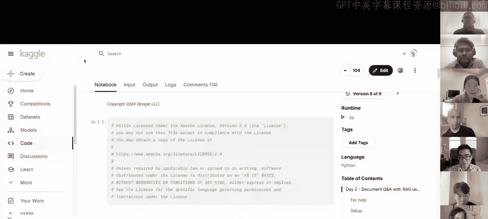

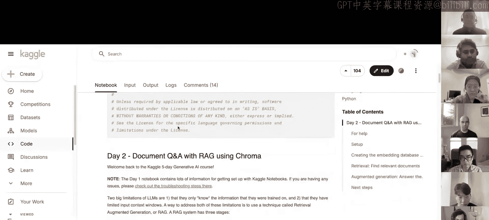

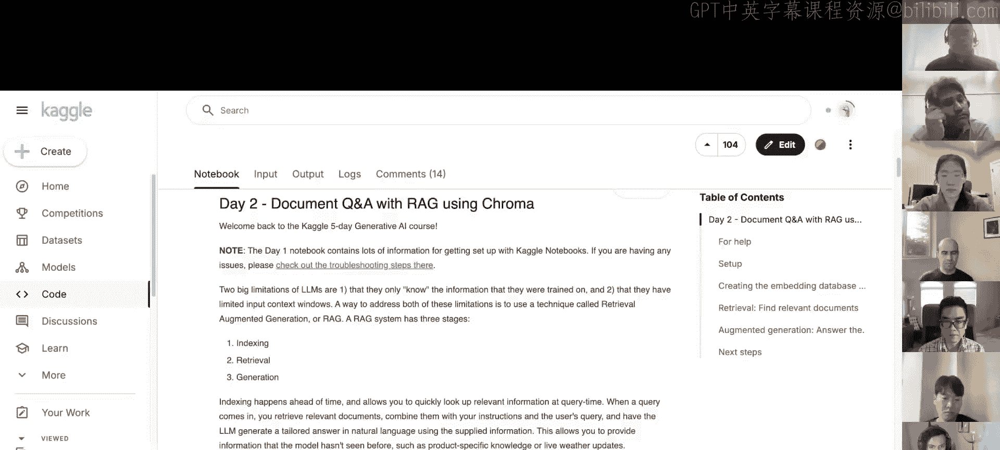

在白皮书中，我们还研究了不同类型的嵌入：文本嵌入、图像嵌入、多模态嵌入，以及结构化数据和图嵌入。接着，我们深入探讨了可用于创建、训练和使用这些嵌入的各种算法和方法，以及它们各自的权衡。

一旦我们有了嵌入，为了将其用于下游应用，就需要一种高效的方法来搜索数十万、数百万甚至数十亿的嵌入向量。给定一个查询，我们需要找到语义上最相似的嵌入，但要以一种非常省时且经济高效的方式来完成。这就是**近似最近邻算法** 发挥作用的地方。

我们研究了如何使用各种度量标准来比较嵌入向量，以判断相似性。例如，在上下文意义上，“国王”与“王后”的相似度应该高于“国王”与“汽车”的相似度。我们应该能够通过比较和计算来发现这一点。

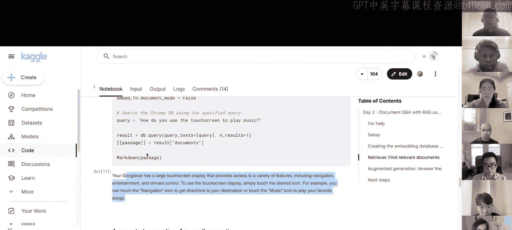

为了大规模地进行这种比较，近似最近邻算法（如**分层可导航小世界** 和 **SCaNN**）就派上了用场。

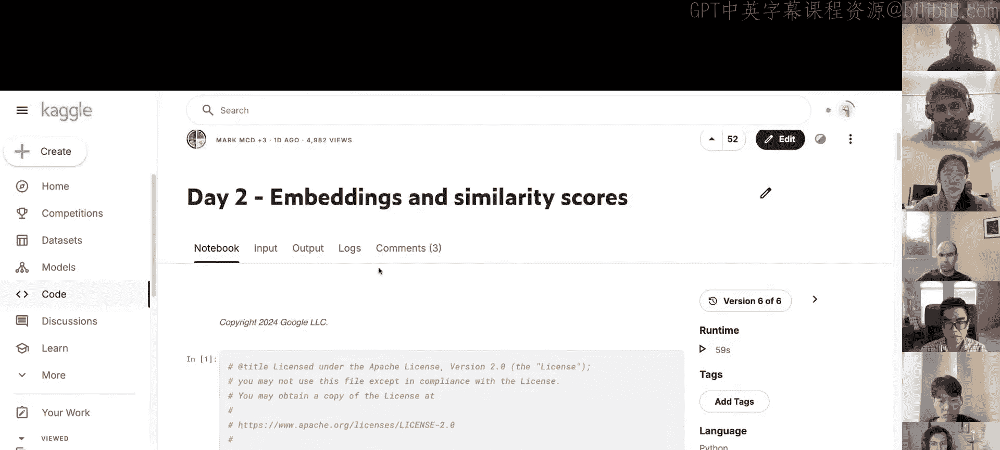

之后，我们研究了可以实现这些大规模近似最近邻算法的各种向量存储和向量数据库，以及生产环境中的各种运维考量和管理方法。

最后，我们通过查看嵌入的一些应用来结束白皮书。例如，使用各种对象的预训练嵌入表示，并在其之上添加一个小的层，以利用丰富的表示，而不是从头开始训练，并将其用于分类任务。我们还研究了嵌入如何用于推荐问题、排序问题等许多其他场景。

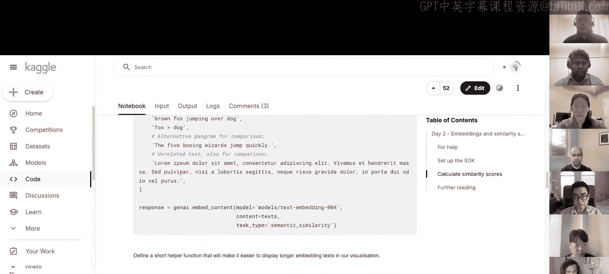

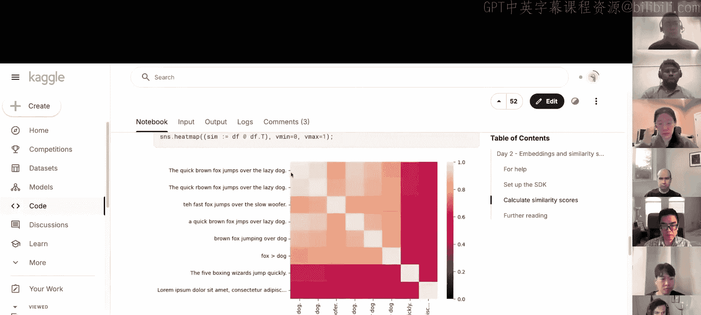

说到这里，这正好是我们代码实验的一个绝佳过渡，接下来我将带大家浏览其中的一些内容。

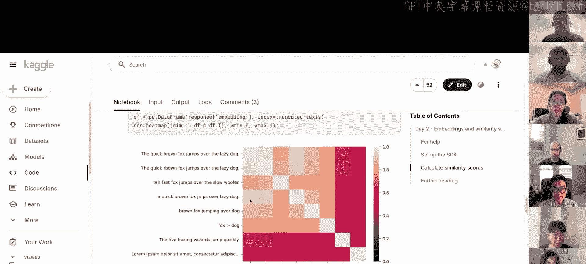

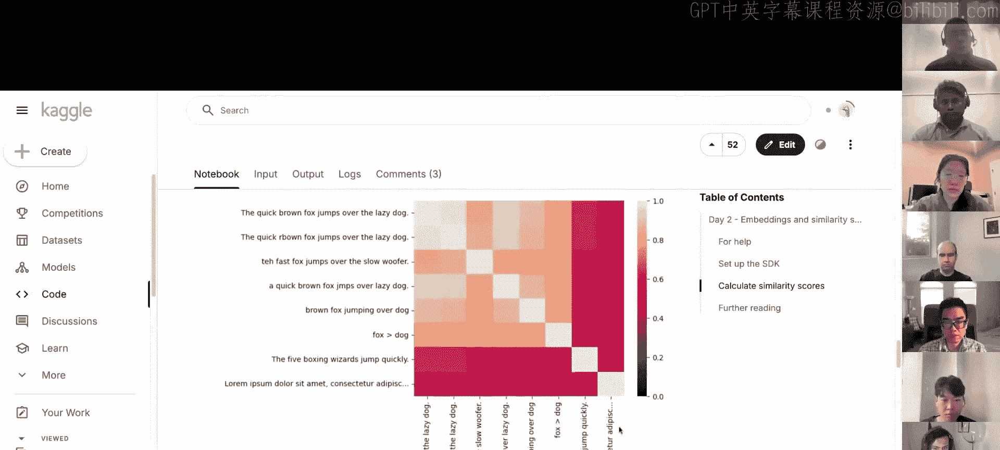

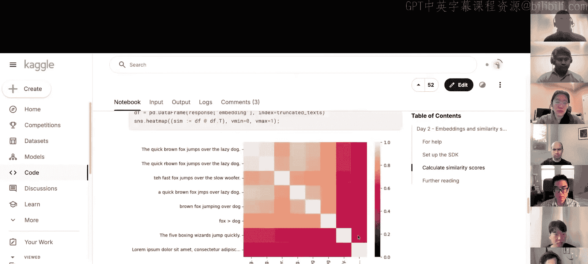

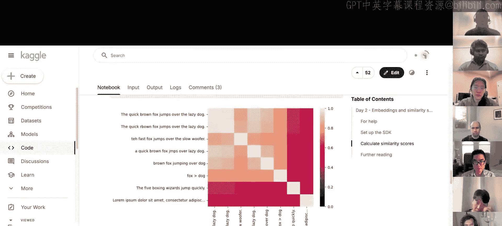

---

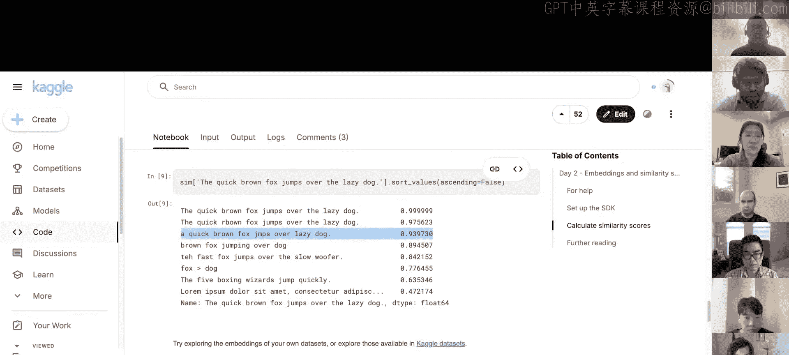

## 代码实验一：使用RAG和ChromaDB构建文档问答系统

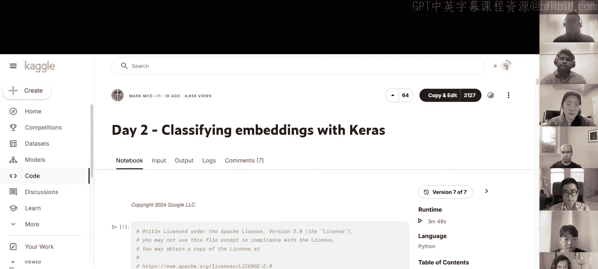

让我们开始吧。第二天的第一个代码实验是使用RAG和ChromaDB构建一个文档问答系统。

那么，什么是RAG？**检索增强生成** 包含三个部分，它解决了LLM的一个非常重要的限制：LLM通常受限于其训练时的知识，并且无法访问最新的动态信息，除非你通过类似这样的系统提供。即使它们能够访问知识，在提示词本身中提供最相关和最新的信息也有助于提高性能并减少幻觉。

RAG系统有三个阶段：
1.  **嵌入和索引**：将数据库中的各种文档以及查询进行嵌入。
2.  **检索阶段**：获取查询嵌入，查看数据库中的所有文档，找出哪些是最相似、最相关的文档，以便LLM能够访问并给出最合适的答案。
3.  **生成部分**：将最相关的上下文和文档作为提示词的一部分，生成答案。

在这个特定的代码实验中，我们构建了一个简单的玩具RAG系统。让我们看看是如何实现的。

我们像之前的代码实验一样安装了必要的库，并从Kaggle Secrets中检索了API密钥以调用Gemini API。

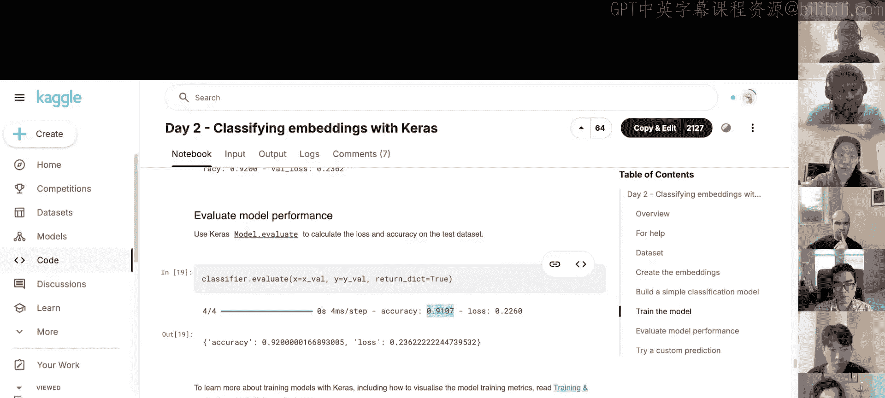

然后我们探索了各种可用的模型，这里我们查看了可用的嵌入模型，例如我们将用于RAG系统的文本嵌入模型。

接着，我们创建了一个包含三个文档的小型玩具数据，作为本代码实验的数据库。

之后，我们创建了一个函数，使用嵌入API来嵌入文档。这里我们使用的是`text-embedding-004`嵌入API，我们定义了这个函数，可以调用它来嵌入给定的文档。

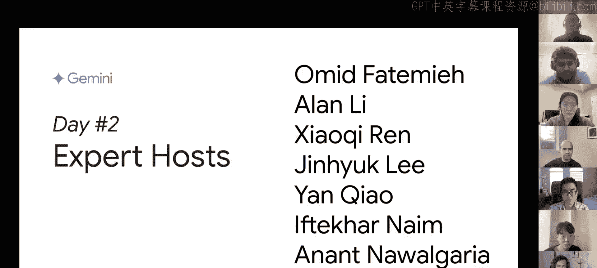

一旦定义了数据集和嵌入函数，我们就初始化ChromaDB，并使用这个函数添加文档。由于我们引用了上面定义的嵌入函数，它会自动嵌入文档。因此，它是在使用嵌入函数确保索引文档的嵌入版本，而不是原始文档。

我们确认了文档确实被添加到了向量数据库中。然后，我们测试向量数据库的语义搜索是否真的有效：我们给出一个查询，创建数据库，并找到最相似的结果。根据我们提供的三个示例文档的上下文，这似乎是正确的。

然后，我们使用检索到的结果作为LLM的上下文。在这一部分，我们使用检索到的示例文档扩展了提示词，并用它来生成答案。

恭喜！如果你进行到这里并理解了，那么你已经构建了一个检索增强生成应用。

---

## 代码实验二：使用嵌入理解文档相似性

现在来看第二天的第二个代码实验。这里我们将看到如何使用嵌入来理解各种文档之间的相似性。在这个例子中，我们将专门处理文本嵌入，但你也可以使用多模态嵌入。

类似的启动步骤：从Kaggle Secrets检索API密钥并初始化Gemini。

我们也探索了可用于嵌入的模型。

这里是帮助你理解的重要部分：我们定义了各种文本文档样本，我们希望相互比较，找出每个文档在语义（意义）上与列表中其他文档的相似程度。我们进行了语义相似性计算，并绘制了从每个文档到其他所有文档的热图。

在这个热图中，你可以看到一些非常有趣的现象：较浅的色调表示非常高的语义相似性，较深的色调表示较低的语义相似性。你可以看到句子“The quick brown fox jumps over the lazy dog”与自身最相似，但与完全随机的文档（如“Lompsson”等）最不相似。这很合理。

如果你查看具体的相似性分数，文档“The quick brown fox jumps over the lazy dog”当然与自身最相似，因为是完全相同的句子。但它第二相似的是同一个文档的轻微拼写错误版本，因为含义基本保持不变，只是有一个小拼写错误。你可以看到，它第三相似的文档也暗示了相同的含义，依此类推。这基本上也是人类会给出的排名，通过嵌入这些文档，语义相似性被捕捉得非常好。

你可以将此用于各种目的，例如聚类、排序、检索系统等。

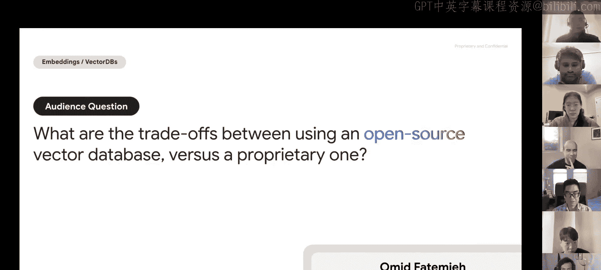

---

## 代码实验三：使用嵌入作为下游模型的丰富表示

现在来看第三个代码实验。这里展示了嵌入的一个略有不同的用例。前两个讨论了利用文档语义相似性进行检索，这个则讨论了如何将嵌入用作丰富的表示，以引导你的下游模型，并利用这种丰富表示作为信息源，这样你就不需要大量数据或非常复杂的模型，并且已经可以利用嵌入中的信息。

在这个代码实验中，我们将从使用预训练的嵌入开始，这些嵌入可以帮助在顶部添加一个小的Keras模型来对新闻组帖子进行分类。这个Keras模型不会从头开始基于原始文本数据进行训练，而是将这些嵌入作为输入源，并在顶部添加几层。这可以极大地提高数据效率，并学习如何将新闻组帖子分类到各个类别。

我们像往常一样开始，初始化并检索API密钥，用它初始化Gemini。

然后我们查看新闻组文本数据，其中包含许多跨越多个主题的新闻组帖子。我们的目标是创建一个模型，该模型可以获取新闻组帖子的文本内容并将其分类到其中一个主题。

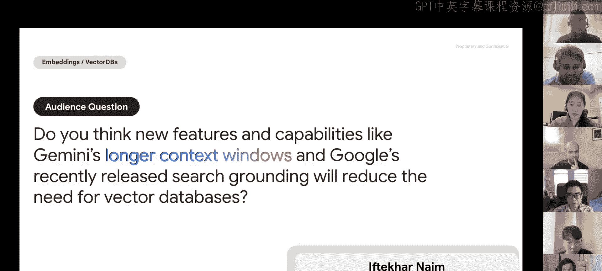

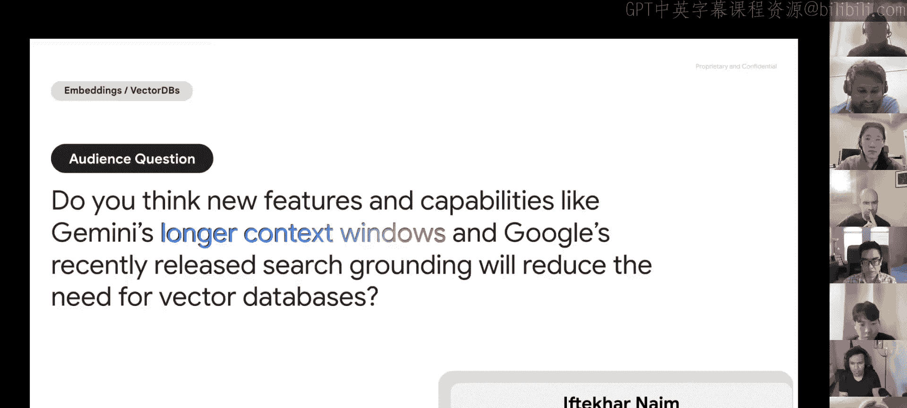

在这个单元格中，我们对新闻组帖子进行了一些预处理以进行清理。

然后，我们对帖子进行了训练集和测试集的划分。我们希望根据新闻组帖子和现有的类别标签进行训练，然后学习如何预测新的、类别标签未知的新闻组帖子的类别标签，并查看其在测试集上的表现。

这是所有的预处理步骤。接下来是最重要的部分：创建嵌入并将其用于下游模型。因为我们将执行分类任务，所以我们将使用嵌入的分类任务类别。根据你正在执行的任务，可以使用各种不同的类别。然后，我们定义了创建嵌入的函数，并基于训练和测试数据集创建了嵌入。

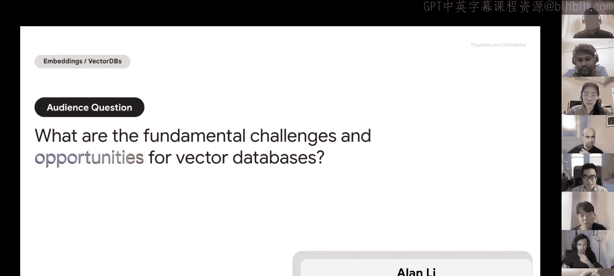

在这一部分，我们添加了几个密集的Keras层（使用Keras框架的密集层）。我们以嵌入作为输入，将其传递过几层，然后模型学习如何将其分类到各自对应的新闻组目标类别。

请记住，这里我们不是从头开始学习，而是将嵌入作为输入，因此模型不需要那么多数据，也不需要那么深的深度和复杂度。

通过这样做，我们可以看到验证准确率在仅仅7个周期内就快速提高，即使数据有限，它也能达到相当好的准确率。因为我们是从嵌入表示开始的，而不是原始文本。这在你数据有限时尤其有帮助。

希望这很清楚。谢谢，现在交还给Paige。

---

## 专家问答环节

太棒了，非常感谢你详细讲解这些精彩的笔记本。也感谢Mark McDonald创建并提供了它们，让学生们能够动手并开始理解嵌入和向量数据库的工作原理。同样感谢Chroma和Keras背后的开源团队，很高兴看到这些工具与课程内容一起使用。

现在回到我们的幻灯片，看起来是时候开始我们的问答环节了。这个问答环节由你们所有人提供，你们在Discord中提出的所有精彩问题将被用来为我们的问答环节创建问题。我还要感谢我们的生成式AI课程主持人Polong、Ca、Mark、Eric、Erwin和Miles，他们一直在Discord上实时回答你们的问题，并帮助人们解决一些作业中可能遇到的挑战。请为我们所有优秀的课程主持人热烈鼓掌。

热烈欢迎我们第二天的所有专家主持人，他们来自DeepMind以及我们的Google Cloud AI团队：Oid、Allan、Shaochi、Genhook、Yan、FTar和Anant。非常感谢你们今天抽出时间回答学生们的问题。

现在，我将开始我们的第一个问题。提醒一下，如果你希望你的问题得到解答，请确保在每天学习课程作业时将它们添加到Discord中。

**问题1：首先，请Alan和Janon介绍一下向量数据库和嵌入，它们是什么，为什么有用？**

**Janon：** 当然，我先介绍一下嵌入，然后交给Alan来谈向量数据库。
嵌入是数值向量。我们使用这些嵌入模型，它们是机器学习模型，可以将现实世界的对象（如文本、图像和视频）转换为嵌入。这些模型经过训练，使得嵌入的几何距离或相似性能够反映它们所代表对象的真实世界相似性。
嵌入模型可用于推荐系统、语义搜索、分类、RAG等许多应用。
Google的Vertex AI平台提供两类预训练的嵌入模型：文本嵌入模型和多模态嵌入模型。文本嵌入模型允许你将纯文本转换为嵌入，而多模态模型则适用于图像、音频和视频输入，以及文本输入。
要使用这些模型，你只需在Vertex AI或GCP项目中启用，并向Vertex端点发送请求。我们还支持使用你自己的数据来定制这些模型。
向量数据库是专门管理这些嵌入向量的存储解决方案。现在我把时间交给Alan来详细谈谈向量数据库。

**Alan：** 谢谢Yan。我是Alan，来自Google Cloud数据库团队，负责AlloyDB语义搜索。既然我们知道向量嵌入捕捉了非结构化数据的语义含义，那么向量搜索就是这样一个操作：给定一组存储的嵌入和一个查询嵌入，找到与该查询最接近的邻居，即最相似的项。
向量搜索可以通过计算查询与每个存储嵌入之间的距离来完成，这被称为精确最近邻搜索。但是想象一下，如果有十亿个存储向量需要计算距离，这个操作会有多慢。因此，向量数据库通过近似最近邻搜索来加速向量搜索，它在进行数量级更少的工作的同时，提供高度准确但近似的答案。
业界有多种近似最近邻算法，它们通常分为两大类：基于图的（最流行的是HNSW）和基于树的。一个先进的基于树的算法是Google的SCaNN算法。它基于Google超过12年的研究，在Google内部大规模用于Google搜索、YouTube、广告、照片等产品。我们已经将SCaNN算法原生集成到多个Google Cloud产品中，包括AlloyDB、Cloud Spanner、托管MySQL、BigQuery和Vertex Vector Search。

**Paige：** 太棒了，听起来嵌入和向量数据库是理解某些数据彼此相似程度的快速方法。我们通过Google Cloud以及Gemini开发者API提供了许多不同的嵌入托管服务选项，同时你也可以使用像Chroma这样的开源工具和其他向量数据库来完成工作并存储为项目创建的所有嵌入。谢谢你们。

**问题2：说到开源向量数据库，使用开源向量数据库与使用专有数据库（比如刚刚提到的Google Cloud上的一些托管服务）之间有哪些权衡？Oit，你想回答这个问题吗？**

**Oit：** 是的，谢谢。大家好，我是Oit，来自Google Cloud的BigQuery团队，负责领导AIML和搜索领域。
这是一个很好的问题。我认为权衡与其他技术领域类似。更具体地说，开源向量数据库可能在成本、灵活性、可定制性、社区支持以及可能避免供应商锁定等方面更具优势。
然而，这通常需要与更高的维护成本、更高的管理成本和复杂性，以及未来潜在的碎片化和有限的支持选项进行平衡。
对于专有向量数据库，情况基本上相反。它们通常在易用性（作为更托管的服务）、支持、更高级的功能和稳定性方面具有优势。但缺点可能是成本、潜在的供应商锁定（在某些情况下）以及有限的自定义灵活性和透明度。
话虽如此，我还想提请大家注意，各种通用数据库、数据分析和数据仓库平台中正在增加的强大向量搜索和索引功能。正如Alan提到的，这些功能是作为一等公民添加的。顺便说一下，这涵盖了开源和专有领域。例如，你可以想想Postgres的PG向量扩展；在Google Cloud中，对于数据库和数据仓库，我们有AlloyDB、Spanner和BigQuery，它们都添加了非常强大的一等公民功能。
现在，考虑这个选项的优势在于，它有助于避免跨两个数据库的数据重复。你只需一个数据库作为单一事实来源，并且可以继续受益于数十年来构建到这些通用数据库和数据仓库中的高度先进功能。本质上，你将其用作单一事实来源，并使用不断快速增长的附加AI和向量功能。这也是我想作为这个问题答案的一部分提出的另一个选项。

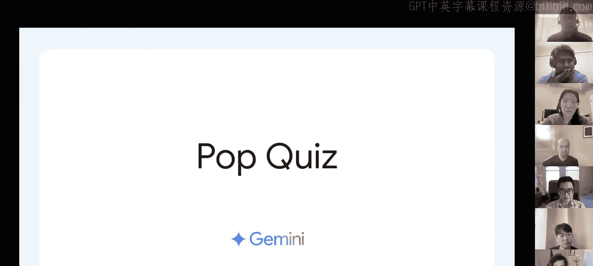

**Paige：** 这太棒了，听到用户不必纠结是使用向量数据库还是更传统的数据库，这些功能正在两者之间交叉融合，这样你就不必进行数据复制，也不必理解应该使用哪种工具或技术，你只需在像Postgres这样大多数人已经有使用经验的东西中采用这些功能。非常酷，谢谢，很高兴听到这些。

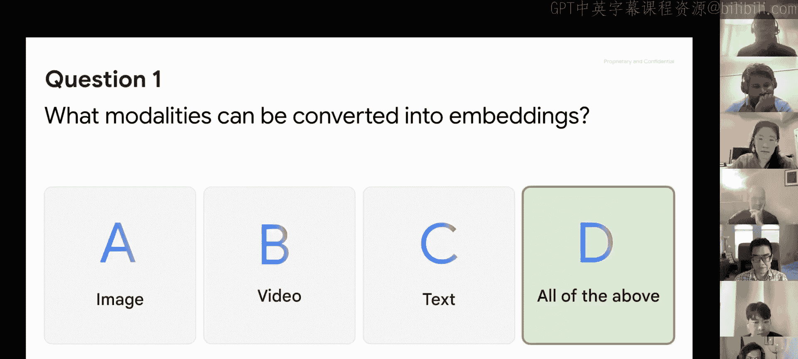

**问题3：下一个问题给TeChar：你认为像Gemini更长的上下文窗口（现在高达200万个令牌）和Google最近发布的搜索增强这样的新功能和能力，会减少对向量数据库的需求吗？还是这些功能和工具是互补的？**

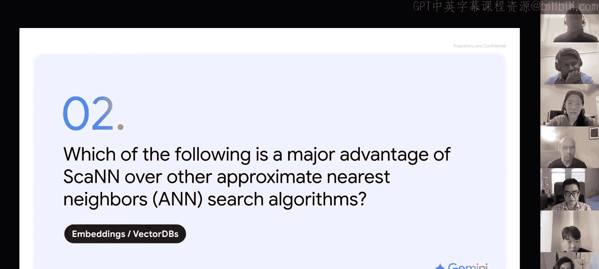

**TeChar：** 谢谢Paige。我是Ehaer，来自Google DeepMind。谢谢这个好问题。我先解释一下问题：提到了两项新技术，一是像Gemini这样的语言模型可以支持越来越多的令牌作为输入的长上下文窗口；另一项技术是搜索增强，我们最近发布了进行网络搜索并基于此验证答案正确性的能力。
首先谈谈更长的上下文窗口。当然，能够扩展到更长的上下文非常令人兴奋，但我们还没有准备好真正大规模地这样做，原因有几个：首先，我们目前支持几百万个令牌，但大多数真实的数据库或语料库要大得多，我们经常需要数十亿或数万亿个令牌。其次，在大量令牌上运行完整的LLM计算成本非常高，而正如Janan和Alan解释的，向量数据库极其高效，可以快速从数十亿项中检索。最后，我们发现，当我们在上下文中放入越来越多不相关的内容时，LLM的推理能力开始下降。因此，通常更有用的是先使用向量数据库检索最相关的文档或内容，然后对实际上与用户问题相关的内容进行推理。
这样看来，向量数据库实际上是新的长上下文语言模型能力的一个非常令人兴奋的补充技术，因为现在初始检索阶段不必极其精确，相反，我们可以专注于召回，获取大量相关文档放入上下文，然后LLM可以在这个大量上下文上进行推理。

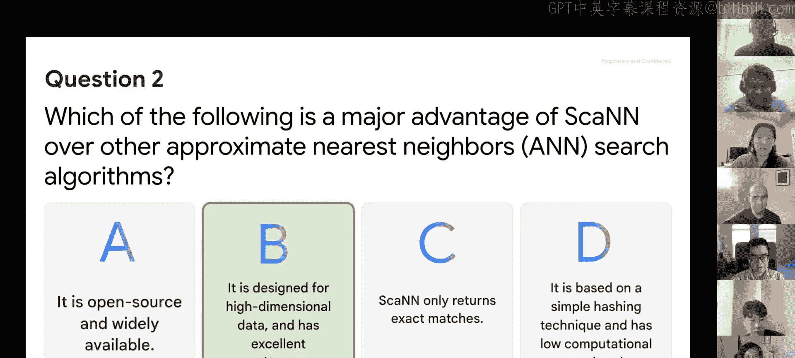

**Paige：** 我很快想说，我非常喜欢你刚刚描述的模式：能够使用向量数据库和检索来确定哪些是最有效的信息，放入上下文窗口以帮助支持你的输出。我认为这一点迄今为止尚未得到充分探索，我很高兴你指出来。

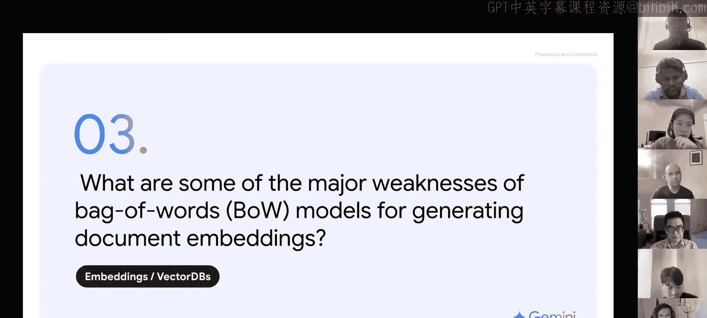

**TeChar：** 我非常兴奋，这也帮助我们以不同的方式思考。过去我们上下文非常有限，所以我们会过分关注检索的精确度。而现在，我们可以更侧重于召回，因为我们可以支持稍多的上下文令牌，然后撒一张更大的网，获取所有相关内容，然后在其上进行推理。
问题的另一部分是关于搜索增强。我简要提一下，搜索增强使我们能够基于网络上的所有公共信息进行增强。但通常，我们希望对我们私有信息（如个人数据或公司专有的私有语料库）进行搜索或增强。对于这些，我们仍然需要向量数据库，因为公共搜索无法访问那些私有数据。

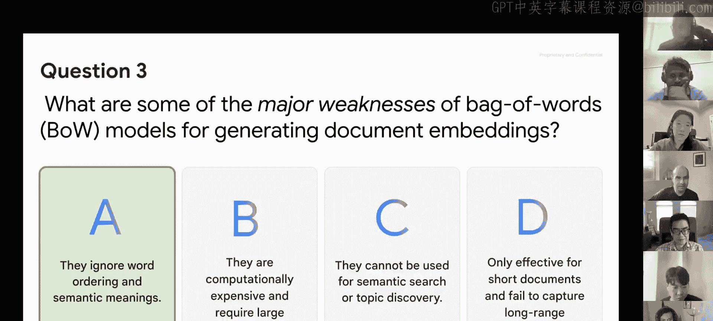

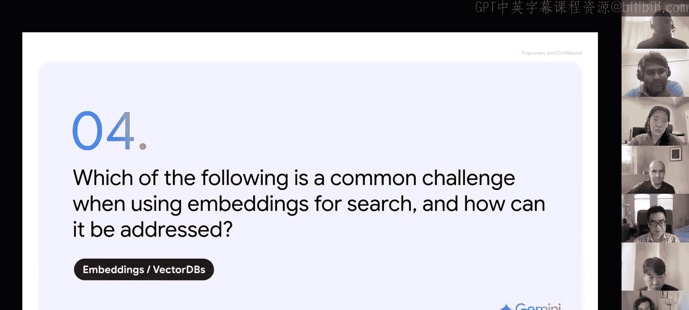

**Paige：** 是的，当然。我知道Google Cloud实现了一个功能，不仅仅是搜索增强，还可以基于可能托管在GCS中的任意数据进行增强。所以我认为你是对的，两者都有其位置：检索以获取最相关的信息，以及搜索网络以找到最新信息的能力。

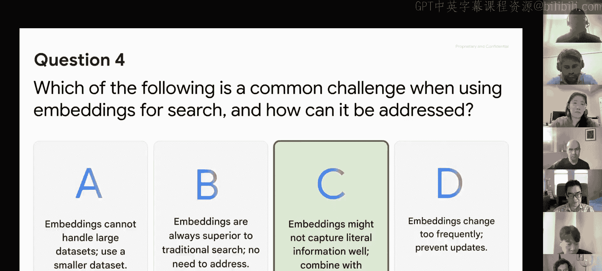

**问题4：下一个问题，向量数据库的基本挑战和机遇是什么？Alan，你想回答这个吗？**

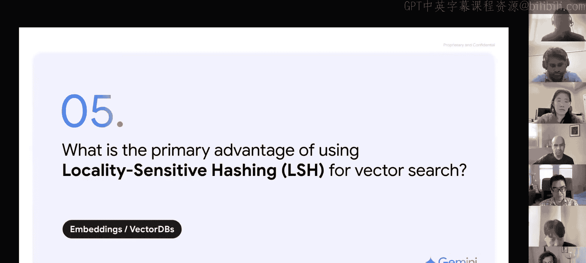

**Alan：** 当然，谢谢Paige。从在操作数据库内原生构建向量搜索索引的角度来看，对于操作数据库客户来说，这是一个记录系统，他们期望具有事务语义、强一致性、快速事务操作以及跨越内存和磁盘的数据。
我们一直在研究的一个有趣挑战是如何实现与专业向量数据库系统相同的性能，而这些系统没有相同的约束。作为一个创新例子，AlloyDB团队已经实现了底层缓冲区页面格式，以利用SCaNN的低级优化。
我看到的适用于向量数据库的其他机会领域在于，当向量搜索只是应用逻辑的一部分时，提高其可用性和性能。例如，带过滤的向量搜索是一个众所周知的挑战，根据过滤条件和用户意图，进行后过滤或预过滤操作可能更高效。用户意图很明确：返回给我通过过滤条件的最接近的邻居。现在很多系统需要用户指定是在向量搜索之后应用过滤器还是反之，但向量搜索数据库应该能够自动判断出哪种过滤操作能带来最佳性能，而无需用户指定。这延伸到与其他应用逻辑（如连接、聚合和文本搜索）的结合。

**Paige：** 我喜欢你刚才提到的，将这些AI功能引入传统数据库，并改善开发者的使用体验。我认为这将为人们带来更多能力，而不必让他们学习使用新的工具或技术。我真的很期待看到大家构建什么，以及GCP产品和开源数据库中即将出现的新改进。非常酷，谢谢你的精彩回答。

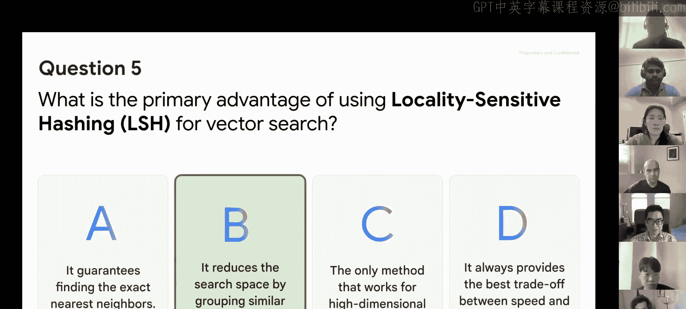

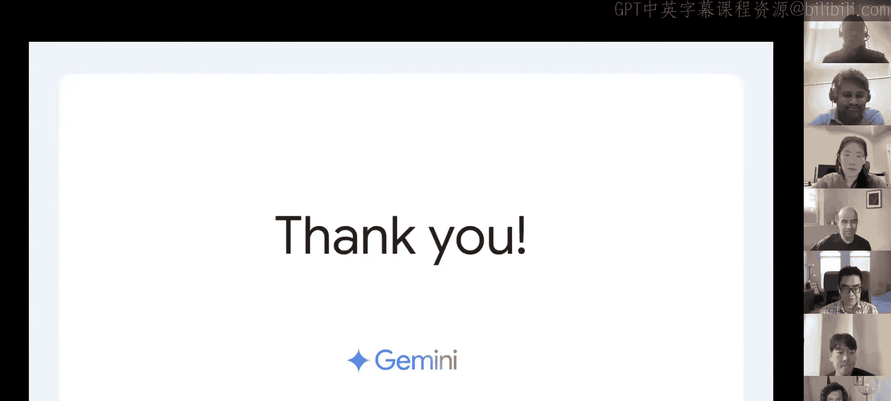

**问题5：下一个问题。我们讨论了很多当一切顺利时的情况，当我们能够找到