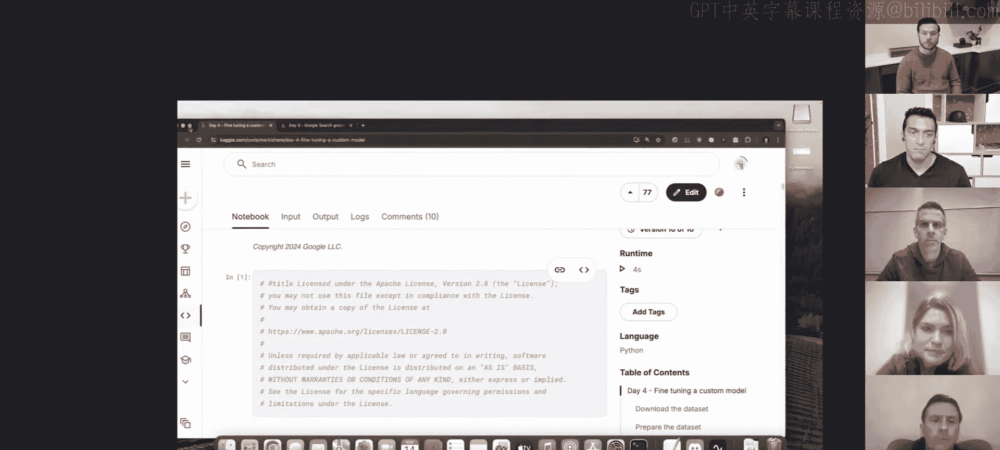
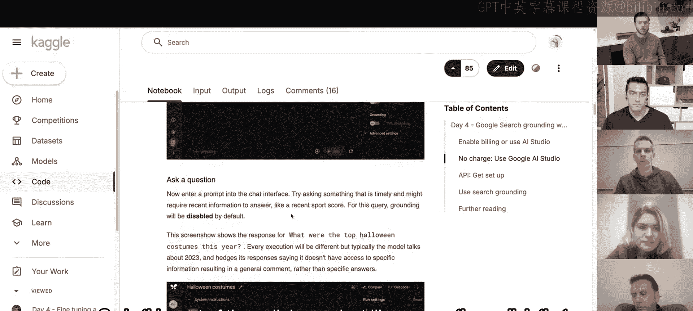

# 004：领域特定大语言模型与微调 🎯

在本节课中，我们将要学习领域特定大语言模型，以及如何通过微调和定制化，使大语言模型完美适配你的特定使用场景。

## 课程概述

欢迎来到生成式AI五天强化课程的第四天。今天的主题是领域特定大语言模型，以及如何通过微调来定制大语言模型，使其精确满足你的用例需求。本课程由Kaggle和Gemini团队赞助，包含每日作业、播客、白皮书、Discord讨论以及代码实验。

上一节我们介绍了动态智能体，本节中我们来看看如何通过微调让模型在特定领域表现更出色。

## 领域特定模型简介

领域特定大语言模型是针对特定领域（如医疗、网络安全）进行专门训练或微调的模型。它们结合了我们在前几日学到的概念，旨在解决通用模型在专业领域面临的挑战，例如知识代表性不足、任务特殊性以及安全合规要求。

### 医疗领域：Med-PaLM

在医疗领域，想象一下准确诊断病人所需的复杂性：需要考虑病人完整的病史和检测结果。这通常不仅需要深厚的医学概念理解，还需要检索相关信息并进行推理的能力。

Med-PaLM模型旨在应对这一挑战。它的发展历程包括通过美国医疗执照考试，并在真实临床场景中产生影响，例如协助医生进行诊断和治疗规划。该模型的关键需求在于生成长篇回答、理解医疗记录，并与患者进行自然的对话，而不仅仅是机械式的应答。

### 网络安全领域：Sec-PaLM

在网络安全领域，从业者持续应对着所谓的“3T”挑战：威胁、繁琐工作和人才短缺。

想象一下安全分析师筛选海量警报，试图从无害的异常中识别真实攻击的场景，这就是网络安全中“繁琐工作”的现实。再加上网络威胁的不断演变和全球熟练专业人员的短缺，基本上就构成了职业倦怠和系统漏洞的配方。

在这部分内容中，我们探讨了Sec-PaLM如何通过分析恶意代码、自动化警报分类甚至生成报告，来解放人类分析师，让他们专注于更战略性和重要的任务。

## 核心技术与方法

这些专业语言模型在大量医学和网络安全数据上进行训练，使其能够理解各自领域的细微差别。它们还利用规划和推理框架，将复杂任务分解为小而可管理的步骤，就像人类专家所做的那样。

在最后部分，我们探讨了在现实世界中负责任地部署这些强大AI模型的重要性，强调了评估、解决潜在偏见以及确保安全、合乎伦理地使用它们以改善患者护理和加强网络安全防御的关键性。

## 代码实验解析

以下是两个核心代码实验的要点介绍。

### 实验一：使用搜索增强提高准确性

这个实验主要探讨如何使用诸如谷歌搜索增强这样的基础技术，来提高大语言模型的准确性并减少幻觉。在Sec-PaLM中，增强技术同样被使用。

实验首先初始化环境，安装必要的库并获取API密钥。

接下来是有趣的部分。我们首先探索可用的各种模型。对于这个实验，我们将使用前几天用过的标准模型，但会通过增强技术来增强它们，特别是谷歌搜索增强。通过SDK接口，模型的回答将基于谷歌搜索结果，这不仅提高了回答质量，还能获得来源和引用，从而理解答案的哪些部分可以归因于哪些搜索结果。

例如，询问“泰勒·斯威夫特的下一次演唱会是什么时候在哪里？”，这通常需要动态和实时的信息。实验展示了增强如何帮助提供这类信息。因为大语言模型是在某个时间点之前训练的，可能没有最新的信息。如果不使用增强，模型可能会给出不正确的回答，或者声明自己没有实时信息并指向各种来源，但这可能不是你想要的答案。

在后续部分，我们像昨天在智能体章节讨论的那样，给模型提供一个名为“谷歌搜索检索”的工具，然后重复相同的问题。你会看到模型能够给出更具体、更准确的答案。

但拥有答案固然好，你如何知道可以信任基于实际来源的答案呢？这就是你可以深入研究该服务提供的元数据的地方。你可以看到它根据你的查询给出了各种链接和结果，你不仅可以获得生成答案所使用的来源链接，还可以看到（取决于你问的问题）答案的哪些部分可以归因于哪些来源。

这本质上就是这个实验的主要内容：生成有根据的文本，并为输出答案的某些部分获取引用。

以上是静态增强，我们要求模型将每个答案都基于谷歌搜索结果。但可能存在某些场景，你希望根据是否需要增强来策略性地对结果进行增强。如果模型在没有增强的情况下无法正确或适当地回答问题，你可能不希望依赖增强。在这里，你可以为模型提供一个阈值，然后模型会根据其对答案的置信度自动决定是否重定向到增强服务。

这就是实验第二部分的内容：使用增强来减少幻觉并提高结果质量。如果你在Sec-PaLM部分的工作中使用了增强，你也可以在你的应用程序中利用它。

### 实验二：微调自定义模型

这个实验讨论了微调自定义模型，它通过使用参数高效微调技术来实现，正如你在第一天学到的那样。你可以在自己的语料库上微调Gemini模型，这可以帮助它在未见过的任务上表现更好。

我们像往常一样，通过Kaggle Secrets初始化API密钥，并探索各种可用模型。

就像我们在第二天看到的那样，我们使用相同的新闻组文本数据集，其中包含超过18000个关于20个主题的新闻组帖子。我们将根据文本将新闻组帖子分类到各个类别，这本质上是一个基于文本的分类问题。

像第二天一样，我们将清理数据，移除任何明显的类别信号，以使实验公平相关。然后，我们为训练和测试采样某些行。请记住，参数高效微调对数据效率要求很高，你不需要像训练嵌入模型那样多的数据行，它甚至更高效。因此，我们只保留50行用于训练，并保留一些用于测试。

为了理解微调如何帮助提高性能，最好有一个基线来查看在微调之前，模型在零样本分类下的表现或分类性能如何。这是我们在实验这部分所做的：我们让模型进行零样本分类，询问它“以下消息源自哪个新闻组？”，并给出几个选项。我们在这里做了一些提示工程，使其更具体。然而，无论如何，正如你在这里看到的，在没有参数高效微调的情况下，准确率只有大约18.75%。

现在，如果我们在对输入输出对示例（我们采用的50个包含新闻组帖子及其各自类别的示例）进行微调后，重复相同的评估过程，你可以看到模型的评估分类性能显著提高。这在你的任务不完全符合模型之前所见内容的场景中，可能是一个主要优势。

当然，你也可以通过提示工程来提高性能，正如你在第一天看到的那样。我建议你尝试一下，稍后你会看到效果。

接下来，参数高效微调还有另一个不常被提及的优势，你也会在实验的这个部分看到，那就是它可以用于减少生成的令牌数量。特别是当你使用这些API的付费版本时，你需要为输入和生成输出的长度付费，这有助于减少两端的长度。特别是因为你可以极大地影响输入输出的长度，而且因为我们训练（或参数高效训练）模型在其从输入到输出的映射上非常高效，我们不需要在输入侧进行额外的提示工程，我们可以看到我们节省了大量的令牌，因为输入更短，因此在输入大小上花费更少。

## 专家问答要点总结

在本节中，我们与来自Med-PaLM和Sec-PaLM团队的专家进行了问答，深入探讨了领域特定模型的实践与挑战。

**关于安全领域大模型：**
安全领域具有任务、工具和数据极其多样化的特点，且公开数据有限、敏感性高。通用模型难以达到专家级的理解和推理水平。Sec-PaLM通过持续预训练、针对性的指令微调、人类对齐过程以及LoRA等技术，使模型适应特定客户环境或任务。其核心价值在于执行任务而非记忆信息，并强调通过增强来获取权威事实。

**关于医疗领域基准：**
MedQA等多项选择题基准虽有助于自动评估，但场景过于简化。未来趋势是转向更复杂、更贴近现实的基准，如涉及完整患者场景、医学影像或治疗建议的任务。达到100%的MedQA准确率并非最重要的里程碑。

**关于通用模型与微调模型的权衡：**
需要在回答质量、服务成本和延迟等多个维度进行权衡。领域特定模型可以在模型规模较小的情况下，通过在特定领域的专业化获得良好收益。微调、检索增强和上下文学习等都是可用的工具，具体选择取决于用例。

**关于AI解决所有健康问题：**
生成式AI在医疗领域的应用不应仅限于提高效率的渐进式改进。更应探索那些在过去无法想象、现在因模型能力而成为可能的新护理路径和科学发现，这才是未来十年医疗保健领域期待的重大进步。

**关于安全领域的对抗性：**
部署大语言模型时需考虑新的攻击面，如提示注入。应对策略包括输入扫描、通过训练提高抵抗力，以及将问题分解为多个子步骤以限制恶意输入的影响范围。

**关于医疗领域的伦理与隐私：**
在部署时，需依赖本地法规（如HIPAA）和合规的基础设施。在训练时，通常使用去标识化数据或合成数据，这既保护患者隐私，也有助于提高模型性能和数据清洁度。

**关于大模型在安全领域的有效用例：**
最有效的用例是解锁执行安全任务的能力，特别是程序性知识，以及充当连接各种异构安全系统和数据孤岛的“粘合剂”。代码分析和自动修复云配置误设置是前景广阔的领域。

**关于安全领域大模型的现存差距：**
关键差距在于可解释性和信任验证。当前的引用和增强方法，对于高度技术性的领域，验证工作量依然很大。需要能够内置信度评估、对推理过程的信心衡量等更深层次的能力。此外，让模型有效理解和使用具有复杂模式（数百上千个字段）的API工具，仍是亟待解决的规模化难题。

**关于Med-PaLM的演进：**
工作重点正在从“根据对话记录诊断”扩展到更困难、更全面的任务，例如作为对话伙伴参与交流，并最终帮助患者理解并执行最佳的健康决策。这仍处于早期探索阶段，需要通过临床研究在真实环境中安全地验证其积极影响。

## 课程总结

本节课中我们一起学习了领域特定大语言模型的核心概念与应用。我们探讨了Med-PaLM如何助力医疗健康，以及Sec-PaLM如何应对网络安全挑战。通过代码实验，我们实践了使用搜索增强来提升模型回答的准确性与可追溯性，并学习了如何使用参数高效微调技术来定制模型，使其在特定分类任务上表现更佳，同时还能优化成本。专家分享进一步揭示了领域模型设计的考量、面临的挑战以及未来的发展方向。明天，我们将进入课程的第五天，学习关于生成式AI的评估与MLOps。