# 005：第五天直播与Paige Bailey – 生成式AI运维 (MLOps)

## 概述

在本节课中，我们将学习如何将生成式AI系统投入生产并进行长期维护。我们将回顾课程内容，探讨MLOps的核心概念，并通过一个实战演示了解如何使用Google Cloud的工具链来构建和部署生产就绪的生成式AI应用。

---

## 课程回顾

上一节我们介绍了整个五天课程的框架。本节中，我们来回顾一下前四天学习的关键内容。

*   **第一天**：我们讨论了基础模型，包括它们的创建、调优以及如何通过提示工程引导它们完成任务。
*   **第二天**：我们学习了嵌入和向量存储，了解了如何将各种数据类型表示为紧凑的语义向量，并使用向量搜索等技术进行大规模管理和查询。
*   **第三天**：我们结合了前两天的知识，利用AI函数调用等技术构建了能够调用各种数据库和工具的复杂生成式AI智能体。
*   **第四天**：我们探讨了领域特定的大语言模型，例如专注于网络安全和医疗的模型，它们利用RAG、智能体和提示工程等技术构建。

今天，我们将聚焦于如何将所有这些模型、数据库和技术整合到一个生产就绪的系统中。

---

## 白皮书核心概念

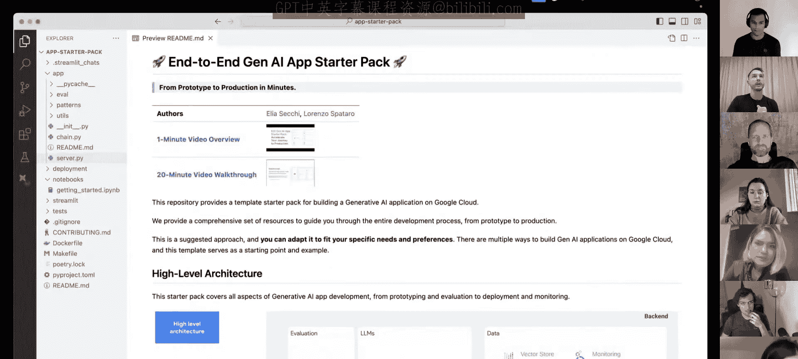

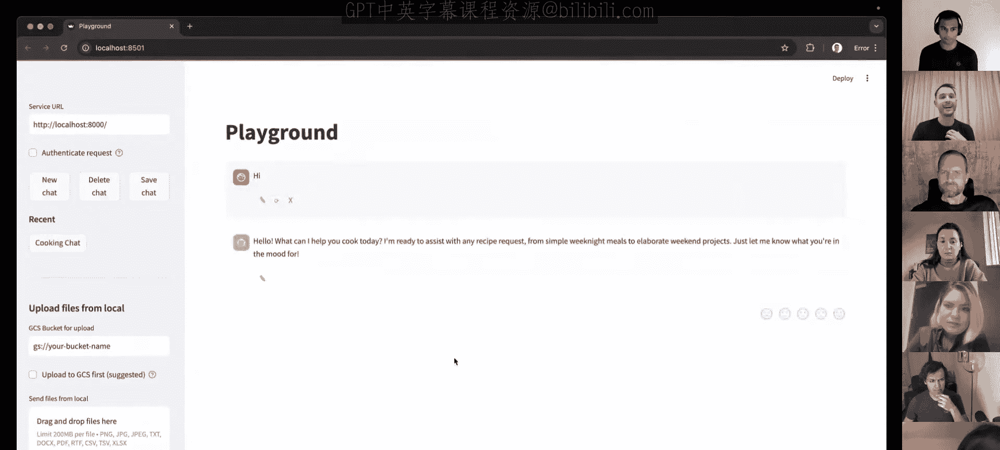

在今天的白皮书中，我们讨论了几个将生成式AI项目从原型推向生产环境的核心概念。

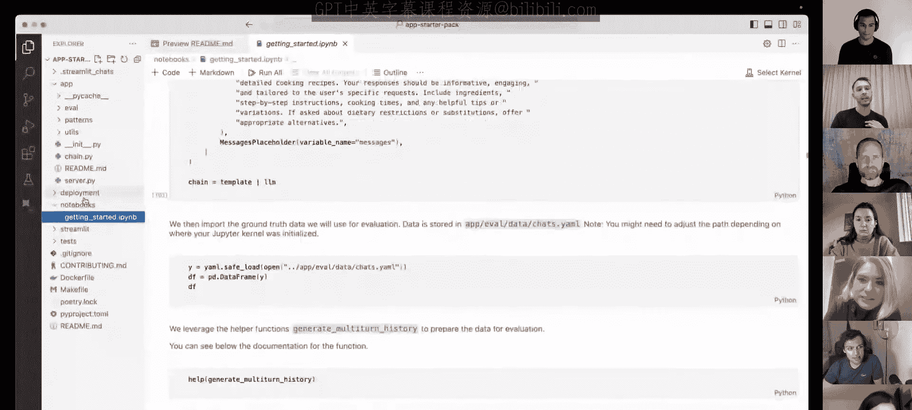

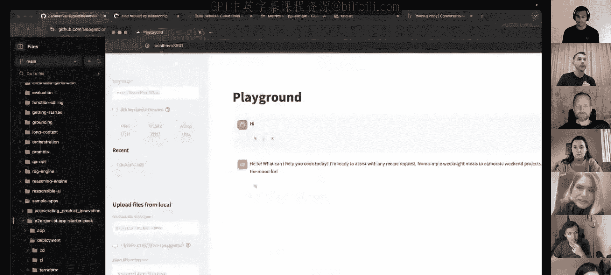

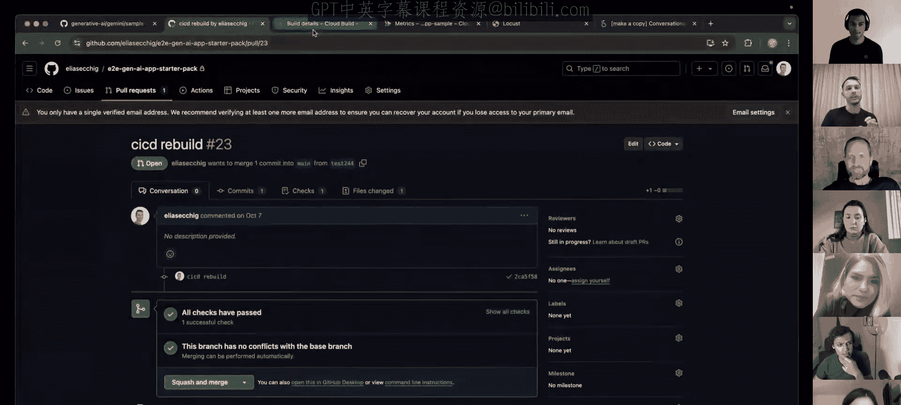

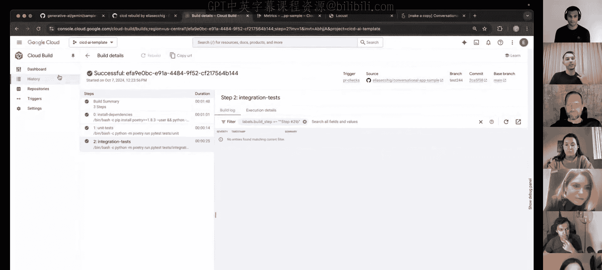

### 1. 模型发现与选择
如何从众多具有不同优势、劣势和权衡（如性能、成本）的基础模型中，有效地选择正确的模型。

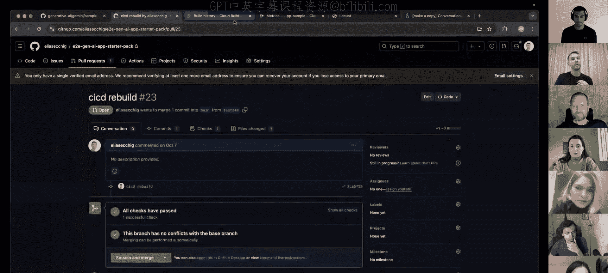

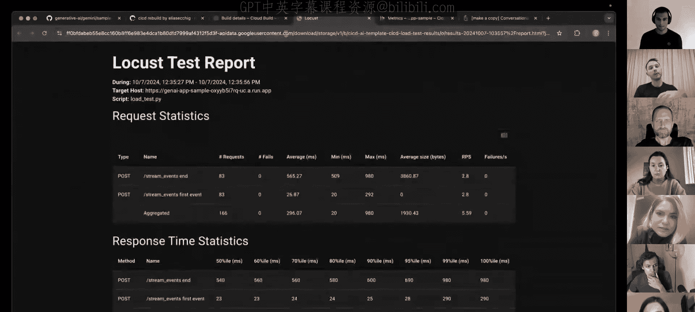

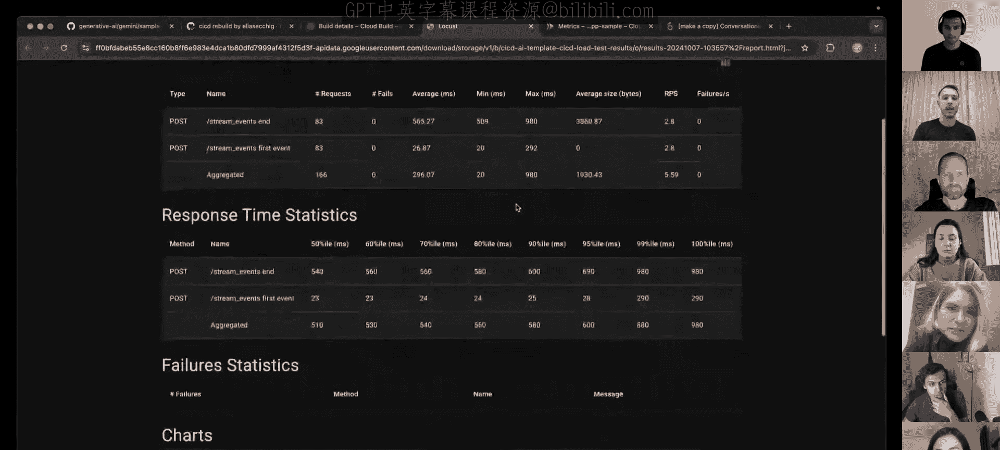

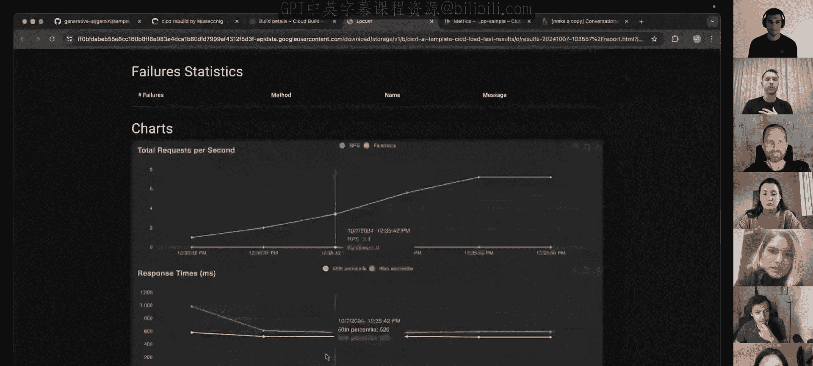

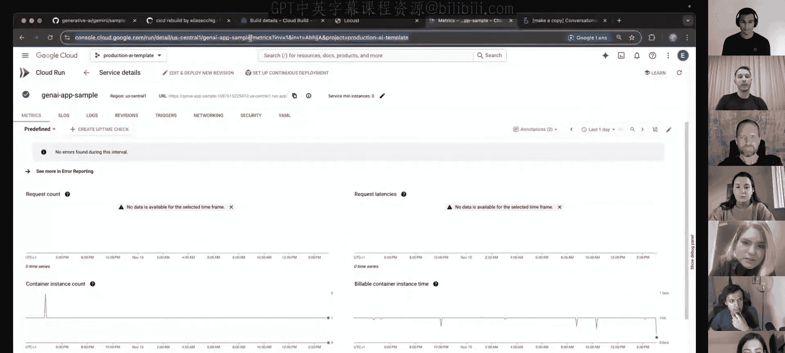

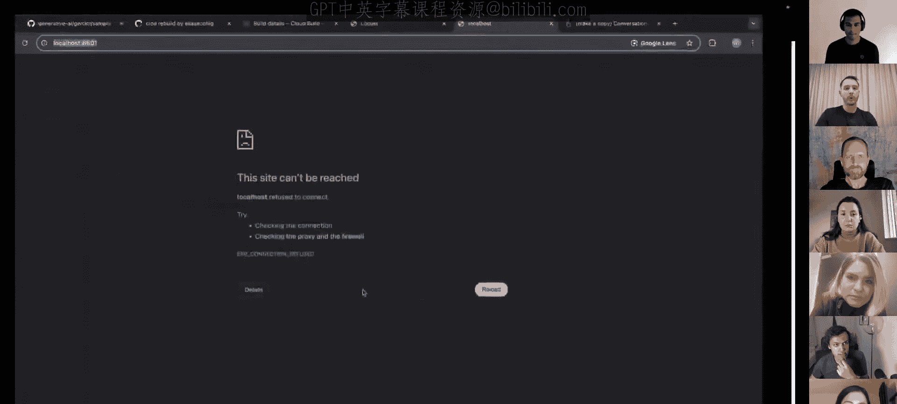

### 2. 开发、评估与实验
专注于迭代开发和端到端生成式AI应用的严格评估。我们建立了一个稳健的评估框架，包括使用任务和业务特定指标，以及多种评估方法（如并排比较）。

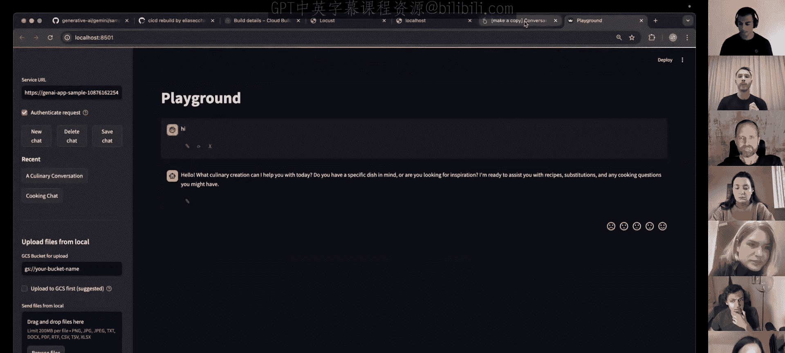

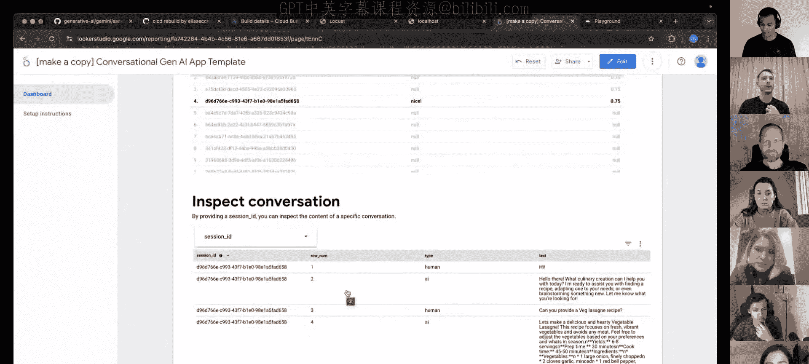

### 3. 部署
借鉴DevOps理念并将其扩展到生成式AI领域，涵盖持续集成、持续交付，并针对大语言模型和多模态模型的特定挑战进行定制。

### 4. 监控与日志记录
这是一个至关重要的环节，尤其对于大语言模型而言更为复杂。它包括：
*   **漂移检测**：当提示或输出偏离预期分布时进行检测。
*   **持续评估**：确保你的应用在生产环境中按预期运行。

### 5. 治理
这是一项贯穿始终的实践，旨在为开发和部署过程建立控制、问责制和透明度。

---

## 实战演示：生成式AI入门套件

上一节我们介绍了MLOps的理论框架，本节中我们来看看一个实际的工具如何简化在Google Cloud上构建和部署生成式AI应用的过程。

我们创建这个“生成式AI入门套件”是为了解决将生成式AI应用投入生产的“最后一公里”挑战。以下是该套件旨在解决的主要问题：

*   **部署与运维**：如何构建基础设施、进行测试、部署以及构建用户界面。
*   **评估**：如何衡量性能、构建合成数据。
*   **定制化**：如何集成自定义逻辑、实现安全与合规。
*   **可观测性**：如何收集数据用于调优和评估，如何监控服务与用户反馈。

该入门套件提供了以下功能：

1.  一个生产就绪的FastAPI服务器，支持实时聊天界面、流式响应和自动生成文档。
2.  一个用于实验的UI游乐场。
3.  完整的部署流程所需工具。
4.  不同的构建模式（例如，如何用LangChain构建智能体或RAG应用）。
5.  可观测性实现，允许跟踪用户与应用的所有交互。

**演示核心流程**：
1.  **应用开发**：使用如LangChain的框架创建应用（例如一个烹饪食谱助手）。
2.  **代码模式**：套件提供了构建智能体或自定义RAG问答应用等模式的示例代码。
3.  **评估**：在部署前，使用提供的示例进行应用评估。
4.  **部署**：使用Terraform或Cloud Build等工具进行CI/CD部署。流程包括代码提交、自动化测试（单元测试、集成测试）、容器构建与性能测试（如延迟、吞吐量），最终部署到生产环境。
5.  **监控**：所有用户交互数据被记录并保存到BigQuery中。可以通过Looker Studio仪表板监控应用使用情况、收集反馈分数，并深入查看每次对话的细节。

---

## 专家问答：MLOps与生成式AI

下面我们进入问答环节，探讨MLOps在生成式AI时代的变化与最佳实践。

### Q1: 随着大语言模型和生成式AI的出现，MLOps发生了哪些变化？
**Gabriela**: 早期的机器学习模型开发部署是手动的、临时的。MLOps通过引入DevOps原则实现了自动化和规模化。生成式AI的兴起再次推动了MLOps的演变：
*   **新角色**：出现了提示工程师、AI工程师。
*   **更广泛的工件管理**：需要管理模型配置、基础模型使用、提示模板、链式流程等。
*   **整体应用监控**：从仅监控模型扩展到监控整个生成式AI应用，包括收集反馈和进行任务特定的定制化评估。
*   **敏捷工作流**：新模型和框架层出不穷，要求工作流极其敏捷。

### Q2: 评估对于模型生产化有多重要？是否只适用于文本，多模态评估是否可行？
**Anant & Olivia**:
*   **重要性**：评估是MLOps不可或缺的部分。与预测式AI不同，生成式AI的输出（文本、图像等）评估更加复杂、任务特定且主观。
*   **文本评估方法**：
    *   **传统指标**：如BLEU、ROUGE，将生成结果与单一标准答案对比。适用于机器翻译等，但对摘要等任务有局限。
    *   **LLM即评判员**：使用一个大语言模型来评估另一个模型的输出，例如打分或解释。
    *   **并排比较**：人类更擅长比较两个答案的优劣，这种评估方式更符合直觉。
*   **多模态评估**：例如图像生成，没有所谓的“标准答案”。一种创新方法是使用如Gemini这样的模型作为黑盒，将评估任务分解为子问题（例如，“图像中有狗吗？”，“狗戴了帽子吗？”），不仅给出总分，还提供细粒度分析，让用户理解模型在哪些具体属性上表现不佳。

### Q3: 既然很多公司使用API调用而非自己训练部署模型，哪些MLOps挑战不再是优先事项？
**Socrates**: 调用模型API意味着他人承担了繁重工作（数据准备、训练、评估、部署、扩缩容）。这带来了巨大好处：
*   **快速启动**：可以直接构建应用，减少对数据科学技能的深度依赖（除非进行微调）。
*   **关注点转移**：直接从评估开始，大大缩短应用构建时间。
*   **新评估参数**：关注毒性、事实性、任务特定指标，而非传统的损失函数。
*   **新监控重点**：关注模型在毒性、事实性等方面的漂移，而非传统的数据/模型漂移。
*   **新的护栏**：需要围绕具体用例和主题设置更贴近语义理解的限制。

### Q4: 请介绍一下Vertex AI，客户为什么要在公司中使用它？
**Advait**: Vertex AI是一个企业级平台，是机器学习的“一站式商店”，涵盖生成式和非生成式任务。
*   **模型访问**：提供Gemini、Anthropic、Meta、Mistral等多种模型的API。
*   **工具集**：提供用于基础、构建智能体、应用落地所需的全套MLOps工具。
*   **灵活性**：可根据用户技能水平，选择手动管理所有基础设施，或使用AutoML等点击式界面简化流程，让用户更专注于ML本身而非运维。

### Q5: 开始使用生成式AI时，应优先考虑哪些MLOps实践？与传统MLOps有何不同？有哪些适合新手的工具？
**Veer**: 生成式AI模型（尤其是LLMs）更具通用性，需要提示来引导。因此，**“提示化模型”**（模型+提示）成为生成式AI MLOps的基本单元。
应优先考虑的实践及Vertex AI对应工具：
1.  **模型发现**：系统化评估模型（质量、延迟、成本等）。工具：**Vertex AI Model Garden**。
2.  **提示工程**：将提示视为数据和代码进行管理（验证、漂移检测、版本控制、测试）。
3.  **链式与增强**：通过链接模型、集成外部API和数据来克服LLM的时效性和幻觉问题。工具：Vertex AI的**Grounding、扩展、向量搜索、Agent Builder**。
4.  **模型调优与训练**：支持监督微调、RLHF等技术。工具：**Vertex AI模型注册表**、Dataplex。
5.  **数据实践**：对各类数据实施传统MLOps/DevOps实践。
6.  **评估**：需要手动和自动结合，定制评估方法。工具：Vertex AI的**自动评估、并排比较、快速评估API**。
7.  **部署**：使用标准软件工程实践（版本控制、CI/CD）。工具：**Vertex AI端点**、Cloud Build、Cloud Deploy。
8.  **治理**：对整个生命周期进行控制、问责、透明化管理。工具：**Vertex AI特征存储、模型注册表**、Dataplex。

**新手友好工具**：从**Vertex AI Studio**（游乐场）开始实验提示和模型，然后探索**Agent Builder**构建聊天机器人，再使用**Vertex AI Pipelines**进行MLOps自动化。

### Q6: 在Google Cloud生产环境中，如何监控用户查询差异很大的大型生成式AI模型？
**Gabriela**: 需要监控两方面：
1.  **系统性能**：延迟、查询大小等。
2.  **模型质量**：答案的准确性、相关性、安全性等。
**策略**：将用户查询、检索片段、提示、生成答案、用户反馈、延迟等所有数据详细记录到**BigQuery**（全托管、无服务器数据仓库）。在BigQuery中，可以：
    *   为用户查询和模型答案创建嵌入向量，将相似的聚类在一起。
    *   分析特定查询集群的用户反馈。
    *   利用BigQuery与**Looker**的集成构建监控仪表板，清晰展示系统和模型性能的聚合视图。
    *   结合开源可观测性工具与**Cloud Trace**和**Cloud Logging**，为每个生成式AI模型的回答添加详细追踪。

### Q7: Vertex AI如何增强针对基础模型和生成式AI应用的MLOps？有哪些特定功能？
**Advait & Socrates**:
*   **提示优化**：提供提示优化工具，可基于评估数据集自动优化提示，使其更数据驱动。
*   **评估**：核心功能。可以比较模型、比较提示、评估不同参数和微调对模型质量的影响。
*   **生产监控**：正在推出实验性功能，用于评估和监控生产中的模型，检查主题趋势、安全协议遵守情况，并指导如何通过修改提示或微调来改进模型。
*   **其他工具**：
    *   **Vertex AI Pipelines** + **Experiments**：创建可扩展的生成式AI实验环境。
    *   **提示词管理**：帮助存储、理解问题、重用和修改提示。
    *   **提示词库**：为特定应用提供良好的提示起点。

---

## 随堂测验

现在，我们来通过一个小测验巩固今天关于生成式AI MLOps的知识。

**问题1**：根据白皮书讨论，以下哪项**不是**生成式AI应用MLOps的核心实践？
A. 将提示工程和评估作为迭代周期
B. 数据验证、模型评估和模型监控
C. 从头开始训练基础模型
D. 管理和版本控制提示模板、链定义和外部数据集
> **答案：C**。训练基础模型本身不属于生成式AI应用MLOps的范畴，MLOps关注的是如何将已构建的模型稳健地部署到生产环境。

**问题2**：在生成式AI的上下文中，什么是提示模板？
A. 用户的简单文本输入
B. 带有用户输入占位符的一组指令和示例
C. 基础模型本身
D. 模型生成的最终输出
> **答案：B**。提示模板是包含指令和示例的框架，其中留有位置供插入具体的用户输入。

**问题3**：在生成式AI应用中，链式调用的目的是什么？
A. 保持模型输出的时效性
B. 避免幻觉并保持模型输出的时效性
C. 增加模型的复杂性
D. 降低模型的效率
> **答案：B**。通过将多个步骤或模型链接起来，可以帮助模型利用更准确、及时的信息来生成输出，从而减少幻觉。

**问题4**：为什么评估是开发生成式AI系统的关键步骤？
A. 确保模型被部署到正确的基础设施
B. 优化资源利用并减少延迟
C. 跟踪数据和模型版本的谱系
D. 衡量模型输出的质量和有效性
> **答案：D**。评估的核心目的是衡量模型输出是否满足质量、有效性及相关标准。

**问题5**：哪个Vertex AI产品允许在生产中定期执行评估任务以及漂移检测流程？
A. Vertex AI模型监控
B. Vertex AI管道
C. Vertex AI特征存储
D. Vertex AI模型注册表
> **答案：B**。Vertex AI管道可用于编排和自动化重复的ML工作流，包括评估和监控任务。

---

## 总结

在本节课中，我们一起学习了生成式AI项目的MLOps全流程。我们从回顾整个课程开始，深入探讨了将生成式AI应用投入生产所需的核心实践：从模型选择、提示工程、链式构建，到评估、部署、监控和治理。我们通过一个实际的“生成式AI入门套件”演示，看到了如何利用Google Cloud的工具（如Vertex AI、BigQuery）来简化这一过程。最后，通过专家问答和随堂测验，我们巩固了对生成式AI时代MLOps独特挑战和解决方案的理解。希望这门课程能为你构建自己的生产级生成式AI应用打下坚实的基础。