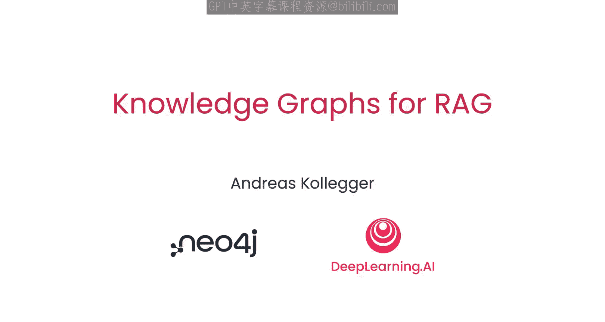
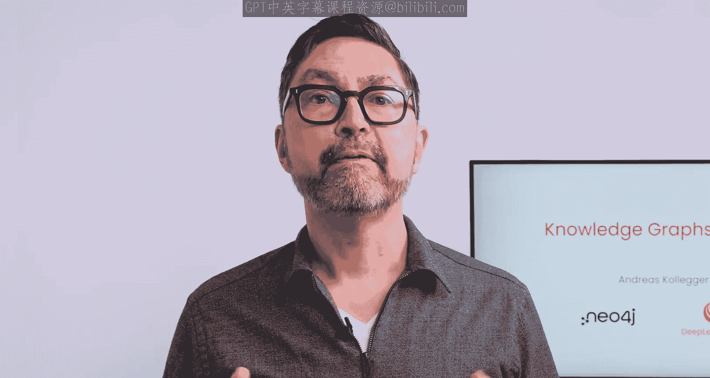

# 001：引言 🚀

在本课程中，我们将学习如何利用知识图谱来增强检索增强生成（RAG）应用。知识图谱是一种强大的工具，它能通过强调事物间的关系来组织和存储数据，从而提升信息检索的准确性和上下文相关性。

---

## 什么是知识图谱？🧠

上一节我们介绍了课程目标，本节中我们来看看知识图谱的基本概念。

知识图谱提供了一种存储和组织数据的方式，其核心在于强调事物之间的关系。与传统的关系型数据库（将数据组织成带行和列的表）不同，知识图谱采用基于图的结构。这种结构包含：
*   **节点**：代表事物或实体，例如人或公司。
*   **边**：代表这些实体之间的连接或关系，例如雇主与雇员的关系。

因此，当你听到“节点”时，可以将其理解为事物或实体；当你听到“边”时，可以将其理解为事物之间的关系。

图谱中的每个节点或边还可以存储额外的信息：
*   对于节点，可以存储实体的详细信息，例如一个人的姓名、邮箱等。
*   对于边，可以存储关系的详细信息，例如雇佣关系中的职位、入职日期等。

节点和关系的图结构非常灵活，相比关系型数据库，它能更方便地对现实世界的某些部分进行建模。

---

## 知识图谱的优势 ⚡

了解了基本结构后，我们来看看知识图谱的优势所在。

知识图谱使得表示和搜索深层关系变得更加容易，因为关系本身就是数据库的一个组成部分，而不仅仅是两个表之间共享的键。这使得查询执行速度更快，能更高效地定位所需数据。

正因如此，提供产品搜索功能的网络搜索引擎和电子商务网站都将知识图谱视为提供相关搜索结果的关键技术。事实上，当你在谷歌或必应上搜索某位名人时，侧边栏返回的卡片信息，就是通过知识图谱检索得到的。

---

## 知识图谱与RAG的结合 🤖

我们已经看到了知识图谱在搜索中的威力，那么它如何与RAG结合呢？

当你将知识图谱与嵌入模型结合时，就拥有了一个非常强大的工具，可用于与大语言模型（LLM）一起执行检索增强生成（RAG）。

这是因为你可以利用图谱中存储的关系和元数据，来提高检索文本的相关性，从而传递给语言模型。在一个基础的RAG系统中，你想要查询或对话的文档首先会被分割成更小的片段或块，然后使用嵌入模型将这些文本块转换为向量。转换成向量形式后，你可以使用余弦相似度等相似性函数来搜索文本块，以找到与你的提示相关的部分。

但事实证明，将这些文本块存储在知识图谱中，为你从文档中检索相关数据开辟了新的途径。你不仅可以进行基于文本嵌入的相似性搜索，还可以检索一个文本块，然后遍历图谱以找到其他相关的文本块，从而为你的LLM提供更完整的上下文。在本课程中，你将看到这种方法如何揭示基于相似性的RAG可能遗漏的文本源之间的连接。

---

## 课程实践项目与目标 📈

理论部分已经介绍完毕，接下来我们将进入实践环节，看看本课程具体要构建什么。

在本课程中，你将学习如何构建一个知识图谱，来表示公司需要向美国证券交易委员会（SEC）提交的一系列财务表格。SEC是一个负责监管市场、保护投资者的美国政府机构。

以下是本课程的学习路径：
1.  **知识图谱入门**：你将学习知识图谱的基础知识，并了解如何使用Neo4j的查询语言Cypher来探索和修改一个有趣的电影数据图。
2.  **结合嵌入模型**：你将看到如何将Neo4j与文本嵌入模型结合使用，在知识图谱中为文本字段创建向量表示。
3.  **构建第一个图谱**：你将构建一个知识图谱来表示一组SEC表格，并使用LangChain通过从该图谱中检索文本来执行RAG。
4.  **连接多个图谱**：你将再次为第二组SEC表格构建知识图谱，使用一些链接数据将两个图连接起来，并学习如何使用更复杂的图查询来跨多组文档执行检索。

所有这些步骤结合在一起，将使你能够对SEC数据提出一些非常有趣的问题。

---

## 总结 🎯

本节课中我们一起学习了知识图谱的核心概念及其在RAG中的应用价值。我们了解到，知识图谱通过节点和边来结构化地表示实体及其关系，这种结构在表示复杂关系和高效查询方面具有优势。当与嵌入模型结合时，知识图谱能超越传统的相似性搜索，通过关系遍历为LLM提供更丰富、关联性更强的上下文，从而显著提升RAG系统的效果。在接下来的课程中，我们将动手实践，一步步构建属于我们自己的知识图谱RAG系统。