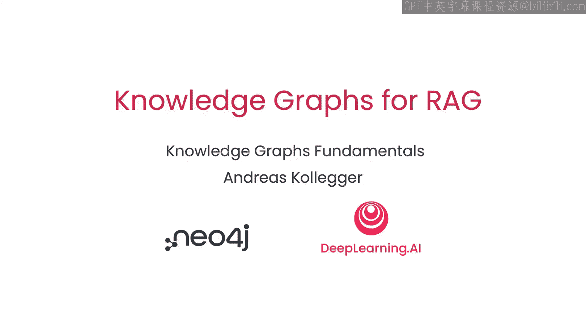
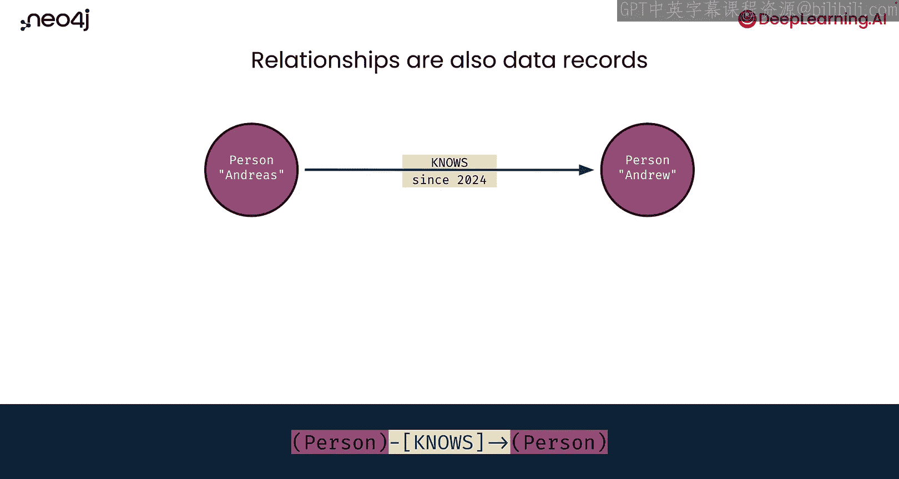
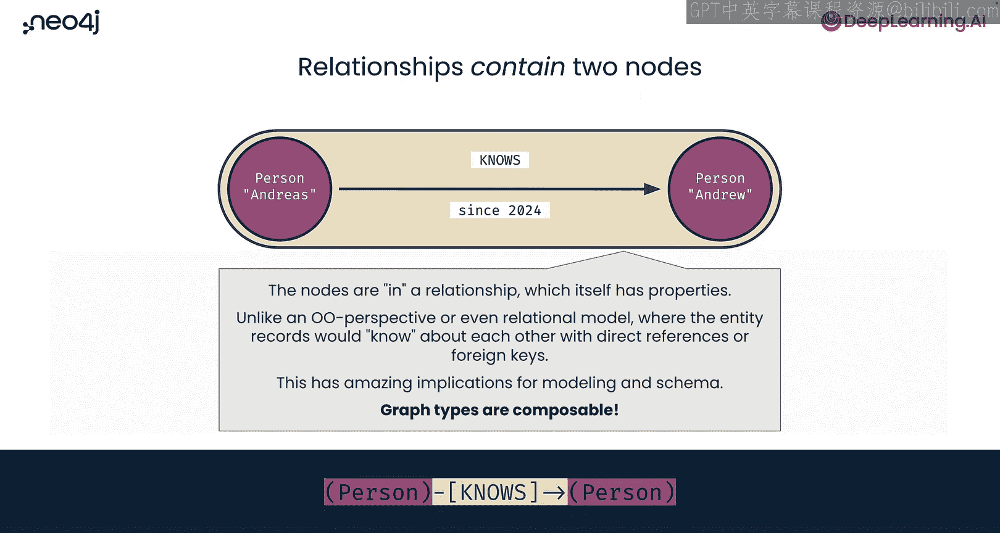
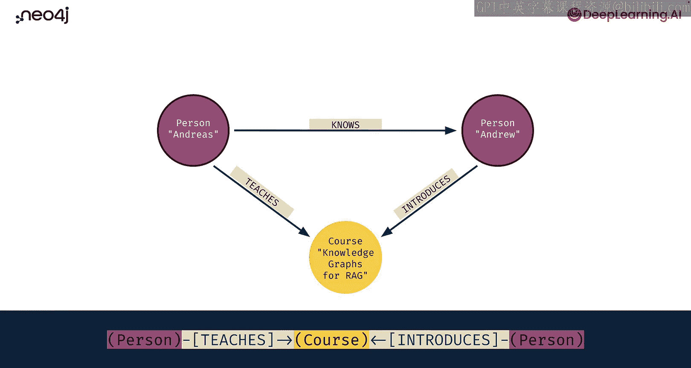
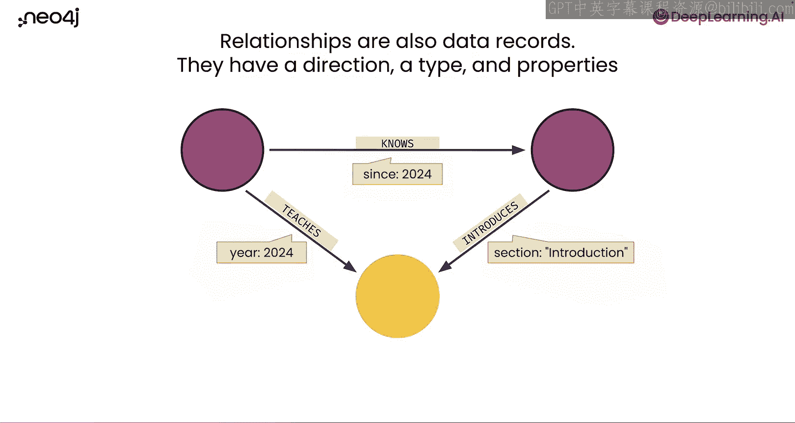
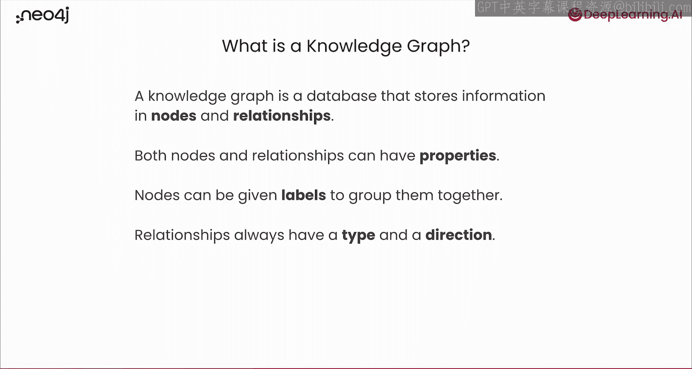

# 002：知识图谱基础 🔍

在本节课中，我们将要学习知识图谱的基础概念。我们将了解知识图谱如何作为一种数据结构，通过节点和节点之间的关系来存储信息。

## 概述

知识图谱是一种将信息存储在节点及其关系中的数据结构。本节我们将深入探讨节点、关系、标签和属性等核心概念，并通过一个简单的例子来理解数据模式是如何在图中形成的。

## 节点与关系

上一节我们介绍了知识图谱的基本思想。本节中，我们来看看构成图谱的两个基本元素：节点和关系。

节点是数据记录。我们可以通过绘制一个非常小的图来开始探索其在知识图谱中的含义。这里我们有一个只包含一个“事物”的图：一个名叫Andreas的人。

在文本表示中，我们使用括号`()`来表示一个节点。例如，`(Person)`表示这里有一个“人”节点。

现在，让我们添加另一个节点。我们有了这个人Andreas，以及另一个名叫Andrew的人。在文本表示中，我们同样使用括号：`(Person), (Person)`。现在我们有了一个数据模式：一个包含人的图。

当然，要构成一个完整的图，我们不仅需要“事物”，还需要这些“事物”之间的关系。这些关系也是数据记录。我们有一个“人”Andreas，一个“人”Andrew，以及一个“Andreas认识Andrew”的关系，并且这个“认识”关系始于2024年。

在文本表示中，节点用括号`()`表示，关系则用箭头`-->`表示，并带有类型。模式现在不仅仅是“人，人”，而是“人 -[认识]-> 人”。

如果你还记得计算机科学或数学中的图论知识，节点通常也被称为“顶点”，而我们数据结构中的关系可能被称为“边”。这些是不同的术语，但描述的是完全相同的概念。

## 关系的本质

作为数据结构，我们使用“关系”这个词而非“边”的原因是，关系本质上是一对节点以及关于这对节点的信息。你可以认为关系实际上包含了两个节点。例如，这里有一个关系包含了Andreas，并且方向性地也包含了Andrew。

## 扩展我们的图

为了稍微扩展我们的小图，我们引入一个新节点：课程“Knowledge Graphs for RAG”。

我们知道“人”Andreas“教授”这门课程。因此，我们有了两种新节点之间的新数据模式：我们已有的人节点和这个新的课程节点。

Andrew也与这门课程有关系：Andrew“介绍”了这门课程。因此，我们同时拥有了人与人之间、以及人与课程之间的关系。

如果你看底部的文本表示，这会变成一个稍长的数据模式。但你可以仔细阅读它：有一个人从左到右“教授”一门课程；另一方面，从外向内读，有一个人“介绍”那门课程。将所有内容放在一行中，你会有从左到右的方向，也有从右到左的方向，意味着课程在中间。

这里有一个关于如何在知识图谱中进行数据建模的有趣旁注：你可以说Andreas这个人是一位“教师”，Andrew这个人是一位“介绍者”。但我们并不真的需要在人本身添加这些额外的标签，因为Andreas“教授”课程，所以他是一位教师；Andrew“介绍”课程，所以他是一位介绍者。因此，你不需要给实体（即事物或人）本身添加额外的标签，只需使用关系来进一步限定这些人在图中的角色是什么。

## 节点与关系的属性

现在，我们正式介绍节点的标签。我们已经引入了“人”和“课程”的概念，在知识图谱中我们称这些为节点的“标签”。标签是一种将多个节点分组在一起的方式。例如，对于所有是人的节点，我们赋予“Person”标签；对于所有是课程的节点，我们赋予“Course”标签。

节点作为数据记录，当然也有值，这些值就是“属性”。属性是以键值对的形式存储在节点内部的。我们知道“人”Andreas有一个名为`name`的属性，其值是`Andreas`。同样，Andrew有一个`name`属性，值是`Andrew`。对于课程，它有一个`title`属性，值是`Knowledge Graphs for RAG`。

因为关系也是数据记录，它们具有方向、类型和属性。我们意识到我们有“认识”、“教授”和“介绍”这些关系。对于每一个关系，我们都可以通过添加属性来附加额外信息。例如，“认识”关系有一个`since`属性，值为`2024`；“教授”关系也有一个`year`属性，值为`2024`；“介绍”关系则有一个`for`属性，说明介绍了课程的哪个部分。

以下是节点和关系属性的总结：

*   **节点属性示例**：
    *   `(Person {name: ‘Andreas’})`
    *   `(Person {name: ‘Andrew’})`
    *   `(Course {title: ‘Knowledge Graphs for RAG’})`
*   **关系属性示例**：
    *   `-[:KNOWS {since: 2024}]->`
    *   `-[:TEACHES {year: 2024}]->`
    *   `-[:INTRODUCES {for: ‘Section 2’}]->`

## 知识图谱的定义

那么，什么是知识图谱？

知识图谱是一种将信息存储在节点和关系中的数据库。节点和关系都可以拥有属性（键值对）。节点可以被赋予标签以帮助对它们进行分组。关系总是具有类型和方向。

现在你对知识图谱是什么有了一些概念，并且开始对描述图结构的模式有了一些直觉。

## 总结

本节课中，我们一起学习了知识图谱的基础构成。我们明确了**节点**是代表实体的数据记录，**关系**是连接节点并带有方向的数据记录。节点可以拥有**标签**进行分类，以及**属性**来存储详细信息。关系则拥有**类型**和**属性**。这些元素共同构成了知识图谱的结构化数据模式。

接下来，让我们在代码中应用这些概念，使用一个真实的电影数据图。为此，你将使用一种名为Cypher的查询语言。请加入下一课来尝试一下。