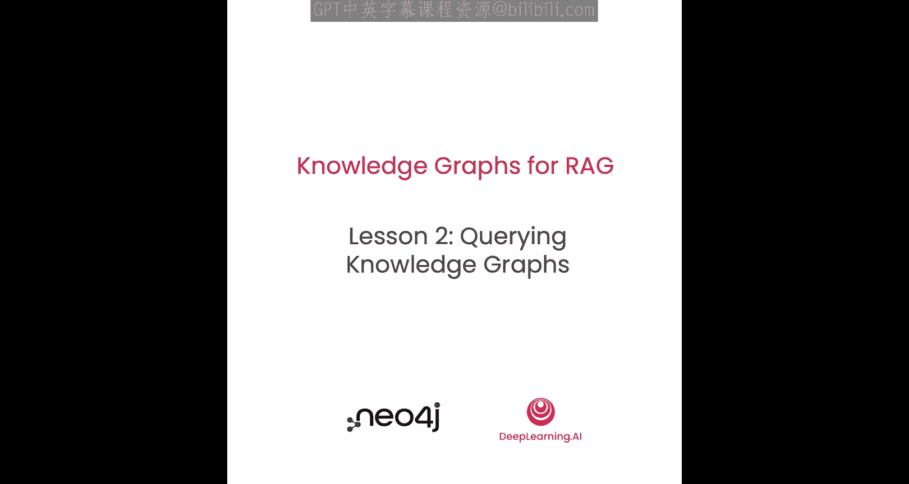
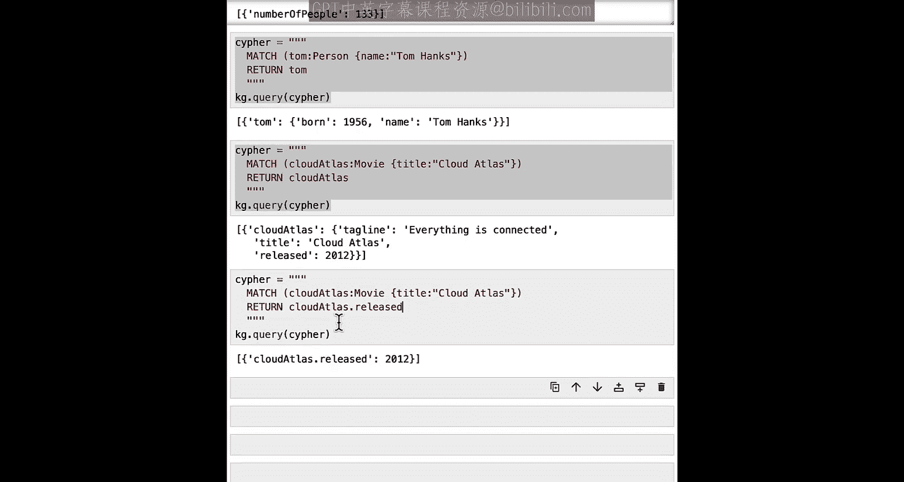
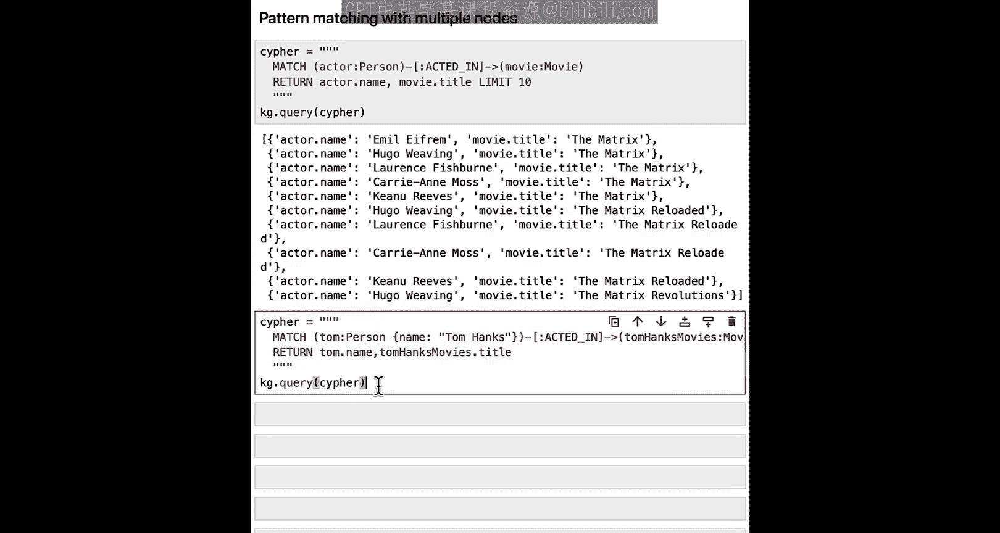
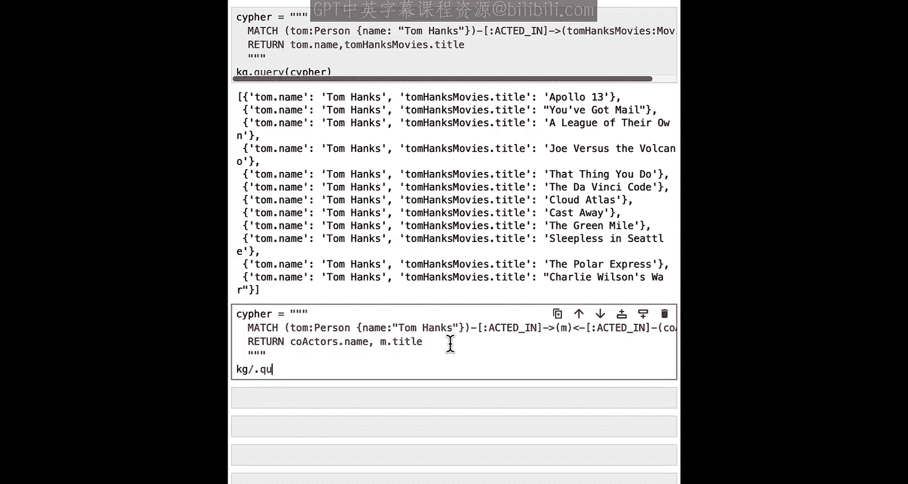
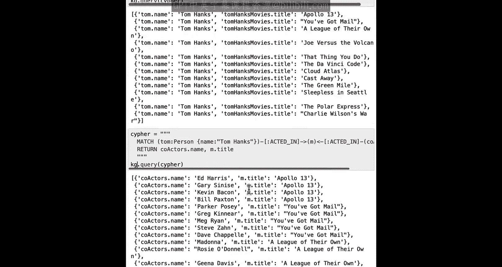
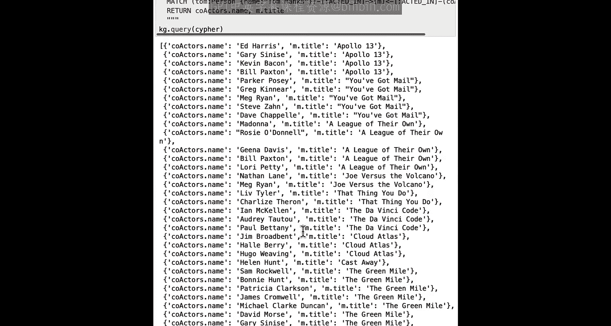
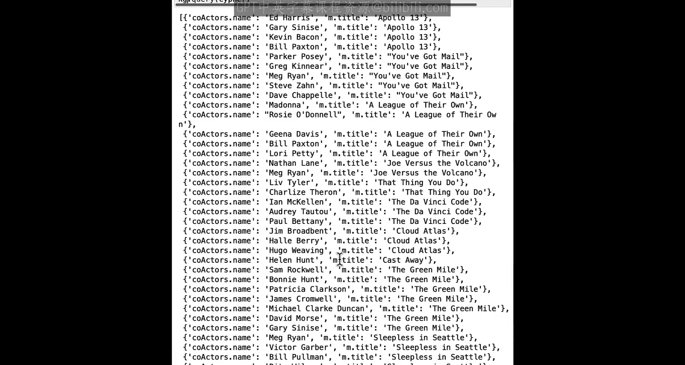
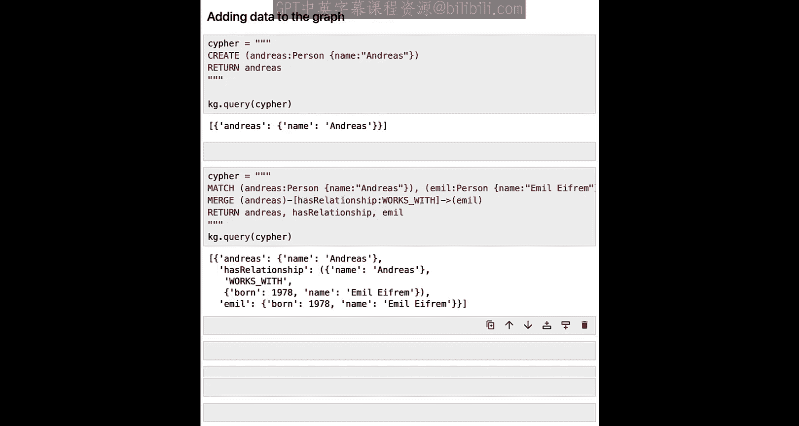

# 003：使用Cypher查询知识图谱 🧠




在本节课中，我们将学习如何使用Cypher查询语言与一个包含演员和电影数据的知识图谱进行交互。我们将从基础查询开始，逐步探索更复杂的图模式匹配、条件筛选、数据修改等操作。

## 概述与环境设置

上一节我们介绍了知识图谱的基本概念。本节中，我们来看看如何通过代码与一个具体的知识图谱进行交互。

首先，我们需要导入必要的Python包并设置Neo4j数据库的连接环境。

```python
import os
from langchain_community.graphs import Neo4jGraph

# 设置环境变量
os.environ["NEO4J_URI"] = "bolt://localhost:7687"
os.environ["NEO4J_USERNAME"] = "neo4j"
os.environ["NEO4J_PASSWORD"] = "password"
os.environ["NEO4J_DATABASE"] = "neo4j"

# 创建Neo4j图实例
kg = Neo4jGraph(
    url=os.environ["NEO4J_URI"],
    username=os.environ["NEO4J_USERNAME"],
    password=os.environ["NEO4J_PASSWORD"],
    database=os.environ["NEO4J_DATABASE"]
)
```

## 了解数据图谱结构

在开始查询之前，我们需要了解这个知识图谱的结构。图谱包含两种主要节点：`Person`（人物）和`Movie`（电影）。它们之间存在多种关系。

以下是节点和关系的说明：

*   **Person节点属性**：`name`（姓名），`born`（出生年份）。
*   **Movie节点属性**：`title`（标题），`tagline`（宣传语），`released`（上映年份）。
*   **人物与电影的关系**：`ACTED_IN`（出演），`DIRECTED`（导演），`WROTE`（编剧），`PRODUCED`（制片），`REVIEWED`（评论）。
*   **人物之间的关系**：`FOLLOWS`（关注）。例如，某人关注了某位影评人。

节点的“角色”（如演员、导演）由其与电影的关系决定，而非节点本身的标签。

## 基础Cypher查询

Cypher是Neo4j的图查询语言，使用模式匹配来查找图中的数据。一个基本查询由`MATCH`（匹配模式）和`RETURN`（返回结果）子句构成。

### 查询所有节点数量

让我们从最简单的查询开始：统计图谱中所有节点的数量。

```python
cypher = """
MATCH (n)
RETURN count(n) AS number_of_nodes
"""
result = kg.query(cypher)
print(result)
# 输出: [{'number_of_nodes': 171}]
```

这个查询匹配了图中所有节点（`(n)`），并返回其计数。结果显示该图谱共有171个节点。

### 查询特定类型的节点

我们通常只关心特定类型的节点，例如所有电影。这可以通过在节点模式中添加标签来实现。

以下是查询电影数量的方法：

```python
cypher = """
MATCH (m:Movie)
RETURN count(m) AS number_of_movies
"""
result = kg.query(cypher)
print(result)
# 输出: [{'number_of_movies': 38}]
```

查询表明图中有38部电影。我们可以用同样的方法查询人物数量。

```python
cypher = """
MATCH (p:Person)
RETURN count(p) AS number_of_people
"""
result = kg.query(cypher)
print(result)
# 输出: [{'number_of_people': 133}]
```

## 条件查询与属性匹配

### 精确匹配查询

如果我们想查找特定的节点，可以在`MATCH`子句中使用花括号`{}`来指定属性的精确值。

例如，查找演员“Tom Hanks”：

```python
cypher = """
MATCH (tom:Person {name: 'Tom Hanks'})
RETURN tom
"""
result = kg.query(cypher)
print(result)
# 输出Tom Hanks节点的所有属性
```

同样，我们可以查找电影“Cloud Atlas”：

```python
cypher = """
MATCH (movie:Movie {title: 'Cloud Atlas'})
RETURN movie
"""
result = kg.query(cypher)
print(result)
```

### 返回特定属性

我们不必返回整个节点，可以只返回感兴趣的属性。

例如，只返回电影“Cloud Atlas”的上映年份和宣传语：

```python
cypher = """
MATCH (movie:Movie {title: 'Cloud Atlas'})
RETURN movie.released, movie.tagline
"""
result = kg.query(cypher)
print(result)
# 输出: [{'movie.released': 2012, 'movie.tagline': 'Everything is connected'}]
```

### 范围查询

当不知道精确值时，可以使用`WHERE`子句进行条件匹配，例如范围查询。



查找所有90年代（1990年至1999年）上映的电影：

```python
cypher = """
MATCH (m:Movie)
WHERE m.released > 1990 AND m.released < 2000
RETURN m.title
"""
result = kg.query(cypher)
print(result)
# 输出90年代电影标题列表
```

## 查询节点间的关系

知识图谱的核心价值在于关系。现在我们来查询更“图”化的模式。

### 查询演员及其出演的电影

基本的图模式是“人物-出演-电影”。以下查询返回演员姓名和他们出演的电影标题，并限制为前10条结果。

```python
cypher = """
MATCH (actor:Person)-[:ACTED_IN]->(movie:Movie)
RETURN actor.name, movie.title
LIMIT 10
"""
result = kg.query(cypher)
print(result)
```

### 查询特定演员的电影

我们可以结合条件查询，查找特定演员（如Tom Hanks）出演的所有电影。

```python
cypher = """
MATCH (tom:Person {name: 'Tom Hanks'})-[:ACTED_IN]->(movie:Movie)
RETURN tom.name, movie.title
"""
result = kg.query(cypher)
print(result)
```

### 查询共同出演的演员



图查询的强大之处在于可以轻松扩展模式。例如，查找与Tom Hanks共同出演过电影的所有演员。

```python
cypher = """
MATCH (tom:Person {name: 'Tom Hanks'})-[:ACTED_IN]->(movie:Movie)<-[:ACTED_IN]-(coactor:Person)
RETURN coactor.name AS co_actor_name, movie.title AS movie_title
"""
result = kg.query(cypher)
print(result)
```
这个查询匹配了这样的模式：Tom Hanks出演了一部电影，同时另一位演员（coactor）也出演了同一部电影。

## 修改图谱数据

除了查询，Cypher也可以用于修改图谱数据，包括删除和创建。

### 删除关系





假设我们发现人物“Emil Eifrem”（Neo4j创始人）被错误地标记为出演了电影《黑客帝国》。我们可以删除这条`ACTED_IN`关系。





首先，确认这条关系存在：

```python
cypher = """
MATCH (emil:Person {name: 'Emil Eifrem'})-[:ACTED_IN]->(movie:Movie)
RETURN emil.name, movie.title
"""
result = kg.query(cypher)
print(result)
```

然后，使用`DELETE`子句删除该关系：

```python
cypher = """
MATCH (emil:Person {name: 'Emil Eifrem'})-[r:ACTED_IN]->(movie:Movie)
DELETE r
"""
# 执行删除操作，不返回结果
kg.query(cypher)
```
再次运行查询确认关系已被删除。

### 创建节点

使用`CREATE`子句可以向图谱中添加新节点。

例如，创建一个代表自己的新人物节点：

```python
cypher = """
CREATE (andreas:Person {name: 'Andreas'})
RETURN andreas
"""
result = kg.query(cypher)
print(result)
```

### 创建关系

创建关系需要先匹配到要连接的两个节点，然后使用`MERGE`或`CREATE`来建立关系。`MERGE`会检查关系是否已存在，避免重复创建。

在“Andreas”和“Emil Eifrem”之间创建一个`WORKS_WITH`关系：

```python
cypher = """
MATCH (andreas:Person {name: 'Andreas'})
MATCH (emil:Person {name: 'Emil Eifrem'})
MERGE (andreas)-[:WORKS_WITH]->(emil)
RETURN andreas, emil
"""
result = kg.query(cypher)
print(result)
```

## 总结

本节课中我们一起学习了使用Cypher查询语言与知识图谱交互的核心技能。我们从统计节点数量等简单查询开始，逐步掌握了按标签和属性筛选节点、进行范围查询等操作。接着，我们探索了知识图谱的核心——关系查询，学会了如何查找演员的电影以及共同出演者。最后，我们还实践了如何使用`DELETE`、`CREATE`和`MERGE`子句来删除关系和创建新的节点与关系，从而修改图谱数据。



这些操作是构建基于知识图谱的检索增强生成（RAG）应用的基础。在下一节课中，我们将学习如何将图谱中的文本字段转化为向量嵌入，并将其添加到图谱中，以实现向量相似性搜索。