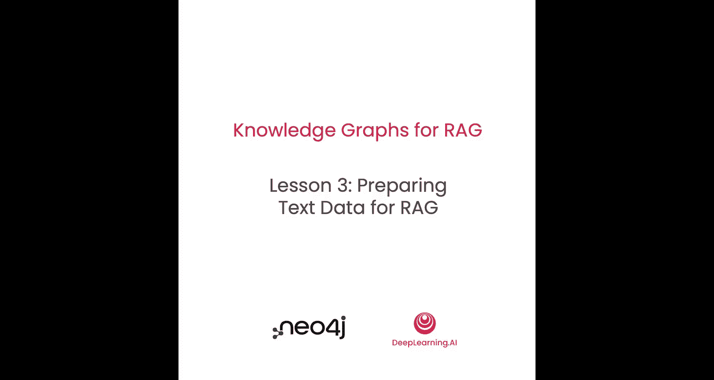
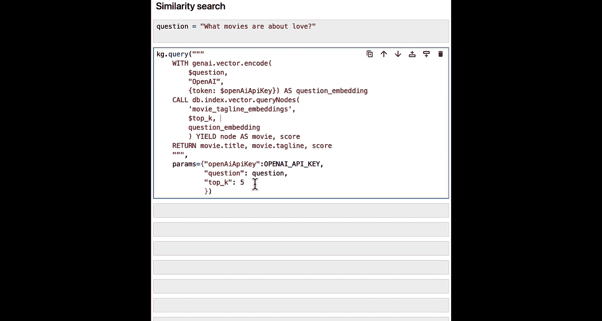
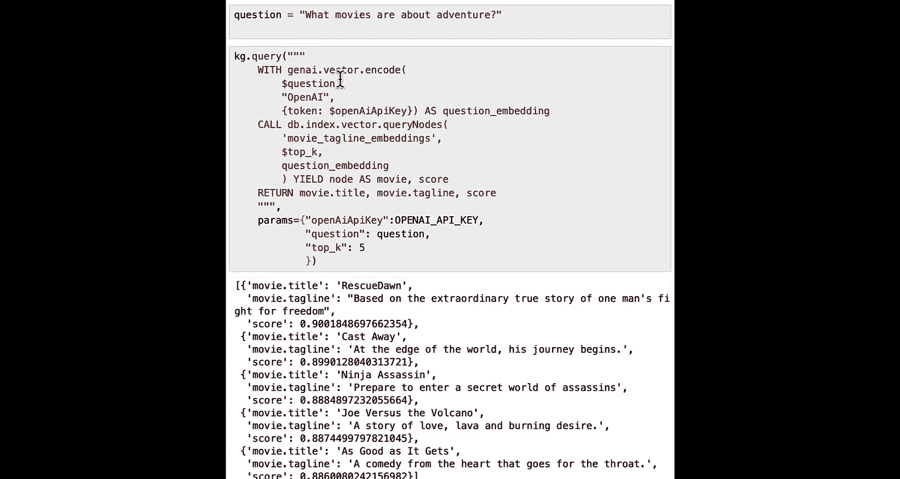

# 004：为RAG准备文本




在本节课中，我们将学习如何为知识图谱中的文本字段创建向量嵌入，以便在RAG系统中实现基于向量的相似性搜索。我们将从设置环境开始，逐步完成创建向量索引、生成文本嵌入以及执行向量搜索查询的完整流程。


RAG系统通常从使用文本的向量表示开始，将用户的提示与非结构化数据中的相关部分进行匹配。


为了能够以同样的方式在知识图谱中找到相关文本，你需要为图谱中的文本字段创建嵌入。让我们看看如何做到这一点。

## 环境设置与导入

首先，你需要导入一些必要的包，就像我们在上一个笔记本中所做的那样。我们还将设置Neo4j连接。

你将加载与上一个笔记本相同的环境变量，但现在包括一个名为`OPENAI_API_KEY`的新变量，我们将用它来调用OpenAI的嵌入模型。

最后，和之前一样，我们将使用`Neo4jGraph`类来创建与知识图谱的连接，以便我们可以向其发送查询。

以下是设置步骤的代码：

```python
# 导入必要的包
import os
from neo4j import GraphDatabase
from langchain.graphs import Neo4jGraph

# 设置环境变量（示例，实际应从安全位置加载）
os.environ["NEO4J_URI"] = "bolt://localhost:7687"
os.environ["NEO4J_USERNAME"] = "neo4j"
os.environ["NEO4J_PASSWORD"] = "password"
os.environ["OPENAI_API_KEY"] = "your-openai-api-key-here"

# 创建Neo4j图连接
graph = Neo4jGraph(
    url=os.environ["NEO4J_URI"],
    username=os.environ["NEO4J_USERNAME"],
    password=os.environ["NEO4j_PASSWORD"]
)
```

## 创建向量索引 🏗️

上一节我们建立了与知识图谱的连接。本节中，我们来看看启用向量搜索的第一步：创建向量索引。

在以下代码的第一行，我们正在创建一个向量索引。我们将其命名为`movie_tagline_embeddings`，并指定仅当该索引不存在时才创建它。

我们将为标签为`Movie`的节点（我们称之为`m`）创建索引，并针对这些节点的`tagline`属性创建和存储嵌入。

在设置索引时，我们还可以通过`index_config`对象传递一些选项。有两个重要的参数：向量本身的维度大小，这里设置为1536（这是OpenAI嵌入模型的默认大小）；以及相似性函数，OpenAI推荐使用余弦相似度，因此我们在这里指定。

```cypher
// 创建向量索引
CREATE VECTOR INDEX movie_tagline_embeddings IF NOT EXISTS
FOR (m:Movie) ON (m.tagline)
OPTIONS {indexConfig: {
  `vector.dimensions`: 1536,
  `vector.similarity_function`: 'cosine'
}}
```

现在，为了验证索引是否已创建，你可以让Neo4j显示所有的向量索引。

这个Cypher查询简单直接，如下所示：

```cypher
// 显示所有向量索引
SHOW VECTOR INDEXES
```

查询结果可能如下所示。我们可以看到我们之前指定的名称，索引已准备就绪，并且它是一个向量索引。

## 为索引填充数据 📥

现在你已经有了一个向量索引，接下来需要用数据填充它。我们将通过一个三步查询来完成。

以下是填充数据的步骤：

1.  首先，使用熟悉的`MATCH`子句匹配所有标签为`Movie`且`tagline`属性不为空的电影节点。
2.  接着，为每部电影的`tagline`计算一个嵌入向量。这是通过调用`genai.vector.encode()`函数完成的。在这个函数中，我们需要传入几个参数：要编码的值（即`m.tagline`）、要使用的嵌入模型（`openai`），以及包含OpenAI API密钥的配置。
3.  最后，执行查询。

这里使用的`$openaiApiKey`是一种查询参数，它可以在Cypher语句中替代硬编码的值。在执行查询时，我们会传入一个参数字典来提供这个值。

```cypher
// 为所有电影的tagline生成嵌入并填充索引
MATCH (m:Movie) WHERE m.tagline IS NOT NULL
WITH m, genai.vector.encode(
  m.tagline,
  "openai",
  {
    token: $openaiApiKey
  }
) AS embedding
CALL db.create.setNodeVectorProperty(m, 'taglineEmbedding', embedding)
RETURN count(m)
```

运行此查询可能需要几秒钟，因为它会调用OpenAI API为数据集中的每部电影计算向量嵌入。

## 验证生成的嵌入 ✅

现在，你可以查看标签行以及计算出的文本嵌入，以了解我们运行的查询产生了什么结果。

让我们从结果中提取出标签行本身，看看它是什么。由于我们只处理了一部有标签行的电影，它的标签行是“Welcome to the real world. Super.”。

我们也可以看看嵌入向量的样子。为了简洁，我们只查看前10个值。

最后，为了验证我们得到的嵌入向量大小是否正确（我们期望是1536维），我们将计算其长度。

以下是验证步骤的代码示例：

```python
# 假设 `result` 是上面查询返回的结果
# 获取第一个结果的tagline和嵌入向量
movie_data = result[0]
tagline = movie_data['m.tagline']
embedding = movie_data['embedding']

print(f"Tagline: {tagline}")
print(f"First 10 values of embedding: {embedding[:10]}")
print(f"Vector size (length): {len(embedding)}")
```

输出应显示向量大小为1536，符合预期。

我们只查看了一部具有标签行和标签行嵌入的电影，但我们之前运行的查询为数据库中的每部电影都计算了嵌入。因此，我们现在可以实际查询数据库，对这些电影进行向量相似性搜索。

## 执行向量相似性搜索 🔍

上一节我们验证了生成的嵌入向量。本节中，我们来看看如何使用这些嵌入进行搜索。

我们将从指定想要提问的问题开始，并寻找可能匹配该问题的相似电影。例如，问题是：“有哪些关于爱情的电影？” 请记住，我们是在`tagline`上做的向量索引，因此这将针对那些标签行进行相似性搜索。

以下是执行搜索的步骤：

1.  首先，使用之前相同的函数调用`genai.vector.encode`来计算问题的嵌入向量。我们需要传入问题文本、使用`openai`模型，并传递API密钥。这个函数调用的结果我们将赋值给一个叫做`questionEmbedding`的变量。
2.  接着，调用另一个函数`db.index.vector.queryNodes`来实际执行向量相似性搜索。我们要查询之前创建的名为`movie_tagline_embeddings`的索引。这里有一个有趣的参数`topK`，它表示我们只想要最相似的K个结果，而不是返回所有结果。
3.  然后，传入我们刚刚计算出的`questionEmbedding`。相似性搜索会说：“在这个所有标签行的索引中，这是我们为问题计算的嵌入向量，请进行相似性计算并返回结果。”
4.  最后，从结果中，我们希望能够获取找到的节点（将其重命名为`movie`）以及相似性分数。我们将返回电影的标题、标签行和分数。

我们传入了一些查询参数：OpenAI API密钥本身、我们提出的问题（这将被计算成嵌入向量），以及`topK`值（这里设为5，表示我们只想要最相似的5个结果）。

```cypher
// 执行向量相似性搜索
WITH genai.vector.encode(
  $question,
  "openai",
  {
    token: $openaiApiKey
  }
) AS questionEmbedding
CALL db.index.vector.queryNodes(
  'movie_tagline_embeddings',
  $topK,
  questionEmbedding
) YIELD node AS movie, score
RETURN movie.title AS title, movie.tagline AS tagline, score
```

运行此查询后，我们得到了像《Joe Versus the Volcano》这样的电影标题，其标签行是“A story of love, lava, and burning desire.”。浏览所有这些标签行，可以发现它们与“关于爱情的电影”这个问题匹配得相当好。



## 探索与实验 🧪

既然我们已经构建了一个可以执行向量相似性搜索的查询，并且提出了一个问题，那么现在是探索电影数据集的好时机，可以通过询问关于其他电影可能存在的不同问题来进行。

例如，让我们尝试搜索关于冒险的电影。

我们将保存这个问题，并再次运行查询。

```python
# 更改问题并重新运行查询
new_question = "What movies are about adventure?"
# ... (使用新问题重新执行上面的Cypher查询)
```

结果可能会包含《Cast Away》、《Ninja Assassin》等电影，听起来像是冒险题材。《Joe Versus the Volcano》也再次出现，它似乎是关于爱情和冒险的，也许值得加入你的观看列表。

这是一个很好的时机，可以暂停视频，尝试自己更改问题来探索电影数据集，询问具有不同特质的电影，看看能得到什么样的结果。

## 总结 📝

本节课中，我们一起学习了如何为知识图谱中的文本创建嵌入向量并将其添加到图谱中，从而为RAG应用启用向量搜索功能。我们涵盖了从创建向量索引、使用外部API（如OpenAI）生成嵌入，到执行向量相似性搜索查询的完整流程。



到目前为止，在所有示例中，你一直在使用一个现有的数据库。但是，要构建你自己的RAG应用程序，你需要从头开始构建一个知识图谱来表示和存储你的数据。在下一课中，让我们来看看如何做到这一点。