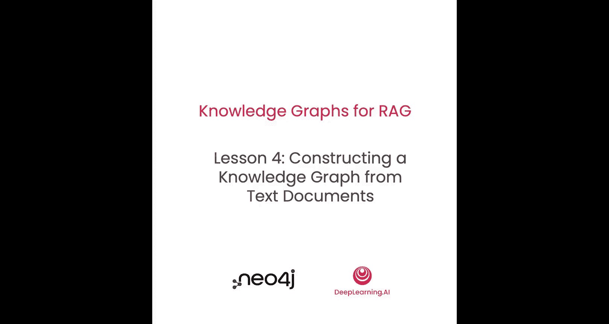
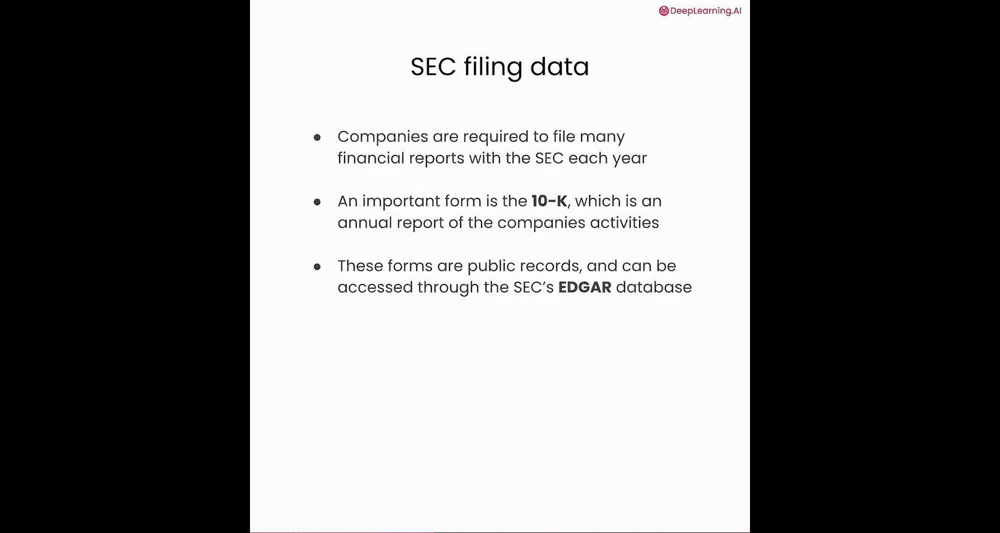
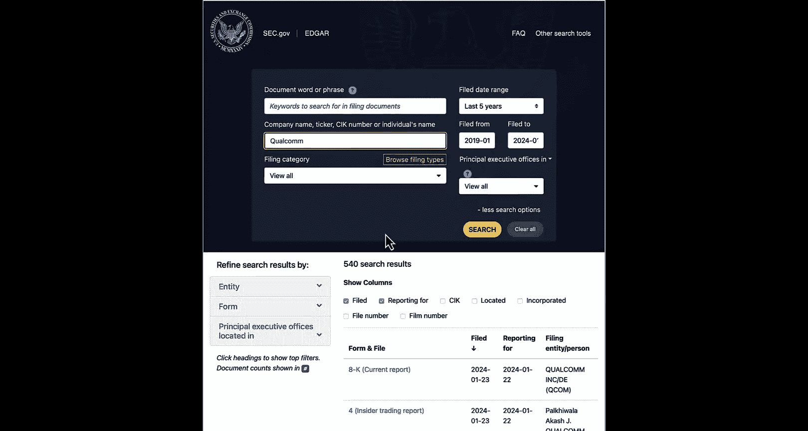
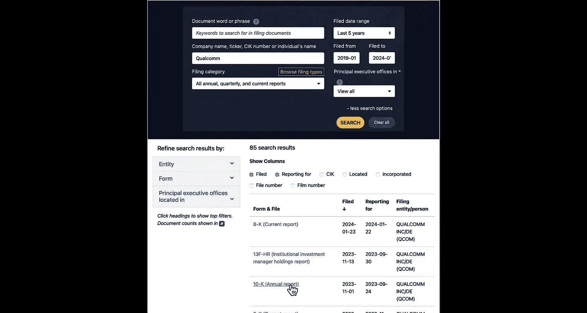
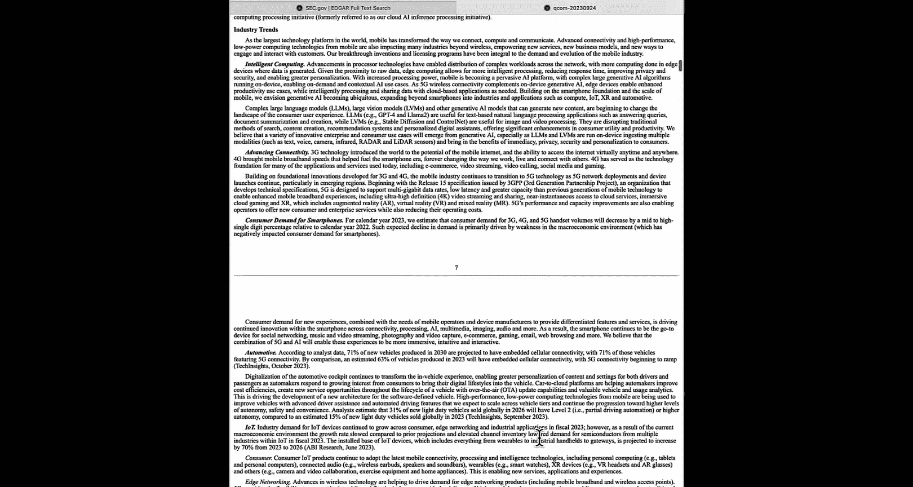
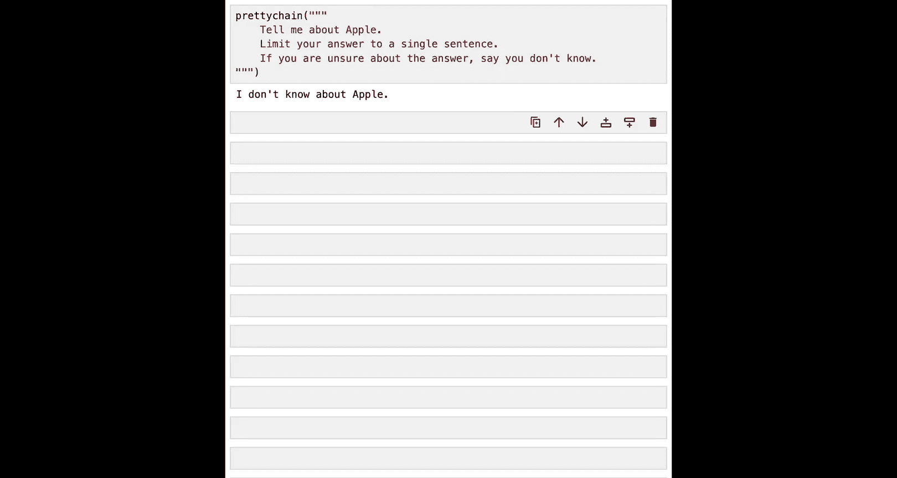

# 005：从文本构建知识图谱 🏗️




在本节课中，我们将运用之前学到的知识，开始为一些公司必须向美国证券交易委员会提交的财务文件构建知识图谱。我们将学习如何解析、处理这些文档，并将其转化为图数据库中的节点，为后续的检索增强生成系统打下基础。



## 财务文档简介 📄



上一节我们介绍了知识图谱的基本概念，本节中我们来看看将要处理的具体数据源。



公司每年需要向SEC提交许多财务报告。其中一份重要的表格是**Form 10-K**，它是公司活动的年度报告。这些表格是公开记录，可以在SEC的EDGAR数据库中访问。



这些文档通常包含大量文本，涵盖行业趋势、技术概述等丰富信息。我们的目标是将这类数据提取到知识图谱中，以便后续与这些财务信息进行交互式问答。

## 数据预处理与提取 🔧

在将数据导入图谱之前，我们需要对原始文件进行解析和清理。下载的Form 10-K文件实际上是XML格式。

以下是处理这些XML文件的主要步骤：

1.  **XML解析与清理**：首先进行基本的正则表达式清理，遍历XML文件以找到我们实际需要的文本块。
2.  **使用Beautiful Soup**：利用这个Python库将部分XML转换为易于操作的Python数据结构。
3.  **提取关键信息**：从中提取关键标识符，例如**CIK**，这是公司在SEC系统中的中央索引键。
4.  **定位核心文本**：我们主要关注Item 1、Item 1A、Item 7和Item 7A这几个部分，它们是文档中我们将要进行对话的大型文本主体。

完成这些工作后，我们将数据转换为JSON格式，以便于导入并开始创建知识图谱。

## 构建图谱的实施计划 📋

在回到Notebook之前，让我们先规划一下实施步骤。

我们了解到每个表格都有不同的文本部分，需要将其分割成块。我们将使用LangChain来完成这个任务。一旦所有文本块准备就绪，每个块都将成为图中的一个节点。节点将包含原始文本以及作为属性的元数据。

节点就位后，我们将创建一个向量索引。在该索引中，我们将计算文本嵌入，为每个文本块填充索引。最后，完成所有这些步骤后，我们将能够进行相似性搜索。

## 代码实现：加载与处理数据 💻

现在，让我们回到Notebook，开始具体的工作。

首先，加载一些有用的Python包，包括LangChain中的一些优秀工具。同时，从环境变量中加载一些全局变量，并设置一些在后续图谱创建过程中要使用的常量。

在本课中，您将处理单个10-K文档。在实践中，您可能有数百或数千个文档。这里采取的步骤需要对所有文档重复执行。

让我们从设置文件名开始，然后加载一个JSON文件。

```python
# 设置要使用的文件名
first_file_name = "path/to/your/10k.json"

# 加载JSON文件
import json
with open(first_file_name, 'r') as f:
    data = json.load(f)
```

我们可以检查一下，确保它看起来像一个正确的字典。然后查看可用的键，这些是Form 10-K中熟悉的字段，如item1、item1A等，以及特殊的标识符、公司名称和原始来源链接。

## 文本分块处理 ✂️

让我们查看item1的文本内容。由于文本量很大，我们只查看前1500个字符。这正是进行分块处理的目的。我们不会将整个文本存储在单个记录中。

我们将使用LangChain的文本分割器来分解它。这里使用**递归字符文本分割器**。

```python
from langchain.text_splitter import RecursiveCharacterTextSplitter

text_splitter = RecursiveCharacterTextSplitter(
    chunk_size=2000,
    chunk_overlap=200
)

item1_text_chunks = text_splitter.split_text(data['item1'])
```

分割完成后，我们可以查看分块列表的长度，例如可能有254个块。最后，查看其中一个块的内容，确认文本格式正确。

## 创建分块辅助函数 ⚙️

准备好文本分割器后，我们可以设置一个辅助函数。该函数将遍历文件中的每个部分，创建文本块，然后将它们全部转换为可用于将数据加载到图谱本身的对象。

以下是该函数的核心逻辑概述：

1.  初始化一个列表来累积创建的所有块。
2.  加载JSON文件。
3.  循环遍历每个部分名称。
4.  对于每个部分，提取文本并使用文本分割器进行分块。
5.  遍历所有文本块，为每个块创建数据记录，包含文本本身、当前处理的条目、块序列ID以及元数据。

```python
def split_form_10k_data_from_file(file_path):
    all_chunks = []
    # ... 加载文件、循环部分、分块、创建记录的代码 ...
    return all_chunks
```

调用这个辅助函数处理文件，输出结果将是一个记录列表，每个记录代表一个块及其元数据。

## 将数据合并到知识图谱中 🗃️

我们将使用Cypher查询将块合并到图谱中。这是一个MERGE语句，它首先尝试匹配，如果匹配失败则创建新节点。

```cypher
MERGE (c:Chunk {chunkId: $chunkParam.chunkId})
ON CREATE SET
    c.text = $chunkParam.text,
    c.item = $chunkParam.item,
    c.formId = $chunkParam.formId,
    ...
```

为了运行此查询，我们需要使用之前保存的数据库位置、用户名、密码等参数来初始化Neo4j集成。然后调用查询方法，传入查询字符串和参数字典。

## 确保数据唯一性与创建索引 🔑

在调用辅助函数创建知识图谱之前，我们需要额外一步以确保不重复数据。我们将创建一个**唯一性约束**，它同时也是一个索引，用于确保所有具有相同标签的节点中，某个属性是唯一的。

```cypher
CREATE CONSTRAINT unique_chunk IF NOT EXISTS
FOR (c:Chunk)
REQUIRE c.chunkId IS UNIQUE
```

运行此查询后，我们可以检查索引，确认新的唯一性约束已创建。

现在，我们准备循环遍历所有块，对每个块运行MERGE查询，并传入相应的参数。完成后，可以运行一个简单的MATCH查询来统计节点数量，验证数据已成功导入。

## 创建向量索引并生成嵌入 🧠

接下来，我们将创建另一个索引，这次是**向量索引**，用于为文本块创建文本嵌入。

```cypher
CREATE VECTOR INDEX `form-10k-chunks` IF NOT EXISTS
FOR (c:Chunk) ON c.textEmbedding
OPTIONS {indexConfig: {
    `vector.dimensions`: 1536,
    `vector.similarity_function`: 'cosine'
}}
```

我们可以检查该索引是否已创建并处于在线状态。然后，使用一个查询来匹配所有块，调用OpenAI获取每个块的嵌入，最后将嵌入设置到每个节点的属性上。这个过程可能需要一些时间。

至此，图谱中包含了带有文本嵌入的文本块节点，但还没有任何关系。

## 实现向量搜索与RAG系统 🔍

现在我们已经有了一个包含带文本嵌入的文本块的知识图谱，可以创建一个辅助函数来使用Neo4j执行向量搜索。这与上一课的做法完全相同。

由于我们处理的表格来自一家名为NetApp的公司，可以尝试使用新的向量搜索辅助函数来询问关于NetApp的信息。

然而，向量搜索只返回相似的文本片段。如果我们想创建一个能提供实际问题答案的聊天机器人，可以使用LangChain构建一个RAG系统。

最简单的方法是使用**Neo4j Vector接口**，这使得Neo4j在底层看起来像一个向量存储。配置指定了几个重要事项，使用了我们在本课开头设置的全局变量。

我们将向量存储转换为检索器，然后使用LangChain框架中的`RetrievalQAWithSourcesChain`，这是一个专门用于问答交互的链。

```python
from langchain.chains import RetrievalQAWithSourcesChain
from langchain_openai import ChatOpenAI

llm = ChatOpenAI(model_name="gpt-3.5-turbo")
chain = RetrievalQAWithSourcesChain.from_chain_type(
    llm=llm,
    chain_type="stuff",
    retriever=vector_store.as_retriever()
)
```

我们还可以创建一个漂亮的辅助函数来格式化问题和答案的显示。

## 进行问答测试与提示工程 💬

完成所有工作后，我们终于可以进行有趣的问答测试了。

既然我们知道图谱中有NetApp的信息，可以问：“NetApp的主要业务是什么？” 系统会返回一个实际的答案，而不仅仅是可能包含答案的原始文本。这正是我们使用LLM的目的。

我们还可以尝试其他问题，例如询问NetApp的总部所在地。

现在有了LLM的参与，我们可以提出各种有趣的问题，甚至可以给LLM一些指令。例如，我们可以要求“用一句话告诉我NetApp的情况”。

为了展示一个有趣的现象，我们可以询问一个听起来与NetApp相似的不同公司，比如“告诉我关于Apple的情况”。LLM可能会产生**幻觉**，给出一个与NetApp描述相似的答案。

我们可以通过**提示工程**来尝试修复这个问题，例如在提示中添加：“如果你不确定答案，请说‘我不知道’。” 这样通常能得到更诚实、更好的回答。

## 总结 📝

在本节课中，我们一起学习了如何从财务文档（Form 10-K）构建知识图谱。我们涵盖了从数据加载、文本分块、创建图谱节点和唯一性约束，到建立向量索引并生成文本嵌入的完整流程。最后，我们利用Neo4j作为向量存储，结合LangChain构建了一个简单的RAG系统，实现了基于文档的智能问答。



然而，本节课我们主要将Neo4j用作向量存储，并未充分发挥其作为知识图谱的优势。在下一节课中，我们将为节点添加关系，为聊天应用注入更强大的图计算能力。