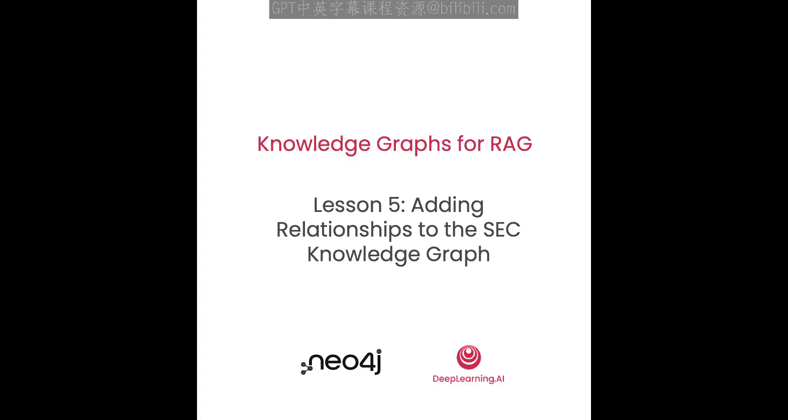
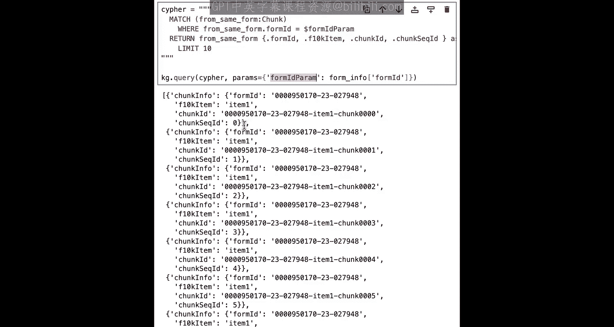
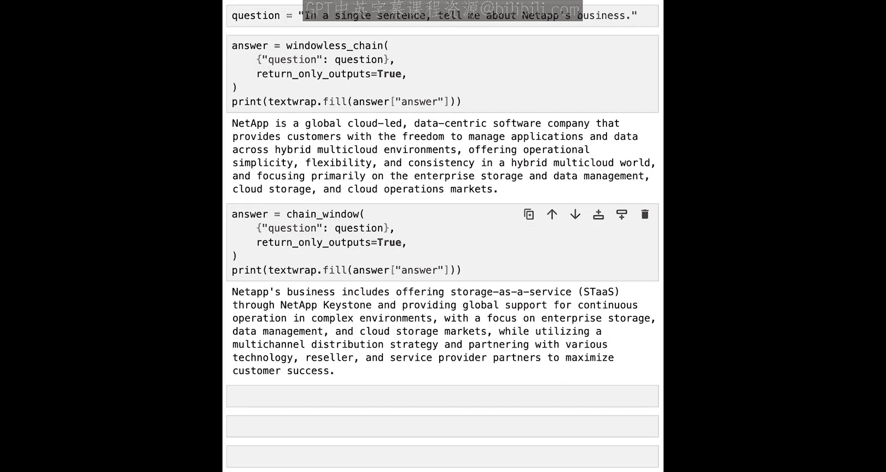

# 006：向知识图谱添加关系




## 概述
在本节课中，我们将学习如何为已构建的知识图谱节点添加关系。这些关系将保留原始文档的结构，从而增强每个文本块（chunk）的上下文信息。我们将连接各个文本块，并将它们链接到代表整个文档的“表单”节点。

## 导入包与设置变量
首先，我们需要导入必要的Python包并设置一些将在本教程中使用的全局变量。

```python
# 导入必要的包
import some_packages

# 设置全局变量
global_variable = "value"
```

对于所有要发送到Neo4j数据库的查询，我们将再次使用LangChain的集成工具`Neo4jGraph`。

## 创建表单节点
你已经有了代表文本块的节点。现在，你需要创建一个新的节点来代表整个10-K表单本身。

这个10-K表单节点将有一个`Form`标签和以下属性：
*   `form_id`：表单的唯一标识符。
*   `source`：指向SEC原始10-K文档的链接。
*   `cik`：SEC的中央索引密钥。
*   `cusip`：CUSIP代码。



以下是创建此节点的参数化Cypher查询：

```cypher
MERGE (f:Form {form_id: $form_info.form_id})
SET f.source = $form_info.source,
    f.cik = $form_info.cik,
    f.cusip = $form_info.cusip
```

我们将运行此查询并检查是否成功创建了一个表单节点。

## 连接节点：创建分块链表
我们的目标是通过添加关系来改善每个文本块的上下文。我们将把文本块彼此连接，并连接到新创建的表单节点，以反映文档的原始结构。

首先，为每个文档部分（section）创建一个节点链表。

以下是查找属于同一表单和同一部分的文本块的查询：

```cypher
MATCH (c:Chunk)
WHERE c.form_id = $form_id AND c.f10k_item = $f10k_item
RETURN c
ORDER BY c.chunk_seq_id ASC
```

为了确保我们按正确的顺序获取所有文本块，我们按`chunk_seq_id`升序排列。查询结果将显示来自同一部分且序列号递增的文本块。

现在，我们将这些文本块收集到一个列表中，并使用`apoc.nodes.link`过程创建链表关系。

```cypher
CALL apoc.nodes.link($section_chunk_list, 'NEXT', {avoidDuplicates: true})
```

此过程将接收一个节点列表和我们想要的关系类型（此处为`NEXT`），并在每对相邻节点之间创建`NEXT`关系。`avoidDuplicates`参数确保我们不会创建重复的关系。

我们可以通过一个Python循环，为所有不同的部分名称执行此操作，从而为每个部分创建链表。

## 连接文本块与表单
接下来，将文本块连接到它们所属的表单。

以下是创建`PART_OF`关系的查询：

```cypher
MATCH (c:Chunk), (f:Form)
WHERE c.form_id = f.form_id
MERGE (c)-[:PART_OF]->(f)
```

此查询匹配具有相同`form_id`的文本块和表单节点，并在它们之间创建`PART_OF`关系。

## 连接表单与各部分起始块
为了便于在知识图谱中导航，我们还可以添加一种关系，将表单直接连接到每个部分的第一个文本块。

以下是创建`SECTION`关系的查询：

```cypher
MATCH (c:Chunk), (f:Form)
WHERE c.form_id = f.form_id AND c.chunk_seq_id = 0
MERGE (f)-[r:SECTION]->(c)
SET r.f10k_item = c.f10k_item
```

此查询匹配表单和每个部分序列号为0（即第一个）的文本块，创建`SECTION`关系，并将部分名称作为关系属性存储。

## 探索图谱：示例查询
现在图谱已构建完成，我们可以尝试一些Cypher查询来探索它。

例如，要获取某个部分的第一个文本块：

```cypher
MATCH (f:Form)-[r:SECTION]->(c:Chunk)
WHERE f.form_id = $target_form_id AND r.f10k_item = $target_section
RETURN c.chunk_id, c.text
```

有了第一个文本块的信息，你可以通过跟随`NEXT`关系来获取该部分的下一个文本块。

## 使用可变长度路径查找文本块窗口
为了在检索时获得更丰富的上下文，我们可能希望找到一个以某个文本块为中心的“窗口”，即它前后相邻的几个文本块。

我们可以使用可变长度路径来实现这一点。以下查询查找以指定`chunk_id`为中心，前后各最多一个文本块的窗口：

```cypher
MATCH path = (c0:Chunk)-[:NEXT*0..1]->(c1:Chunk)-[:NEXT*0..1]->(c2:Chunk)
WHERE c1.chunk_id = $center_chunk_id
RETURN path
ORDER BY length(path) DESC
LIMIT 1
```
*   `[:NEXT*0..1]` 表示匹配0到1个`NEXT`关系。这允许我们处理链表开头或结尾的边界情况。
*   `ORDER BY length(path) DESC LIMIT 1` 确保我们获得匹配的最长路径，即完整的窗口。

## 在RAG中扩展上下文
知识图谱的核心优势在于，一旦在图中找到一个节点（例如通过向量相似性搜索），你就可以轻松获取其相连的信息。

我们可以自定义向量检索查询，在返回结果前，先通过Cypher查询扩展其上下文。以下是一个基础模板：

```cypher
// 1. 执行向量搜索（由Neo4jVector内部处理）
// 假设返回变量为 $node 和 $score

// 2. 使用Cypher扩展上下文（例如，查找相邻文本块）
MATCH window_path = (before:Chunk)-[:NEXT*0..1]->($node)-[:NEXT*0..1]->(after:Chunk)
WITH $node, $score, window_path
// 3. 从窗口中的所有块收集文本
WITH $node, $score, [n IN nodes(window_path) | n.text] AS context_texts
// 4. 拼接文本并返回规定格式
RETURN reduce(text = "", t IN context_texts | text + "\n---\n" + t) AS text,
       $score AS score,
       {chunk_id: $node.chunk_id, source: $node.source} AS metadata
```

在LangChain中创建检索问答链时，我们可以传入这个自定义的`retrieval_query`。

```python
# 创建带有窗口上下文的检索器
vector_store = Neo4jVector.from_existing_index(
    embedding=embeddings,
    index_name="chunk_index",
    retrieval_query=custom_cypher_query # 传入我们的自定义查询
)
qa_chain = RetrievalQA.from_chain_type(llm=llm, retriever=vector_store.as_retriever())
```

通过比较使用默认检索（仅返回单个块）和使用扩展窗口检索的答案，可以看到后者能提供更连贯、包含更多相关细节的上下文，从而帮助大语言模型生成更准确的回答。



## 总结
本节课中，我们一起学习了如何为知识图谱添加关系结构。我们首先创建了代表整个文档的表单节点，然后通过`NEXT`关系将同一部分的文本块连接成链表，并使用`PART_OF`和`SECTION`关系将文本块与表单关联起来。接着，我们探索了如何使用Cypher查询遍历这些关系，特别是利用可变长度路径来查找文本块窗口。最后，我们将这种能力应用于RAG流程，通过自定义检索查询来扩展向量搜索返回的上下文，从而显著提升问答系统的回答质量。在下一课中，我们将引入另一份包含投资者信息的SEC表单，进一步扩展知识图谱的上下文。