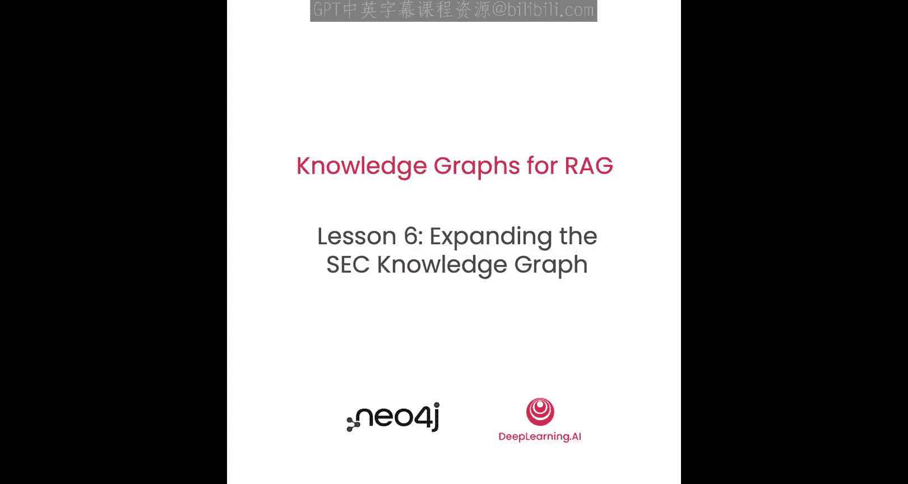
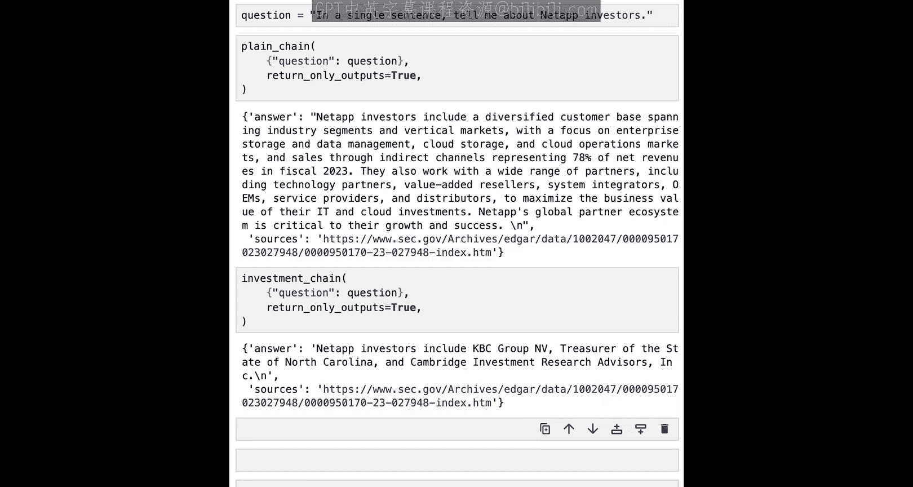

# 007：扩展知识图谱 📈




在本节课中，我们将引入第二个SEC数据集，以扩展原始申报表格的上下文。这个新数据集提供了关于机构投资经理及其在公司中持有权益的信息。通过将这些数据添加到图谱中，你将能够对合并后的数据集提出更复杂的问题，从而帮助你理解市场动态。


## 导入与准备

首先，我们照常导入必要的库，并设置一些全局变量。当然，我们还需要一个Neo4j图实例来连接数据库。

SEC的13F表格由机构投资管理公司提交，用于报告他们投资了哪些上市公司。这些表格以XML文件形式提供。在数据准备阶段，我们从XML中提取特定字段，并将其作为一行添加到CSV文件中。

以下是读取CSV文件的代码：
```python
import csv
with open('form13_data.csv', 'r') as f:
    csv_reader = csv.DictReader(f)
    form13s = list(csv_reader)
```

让我们快速查看前几行数据：
```python
print(form13s[:5])
```

可以看到，这些管理公司都投资了同一家公司（例如NetApp）。每一行都包含关于管理公司本身（如经理姓名、地址、中央索引密钥CIK）以及投资详情（如报告日历、股份数量、价值）的信息。此外，还有关于被投资公司的元数据，如CUSIP代码。

检查数据行数：
```python
print(len(form13s))
```
共有561行数据，这意味着我们将创建561个相关节点。

## 创建公司节点

从每一行数据中，我们将创建两个节点：一个用于管理公司，另一个用于它们投资的公司。

公司节点将带有 `Company` 标签，并以CUSIP标识符确保唯一性。它们还将获得公司名称和完整的CIK属性。

以下是创建公司节点的Cypher查询：
```cypher
MERGE (c:Company {cusip: $row.cusip})
ON CREATE SET c.name = $row.companyName, c.cik = $row.cik
```

进行快速完整性检查，确认NetApp公司已被创建：
```cypher
MATCH (c:Company {name: 'NetApp Inc.'}) RETURN c
```

由于知识图谱中已存在NetApp的10-K表格，我们可以通过匹配CUSIP标识符，将新创建的公司节点与相关的10-K表格关联起来：
```cypher
MATCH (c:Company), (f:Form)
WHERE c.cusip = f.cusip
RETURN c, f
```

匹配成功后，我们可以将表格中的名称变体提取出来，以丰富公司节点的信息：
```cypher
MATCH (c:Company), (f:Form)
WHERE c.cusip = f.cusip
SET c.names = f.names
```

最后，在上述配对的基础上，我们创建一个关系，以表明“该公司提交了此表格”：
```cypher
MATCH (c:Company), (f:Form)
WHERE c.cusip = f.cusip
MERGE (c)-[:FILED]->(f)
```

## 创建管理公司节点

管理公司节点将带有 `Manager` 标签。我们将基于经理的CIK编号确保其唯一性，并设置经理姓名和地址属性。

以下是创建管理公司节点的代码示例：
```python
manager_params = {
    'cik': row['manager_cik'],
    'name': row['manager_name'],
    'address': row['manager_address']
}
query = """
MERGE (m:Manager {cik: $manager.cik})
ON CREATE SET m.name = $manager.name, m.address = $manager.address
"""
```

进行完整性检查：
```cypher
MATCH (m:Manager {name: 'Royal Bank of Canada'}) RETURN m
```

由于有多达561家管理公司，为了避免意外创建重复节点，我们创建一个唯一性约束。同时，我们还可以在经理节点上创建全文索引，以便进行基于相似字符串的关键词搜索。

创建唯一性约束和全文索引：
```cypher
CREATE CONSTRAINT FOR (m:Manager) REQUIRE m.cik IS UNIQUE;
CREATE FULLTEXT INDEX managerNameIndex FOR (m:Manager) ON EACH [m.name];
```

现在，我们可以使用Python循环遍历CSV文件中的所有行，为所有管理公司创建节点。

## 建立投资关系

现在，我们可以使用13F CSV文件中的信息，找到管理公司节点和公司节点的配对。

以下查询用于匹配特定的经理和公司：
```cypher
MATCH (m:Manager {cik: $investment.manager_cik})
MATCH (c:Company {cusip: $investment.cusip})
RETURN m, c
```

匹配成功后，我们可以在这些节点之间建立关系。我们将使用 `MERGE` 创建一个 `OWNS_STOCK_IN` 关系。为了防止同一经理对同一公司的多次投资记录被重复创建，我们将使用报告日历季度作为该关系的唯一属性。

创建投资关系的完整Cypher查询如下：
```cypher
MATCH (m:Manager {cik: $os_param.manager_cik})
MATCH (c:Company {cusip: $os_param.cusip})
MERGE (m)-[r:OWNS_STOCK_IN {report_calendar_or_quarter: $os_param.report_calendar_or_quarter}]->(c)
ON CREATE SET r.shares = $os_param.shares, r.value = $os_param.value
RETURN m.name, r.shares, r.value, c.name
```

运行此查询后，我们可以通过一个快速查询来验证关系是否已正确创建。

最后，我们循环遍历CSV文件的所有行，为每一行数据创建 `OWNS_STOCK_IN` 关系。

## 探索知识图谱

我们的知识图谱已经发生了很大变化。我们最初只有10-K表格的文本块，然后连接了这些块并创建了它们所属的表格节点，现在又创建了公司和管理者节点，并将它们全部连接起来。

让我们查看知识图谱的模式，以了解我们所有工作的成果。我们可以刷新图谱模式并打印出来。

节点类型包括：
*   `Chunk`：文本块及其属性。
*   `Form`：表格节点及其属性。
*   `Manager`：我们创建的管理者节点。
*   `Company`：我们创建的公司节点。

关系类型包括：
*   `(:Chunk)-[:PART_OF]->(:Form)`
*   `(:Chunk)-[:NEXT]->(:Chunk)` （块之间的链表）
*   `(:Form)-[:SECTION]->(:Chunk)` （用于找到链表的起点）
*   `(:Manager)-[:OWNS_STOCK_IN]->(:Company)`
*   `(:Company)-[:FILED]->(:Form)`

图谱非常适合探索。让我们从一个随机块开始，逐步构建路径，看看能发现什么。

首先，找到一个随机块：
```cypher
MATCH (c:Chunk)
RETURN c.id AS chunk_id
LIMIT 1
```

然后，从该块出发，通过 `PART_OF` 关系找到其所属的表格：
```cypher
MATCH (c:Chunk {id: $chunk_id})-[:PART_OF]->(f:Form)
RETURN f.source
```

再扩展一步，找到提交该表格的公司：
```cypher
MATCH (c:Chunk {id: $chunk_id})-[:PART_OF]->(f:Form)<-[:FILED]-(co:Company)
RETURN co.name
```

继续扩展，找到投资于该公司的管理者：
```cypher
MATCH (c:Chunk {id: $chunk_id})-[:PART_OF]->(f:Form)<-[:FILED]-(co:Company)<-[:OWNS_STOCK_IN]-(m:Manager)
RETURN co.name, count(m) AS numberOfInvestors
```

这将返回公司名称及其投资者数量，验证了我们的图谱构建工作。

## 利用图谱扩展上下文

你刚刚创建的从文本块到投资者的模式是很有用的信息。你可以利用这些信息来扩展提供给大语言模型（LLM）的上下文。

例如，你可以找到一个公司的投资者，然后创建包含每个投资详情的句子，从而进一步扩展提供给LLM的信息。

我们将使用之前的匹配模式，但这次不是仅仅返回数据，而是将部分数据转换成字符串句子。

以下是将投资信息转换为句子的示例：
```python
sentence = f"{manager_name} owns {shares} shares of {company_name} at a value of ${value:,.0f}."
```

让我们看看生成的第一句话示例：
```
KPC Group Inc. owns 37500 shares of NetApp Inc. at a value of $2,814,375.
```

## 在RAG工作流中应用

现在，让我们将上述功能应用到RAG工作流中。我们将设置两个不同的LangChain链：一个仅进行常规向量检索，另一个则包含检索查询以获取额外信息。

第一个链（普通链）仅使用向量检索：
```python
plain_chain = setup_chain(vector_store, retriever_type="vector")
```

我们将定义一个Cypher查询来扩展向量搜索的结果。这个模式现在应该很熟悉了：从一个特定的节点（由向量搜索提供）开始，找到其所属的表格、提交表格的公司，以及投资于该公司的管理者。

投资检索查询示例：
```cypher
MATCH (chunk:Chunk)-[:PART_OF]->(form:Form)<-[:FILED]-(company:Company)<-[r:OWNS_STOCK_IN]-(manager:Manager)
WHERE chunk.id = $chunk_id
RETURN chunk.score, manager.name, r.shares, r.value, company.name
ORDER BY r.shares DESC
LIMIT 10
```

然后，我们使用这个扩展查询创建一个新的向量存储和检索器，进而构建一个我们称之为“投资链”的新链。

现在，我们可以尝试几个不同的问题来测试这两个链。

**问题1：** “用一句话告诉我关于NetApp的信息。”
*   **普通链的回答**：侧重于公司的业务描述（例如，“NetApp是一家全球领先的云公司...”）。
*   **投资链的回答**：与普通链类似，因为问题没有明确询问投资者信息，LLM忽略了额外的投资上下文。

**问题2：** “用一句话告诉我关于NetApp投资者的信息。”
*   **普通链的回答**：可能尝试从文本块中推断，给出一个模糊的答案（例如，“投资者是多元化的客户群”）。
*   **投资链的回答**：提供了更具体、基于数据的答案，列出了实际的投资者名称，如KPC Group、Cambridge Investments等。

这为我们提供了一个很好的起点，可以开始进行一些调整。你可以更改从投资信息创建的句子格式，观察这对结果的影响；也可以改变提出的问题，看看不同的提示如何影响LLM的输出。让LLM理解你提供的信息、这些问题如何被解答以及如何被解答，仍然需要一些技巧。我们将在第七课中进一步探索这些内容。

## 总结



在本节课中，我们一起学习了如何通过引入第二个数据集（SEC 13F表格）来扩展知识图谱。我们创建了代表管理公司和被投资公司的新节点，并在它们之间建立了清晰的投资关系。随后，我们探索了如何利用图谱中这种丰富的连接关系，从已知信息点出发，发现新的关联（如从文本块找到其投资者）。最后，我们将这种图谱查询能力整合到RAG工作流中，通过提供额外的、基于图谱检索的上下文，使大语言模型能够回答更复杂、更具体的问题（例如关于公司投资者的问题），从而超越了单纯向量搜索的能力范围。