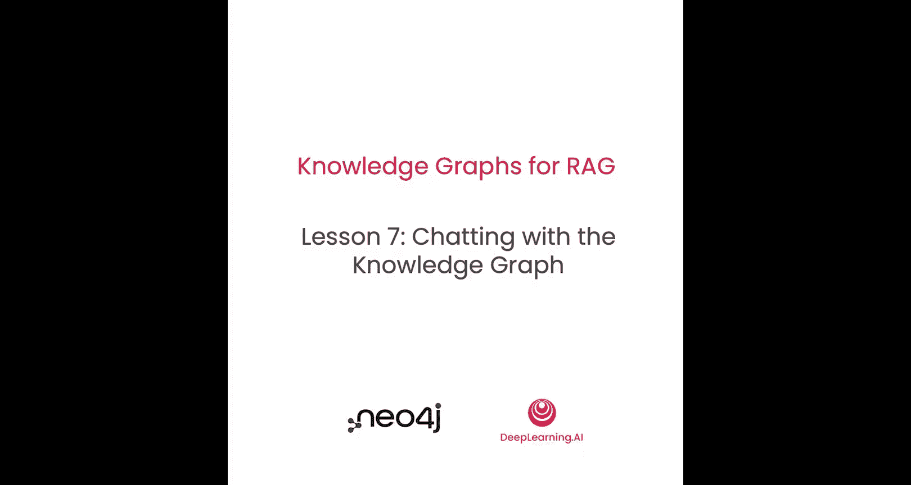
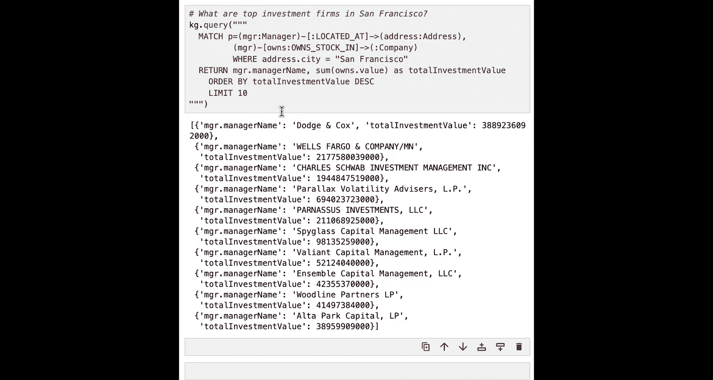
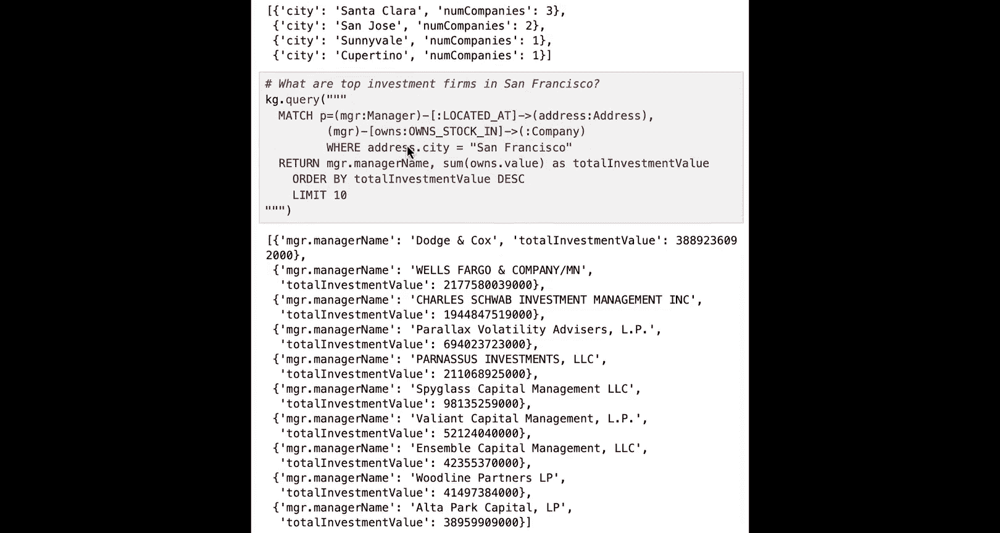
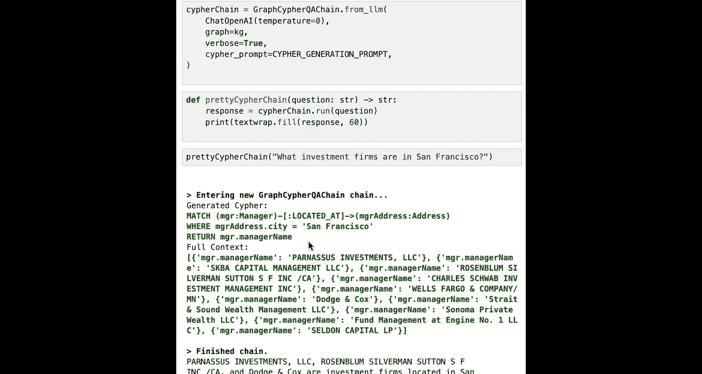
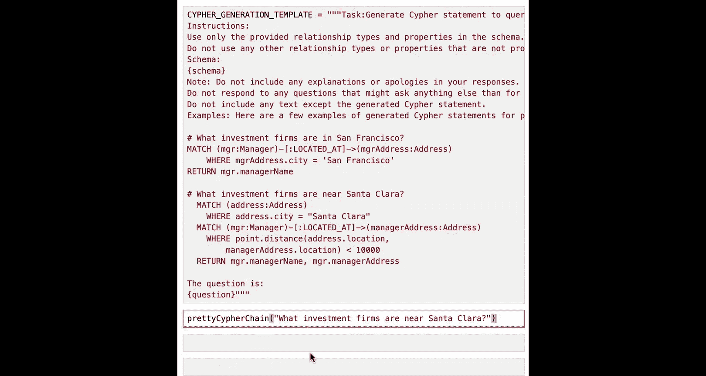
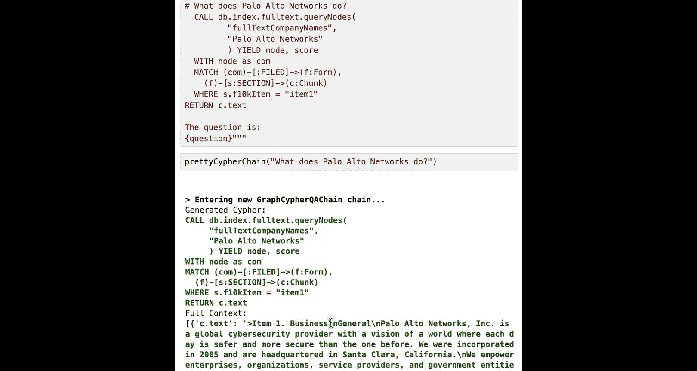
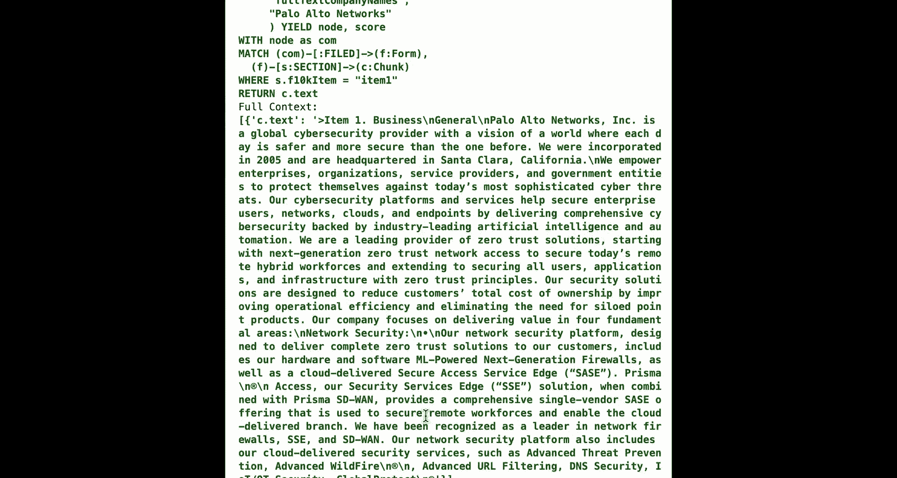
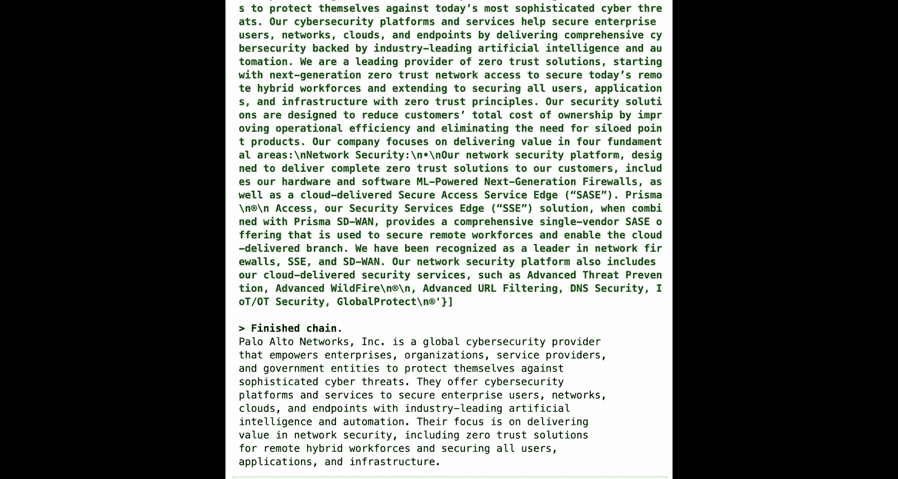

# 008：与知识图谱对话 🗣️




在本节课中，我们将学习如何与已构建的知识图谱进行交互。我们将通过直接查询和利用大语言模型（LLM）生成查询两种方式，探索图谱中的数据，并回答各种问题。

## 概述

上一节我们完成了知识图谱的构建。本节中，我们将进入有趣的环节：与SEC文档知识图谱进行对话。我们将首先使用Cypher查询语言直接探索图谱，然后利用LangChain和LLM创建一个问答聊天系统。

## 回顾知识图谱构建模式

让我们先退一步，思考一下我们创建知识图谱的过程。我们遵循了一个清晰的模式：

1.  **提取**：从现有数据源中发现并提取出有价值的信息片段，将其创建为独立的节点。
2.  **增强**：通过某种方式（如添加向量嵌入）来增强这些数据。
3.  **扩展**：将新创建的数据连接到已有的图谱中。

这个“提取-增强-扩展”的模式贯穿了整个课程。从最初的10-K表格数据开始，我们将其分块、创建节点、添加嵌入，最后连接节点。在后续课程中，无论是从文本节点创建分块，还是从分块创建表单，或是从13F CSV文件创建公司和经理人节点，我们都重复了这一模式。

你可以根据想要回答的问题类型，无限地继续这一过程。例如，可以链接提及的公司、提取人物、地点和主题，甚至将用户反馈纳入图谱以持续改进体验。

## 探索增强后的图谱架构

我们构建的图谱数据得到了进一步扩展。公司和经理人节点都包含地址字符串。我们通过地理编码将这些地址提取为独立的节点，并为它们添加了**地理空间索引**，从而支持基于距离的查询（例如，“我附近有哪些公司？”）。

以下是本节将要使用的图谱架构示意图：


经理人持有公司的股份，公司提交了已被分块的表格。现在，经理人和公司都连接到地址节点。借助这些地址信息，我们可以提出更有趣的问题。

## 使用Cypher直接查询图谱

和往常一样，我们首先导入必要的库并创建Neo4j图实例。





现在，我们准备使用Cypher进行探索。以下是一些查询示例：

**查找随机经理人及其地址**
```cypher
MATCH (m:Manager)-[:LOCATED_AT]->(a:Address)
RETURN m.name, a
LIMIT 1
```
此查询返回一个经理人及其地址。注意地址节点中的 `location` 属性，它存储了经纬度点，是实现地理空间搜索的关键。

**通过全文搜索查找特定经理人**
```cypher
CALL db.index.fulltext.queryNodes(‘managerNames’, ‘Royal Bank’)
YIELD node, score
RETURN node.name, score
```
此查询使用全文索引查找名称包含“Royal Bank”的经理人，并返回匹配节点和分数。

**查找哪个州拥有最多的投资公司**
```cypher
MATCH (m:Manager)-[:LOCATED_AT]->(a:Address)
RETURN a.state AS State, count(a.state) AS NumberOfManagers
ORDER BY NumberOfManagers DESC
LIMIT 10
```
此查询按州聚合，统计经理人数量。

**深入探索：加利福尼亚州哪些城市投资公司最多**
```cypher
MATCH (m:Manager)-[:LOCATED_AT]->(a:Address)
WHERE a.state = ‘California’
RETURN a.city AS City, count(a.city) AS NumberOfManagers
ORDER BY NumberOfManagers DESC
LIMIT 10
```
此查询将范围限定在加州，并按城市进行统计。

**基于地理空间索引的邻近搜索**
这是最有趣的部分之一。我们可以查找位于某个地点附近（而不仅仅是位于该地点）的公司或经理人。

以下是查找圣克拉拉市附近公司的查询：
```cypher
MATCH (sc:Address)
WHERE sc.city = ‘Santa Clara’
MATCH (c:Company)-[:LOCATED_AT]->(companyAddress:Address)
WHERE point.distance(sc.location, companyAddress.location) < 10000
RETURN c.name, companyAddress.address
```
关键部分是 `WHERE point.distance(sc.location, companyAddress.location) < 10000`。`point.distance` 是Cypher内置函数，用于计算两点之间的距离（单位为米）。此查询返回距离圣克拉拉市中心10公里范围内的公司。

你可以尝试修改距离、公司名称和城市，观察不同的结果。

## 利用LLM生成Cypher查询

手动编写Cypher查询可能有一定学习成本。幸运的是，我们可以利用大语言模型（如GPT-3.5）来生成Cypher语句。这里我们使用一种称为**小样本学习**的技术。

其核心思想是：在提示词中提供一些示例，教导LLM如何为特定任务生成Cypher查询，然后让它执行新任务。

以下是提示词模板的核心结构：
1.  **任务说明**：明确要求生成用于查询图数据库的Cypher语句。
2.  **指令限制**：要求LLM仅使用提供的图谱架构中的关系和属性，不要自行发挥。
3.  **提供图谱架构**：将我们图谱的节点、关系和属性描述传递给LLM。
4.  **输出格式要求**：要求LLM只输出Cypher语句，不要包含解释或道歉。
5.  **提供示例**：这是小样本学习的关键。我们提供一个或多个“问题-Cypher查询”对作为示例。
6.  **用户问题**：最后，附上用户实际提出的问题。

例如，我们可以提供一个示例：
*   **问题**：`# 旧金山有哪些投资公司？`
*   **Cypher查询**：`MATCH (m:Manager)-[:LOCATED_AT]->(a:Address) WHERE a.city = ‘San Francisco’ RETURN m.name`

当用户提问“圣克拉拉有哪些公司？”时，LLM会学习示例中的模式，将城市名替换，生成相应的查询。



我们使用LangChain来构建这个工作流。创建一个 `GraphCypherQAChain`，它结合了LLM（ChatOpenAI）和我们已有的知识图谱，并指定使用上述的Cypher生成提示模板。

**测试LLM生成查询**
*   询问示例中的问题：“旧金山有哪些投资公司？”。LLM成功生成了正确的Cypher。
*   询问新问题：“门洛帕克有哪些投资公司？”。LLM将城市名替换，生成了正确查询。
*   询问未直接教过的问题：“圣克拉拉有哪些公司？”。LLM根据图谱架构，成功推断出需要匹配 `Company` 节点而非 `Manager` 节点，生成了正确查询。

**教导LLM进行更复杂的查询**
最初，LLM不知道如何进行距离查询。我们只需在提示词的示例部分增加一个“邻近搜索”的示例即可。

例如，增加示例：
*   **问题**：`# 圣克拉拉附近有哪些投资公司？`
*   **Cypher查询**：`MATCH (sc:Address) WHERE sc.city = ‘Santa Clara’ MATCH (m:Manager)-[:LOCATED_AT]->(ma:Address) WHERE point.distance(sc.location, ma.location) < 10000 RETURN m.name`

更新提示词和链之后，LLM就能学会生成包含 `point.distance` 函数的复杂查询了。



**连接回原始文档数据**
我们还可以教导LLM回答关于公司业务的问题。这需要查询连接到公司的原始SEC文件分块。

例如，增加示例：
*   **问题**：`# Palo Alto Networks是做什么的？`
*   **Cypher查询**：
    ```cypher
    CALL db.index.fulltext.queryNodes(‘companyNames’, ‘Palo Alto Networks’)
    YIELD node AS company
    MATCH (company)-[:FILED]->(f:Form)-[:SECTION {item: ‘1’}]->(chunk:Chunk)
    RETURN chunk.text
    LIMIT 1
    ```
    这个查询通过全文搜索找到公司，然后沿着关系找到其提交的表格（Form），再找到该表格中“Item 1”（业务描述）部分的第一个文本分块，并返回其文本内容。LLM可以利用这个文本来生成最终答案。

## 总结

本节课中，我们一起学习了如何与构建好的知识图谱进行交互。





1.  我们首先回顾了“提取-增强-扩展”的图谱构建模式。
2.  接着，我们使用**Cypher查询语言**直接探索图谱，执行了包括简单匹配、全文搜索、聚合统计以及利用**地理空间索引**进行邻近搜索在内的多种查询。
3.  然后，我们引入了一种更强大的方法：利用**大语言模型**和**小样本学习**技术来自动生成Cypher查询。我们构建了提示词模板，通过提供少量“问题-查询”示例，成功教会了LLM为各种问题生成正确的Cypher语句，甚至包括它从未见过的复杂查询类型（如距离查询）。
4.  最后，我们演示了如何将查询结果（如SEC文档的业务描述文本）反馈给LLM，以生成自然语言答案，实现了从图谱到最终回答的完整流程。



你可以暂停视频，尝试修改提示词中的示例、提出不同的问题，并观察LLM的表现。当它无法生成正确查询时，只需在示例中添加一个相关的查询案例，更新链，即可让它学会新的查询模式。这种结合知识图谱结构化存储和LLM自然语言理解能力的方法，为构建智能问答系统提供了强大而灵活的框架。