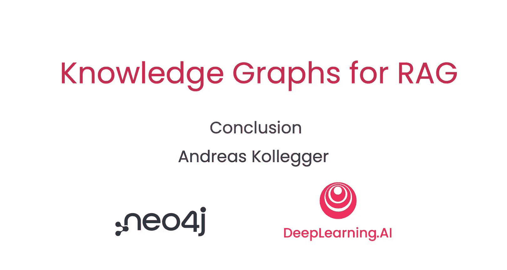

# 009：总结 🎉

在本节课中，我们将对《知识图谱用于RAG》课程进行总结，回顾所学内容，并展望未来的学习方向。

---

恭喜你完成了本课程的学习。

我希望你享受了构建一个由知识图谱驱动的RAG系统，并探索美国证券交易委员会财务文件细节的过程。

😊，当你能够直接与这类公共记录对话时，分析它们无疑会变得更加有趣。

你在本课程中实践的SEC示例，代表了企业正在利用知识图谱和生成式AI构建的各类应用程序。我希望本课程能激励你构建自己的知识图谱。

如果你想继续学习，Neo4j官网上提供了大量资源。你可以在那里注册一个免费的云端托管Neo4j账户，并了解其他能帮助你构建自己知识图谱的工具。

感谢你坚持学习到课程的最后一节，我迫不及待想看到你构建的作品。

---

本节课中，我们一起学习了课程的整体回顾与总结。我们祝贺了学习的完成，肯定了构建知识图谱RAG系统的实践价值，并指出了SEC案例的代表性。最后，我们提供了进一步学习的资源路径，并表达了对学习者未来成果的期待。