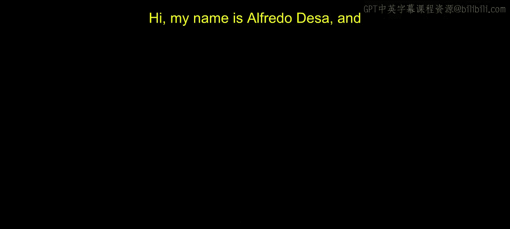

# 001：开始本地大型语言模型的 Llamafile｜Beginning Llamafile for Local Large Language Models (LLMs) p01 0_与您的导师 Alfredo Deza 会面.zh_en -BV1e6421Z7sg_p1-

Hi， my name is Alfre Lodesa and in this course we will see a lot about open source models。

 how to interact with them， how to work to find them。

 what are some some of the flavors of open source models that you might be wanting to interact with we'll go through certain things like or certain scenarios like using the models on the browser。

 with ja， which I think is' pretty incredible， but as well using them with Python libraries。

 which is very common as well as rust， we'll see some of the differences between Python and rust and why you want to choose one versus the other but concentrating in trying to make it very accessible very simple and in some situations with off the shelf ready to use local models and we'll be building interesting projects and you will be able to apply a lot of these concepts with hands on。

Labbs， very practical examples so you can actually go in and try the concept that we will be trying out all throughout these course I have several years of experience teaching machine learning teaching Python I've been a software engineer and a system administrator in the past and I think that my approach to demonstrating some of these examples and the repositories and all the lessons you will be able to kind of like get a little bit of that experience all throughout in very practical very straightforward examples so hopefully you get good understanding of how to work with open source models and get you get to apply it in your own projects with your own ideas。

