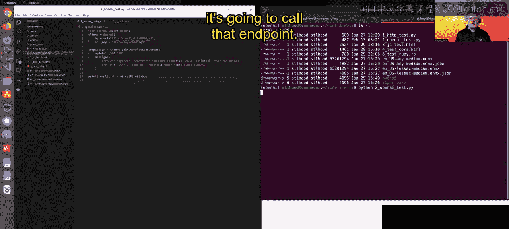
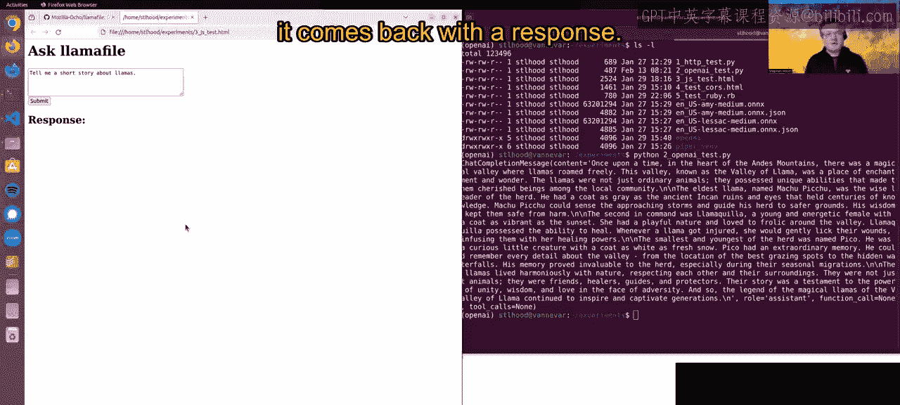

# 003：开始本地大型语言模型的 Llamafile｜Beginning Llamafile for Local Large Language Models (LLMs) p03 2_使用 Llamafile API.zh_en -BV1e6421Z7sg_p3-

Hey there， I just want to talk to you about Lma file and its server mode when you bring up any LAma file by default。

 it also brings up a server in the background that provides an open AI compatible API endpoint so it mimics the open AI API signature for completions and other functions。

 but instead of using open AI， it uses the LAMma file you're running on your local machine。

What this means is you can take code that's been written to work with open AI and you can use it with allma file。

 this lets you switch from using a commercial centralized offering like open AI to an open source freely available system that's under your control。

And you can run this under your local machine， or you could also doize a Lama file and run it on a server if you want as well。

 people do both。Here I have in Visual Studio I just have a quick example， this is some very。

 very simple Python code that actually uses the open AI library Python clan。

 and all I've done is change the baseE to point to my local host where I have currently allmaophil running。

 it's Mil 7B。😊，And then I I got some very simple code here where I'm saying there's a system prompt and I'm asking it to tell me a short story aboutllmas。

 And if I run this over here in my console， it's going to call that endpoint and it thinks that it's talking to open AI but it's really talking to a model running locally on my machine and then this is the output which I'm just dumping raw to the console you can do this in other way too you can do this in jascript So here's some very simple jascript that's using straight up HTML sorry Hp requests to talk to that same API signature but instead of pointing to open AI it is pointing to my local host and this really is going to do the same thing but run inside a browser so I can show you my browser of a very simple interface。

Ask it a question。 I submit this all happens through jascript and it comes back with a response。

 Again， I'm just dumping the raw content to the console。

So this is something that we have out today it works today in Lmaophil。

 you can actually when you create your own LMma files。

 you can create them so they only run in the server mode so they don't bring up any of the WebUI。

 they're just purely an API server so you can optimize that if you want and that's your use case but we really hope developers enjoy using this we really want to make it easier for people to switch from centralized commercial offerings to open source offerings because we think that will just help accelerate all the progress we want to see in the open source space。

😊，Thanks a lot。