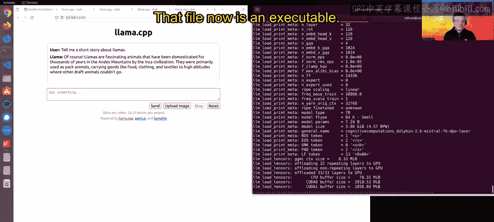

# 004：开始本地大型语言模型的 Llamafile｜Beginning Llamafile for Local Large Language Models (LLMs) p04 3_创建 Llamafile.zh_en -BV1e6421Z7sg_p4-

Hey everybody， I just want to give you a quick demonstration of Lama file to get allma file。

 simply go to Lama file AI or Google Lama file and you will find our Github repository the readme file in this repository has links to a number of lama files that we've created for you as examples These are all hosted a hugging face where you can find others as well and you simply download them I've downloaded here you can see my console window several of these I'm going to run one right now for you Mitral 7b Miral 7 B is a recently released small model that has great performance and is open license and if I simply just type it in and run it like an executable that's what happens it loads the model into memory it brings up automatically a chat interface that I can engage with I can ask it the canonical。

😊，Model evaluation question， please tell me a short story about llmas。And it will start doing it。

So this is an AI running entirely locally on my machine， it is not connecting to the internet at all。

 it is 100% open source using an open model， it's running in total privacy and under my control。😊。

Now， it's running at a speed that's less than you you would get from chat GT。

 but it's a serviceable speed。 And this is just using my CPU。

 This is not using any other hardware I might happen to have， which could accelerate inference。😊。

But even at this speed， we're still getting usable performance here， yeah， 11。34 tokens per second。

 it's not too bad， but if we run it again and this time passing a command line parameter，😊。

This will tell it actually to load as many layers of the model as it can into my GPUs VRAM and then use the GPU for acceleration。

 So if I run this again now， the interface comes back up。

 I ask the same question and you will note a dramatic difference in the inference performance。

Almost 120 tokens per second。So this is the power of GPU acceleration and Lammaophil makes it very easy to use out of the box。

 it'll work with NviIDdia GPUs， but it'll also work with AMD GPUs， which is much less common。

 NVIDIdia really has a stranglehold on the market and AMD cards are typically harder to get working we're very happy to say that with Lmophile they just work out of the box。

Let me show you another example here， this is a model called lava lava is a multimodal model and what that means is it can accept not just text as input it can also accept images so if I load an image here i've got an example that I have and I'll just say you know what is in this image。

😊，And ask it。You will see that it analyzes the image it gives me a description of it and did a pretty good job。

 it's not aware that this is the Terinator in other runs when I've tried this。

 it has actually figured that out， but as an open model。

 this is I think very impressive capability for the open source community to have and it works just fine in Lama file。

😊，Last， let me show you one more example， which is a model called Rock 3B。This is a very。

 very small model that's designed to work in constrained environments and because it's smaller it's not going to be as powerful or smart as larger models。

 but this is pretty amazing that with no GPU acceleration just running I can ask it that same question and I get a short but very quick answer and it's not a bad answer and the beauty of this is that with Lmaophil you could run this model and ones of the same size on something as modest as a raspberry pie this is a $35 credit card sizeized computer doesn't get much more simple than that。

 but it can run an open source pretty capable AI and I think that just says a lot about where we are in terms of progress in open source AI。

Lastly， I just want to show you how you make your own Lama file if you'd like it'll work with any GGUF or Guff file this is a very popular currently format for open model weights you can go on hugging face and you will find thousands if not tens of thousands of GGUF files ready for use at different levels of quantization here I've downloaded a version of the Mstral model that's been finetuned and is quantized at four bits and with a single command I can turn this data file which currently can't do anything on its own into an executable I just say Lama file convert。

😊，The name of the GF file， I hit En。And in a few seconds， it will turn it into a dot lamma file。

 and now I can now run this。😊，Just like the other ones I've been showing you。

 and that file now isn't executable。😊，And it brings up a command line and it does everything。 sorry。

 brings up an interface， and I can do everything I want to do with it just like the other models。

 So it's very easy to get your own Lama files running if you want to。😊。

I hope you enjoyed the demonstration， thanks a lot。

