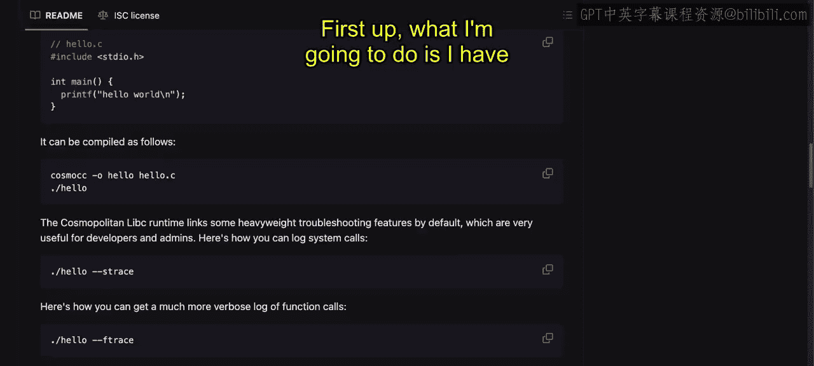
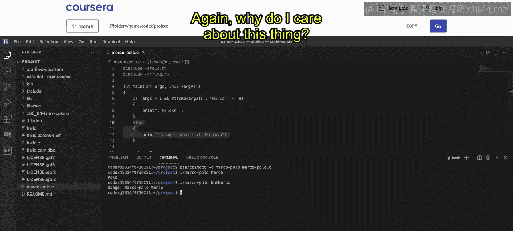
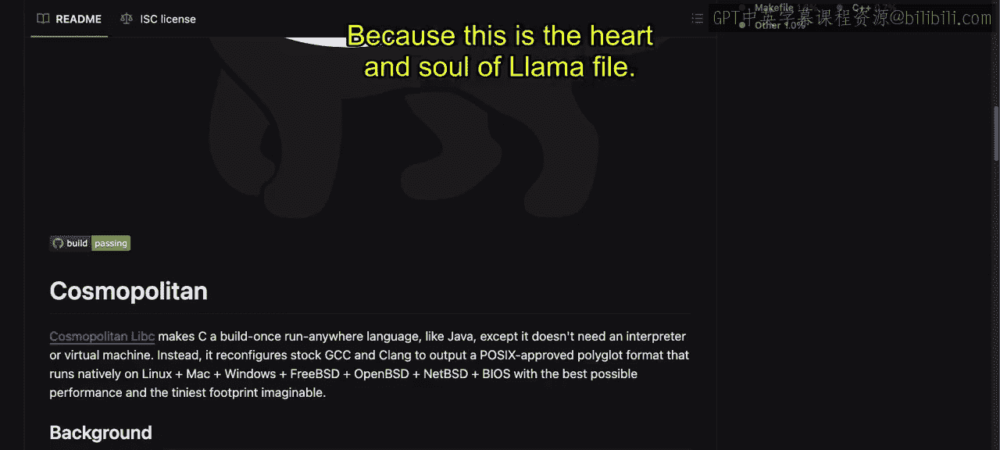
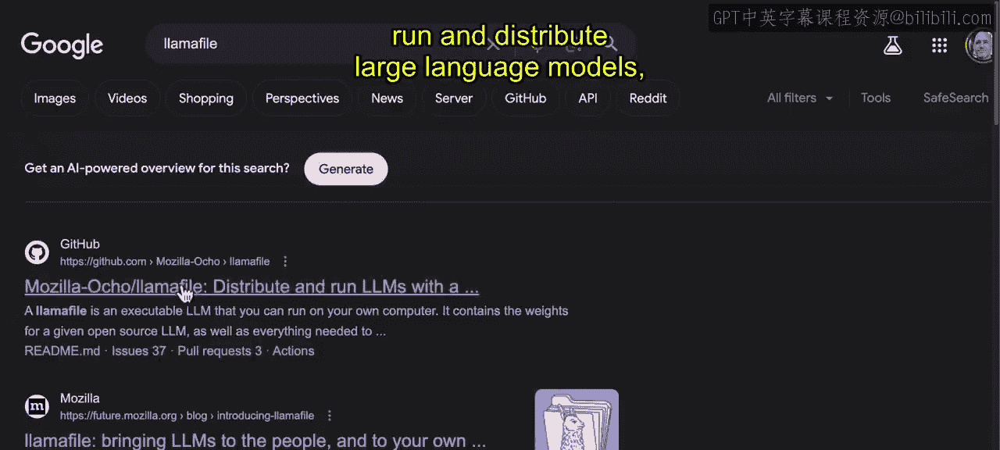
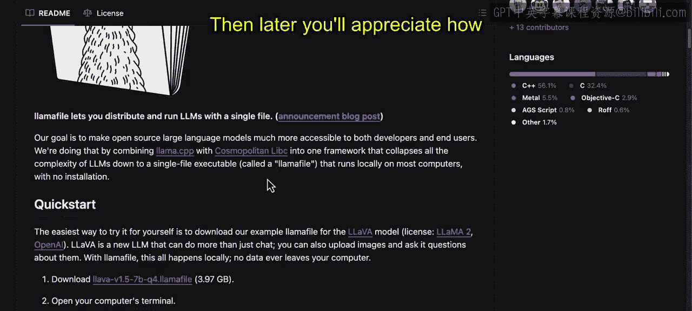

# 005：开始本地大型语言模型的 Llamafile｜Beginning Llamafile for Local Large Language Models (LLMs) p05 4_使用 Cosmopolitan 构建便携式二进制文件.zh_en -BV1e6421Z7sg_p5-

。This is a library called cosmopolitan， which is at the core of Lamaophil。

 which allows it to be a portable large language model。

 So let's go ahead and take a look at how this actually works。

 We have here the cosmopolitan Lib C makes a C build once run anywhere language like Java right So that's one of the cool things about it。

 So all you need to do is unzip it， go to the releases right here unzip it and then use this cosmo compiler right where we say Cosmo。

CC dash O， hello。This would be the output and the C file will be hello do C and what's also kind of cool is that for old school Unix people。

 you can see that there's an Stra facility here as well so you can actually see what's actually happening underneath the hood This was a utility that a lot of ciss admins would use back in the day but it's also very useful in modern times as well to really dig into all the calls that are happening in a piece of code。

 So let's go ahead and take a look at how we would do this So first up what I'm going to do is I have a lab here。

That I'm going to set up and in this lab what I'll first do is create a hello world file。

 so let's go ahead and say that。 let's say touch hello do C and then what I will do goes refresh this for a second and then go to hello do C and then we can just paste in a hello example。

 So first up here we can paste this in。 you can see we just include the standard library here。

 header file and then we have a main function and then it goes through and it prints hello world。

 So how do we run this Well I have it inside of the bin directory So we're gonna to go to bin cosmocc so we'll get the cosmo compiler and then we'll say dash o so we want to make a portable binary called hello。

 and then we'll feed it in that C file There we go pretty simple and then we just go ahead and run it there we go。

 we got hello world So really easy to get started here with building portable binaries using。

And so let's go ahead and do something a little bit more complex。

 which is build a Marco Polo function here next。 So let's go ahead and do that and we'll say touch and we'll call this in this particular example of Marco。

Polo C perfect again we'll go ahead and refresh right here and then what I'm going to do is I'm going to open this up and we'll need to do a little bit more。

 we'll include some other header files so in this case we'll have the standard library and the string as well and what I'll do is I'll make a main function that takes a little bit of logic so let's go ahead and take a look at how this works so we'll say inside of here the main function will go through here and look at the arguments in this case if it's Marco it's going to go ahead and return back Polo otherwise it'll just give us essentially a help menu so it's a really simple program here but that's what's nice about Cs you can write really elegant simple programs and in the case of this cosmopolitan acrossplform binary portability tool all we have to do is go through here and compile it so let's go ahead。

And say bin。Cosmo CC， and we'll go dash O， Marco Polo。There we go。

And we can go and compile pretty straightforward， and now we can just run it。

 was it say Marco Polo Marco， we'll see we get back Polo。

 and then if we go through and we say not Marco。We can see that。 In fact， it doesn't work。

 It gives us the help menu here that says， hey， you got to run it this way。

 So a very nice library here to get started。 And again， why do I care about this thing。

 Because this is the heart and soul of lamaophil。 And so if we go to Lam file。

Here， which allows you to run and distribute large language models。

 you can see that this is actually a key component of it。

 so it is nice to go down to the first principles， sometimes play around with that core library to see exactly what it works like and then build some things around it so then later you'll appreciate how elegant lammaophil really is。

