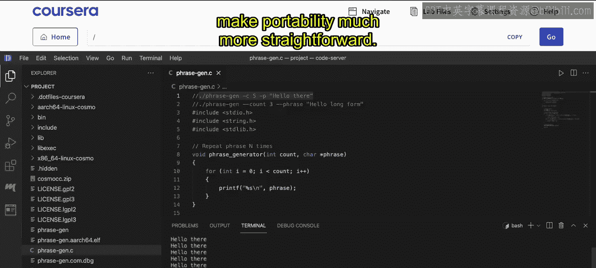

# 006：开始本地大型语言模型的 Llamafile｜Beginning Llamafile for Local Large Language Models (LLMs) p06 5_使用 Cosmopolitan 构建短语生成器.zh_en -BV1e6421Z7sg_p6-

Here is an insult of the cosmopolitan portable binary framework and what I'm going to do with it is build a portable phrase generator commandlan tool。

 So typically commandme tools are things that benefit the most from portability and what's really nice about the cosmopolitan framework is that it helps you build out these portable binary。

 So in this case know it's something simple just for teaching but you could do something like a static website generator or some kind of AI tool etc with this approach。

 let's go ahead and start first at what it will build。

 So you can see here that it's going to build a binary that allows you to specify the account and then a phrase you also have the option for a longer parameter here。

 So if we say dash count。You also can do that or you can do dash phrase as well。

 So to start with we include the standard library headers。

 which are the standard doth for input output string doth for string functions like string comparison and then also the standard Lib which declares utility functions like AtiIO for converting strings to integer。

 So these are all right here Now next we have a function here that allows us to repeat a phrase。

 you can see here that it's going to repeat a phrase in number of times accepts an integer and then we have the phrase right there so it goes through and does a for loop and then this is the main logic here and what happens is that we basically initially have count and then we parse through the command line arguments and then here's the string comparison we say if basically we have count or we have dash C。

We do this operation otherwise if we have dash phrase or dash P。

 we do this other operation and then we go through at the very end here and we generate the phrase so how do we actually compile this thing well because the cosmopolitan framework has its own compiler。

 we're just going to say，Bin， so we'll do bin slash cosmo。CC and then we'll do dash O。

 and this will be the binary that we would create。 That's again， portable。

And then we just feed it in the C file here， which is Fr gen de C。There we go。 pretty easy to create。

 you can see it creates all these different artifacts here as well。 Now， in order to run it。

 I can just take my comment right here and I can actually go through and。Run it， we can change it。

Have some different things in here， for example，7。Whatever you want to do for the total number of counts So the idea here is that with phrase generation。

 it's really an important kind of demo type framework that I like to do when I'm testing on a new chameleon utility。

 but the advantage of a cosmopolitan framework is that I build this binary once and it can be deployed to many different platforms at the same time。

 Windows， Linux， Uni etc。 and so this is a very compelling technology。

 especially for things like large language models， which is again why we're showing this because Lamaophil uses this to make portability much more straightforward。

