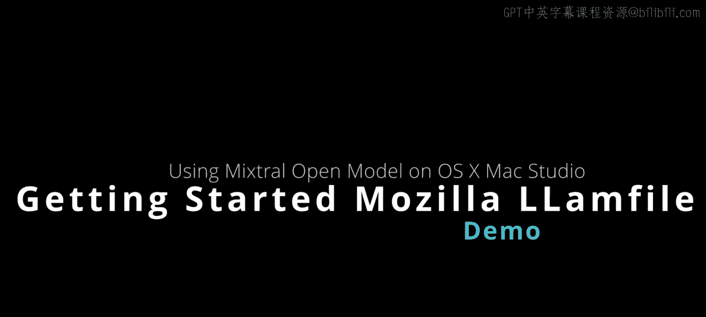
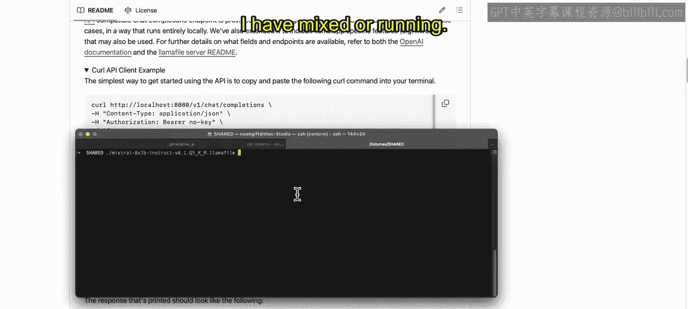
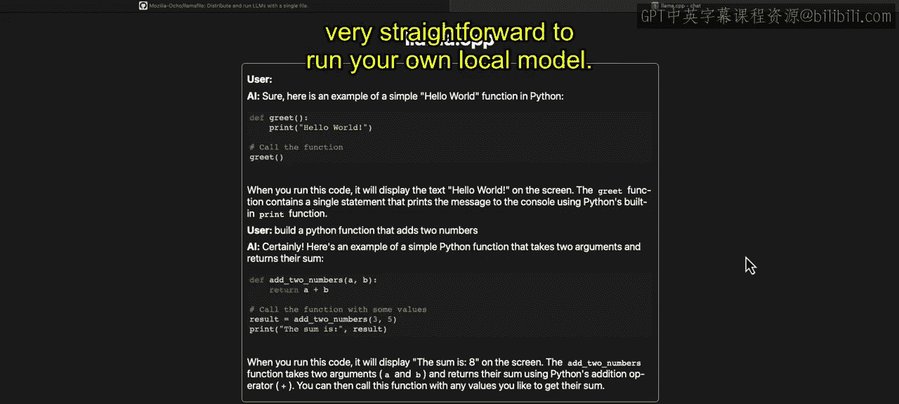
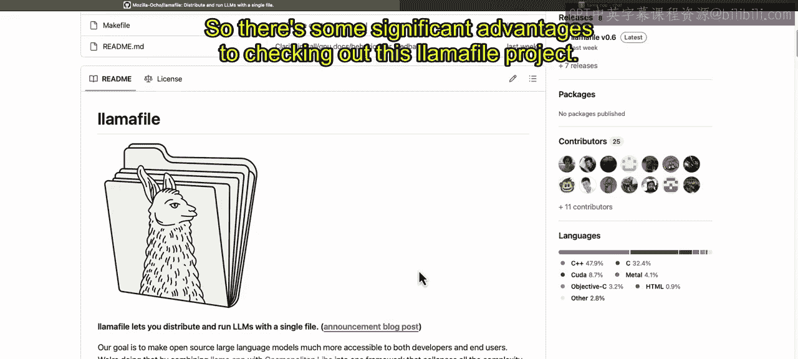

# 007：开始本地大型语言模型的 Llamafile｜Beginning Llamafile for Local Large Language Models (LLMs) p07 6_开始使用 Llamafile.zh_en -BV1e6421Z7sg_p7-

。Here we have the Lama file project from Mozilla， probably the easiest possible way to run a local large language model。

 Many people are interested in running large language models locally because of the privacy aspects and also it's free。

 right if you're able to use your own machine you can dive right into the Lama file here。

 So let's go ahead and take a look at the structure， this project first。

 So you can see that Lama file lets you distribute and run LLMs with a single file and what's really fascinating about this is because they use this library cosmopolitan lid C。

 it is able to collapse everything into a single file executable here called Lama file。

 and its actually even though it's called Lama file actually is not really tied to any particular large language model。

 there's an example here where you could download lava which is able to do reading of images。

 which is a pretty cool project。If you want to play around with that。

 the one that I think is one of the more interesting ones is this mixtureal one。

 So Mire is one of the better performing open source models here and you can see it's Apache2 license and it's a 30 gig file。

 So it's a pretty big download but all you have to do is download it and then do dot slash run Also what's pretty cool about this is there's a Python API that mimics the open AI API so you can basically convert from or upgrade or even graduate from closed commercial proprietary models to open models using this API。

 and you also could do a Chroal command。 And you can see these Chal commands here。

 So very fascinating project here。 let's go ahead and take a look at how this works。

 I'm going take my terminal over here and you can see I've already downloaded it。😊，AndM or running。

 It's that simple。 Here we see that Lama dot CPP is running locally here。

 And if I wanted to reset to some kind of default state， I can reset this。

 and this would reset all of these defaults。 What I'm going to do is I'm going to change this bot to AI。

 And then I'm going to ask it to do something。 So let's， let's do a Python howo world。

 We'll say Python。

Hello， world function。Show。Me Python hollowello world function。 All right， great。

 let's go ahead and do send。And then it' going to use my Mac GPU here to get this very fast response。

 So some of the metrics around Mitro are that it's actually just as good as closed proprietary models you can see here that this looks pretty good。

 And if I wanted to I could keep doing more and more functions like build a Python function that add to numbers so really the takeaway here is that it is actually very straightforward to run your own local model and the big advantages here when you're using the Lmaophil here are that you have privacy you're not sending your data to some company where you don't know what they're doing with it and then second that performance is actually much better than calling in external API because there's less latency。

 And then third is actually it's free。 So there's some significant advantages to checking out this。

A fileile project， go ahead and take a look at it and let me know what you think。

