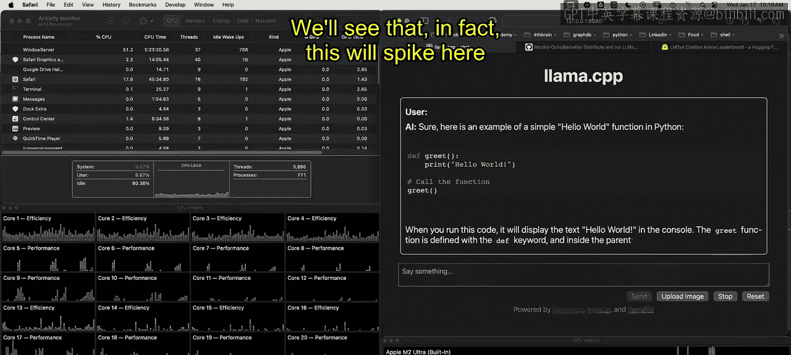

# 008：开始本地大型语言模型的 Llamafile｜Beginning Llamafile for Local Large Language Models (LLMs) p08 7_Llamafile 本地系统指标.zh_en -BV1e6421Z7sg_p8-

Let's take a look here at how we can monitor system metrics with Lama file。 First up。

 I'm going to look at the actual use of the Lama file in terms of an elo rating so this shows how people perceive the strength of this model and you can see here this mixture model is right in the running here very small difference than commercial models which shows that in fact there should be a huge percentage of people interested in running this locally is long as the performance is good enough and so is the performance good enough。

 let's go ahead and take a look again at this Lama file project now I've got this running inside of this web browser window and I also have all of these metrics right here that our letting us take a look at what's happening and the things to pay attention to could be for example。

 the GPU time that's one another one would be to look at all the cores but then also to look at this Mtu。

Ultra GPU now the M2 Ultra the one I have has 60 GPU cores and it is able to actually leverage all of those GPU cores on the Mac operating system because of the great work by the authors of the Lama file and also Lama CPP so let's go ahead and take a look at this we'll see show a Python function if I scroll down here let's see what happens in terms of this GPU。

We'll see that in fact this will spike here and also we should see some GPU here as well。

 so we can see this as well that the GPU is actually being hit by this dot a1。

9 and in fact we see this running again and we could do another one， we could say。

 you know give me an example of a recursive。Function in Python。And let's see what it does。And， again。

There we go。 We see a recursive function in Python， and we can also see that， in fact。

 it is going to be using this GPU。 So you can see the performance is actually incredible right。

 and we can see historical GPU here is able to leverage it。

 And so for people that are actually using commercial models。😊。

Obviously there's some usefulness in them， but it definitely raises the question of why long term would you use commercial models if you can just download a model that's good enough and the performance is just incredible and it's free。

 So something to think about as you're playing around with mammaophil or even going into commercial arrangements for large language models is first take a look at what the local performance really is。

 look at the metrics and you'll see that it's very impressive。

