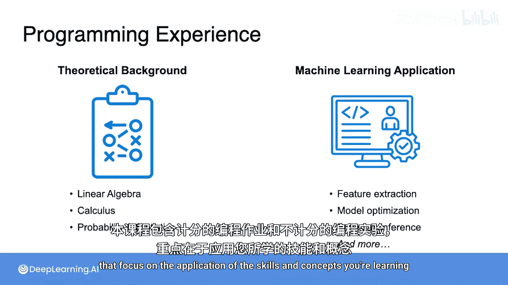
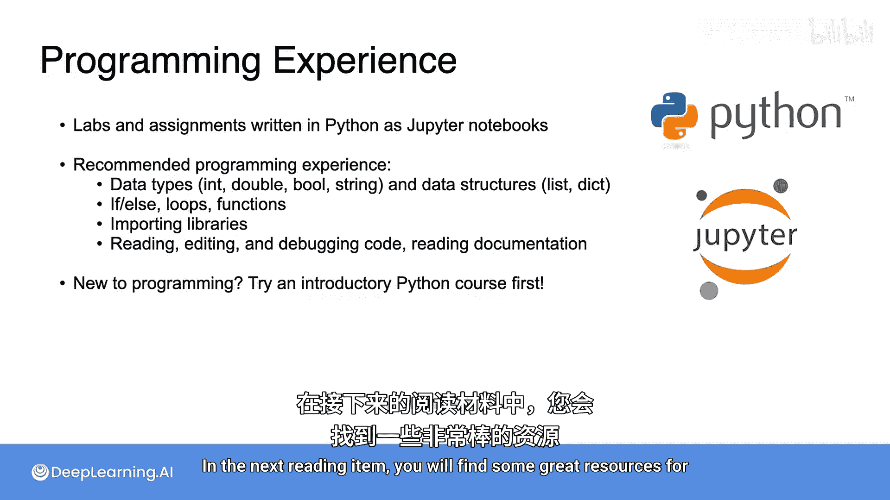

# 004：关于编程经验的说明 🐍

在本节中，我们将讨论学习本课程所需的编程经验。我们将了解课程实践部分的设计，以及为了顺利完成课程，你需要具备哪些编程技能。

本课程旨在为你提供机器学习背后的数学理论基础，并展示这些概念如何在实践中应用。这意味着你需要进行一些编程实践。

课程包含计分的编程作业和未计分的编程实验，这些练习专注于应用你正在学习的技能和概念。

## 编程环境与要求

以下是关于课程编程练习的具体信息：

*   **编程语言**：这些练习使用 **Python** 编写。
*   **交互界面**：练习将以 **Jupyter Notebook** 的形式呈现。这是一个基于网页的交互式界面，允许你阅读、运行和编辑程序。
*   **技能要求**：你不需要成为 Python 专家也能成功完成练习，但你应该熟悉通常在 Python 入门课程中教授的概念。

## 所需的核心编程概念

为了顺利进行，你需要掌握以下核心编程概念：

*   **数据类型与结构**：理解不同的数据类型（如整数、浮点数、字符串）和数据结构（如列表、字典）。
*   **控制流**：能够使用条件语句（`if/else`）、循环（`for`、`while`）和函数来控制程序执行流程。
*   **库的使用**：能够导入和使用不同的 Python 库（例如 NumPy、Matplotlib）。
*   **代码读写与调试**：你应该能够阅读和编辑运用了上述概念的 Python 代码，能够编写和调试自己的代码，并偶尔查阅新软件包的文档。

## 给不同背景学习者的建议

上一节我们列出了所需的核心技能，本节中我们来看看针对不同背景的具体学习路径。

*   **有其他语言经验者**：如果你熟练掌握另一种编程语言（如 Java、C++），你应该可以在课程进行中顺利掌握所需的 Python 知识。
*   **编程新手**：如果你对编程是全新的，我建议你在开始本课程之前，先学习一门 Python 入门课程。在接下来的阅读材料中，你会找到一些很棒的学习 Python 的入门资源。

---

在本节课中，我们一起学习了本课程对编程经验的要求。我们了解到课程实践部分使用 Python 和 Jupyter Notebook，并明确了成功学习所需掌握的编程基础概念。最后，我们根据不同的编程背景，给出了相应的学习建议。