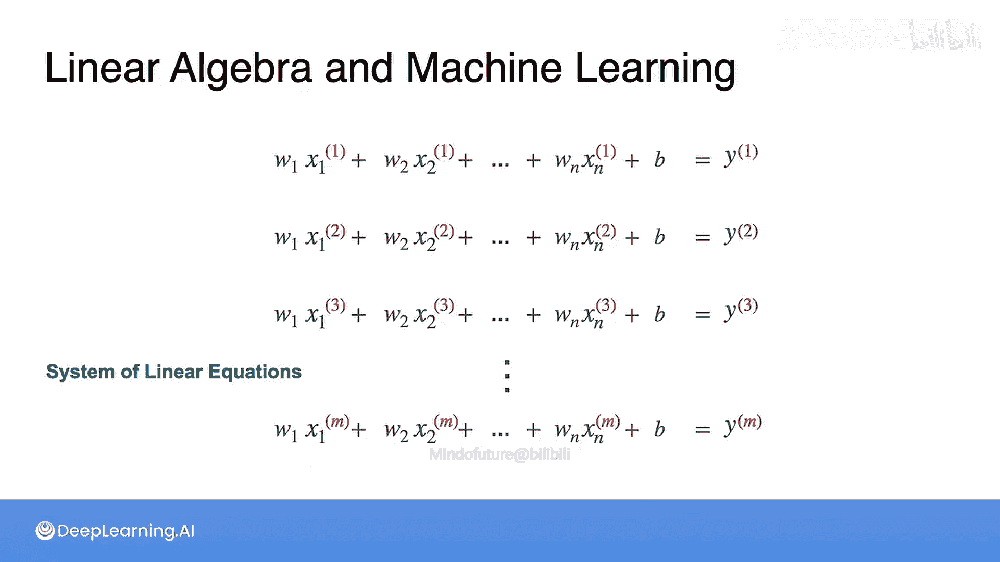
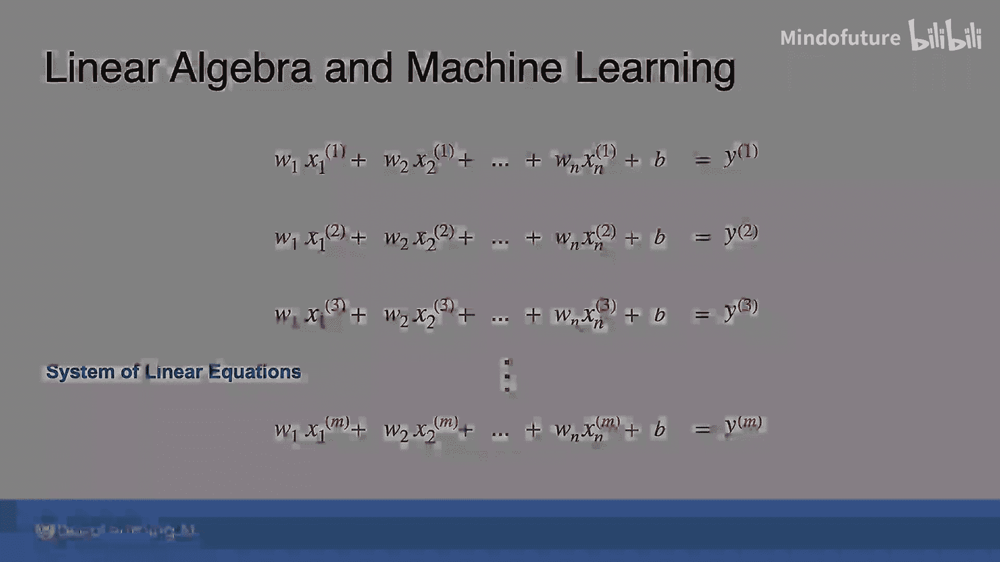

# 005：线性代数在机器学习中的应用 🧮

在本节课中，我们将学习线性代数在机器学习中的一个核心应用：线性回归。我们将看到，一个看似简单的机器学习问题如何自然地引出一个线性代数中的基本概念——线性方程组。

线性代数在科学与技术的众多领域都有应用，机器学习也不例外。可以说，线性代数是机器学习中最有用、最普遍的数学领域之一。

## 从线性回归到线性方程组

在机器学习课程中，你有时会听到“不必担心数学细节”。在本课程中，我们有时会反其道而行之，说“不必担心机器学习细节”。你会看到许多机器学习技术的例子，但如果不完全理解它们的工作原理，这也没关系。我们的目标是建立一个坚实的数学基础，持续培养你对机器学习主题的兴趣，并为你进一步学习机器学习课程做好准备。

基于这个思路，让我通过一个机器学习例子来介绍本周的主题：线性方程组。

一种常见的机器学习建模方法称为**线性回归**。线性回归是一种**监督式**机器学习方法，这意味着你已经收集了许多输入和输出的数据，你的目标是发现它们之间的关系。

例如，假设你想预测风力涡轮机的电力输出。

### 单特征线性回归

如果你只有一个特征，比如本例中的风速（显示在X轴，即水平轴上），并将你的目标——功率输出——绘制在Y轴（即垂直轴）上，那么这些数据点就代表了风速和功率输出的真实测量值。显然，这里存在一种模式，线性回归的目标就是为这些数据找到**最佳拟合线**，例如图中的这一条。

使用这样的模型，你假设这种关系是**线性的**。换句话说，如果你知道风速，你可以将其乘以一个常数，再加上第二个常数，从而对风力涡轮机的功率输出做出合理的估计。

例如，根据这个模型，如果风速为5米/秒，那么我预测风力涡轮机的功率输出将是1500千瓦。

这个模型并不完美，你可以看到实际数据分散在代表模型的直线周围，但它做得相当不错。这里的模型是熟悉的线性方程：

**`y = mx + b`**

其中 `y` 是功率输出，`x` 是风速。你的目标是找到最适合数据的 `m` 和 `b` 的值。

在机器学习中，你经常会看到这个模型方程被写成：

**`y = wx + b`**

因为与 `x` 相乘的数字被称为**权重**，`b` 被称为**偏置**。

### 多特征线性回归

像这样的单特征线性回归很容易可视化，但在许多机器学习问题中，你会考虑更多特征。

在预测风力涡轮机功率输出的情况下，你可能不仅想包含风速，还想包含温度。为了考虑新的输入，你的直线方程需要改变。现在：

**`y = w1 * 风速 + w2 * 温度 + b`**

为第二个输入变量增加了一个新的权重。

如果你绘制这个方程，它将不再形成一条直线，而是在三维空间中表示为一个平面。

但如果你想考虑更多特征呢？比如压力、湿度或任何其他可能影响风力涡轮机性能的因素？其思想与使用一个或两个特征时完全相同：你只需为每个新特征添加一个新的权重。即使模型方程变得更长，其概念是相同的。

通过找到权重和偏置项的正确值，就有可能在线性关系的假设下，对输出或目标做出准确的预测。

如果我们明确地写出来，那么你有：

**`w1*x1 + w2*x2 + ... + wn*xn + b = y`**

其中 `y` 是你的目标。如果你把这个方程想象成数据集中的一行，那么你已经知道了 `x` 和 `y` 的值，你的目标是找到 `w` 和 `b` 的值，使这个方程成立。

当然，实际上，你的数据中有许多记录。因此，你可以写下许多这样的方程，数据中的每个记录对应一个。

所以，如果我在上面写的第一个方程中的所有项上加上一个带括号的上标 `(1)`，那么我可以为数据集中的第二个样本写下同样的东西，并用上标 `(2)` 表示，依此类推，直到包含 `M` 条记录的数据集中的最后一个样本的上标 `(M)`。请注意，这些红色上标不是指数，它们的作用类似于下标，只是为了清晰起见放在上面。

理想情况下，你会找到能同时满足所有这些方程的权重和偏置项的值，或者至少尽可能接近。于是，从这个非常常见的机器学习模型中，出现了线性代数的一个基本概念，称为**线性方程组**。这将是本周学习的一个基本主题。

## 总结

本节课我们一起学习了线性代数在机器学习中的一个基础应用。我们通过风力涡轮机功率预测的例子，看到了单变量线性回归如何用直线方程 `y = wx + b` 表示，而多变量线性回归则扩展为包含多个权重的方程 `y = w1*x1 + w2*x2 + ... + b`。当使用包含多个样本的数据集时，为每个样本列出的方程就共同构成了一个**线性方程组**。寻找最佳权重和偏置的过程，本质上就是在求解或近似求解这个方程组。这为我们理解后续更深入的线性代数概念（如矩阵表示和求解方法）奠定了直观的基础。