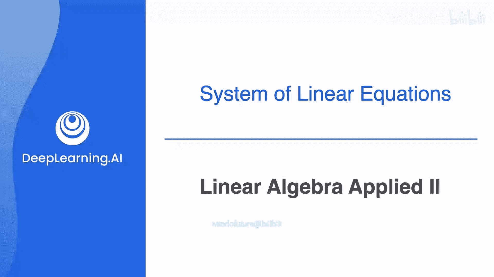
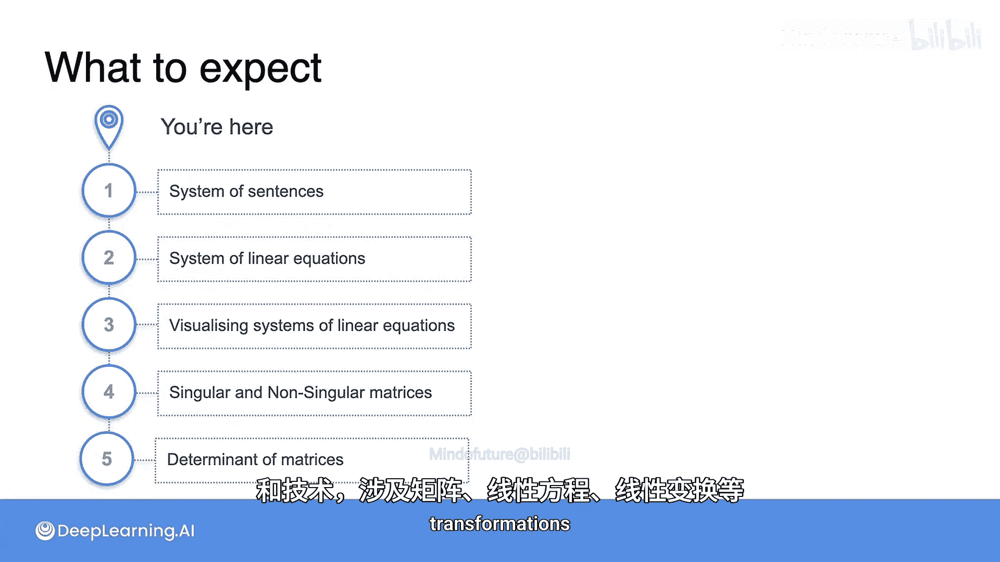

# 006：线性代数在机器学习中的应用 🧮



在本节课中，我们将要学习线性代数在机器学习中的一个核心应用场景——线性回归。我们将通过一个风力涡轮机发电量预测的例子，理解如何将实际问题转化为线性方程组，并初步认识向量和矩阵的表示方法。

## 概述

上一节我们介绍了线性代数的基础概念。本节中，我们来看看线性代数如何具体应用于机器学习问题，特别是线性回归模型。我们将从一个预测风力涡轮机发电量的例子开始，逐步拆解其背后的数学原理。

## 线性回归模型示例

在之前的视频中，我们看到了一个用于预测风力涡轮机发电量的线性回归场景。在这个案例中，我们有一个数据集，包含一系列特征，例如风速、温度、大气压力、湿度等。对于一个具有 `n` 个特征的数据集，我将这些特征称为 `x1`, `x2`, ..., `xn`。

然后，我为数据集添加了一个上标，以表示一组特征属于哪一行数据。接着，我们有模型权重乘以每个特征，我们将其写为 `w1`, `w2`, ..., `wn`。

我们还添加了一个偏置项 `b`，并将其设为目标值 `y`，在本例中即涡轮机的发电量。

关于这个系统，需要注意的重要一点是，虽然 `x` 和 `y` 在每一行中都是唯一的（即所有带 `(1)` 上标的 `x` 与带 `(2)` 上标的 `x` 都不同，所有 `y^(1)` 也与 `y^(2)` 到 `y^(m)` 不同），但 `w` 值和 `b` 在所有行中都是相同的。

因此，线性模型所表达的是：存在一组值 `w1`, `w2`, ..., `wn` 以及某个值 `b`，当它们与任何一行的特征相乘并像这样相加时，将能够为你提供该行目标 `y` 的估计值。

换句话说，使用这个模型，你是在说：给我一组 `x`，我就可以估计出 `y` 的值，因为我有一个模型告诉我所有的 `w` 和 `b` 是多少。

## 向量与矩阵表示

与其像这样用冗长的形式写出这个模型，不如说我有一个称为 `W` 的权重向量，它由 `w1`, `w2` 等组成。我将这个向量乘以我的特征矩阵（现在称为大写 `X`）中的每一行特征 `x`。

然后我加上一个偏置项，并将其全部设为等于 `y`，`y` 是我的目标变量的向量。

就这样，我们回到了一个看起来就像直线方程的简洁方程：`W * X + b = y`。

我刚才跳过了很多内容，所以如果你还不熟悉“向量”和“矩阵”这些术语，现在不用担心。暂时将它们视为数字列表或数字网格即可。线性代数就是关于操作向量和矩阵以进行强大计算的，正如你刚才所见，这种数学是许多机器学习技术的支柱。

## 线性方程组与求解

现在，如果你已经是线性代数的爱好者，你可能已经注意到我在这里的表示法有点不精确。例如，根据这些向量和矩阵的定义方式，我可能需要指明这到底是 `W` 的转置还是 `X` 的转置才能使数学运算成立。但我现在不打算担心这个问题。

相反，我想强调的是，当你使用线性回归作为机器学习模型时，你正在将你感兴趣的系统表示为一个线性方程组。事实上，如果存在一组 `W` 和 `B` 值，使得给定一组 `X` 特征就能完美预测 `Y`，那么这将是一个你可以解析求解的方程组，无需任何机器学习。

我的意思是，只要你有一个包含所有 `X` 和 `Y` 值的数据集，并且你拥有的示例记录至少与你需要求解的未知数（即 `W` 和 `B`）一样多，你就可以仅用纸笔应用基本代数来求解。

而对于线性回归，你是在经验性地求解系统，也就是说，通过迭代和近似地寻找系统的最佳拟合线性解。

## 本周学习内容与自测

在本周的材料中，我将从非常简单的内容开始，带你逐步了解线性代数中常见的向量和矩阵运算。如果你以前学过线性代数，可能已经见过其中一些概念。

为了让你了解本周课程的内容，我将提出一系列问题供你思考。如果你能成功回答所有这些问题，那么恭喜你，你已经准备好直接跳到本周末尾进行测验。如果你对其中任何问题有不确定的地方，那么你将在本周的材料中找到有价值的学习内容。

本周将从线性方程组开始，学习如何用向量和矩阵表示这些系统，以及如何操作这些系统来计算系统的行列式或其他特征。

以下是你的第一组自测问题。本专项课程包含三门课：线性代数、微积分以及概率与统计。

假设我记录了你这三门课的成绩，但我没有告诉你实际分数。相反，我告诉你关于你分数的以下信息：

1.  你的线性代数分数加上你的微积分分数减去你的概率与统计分数等于 6。
2.  你的线性代数分数减去你的微积分分数加上两倍的概率与统计分数等于 4。
3.  四倍的线性代数分数减去两倍的微积分分数加上你的概率与统计分数等于 10。

当然，没有老师会这样给你分数，这很荒谬。但请花点时间思考这些句子，看看你是否能将它们表示为一个线性方程组。

如果我们用 `A` 代表你的线性代数分数，`C` 代表你的微积分分数，`P` 代表你的概率与统计分数，那么方程组将如下所示：

```
A + C - P = 6
A - C + 2P = 4
4A - 2C + P = 10
```

现在，结合我们之前看到的预测风力发电输出的线性回归背景，权重 `W`、特征 `X` 和目标 `Y` 的等价物是什么？

在这种情况下，你的分数 `A`、`C` 和 `P` 是权重（即 `W`），也就是在所有陈述中保持一致的东西。特征是权重旁边的数字（即 `X`），等号另一边的数字是目标 `Y`。

现在，你能告诉我这个系统是奇异的还是非奇异的吗？换句话说，这些方程是相互矛盾，还是存在冗余信息？你能解这个方程组吗？也就是说，你现在能解出你这三门课各自的分数吗？

你能将这个线性方程组表示为一个矩阵和一个向量吗？你能计算该矩阵的行列式吗？

如果你能轻松回答所有这些问题，那么恭喜你，你已经准备好参加本周的测验并完成本周的实验。

如果不能，那么同样恭喜你，你来对地方了。请跟随我一起学习本周的材料，我们将逐步讲解线性方程组。

我们将从超级简单的句子系统开始，然后将其转化为方程，接着从那里进入求解这些系统以及此类系统的特性，如奇异性和行列式。

## 总结

本节课中，我们一起学习了线性代数在机器学习中的关键作用。我们通过风力发电预测的例子，看到了实际问题如何被建模为 `W * X + b = y` 的线性方程，并理解了权重、特征和目标的角色。我们还初步探讨了将线性方程组转化为向量和矩阵表示的思想，并设置了关于求解方程组、判断奇异性及计算行列式的自测问题。正如所见，线性代数在机器学习中无处不在，这是你掌握它的绝佳理由。在本课程的剩余部分，你将学习线性代数中一些非常重要的概念和技术，涉及矩阵、线性方程、线性变换等等。



准备好了吗？让我们开始吧。