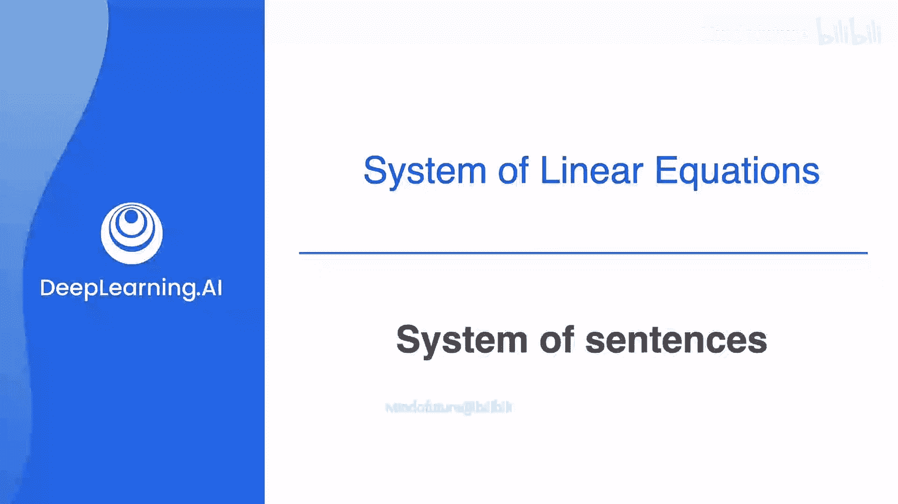
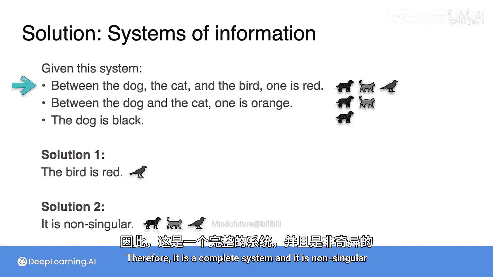

# 007：P07_句子系统

在本节课中，我们将要学习线性代数的一个基础概念：线性方程组。但在深入探讨方程之前，理解数学的语言至关重要。我们可以把方程看作是句子，它们为我们提供了关于世界的某些信息。当存在许多句子，或者说一个句子系统时，这些句子组合起来能提供更多信息。从合适的角度看，句子组合提供信息的方式与方程组合提供信息的方式非常相似。换句话说，句子系统的行为很像方程组，你将在下面的例子中看到这一点。

## 句子系统示例 🐕🐈

为了便于理解，我们假设你只有一只狗和一只猫，并且它们都只有一种颜色。你获得了一些信息，目标是尝试找出每只动物的颜色。

以下是三个不同的句子系统：

*   **系统一**：句子是“狗是黑色的”和“猫是橙色的”。
*   **系统二**：句子是“狗是黑色的”和“狗是黑色的”。
*   **系统三**：句子是“狗是黑色的”和“狗是白色的”。

这里使用的都是简单句，每个句子只包含一条信息。像“狗是黑色和白色的”这样的复合句不被允许，因为它们单独就包含了两条信息。一个系统的目标是用这些简单句尽可能多地传递信息。

## 系统类型：完整、冗余与矛盾 🔍

关于实现这个目标，请注意这些系统有很大不同。

*   **系统一**包含两个句子和两条信息。这意味着系统包含的信息量与句子数量一样多，这被称为**完整系统**。
*   **系统二**的信息量较少，它有两个句子，但它们完全相同。因此，尽管包含两个句子，系统只承载一条信息。句子重复了自身，因此这个系统被称为**冗余系统**。
*   **系统三**则很奇怪，因为句子之间相互矛盾。这是因为狗不能同时是黑色和白色。请记住，我们只有一只狗，它只能有一种颜色。所以这个系统被称为**矛盾系统**。

一个系统承载的信息越多，对你来说就越有用。为此，我们将引入一些你将在整个课程中使用的术语。

## 奇异与非奇异系统 📊

当一个系统是冗余的或矛盾的，它被称为**奇异系统**。当一个系统是完整的，它被称为**非奇异系统**。简而言之，非奇异系统是一个承载的信息量与句子数量一样多的系统，因此是信息量最大的系统。奇异系统的信息量则少于非奇异系统。

## 更复杂的句子系统示例 🐕🐈🐦

句子系统可以包含两个以上的句子，事实上，它可以包含任意多个。以下是一些包含三个句子的系统示例。

在这个新例子中，你有三只动物，再次尝试确定它们的颜色。

*   **系统一**：句子是“狗是黑色的”、“猫是橙色的”和“鸟是红色的”。
*   **系统二**：句子是“狗是黑色的”、“狗是黑色的”和“鸟是红色的”。
*   **系统三**：句子是“狗是黑色的”、“狗是黑色的”和“狗是黑色的”。
*   **系统四**：句子是“狗是黑色的”、“狗是白色的”和“鸟是红色的”。

第一个系统是完整的，因为它用三个句子承载了三条不同的信息，所以它是完整的、非奇异的。第二个系统是冗余的、奇异的，因为第一句和第二句说的完全一样。第三个系统也是冗余的，因为所有句子都说同一件事。第四个系统是矛盾的，因为狗不能同时是黑色和白色。

请注意，第三个系统比第二个系统更冗余（第二个系统只有两句说“狗是黑色的”）。是否存在衡量系统冗余程度的方法？答案是肯定的，它被称为**秩**，你将在本周稍后学习这个概念。在奇异性和非奇异性方面，术语和之前完全一样：第一个系统是非奇异的，因为它是完整的；其他三个系统是奇异的，因为它们要么冗余，要么矛盾。

## 综合应用与判断 🧩

现在，系统可以比我们之前看到的更复杂一些。考虑以下句子系统：

*   **句子S1**：在狗、猫和鸟之中，有一只是红色的。
*   **句子S2**：在狗和猫之中，有一只是橙色的。
*   **句子S3**：狗是黑色的。

**问题一**：你能推断出鸟是什么颜色吗？
**问题二**：这个系统是奇异的还是非奇异的？

**解答**：
对于问题一，鸟是红色的。为什么？看第三个句子，它说狗是黑色的。现在你知道了在整个系统中狗是黑色的。再看第二个句子，它说在狗和猫之中有一只是橙色的。既然狗是黑色的，那么猫必须是橙色的。最后，第一个句子说在三只动物中有一只是红色的。既然狗是黑色的，猫是橙色的，那么我们必须得出结论：鸟必须是红色的。

对于问题二，既然你推断出了三只动物的颜色，这意味着系统用三个句子承载了三条信息。换句话说，它没有冗余，也没有矛盾。它承载的信息量与句子数量一样多，因此它是一个完整系统，并且是**非奇异的**。

## 总结 📝

本节课中我们一起学习了如何将句子系统作为理解线性方程组概念的类比。我们定义了三种基本的系统类型：**完整（非奇异）**、**冗余（奇异）** 和 **矛盾（奇异）**。一个非奇异系统承载的信息量与其包含的句子数量相等，是最有用的系统。我们还通过更复杂的例子练习了如何从相互关联的句子中推导信息，并判断系统的奇异性。理解这些基础概念将为后续学习线性代数中的方程组求解打下坚实的基础。