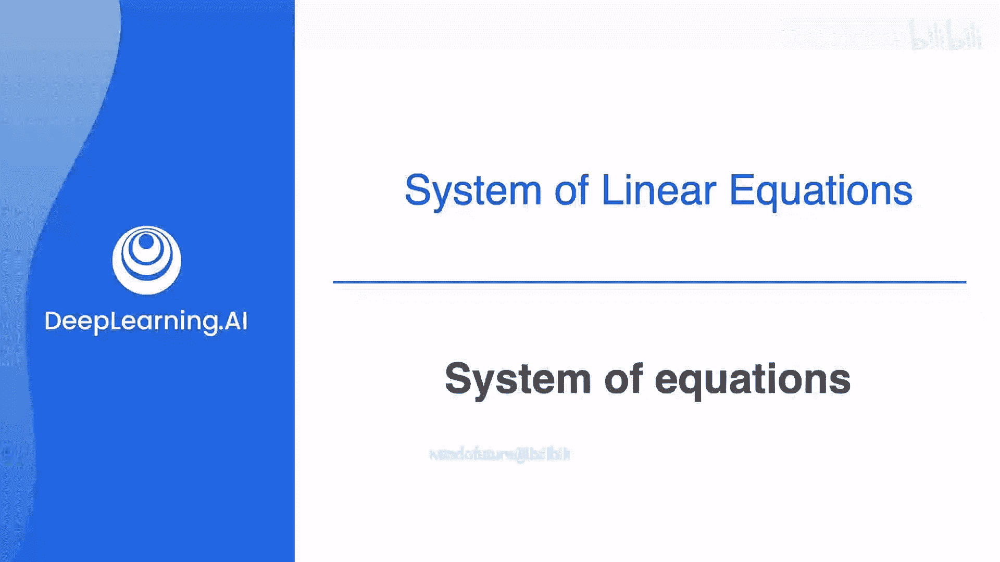
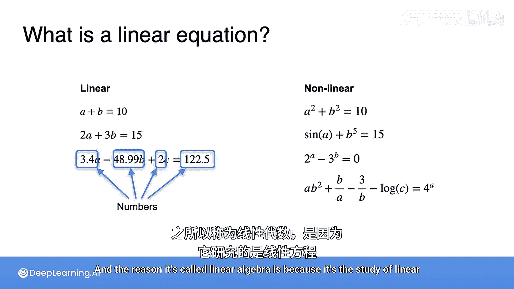

# 008：线性方程组入门 🍎🍌🍒

在本节课中，我们将要学习线性代数的核心基础之一：线性方程组。我们将了解什么是线性方程，什么是线性方程组，并学习如何通过简单的推理来求解它们。通过类比日常生活中的句子，我们将理解方程组可能具有唯一解、无穷多解或无解的情况。

---

## 什么是线性方程？📝

正如之前提到的，方程在很多方面类似于句子，它们都是提供信息的陈述。线性方程是一种特殊的方程，它遵循特定的规则。

一个线性方程可以包含任意多个变量（如 `a`, `b`, `c`），但必须满足以下形式：**变量只能与数字（标量）相乘，然后相加或相减，最后可以加上一个常数**。

**公式**：`c₁*a + c₂*b + c₃*c + ... + cₙ*xₙ = d`，其中 `c₁, c₂, ..., cₙ` 和 `d` 是常数。

例如：
*   `a + b = 10`
*   `2a + 3b = 15`
*   `4a - 48.99b + 2c = 122.5`

相反，非线性方程则复杂得多，可能包含变量的平方（如 `a²`）、变量相乘（如 `a*b`）、三角函数（如 `sin(a)`）、指数（如 `2^a`）或对数等。

---

## 从生活问题到方程组 🛒

为了更好地理解，让我们从一个简单的购物问题开始。假设你去一家奇怪的水果店，商品没有标价，你只能在结账时知道总价。你想通过记录不同组合的总价来推断每种水果的单价。

**问题1**：
*   第一天：你买了1个苹果和1个香蕉，花了10元。
*   第二天：你买了1个苹果和2个香蕉，花了12元。
*   问：苹果和香蕉的单价各是多少？

我们可以将这个问题转化为方程组。设苹果价格为 `a`，香蕉价格为 `b`。

**方程组**：
1.  `a + b = 10`
2.  `a + 2b = 12`

---

## 求解第一个方程组 🔍

上一节我们介绍了如何将生活问题转化为线性方程组。本节中，我们来看看如何求解这个简单的方程组。

以下是求解步骤：
1.  比较两个方程。方程2比方程1多买了1个香蕉，多花了2元。
2.  因此，可以推断出：**1个香蕉的价格是2元**。
3.  将 `b = 2` 代入方程1：`a + 2 = 10`。
4.  解得：**苹果的价格是8元**。

所以，这个方程组的解是：`a = 8`, `b = 2`。这是一个**唯一解**。

---

## 扩展到三个未知数 🍒

现在，让我们挑战一个更复杂的问题，涉及三种水果。

**问题2**：
*   第一天：1苹果 + 1香蕉 + 1樱桃 = 10元
*   第二天：1苹果 + 2香蕉 + 1樱桃 = 15元
*   第三天：1苹果 + 1香蕉 + 2樱桃 = 12元
*   问：苹果、香蕉、樱桃的单价各是多少？

设价格分别为 `a`, `b`, `c`。

**方程组**：
1.  `a + b + c = 10`
2.  `a + 2b + c = 15`
3.  `a + b + 2c = 12`

求解思路与两个未知数时类似：
1.  比较方程1和方程2：多1个香蕉，多5元 → `b = 5`。
2.  比较方程1和方程3：多1个樱桃，多2元 → `c = 2`。
3.  将 `b=5`, `c=2` 代入方程1：`a + 5 + 2 = 10` → `a = 3`。

因此，解为：`a = 3`, `b = 5`, `c = 2`。这同样是一个**唯一解**。

---

## 方程组的不同类型：无穷多解 🔄

并非所有方程组都能得出唯一答案。有时信息可能不足。

**问题3**：
*   第一天：1苹果 + 1香蕉 = 10元
*   第二天：2苹果 + 2香蕉 = 20元

**方程组**：
1.  `a + b = 10`
2.  `2a + 2b = 20`

观察发现，方程2其实就是方程1的两倍（`2*(a+b) = 2*10`）。这两个方程本质上是**同一个信息**的重复。就像有人说“狗是黑色的”说了两遍，并没有提供新信息。

因此，我们无法确定唯一的价格。任何两个相加等于10的数都是解，例如 (8,2), (5,5), (0,10) 等。这个方程组有**无穷多解**，我们称其为**冗余的**或**奇异的**。

---

## 方程组的不同类型：无解 ❌

还有一种情况是方程组内部矛盾。

**问题4**：
*   第一天：1苹果 + 1香蕉 = 10元
*   第二天：2苹果 + 2香蕉 = 24元

**方程组**：
1.  `a + b = 10`
2.  `2a + 2b = 24`

根据方程1，两倍的组合应该是20元（`2*(a+b) = 20`），但方程2却说是24元。这两个信息**相互矛盾**，就像说“狗是黑色的”和“狗是白色的”一样。

因此，这个方程组**没有解**，我们称其为**矛盾的**或**奇异的**。

---

## 更多练习与总结 📚

上一节我们探讨了方程组可能出现的三种情况。现在，我们通过更多练习来巩固理解。

以下是三个需要判断的方程组：

**系统2**：
1.  `a + b + c = 10`
2.  `a + b + 2c = 15`
3.  `a + b + 3c = 20`

**系统3**：
1.  `a + b + c = 10`
2.  `a + b + 2c = 15`
3.  `a + b + 2c = 13`

**系统4**：
1.  `a + b + c = 10`
2.  `2a + 2b + 2c = 20`
3.  `3a + 3b + 3c = 30`

**解答**：
*   **系统2**：从方程1到2，多一个 `c` 多5元，所以 `c=5`。方程3比方程2又多一个 `c` 和多5元，信息重复。将 `c=5` 代入方程1得 `a+b=5`。因此，任何满足 `a+b=5` 且 `c=5` 的三元组都是解，系统有**无穷多解**。
*   **系统3**：从方程1和2可得 `c=5`。但从方程2和3看，多付了-2元（矛盾），或者说方程3直接与方程2矛盾（15 ≠ 13）。因此，系统**无解**。
*   **系统4**：方程2是方程1的2倍，方程3是方程1的3倍。三个方程本质是同一个。因此，任何三个相加等于10的数都是解，系统有**无穷多解**。

---

## 总结 🎯

本节课中我们一起学习了线性方程组的基础知识：
1.  **线性方程**是变量仅与标量相乘后相加，并可能加上一个常数的方程。
2.  多个线性方程构成**线性方程组**。
3.  通过对比方程间的差异，可以像解谜一样求解方程组。
4.  方程组有三种可能的结果：
    *   **唯一解**：方程组提供的信息恰好足够，能确定每个变量的唯一值。系统是**完备的、非奇异的**。
    *   **无穷多解**：方程组提供的信息不足（方程冗余），无法确定唯一值。系统是**冗余的、奇异的**。
    *   **无解**：方程组内的信息相互矛盾。系统是**矛盾的、奇异的**。

理解这些概念是学习线性代数的第一步，它们为我们后续学习矩阵、向量空间等更高级的主题奠定了坚实的基础。