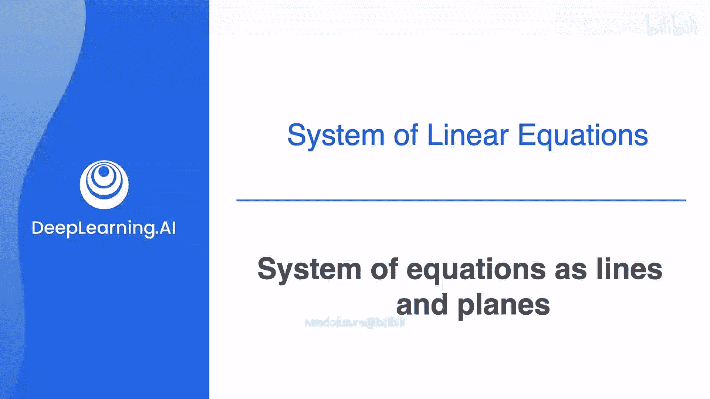
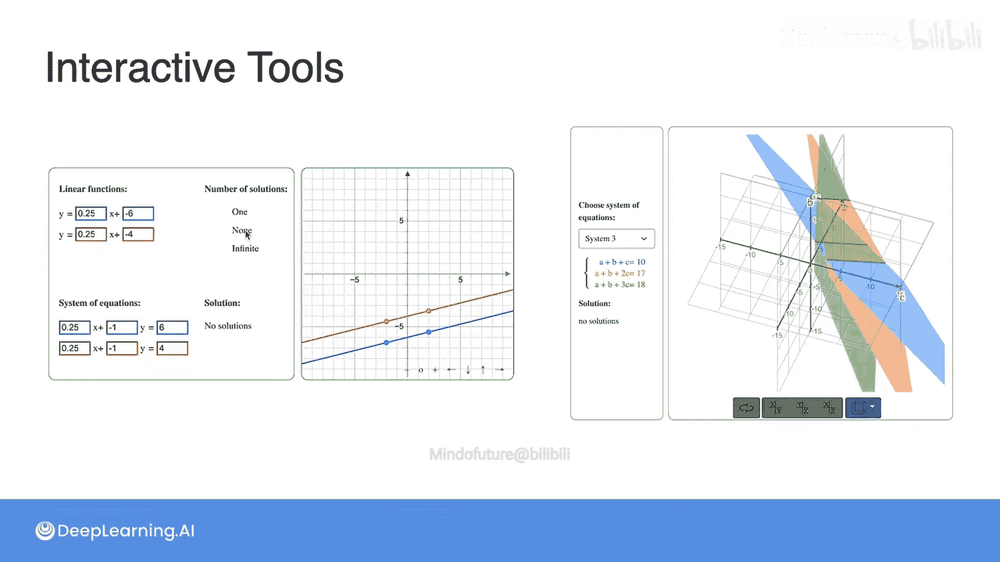

# 009：方程组可视作直线与平面

在本节课中，我们将学习如何将线性方程组可视化为坐标系中的直线和平面。通过几何视角，我们可以更直观地理解方程组的解、奇异性与非奇异性等概念。

## 二维方程组：可视化为直线

上一节我们介绍了线性方程组及其奇异性。本节中，我们来看看如何将它们可视化。线性方程可以很容易地在坐标平面中可视化为直线。

这是因为方程有两个变量。如果有三个变量，它们在空间中就是平面。变量更多时，它们看起来就像是高维物体，但我们暂时先不担心那些。

既然线性方程可以表示为直线，那么线性方程组就可以表示为平面中直线的排列。这样，你可以更清晰地可视化它们的解以及奇异性或非奇异性。

那么，如何将一个方程（例如 `a + b = 10`）可视化为一条直线呢？

首先，我们建立一个坐标系，其中横轴代表 `a`（苹果的价格），纵轴代表 `b`（香蕉的价格）。

现在，我们来看这个方程 `a + b = 10` 的解，也就是和为10的数对。我们将把这些解画在这个图上。

以下是该方程的一些解：
*   `(10, 0)`：苹果价格为10，香蕉价格为0，因为 `10 + 0 = 10`。
*   `(0, 10)`：苹果价格为0，香蕉价格为10。
*   `(4, 6)`：因为 `4 + 6 = 10`。
*   `(8, 2)`：`a = 8`，`b = 2`。

注意，也可以有负数的解，例如 `(-4, 14)`。虽然在现实问题中苹果价格不可能为-4没有意义，但 `-4 + 14 = 10`，所以它确实是方程的一个合法解。同样，`(12, -2)` 也是一个解。

现在，请注意所有这些点都落在一条直线上。事实上，这条直线上的每一个点都是方程的解。因此，我们可以将方程 `a + b = 10` 与这条直线关联起来。

现在，我们来看另一个方程，例如 `a + 2b = 12`。这意味着横坐标加上两倍纵坐标等于12的点。

以下是该方程的一些解：
*   `(0, 6)`：因为 `0 + 2*6 = 12`。
*   `(12, 0)`：因为 `12 + 2*0 = 12`。
*   `(8, 2)`：因为 `8 + 2*2 = 12`。
*   同样，也有负解，如 `(-4, 8)`，因为 `-4 + 2*8 = 12`。

同样，这些点也形成一条直线，直线上的每个点都是该方程的解。所以，这条直线与方程 `a + 2b = 12` 相关联。

一个小提示：你可能熟悉直线的斜率和截距概念。左边直线的斜率是 `-1`，因为每向右移动一个单位，直线就向下移动一个单位（向下为负）。右边直线的斜率是 `-1/2`，因为每向右移动一个单位，直线向下移动半个单位。左边直线的y轴截距是10（直线与纵轴的交点高度），右边直线的y轴截距是6。

有趣的地方来了：每个方程都关联一条直线。那么由两个方程组成的方程组呢？

由两个方程组成的方程组，简单地关联到同一平面上的两条直线。

注意，这两条直线在一个唯一点相交，即点 `(8, 2)`（`a=8`, `b=2`）。这个点正是该方程组的唯一解。这正是我们之前用代数方法得到的结果，但现在我们可以从几何上看到它。

既然我们知道如何画出方程 `a + b = 10` 的直线，让我们试试另一个：`2a + 2b = 20`。

我们会注意到，这条直线仍然经过点 `(0, 10)` 和 `(10, 0)`。由于直线由两点定义，这条直线与方程 `a + b = 10` 所表示的直线完全相同。我们在前几课学过，方程 `a + b = 10` 和 `2a + 2b = 20` 携带相同的信息，这是一个视觉上的确认。

现在，当我们想找到这个方程组的解时，没有单一的交点。相反，两条直线完全重合，它们是同一条直线。现在的情况是，属于这两条直线的每一个点都是方程组 `a + b = 10` 和 `2a + 2b = 20` 的解。这意味着我们有无穷多个解，因为那条直线上的每个点都是解。

最后，让我们看看我们的方程组：`a + b = 10` 和 `2a + 2b = 24`。我们来画出右边这个方程。注意，方程 `2a + 2b = 24` 的直线经过点 `(0, 12)` 和 `(12, 0)`，因为 `2*0 + 2*12 = 24` 且 `2*12 + 2*0 = 24`。因此，它必须是这条线，它与原始直线非常相似，只是向上平移了两个单位。

所以，当我们试图找到这个方程组的解时，请看：由两个方程组成的方程组关联到同一平面上的这两条直线，而它们是平行的。平行线永不相交，因此这个方程组没有解。没有点同时属于这两条直线，所以方程组无解。

## 总结与分类

现在，让我们总结一下你在本视频中看到的内容。有三个方程组：
1.  第一个：`a + b = 10` 和 `a + 2b = 12`。
2.  第二个：`a + b = 10` 和 `2a + 2b = 20`。
3.  第三个：`a + b = 10` 和 `2a + 2b = 24`。

以下是这三个方程组的图示：
*   第一个对应两条相交于唯一点 `(8, 2)` 的直线，所以这是该方程组的唯一解。
*   第二个对应两条完全重合的直线，对应于一个有无穷多解的方程组。
*   第三个对应两条永不相交的平行线，这意味着方程组无解。

因此，我们可以使用与方程和方程组相同的术语。由于第一个方程组有唯一解，它是完备的且是非奇异的，因为每条直线都带来了新的信息。第二个方程组有无穷多解，因为第二条直线与第一条完全相同，所以该方程组是冗余的且是奇异的，第二条直线没有带来任何新信息。最后，由于第三个方程组对应两条永不相交的直线，意味着第二个方程与第一个矛盾，我们没有解；因此，该方程组是矛盾的且是奇异的。

## 小测验

现在你准备好做一个小测验了。

问题1：以下哪个图对应于方程组 `3a + 2b = 8` 和 `2a - b = 3`？

问题2：通过观察问题1的图，你得出结论该方程组是奇异的还是非奇异的？

答案是：为了画出这些直线，你可以注意到方程 `3a + 2b = 8` 的直线经过点 `(0, 4)` 和 `(8/3, 0)`，方程 `2a - b = 3` 的直线经过点 `(0, -3)` 和 `(3/2, 0)`。注意，这两条直线在点 `(2, 1)` 相交，这正是该方程组的唯一解（`a = 2`, `b = 1`）。由于两条直线在一个唯一点相交，因此该方程组是非奇异的。

## 三维方程组：可视化为平面

类似地，一个包含三个变量的线性方程在三维空间中表示为一个平面。

在右侧，你有一个具有三个轴的三维空间：横轴 `A`，纵轴 `B`，以及应该从屏幕伸出并指向你鼻子的 `C` 轴。

那么，例如，方程 `a + b + c = 1` 的图像在空间中看起来是什么样子呢？

让我们看一些属于这个图像的点。例如，点 `(1, 0, 0)` 属于这里，因为 `1 + 0 + 0 = 1`。这是 `a` 坐标为1，其他两个为0的点。点 `(0, 1, 0)` 也属于这里，因为 `0 + 1 + 0 = 1`。最后，点 `(0, 0, 1)` 也属于这个图像。三个点定义一个平面，实际上，经过这三个点的整个平面就是方程 `a + b + c = 1` 的解集。

因此，就像两个变量的线性方程对应于平面中的一条直线一样，三个变量的线性方程对应于空间中的一个平面。

在常数项为0的特殊情况下，例如方程 `3a - 5b + 2c = 0`，该平面必须经过原点 `(0, 0, 0)`。原因在于，如果我们设 `a = 0`, `b = 0`, `c = 0`，这是方程的一个解，因为 `3*0 + (-5)*0 + 2*0 = 0`。

## 三维方程组的解集类型

现在，就像我们过去通过相交直线来获得方程组的解点一样，你也可以相交平面。请看，这里我们不太关心获得完全正确的可视化，因为这些东西在二维中很难可视化。然而，我们将关注这些平面的相交方式。

对于这个方程组：`a + b + c = 0`, `a + 2b + c = 0`, `a + b + 2c = 0`，让我们看看。第一个方程对应一个经过原点 `(0,0,0)` 的平面。第二个方程对应另一个经过原点的平面，这两个平面相交于一条直线。第三个方程对应另一个经过原点的平面，这三个平面相交于一个唯一点，正是原点 `(0,0,0)`。这很重要，因为这是一个非奇异系统，它有唯一解，且该唯一解是原点。

现在让我们看系统2。第一个方程又是一个平面，第二个方程是另一个平面，两者都经过原点并相交于一条直线。这个系统是奇异的，所以发生的情况是，第三个平面也经过原点并与前两个平面相交，但它实际上与前两个平面在同一条直线上相交。所以，这是三个都经过同一条直线的平面。因此，解集不仅仅是一个点，而是整条直线，所以方程组有多个解，这意味着系统是奇异的。

最后，我们有另一个系统，其方程为 `a + b + c = 0`, `2a + 2b + 2c = 0`, `3a + 3b + 3c = 0`。第一个对应一个平面。正如你之前所见，第二个方程只是第一个的倍数，所以它实际上是同一个方程。因此，它对应于完全相同的平面也就不足为奇了。第三个方程也对应于完全相同的平面。因此，该方程组的解集是平面上的每一个点，存在多个解，所以这个系统也是奇异的。

## 动手探索工具

接下来，你将有机会使用一些交互式工具，以动手实践的方式探索这些概念。

第一个工具允许你构建和操作二维（2x2）方程组，将它们可视化为平面中的直线，并观察系统的变化如何影响解的数量。

在第二个工具中，你可以在三维空间的几个方程组中进行选择，然后旋转这些方程在三维空间中的表示。

非常欢迎你自行探索这些工具，我也附上了使用说明和一些建议完成的活动。享受尝试的乐趣，完成后我们再见。

## 课程总结

本节课中，我们一起学习了如何将线性方程组几何化。我们看到了：
*   二维方程组可视化为平面上的直线，其解对应直线的交点。根据直线是相交、重合还是平行，方程组分别有唯一解、无穷多解或无解，对应非奇异或奇异系统。
*   三维方程组可视化为空间中的平面，其解对应平面的交点。平面可以相交于一点、一条直线或完全重合，同样对应不同的解的情况和系统特性。
*   这种几何视角为我们理解方程组的解和奇异性提供了直观且强大的工具。