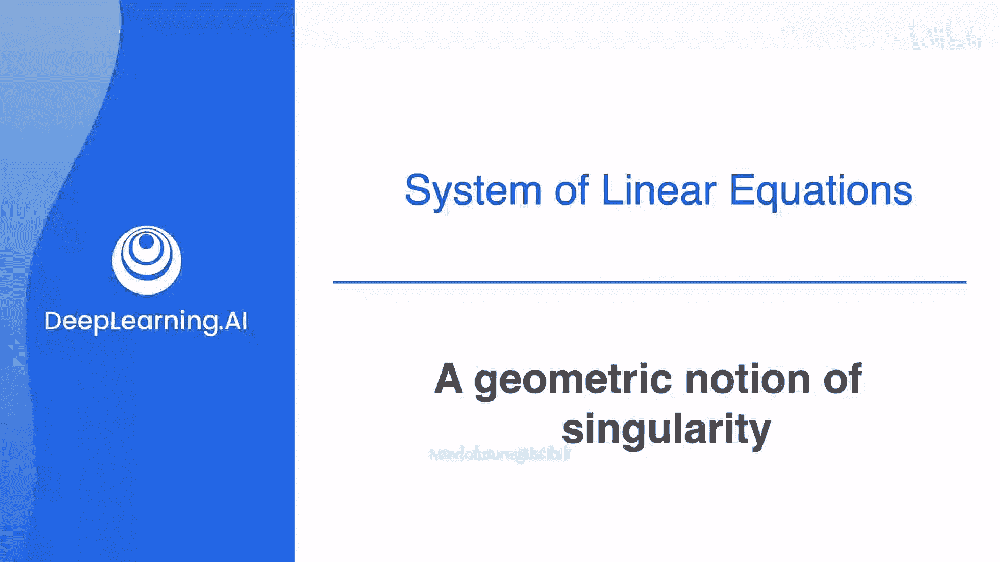
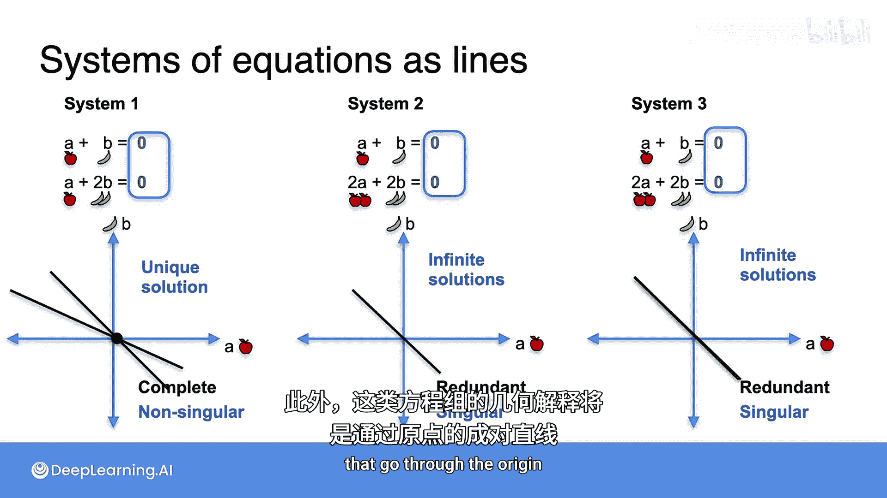

# 010：奇异性的几何概念

在本节课中，我们将学习如何通过更简洁的几何方式来理解线性方程组的“奇异性”与“非奇异性”。我们将通过简化方程组，聚焦于其核心的几何结构。

## 概述

之前，我们学习了线性方程组在平面中如何表示为直线，并且“非奇异性”意味着这些直线相交于唯一一点。本节将展示一种更简单的可视化方法，帮助我们更清晰地区分奇异与非奇异系统。

## 简化方程组：聚焦奇异性

以下是之前研究的三个系统：
*   **系统1**：有唯一解，是**完备且非奇异**的。
*   **系统2**：有无穷多解，是**冗余且奇异**的。
*   **系统3**：无解，是**矛盾且奇异**的。

现在，让我们暂时忽略方程组是完备、冗余还是矛盾，而将注意力集中在**奇异性**和**非奇异性**上。这是因为这两个术语将是整个课程的核心概念。

系统2和系统3都是奇异的，它们非常相似，因为都包含平行线。系统2中的两条线重合，系统3中的两条线平行但分离。它们都与非奇异的系统1有根本区别，因为系统1中的两条线不平行。

那么，能否将系统2和3合并考虑，从而将奇异和非奇异系统真正分为两类呢？答案是肯定的。

## 关键步骤：将常数项设为零

实现上述分类的方法是观察方程组中的**常数项**。常数项是方程中不伴随变量（如A或B）的数字。

例如：
*   系统1的常数项是10和12。
*   系统2的常数项是10和20。
*   系统3的常数项是10和24。

现在，让我们将所有这三个系统中的常数项都设为零，看看图形会发生什么变化。

将常数项设为零后，图形变为：

这是因为新的方程组总是以 `(0, 0)` 作为解，因此所有直线都必须经过原点。如果将任何方程中的A和B都设为0，方程依然成立，所以 `(0, 0)` 是所有新方程组的解。

观察变化：
*   **系统1** 仍然是一对相交的直线，因此仍有唯一解，依然是**完备且非奇异**的。
*   **系统2** 仍然是一对重合的直线，因此仍有无穷多解，依然是**冗余且奇异**的。
*   **系统3** 则从一对不相交的平行线，变成了一对重合的直线。因此，它从“无解”变为“有无穷多解”，即从**矛盾**变为**冗余**。然而，至关重要的是，它和之前一样，仍然是**奇异**的。

## 结论与意义

综上所述，**方程组中的常数项并不影响判断该系统是奇异还是非奇异**。对于本课程的后续部分，**奇异性**和**非奇异性**将是核心概念，而完备性、冗余性和矛盾性将较少使用。

因此，从现在开始，我们可以主要考虑常数项始终为零的方程组，这大大简化了问题。此外，这些系统的几何解释将简化为**经过原点的直线对**，这使得分析其奇异性变得更加直观。

## 总结

本节课中，我们一起学习了如何通过将常数项设为零来简化线性方程组的几何表示。我们发现，这一操作不改变系统的奇异性本质，但能让我们更清晰地看到：非奇异系统对应经过原点且相交的直线，而奇异系统则对应经过原点且平行（包括重合）的直线。这为我们后续深入学习线性代数奠定了重要的几何直观基础。