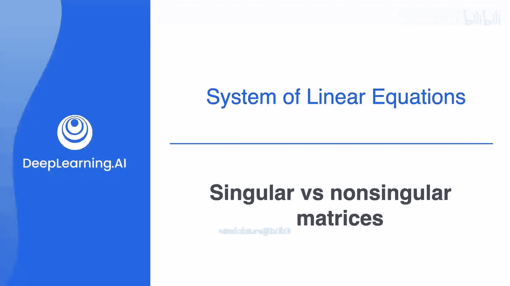
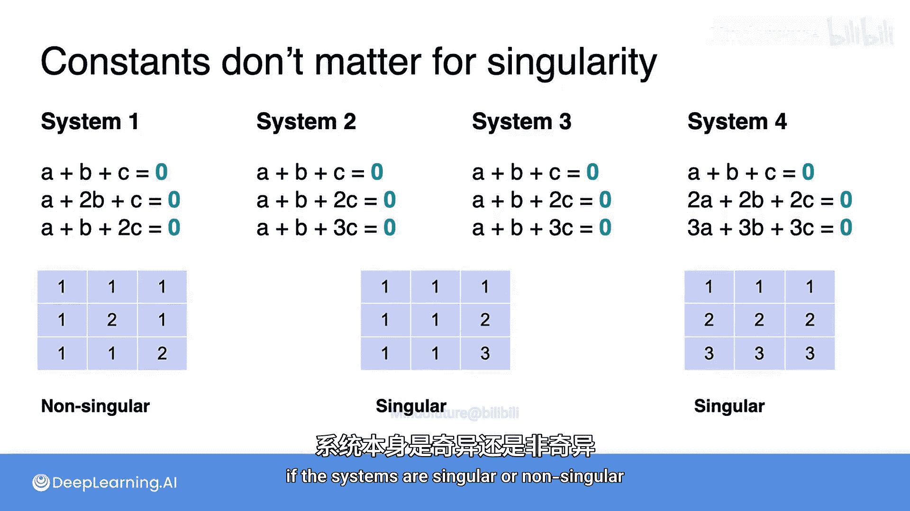

# 011：矩阵与奇异性 🧮

在本节课中，我们将要学习线性代数中最核心的对象之一：矩阵。我们将了解矩阵如何从线性方程组中自然地产生，并学习如何判断一个矩阵是“奇异”还是“非奇异”。

上一节我们介绍了线性方程组的奇异性概念，本节中我们来看看如何将这些概念扩展到矩阵上。

## 从方程组到矩阵

回顾之前看到的两个方程组，当我们将常数项设为零后，系统2和系统3合并为了同一个系统。由于常数项为零，我们可以忽略它们，只关注变量A和B的系数。

以下是构建矩阵的方法：将这些系数放入一个2行2列的矩形框中，这个框就称为矩阵。

*   第一个方程组对应的矩阵是 `[[1, 1], [1, 2]]`。
*   第二个方程组对应的矩阵是 `[[1, 1], [2, 2]]`。

在这个矩阵中，**每一行对应一个方程，每一列对应一个变量的系数**（第一列是A的系数，第二列是B的系数）。

因此，矩阵本质上就是一个排列在矩形中的数字阵列。这些是简单的2x2矩阵，在后续课程中您会看到更大的矩阵。

## 矩阵的奇异性

矩阵，就像线性方程组一样，也可以分为奇异或非奇异。

*   由于第一个方程组有唯一解（非奇异），我们称其对应的矩阵是**非奇异的**。
*   由于第二个方程组有无穷多解（奇异），我们称其对应的矩阵是**奇异的**。

当然，存在更快捷的方法来判断矩阵的奇异性，而无需求解其对应的方程组。

## 扩展到三变量系统

在之前的视频中，我们求解了四个包含三个方程和三个未知数的系统，发现：
1.  第一个有唯一解。
2.  第二个有无穷多解。
3.  第三个无解。
4.  第四个有无穷多解。

沿用之前的术语，第一个是“完备的”，第二和第四个是“冗余的”，第三个是“矛盾的”。第一个是非奇异的，而其他三个都是奇异的。

与二元方程组类似，判断系统奇异性的一种简便方法是将常数项设为零，然后研究这个新系统。

以下是简化后（常数项为零）各系统的解：

1.  **第一个系统**：我们知道它有唯一解（非奇异）。此外，`(0, 0, 0)` 是一个解，因为将A、B、C设为零满足所有方程为0的条件。因此，**唯一解就是 `(0, 0, 0)`**。该系统是完备且非奇异的。
2.  **第二和第三个系统**：将常数项设为零后，它们变成了同一个系统。观察方程1和2，方程2只比方程1多了一个C项，而结果必须为0，因此 **`C = 0`**。将其代入第一个方程，得到 **`A + B = 0`**，即 **`A = -B`**。所以，所有满足“第一坐标等于第二坐标的相反数，且第三坐标为0”的点都是解。该系统是冗余且奇异的。
3.  **第四个系统**：其解是所有三个坐标之和为0的点。这意味着A和B可以是任意值，而 **`C` 必须等于 `-A - B`**。该系统也是冗余且奇异的。

## 构建系数矩阵

与之前一样，每个系统都关联一个记录其系数的矩阵。同样，**每一行对应一个方程，每一列对应变量A、B、C的系数**。

以下是各系统对应的矩阵：
*   系统1：`[[1, 1, 0], [1, 1, 1], [1, 2, 3]]`
*   系统2：`[[1, 1, 0], [1, 1, 1], [2, 2, 1]]`
*   系统3：`[[1, 1, 0], [1, 1, 1], [2, 2, 1]]` （与系统2相同）
*   系统4：`[[1, 1, 1], [1, 1, 1], [1, 1, 1]]`

沿用之前的表示法，这些矩阵根据其对应系统的奇异性，被相应地称为**奇异的**或**非奇异的**。

---

本节课中我们一起学习了矩阵的基本概念，它是线性代数中组织和处理系数数据的核心工具。我们了解到矩阵可以直接从线性方程组的系数中构建，并且继承了方程组的“奇异性”属性：**非奇异矩阵对应有唯一解的系统，而奇异矩阵对应无解或有无穷多解的系统**。理解矩阵的奇异性是深入学习线性代数及其在机器学习中应用的关键第一步。