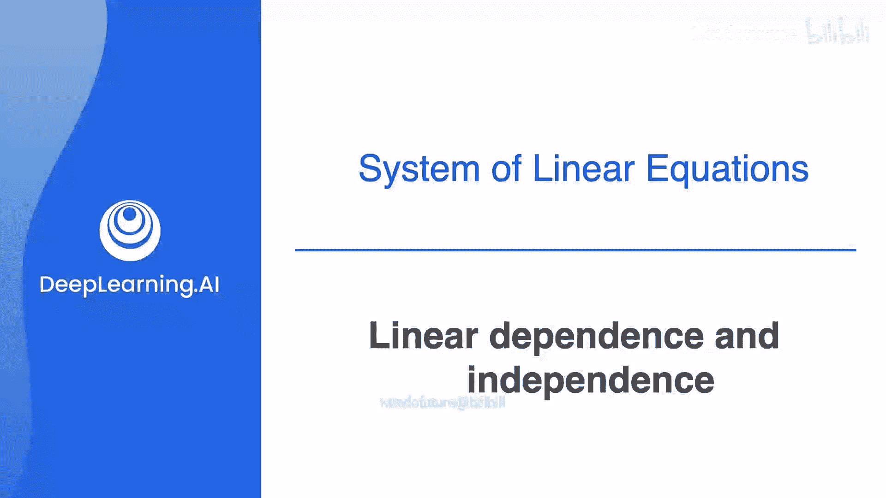
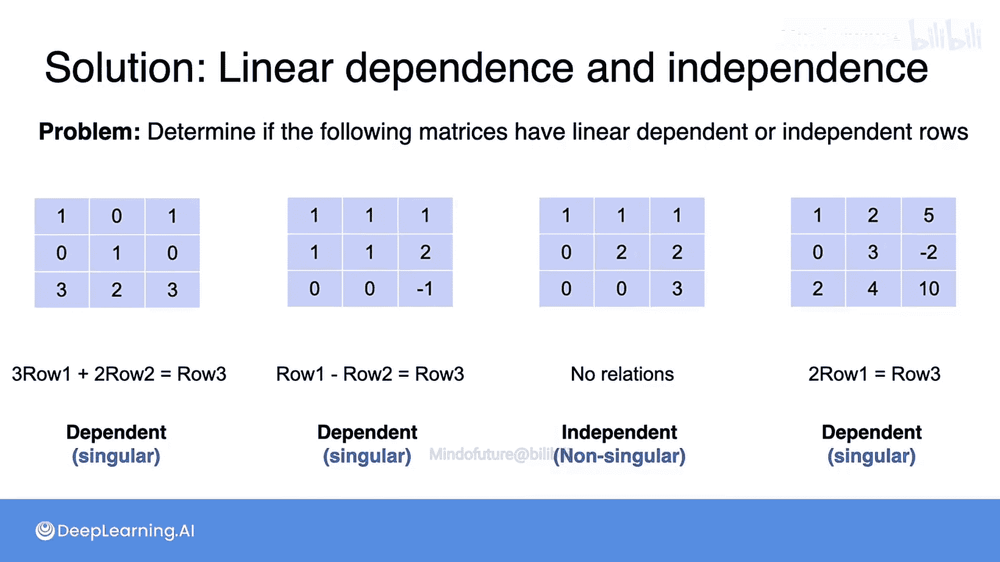

# 012：线性相关与线性无关




在本节课程中，我们将学习如何判断一个矩阵是奇异的还是非奇异的，而无需直接求解线性方程组。我们将引入并深入理解“线性相关”与“线性无关”这两个核心概念。

## 从方程组到矩阵的依赖关系

上一节我们讨论了奇异与非奇异方程组。现在，我们来看看这些性质如何体现在对应的矩阵上。

一个方程组是奇异的，通常意味着其中一个方程可以由其他方程组合得到，没有提供新的信息。类似地，对于一个矩阵，如果其中一行（或一列）可以由其他行（或列）通过线性组合得到，我们就说这些行（或列）是**线性相关**的，对应的矩阵是奇异的。反之，如果没有任何一行（或一列）能被其他行（或列）线性表示，则它们是**线性无关**的，矩阵是非奇异的。

让我们回顾之前见过的两个方程组及其矩阵，重点关注右侧的奇异系统。

这个系统奇异的原因是第二个方程是第一个方程的倍数。具体来说，第二个方程是第一个方程的两倍。这意味着，如果将第一个方程左右两边都乘以2，就得到了第二个方程。

观察对应的矩阵，第二行也是第一行的倍数。将第一行的每个元素乘以2，就得到了第二行。因此，第二行可以由第一行得到，我们说第二行依赖于第一行。同样，第一行也可以由第二行乘以1/2得到。所以，它们彼此依赖，是**线性相关**的。

相比之下，左侧的非奇异系统中，第二个方程不是第一个方程的倍数，反之亦然。没有任何常数能使一个方程通过缩放变成另一个方程。因此，每个方程都提供了独立的信息。在对应的矩阵中，同样，没有任何一行是另一行的倍数，行与行之间是**线性无关**的。

## 理解线性相关

对于更大的矩阵，线性相关性的概念会更复杂一些，但本质依然直观。为了深入理解，我们来看几个例子。

考虑以下包含三个方程和三个未知数的系统：
方程1：`a = 1`
方程2：`b = 2`
方程3：`a + b = 3`

注意，`c`没有出现，但这不影响。这个系统是奇异的，因为第三个方程就是前两个方程的和。具体来说，第一个方程可写为 `1*a + 0*b + 0*c = 1`，第二个是 `0*a + 1*b + 0*c = 2`，将它们相加得到 `1*a + 1*b + 0*c = 3`，这正是第三个方程。

现在看该系统的系数矩阵（忽略常数项）：
```
[1, 0, 0]
[0, 1, 0]
[1, 1, 0]
```
正如第三个方程是前两个方程的和，矩阵的第三行也是前两行的和（`[1,0,0] + [0,1,0] = [1,1,0]`）。因此，第三行依赖于第一行和第二行，这些行是**线性相关**的，矩阵是奇异的。

再看另一个系统，其矩阵为：
```
[1, 1, 1]
[2, 2, 2]
[3, 3, 3]
```
这个矩阵的行之间存在多种依赖关系。例如，第一行加第二行等于第三行（`[1,1,1] + [2,2,2] = [3,3,3]`）。同时，第二行是第一行的两倍，第三行是第一行的三倍。这是一个具有多重行依赖关系的奇异系统。

观察下面这个更微妙的奇异系统矩阵：
```
[1, 1, 2]
[1, 1, 2]
[2, 2, 4]
```
行之间有什么关系？如果将第一行和第三行相加，得到 `[3, 3, 6]`，再除以2，就得到了第二行 `[1.5, 1.5, 3]`？等等，这里似乎有误。让我们重新审视：第一行 `[1,1,2]`，第三行 `[2,2,4]`，相加得 `[3,3,6]`，其平均值（除以2）为 `[1.5, 1.5, 3]`，这并不等于第二行 `[1,1,2]`。原视频此处的例子可能不够准确，但其想表达的核心思想是：**如果某一行可以表示为其他行的线性组合（如加权和），则这些行线性相关**。

相比之下，对于一个非奇异系统，例如矩阵：
```
[1, 0, 0]
[0, 1, 0]
[0, 0, 1]
```
无论你怎么尝试，都无法用其中两行的任何线性组合来得到第三行。每一行都提供了独一无二的信息，因此这些行是**线性无关**的，矩阵是非奇异的。

## 判断练习

以下是判断矩阵行是否线性相关的小练习：

1.  矩阵 A：
    ```
    [1, 2]
    [3, 4]
    [5, 8]
    ```
    **判断**：线性相关。因为 `3 * [1, 2] + 2 * [3, 4] = [3+6, 6+8] = [9, 14]`？这并不等于 `[5, 8]`。原视频答案指出 `第一行*3 + 第二行*2 = 第三行`，即 `3*[1,2] + 2*[3,4] = [3,6] + [6,8] = [9,14]`，这显然不等于 `[5,8]`。此处原视频的示例或答案可能存在笔误。正确的线性相关例子应类似于：存在非全零的标量 `c1, c2, c3`，使得 `c1*行1 + c2*行2 + c3*行3 = 零向量`。对于练习，我们理解其意图即可：**若能找到一组非全零系数使行的线性组合为零向量，则相关**。

2.  矩阵 B：
    ```
    [1, 1, 1]
    [0, 1, 1]
    [1, 0, 0]
    ```
    **判断**：线性相关。因为第一行减去第二行等于 `[1,0,0]`，这正好是第三行。即 `1*行1 + (-1)*行2 + (-1)*行3 = 0`。

3.  矩阵 C：
    ```
    [1, 0, 0]
    [0, 1, 0]
    [0, 0, 1]
    ```
    **判断**：线性无关。这是单位矩阵，每一行（或列）都无法由其他行（或列）线性表示。

4.  矩阵 D：
    ```
    [1, 2, 3]
    [4, 5, 6]
    [2, 4, 6]
    ```
    **判断**：线性相关。因为第三行 `[2,4,6]` 是第一行 `[1,2,3]` 的两倍。即 `2*行1 + 0*行2 + (-1)*行3 = 0`。

## 核心概念总结

本节课中我们一起学习了线性代数中至关重要的概念——线性相关与线性无关。

*   **线性相关**：向量组（在本文中指矩阵的行或列）中，至少有一个向量可以由组内其他向量的线性组合表示。这意味着该向量没有提供新的、独立的信息。用公式表示，对于向量组 `{v1, v2, ..., vn}`，如果存在**不全为零**的标量 `c1, c2, ..., cn`，使得：
    `c1*v1 + c2*v2 + ... + cn*vn = 0`
    则这些向量线性相关。
*   **线性无关**：向量组中，任何一个向量都无法由组内其他向量的线性组合表示。所有向量都提供独立的信息。即，只有当所有标量 `c1, c2, ..., cn` 都为零时，上述线性组合才等于零向量。
*   **与矩阵奇异性关系**：对于一个方阵，如果它的行向量（或列向量）是线性相关的，那么该矩阵是**奇异矩阵**，不可逆，其对应的线性方程组可能无解或有无穷多解。如果行向量（或列向量）是线性无关的，那么该矩阵是**非奇异矩阵**，可逆，其对应的线性方程组有唯一解。

理解这两个概念是掌握矩阵性质、求解线性方程组以及后续学习向量空间、秩等高级主题的基础。



