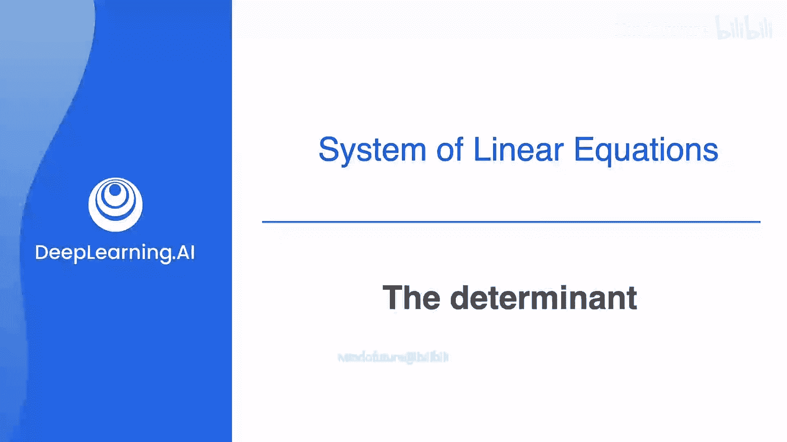

# 013：行列式入门



在本节课中，我们将要学习一个判断矩阵是否可逆（非奇异）的快速方法——行列式。我们将从二阶矩阵开始，逐步扩展到三阶矩阵，并理解行列式为零与矩阵奇异性之间的关系。

## 概述

上一节我们介绍了矩阵的奇异性概念。本节中，我们来看看如何通过一个简单的数值计算——行列式，来快速判断一个矩阵是奇异的还是非奇异的。

## 二阶矩阵的行列式

对于一个二阶矩阵，其行列式有一个非常直接的计算公式。如果矩阵的条目为 A, B, C, D，即：
```
| A  B |
| C  D |
```
那么该矩阵的行列式（Determinant）计算公式为：
**det = A * D - B * C**

这个公式的几何意义可以理解为：计算主对角线（从左上到右下）上元素的乘积，减去反对角线（从右上到左下）上元素的乘积。

### 行列式与奇异性的关系

通过构造可以发现，行列式的值直接反映了矩阵的奇异性：
*   当 **det = 0** 时，矩阵是**奇异**的（不可逆）。
*   当 **det ≠ 0** 时，矩阵是**非奇异**的（可逆）。

这是因为行列式为零的条件 `A*D - B*C = 0`，等价于存在一个数 k，使得第一行乘以 k 等于第二行，即行向量线性相关，这正是矩阵奇异的定义。

### 示例与练习

以下是两个矩阵的行列式计算示例：
1.  对于矩阵 `[[1, 1], [1, 2]]`，其行列式为 `1*2 - 1*1 = 1`（非零，故矩阵非奇异）。
2.  对于矩阵 `[[1, 1], [2, 2]]`，其行列式为 `1*2 - 1*2 = 0`（为零，故矩阵奇异）。

现在，你可以尝试一个练习：
*   **问题一**：计算矩阵 `[[5, 1], [-1, 3]]` 和 `[[2, -1], [-6, 3]]` 的行列式。
*   **问题二**：根据问题一的结果，判断这两个矩阵是奇异的还是非奇异的。

**答案**：
*   第一个矩阵的行列式为 `5*3 - 1*(-1) = 16`，非零，因此是**非奇异**矩阵。
*   第二个矩阵的行列式为 `2*3 - (-1)*(-6) = 0`，为零，因此是**奇异**矩阵。

## 三阶矩阵的行列式

对于三阶矩阵，行列式的计算比二阶矩阵稍复杂，但核心思想类似。我们不再只是看两条对角线，而是需要扩展这个概念。

### 计算方法：对角线法则（萨鲁斯法则）

计算三阶矩阵行列式的一种常用方法是“对角线法则”。具体步骤如下：
1.  将矩阵的第一、二列再次写在矩阵右侧。
2.  将所有**从左上到右下**方向的对角线（共3条）上元素的乘积相加。
3.  将所有**从右上到左下**方向的对角线（共3条）上元素的乘积相加。
4.  用第2步的和减去第3步的和，即得到行列式的值。

考虑矩阵：
```
| a  b  c |
| d  e  f |
| g  h  i |
```
其行列式计算为：
**det = a*e*i + b*f*g + c*d*h - c*e*g - b*d*i - a*f*h**

### 示例

让我们计算以下矩阵的行列式：
```
| 1  1  1 |
| 1  2  2 |
| 2  1  1 |
```
根据公式：
*   主对角线乘积：`1 * 2 * 1 = 2`
*   第二条对角线乘积：`1 * 2 * 2 = 4`
*   第三条对角线乘积：`1 * 1 * 1 = 1`
*   反对角线1乘积：`1 * 2 * 2 = 4`
*   反对角线2乘积：`1 * 1 * 1 = 1`
*   反对角线3乘积：`1 * 1 * 1 = 1`
因此，行列式 `det = (2+4+1) - (4+1+1) = 1`。

### 特殊矩阵：三角矩阵

对于上三角矩阵（主对角线以下元素全为零）或下三角矩阵，其行列式计算有一个捷径：**行列式的值等于主对角线上所有元素的乘积**。

例如，矩阵：
```
| 1  2  3 |
| 0  2  3 |
| 0  0  3 |
```
是一个上三角矩阵。其行列式直接等于 `1 * 2 * 3 = 6`。你可以用对角线法则验证，结果相同，因为所有包含零元素的乘积项都为零。

## 本周总结与后续安排

本节课中我们一起学习了行列式的概念及其计算方法。我们了解到，行列式是一个标量值，它能快速判断矩阵的奇异性：行列式为零对应奇异矩阵，行列式非零对应非奇异矩阵。我们分别学习了两阶和三阶矩阵的行列式计算。

在接下来的课程中，你将有机会通过实践来加深理解。本周安排了两项实验：
*   **实验一**：介绍 NumPy 库及其核心数据结构——数组。如果你已熟悉 NumPy，可以快速浏览。
*   **实验二**：展示如何使用 NumPy 表示方程组，并利用 Python 绘图库可视化这些系统。


这两项实验虽不计分，但能为后续课程提供重要的基础知识。最后，本周将以一个涵盖所有学习主题的计分测验作为结束。