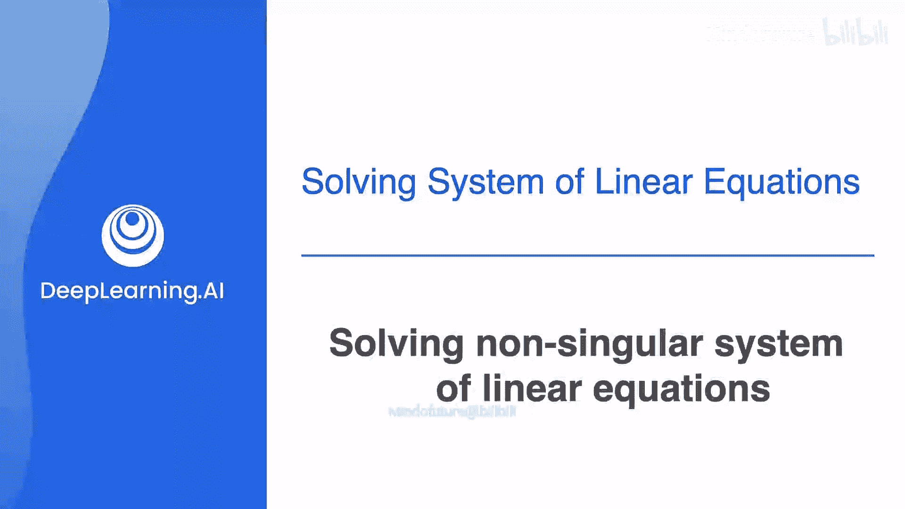
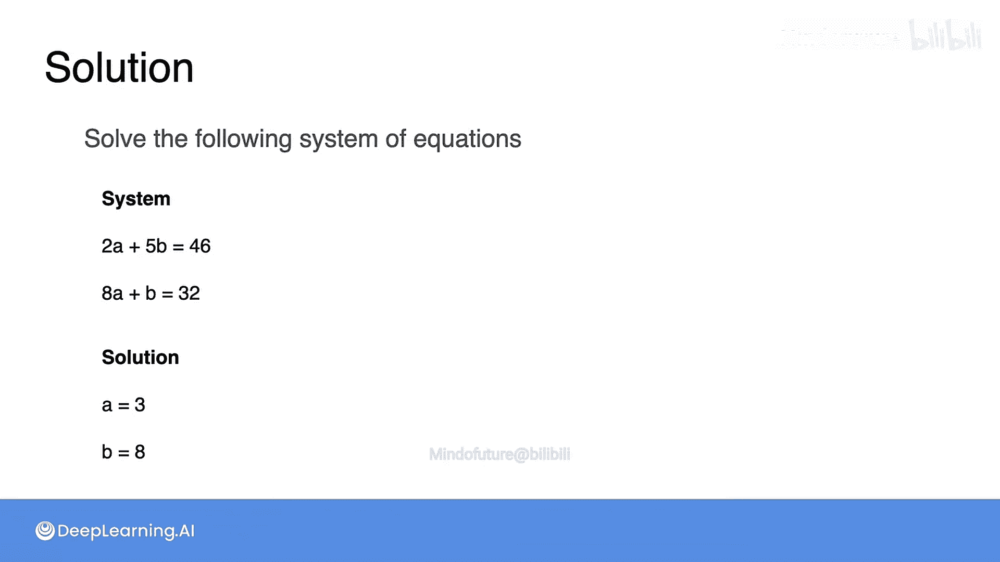

# 015：求解非奇异线性方程组




在本节课中，我们将要学习如何求解线性方程组。在前面的课程中，我们已经接触过这个概念，但现在是时候系统地学习一个通用方法。我们将学习一种算法，它不仅能帮助我们找到方程组的解，还能判断方程组是**奇异**（无解或无穷多解）还是**非奇异**（有唯一解）。

## 从具体例子到通用方法

首先，让我们回顾一下如何求解第一个方程组：`a + b = 10` 和 `a + 2b = 12`。这个场景是：一个苹果加一个香蕉花费10元，一个苹果加两个香蕉花费12元。

你当时推理出，第二天多买了一个香蕉，多花了2元，所以那个额外的香蕉一定花费2元。由此，结合两者共花费10元，你得出结论：苹果一定花费8元。这样，你就将原始的方程组转化为了一个已求解的方程组：`a = 8` 和 `b = 2`。

我们的目标就是将任何（非奇异的）方程组都转化为这样一个已求解的、每个方程只明确给出一个变量值的简单形式。为了实现这个转化，你需要遵循一个特定的过程，涉及对方程的**操作**，例如交换方程、相加方程以及乘以常数。

## 方程操作的基本规则

在深入求解过程之前，了解如何合法地操作方程至关重要。操作必须保证新方程蕴含的信息与原方程完全相同。

以下是两种核心操作：

1.  **乘以常数**：如果方程 `a + b = 10` 成立，那么两边同时乘以7得到的方程 `7a + 7b = 70` 也必然成立。
2.  **方程相加**：如果方程 `a + b = 10` 和 `2a + 3b = 26` 同时成立，那么将它们相加得到的方程 `3a + 4b = 36` 也必然成立。

## 分步求解：一个完整的例子

现在，我们来看一个更复杂的方程组，并应用这些操作来求解它。方程组如下：
```
5a + b = 17
4a - 3b = 6
```

我们的最终目标是得到形如 `a = ?` 和 `b = ?` 的已求解系统。第一步通常是尝试从第二个方程中**消去变量 `a`**，以便先解出 `b`。

**步骤一：标准化第一个变量的系数**

为了使后续消元更容易，我们通常先调整方程，让每个方程中 `a` 的系数都为1。这通过将每个方程除以 `a` 的系数来实现。

*   第一个方程除以5：`a + 0.2b = 3.4`
*   第二个方程除以4：`a - 0.75b = 1.5`

**步骤二：消元**

现在，为了从第二个方程中消去 `a`，我们可以用第二个方程减去第一个方程：
```
( a - 0.75b ) - ( a + 0.2b ) = 1.5 - 3.4
```
计算后得到：
```
-0.95b = -1.9
```

**步骤三：求解第一个变量**

现在，第二个方程已经只包含变量 `b`。我们通过两边同时除以 `-0.95` 来解出 `b`：
```
b = (-1.9) / (-0.95) = 2
```
太好了！我们已经找到了 `b` 的值。

**步骤四：回代求解第二个变量**

现在，将 `b = 2` 代入标准化后的第一个方程 `a + 0.2b = 3.4` 中：
```
a + 0.2 * 2 = 3.4
a + 0.4 = 3.4
a = 3.4 - 0.4 = 3
```
这样，我们就得到了 `a` 的值。

因此，方程组的解是 `a = 3`, `b = 2`。

## 特殊情况处理

有时，方程组一开始就有一个方程缺少某个变量。例如：
```
5a + b = 17
3b = 6
```
在尝试标准化 `a` 的系数时，第二个方程中 `a` 的系数为0，无法进行除法操作。但这其实是件好事！

第二个方程 `3b = 6` 本身就已经消去了 `a`，直接给出了 `b = 2`。然后，我们可以直接将 `b = 2` 代入第一个方程求解 `a`。这简化了我们的流程。

## 练习与验证

现在，你可以尝试自己求解一个方程组来巩固理解。

以下是需要你求解的方程组：
```
2a + 5b = 46
8a + b = 32
```

请运用我们刚刚学到的步骤进行求解。

（答案：`a = 3`, `b = 8`。我邀请你将这些值代入原方程进行验证。）

## 总结

本节课中，我们一起学习了求解二元一次线性方程组的系统方法——**消元法**。核心步骤包括：
1.  **标准化**：调整方程，方便消元。
2.  **消元**：通过加减方程，消除一个变量，得到只含另一个变量的方程。
3.  **求解**：解出该变量。
4.  **回代**：将解出的变量代回原方程，求出另一个变量。

我们还看到，如果某个方程已经缺少一个变量，那么求解过程会更加直接。这个方法是将复杂方程组转化为简单已求解系统的关键，也是理解更高级线性代数概念的基础。



