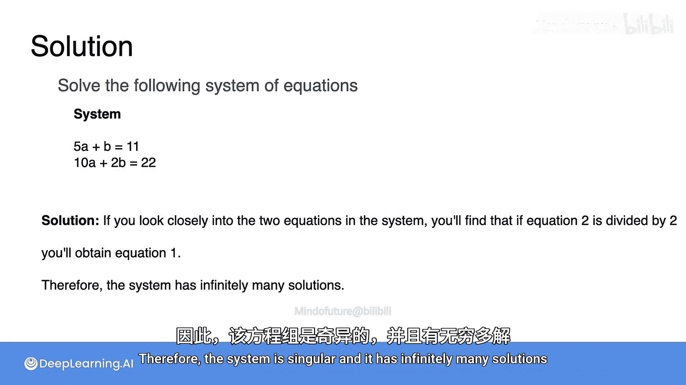

# 016：求解奇异线性方程组


在本节课中，我们将学习如何使用消元法来求解奇异线性方程组。我们将看到，与有唯一解的非奇异方程组不同，奇异方程组可能有无穷多解，也可能无解。

## 回顾与引入

上一节我们介绍了如何使用消元法求解非奇异线性方程组。本节中，我们来看看当方程组是奇异时，消元法会得到什么结果。奇异方程组是指那些没有唯一解的方程组。

## 求解冗余的奇异方程组

首先，我们来看一个冗余的奇异方程组。方程组如下：

**公式：**
```
a + b = 10
2a + 2b = 20
```

回忆一下，这个方程组是冗余的，因为第二个方程是第一个方程的两倍，没有提供新信息。

以下是使用消元法求解的步骤：

1.  首先，将两个方程都除以变量 `a` 的系数，以标准化第一个变量。
    *   第一个方程 `a + b = 10` 中 `a` 的系数是1，保持不变。
    *   第二个方程 `2a + 2b = 20` 除以2，得到 `a + b = 10`。
    此时，两个方程完全相同。

2.  接下来，尝试从第二个方程中消去 `a`。我们用第二个方程减去第一个方程：
    *   `(a + b) - (a + b) = 10 - 10`
    *   得到 `0 = 0`。

这个结果 `0 = 0` 是一个恒等式，没有提供关于变量 `a` 或 `b` 的任何新信息。在消元过程中，我们不仅消去了 `a`，也同时消去了 `b`，因为方程组是奇异的，两个方程线性相关。

因此，求解后有效的方程组只剩下一个方程：
**公式：**
```
a + b = 10
```

我们能否得到像 `a = ...` 和 `b = ...` 这样的唯一解呢？不能。但我们仍然可以描述所有解。我们可以任意选择一个数 `x`，令 `a = x`，那么根据 `a + b = 10`，`b` 必须等于 `10 - x`。

**代码：**
```python
# 解的形式，x 为任意实数
a = x
b = 10 - x
```

这个方程组有一个自由度（变量 `x`），改变 `x` 的值可以得到无穷多个解。这些解在坐标平面上形成一条直线。

## 求解矛盾的奇异方程组

现在，我们来看一个矛盾的奇异方程组。方程组如下：

**公式：**
```
a + b = 10
2a + 2b = 24
```

让我们使用相同的步骤来求解它。

以下是求解步骤：

1.  首先，将两个方程都除以变量 `a` 的系数。
    *   第一个方程保持不变：`a + b = 10`。
    *   第二个方程除以2：`a + b = 12`。

2.  然后，用第二个方程减去第一个方程，以消去 `a`：
    *   `(a + b) - (a + b) = 12 - 10`
    *   得到 `0 = 2`。

我们得到了一个矛盾的结果 `0 = 2`，这永远不成立。因此，这个方程组没有任何解。

## 小测验

现在，你可以尝试解决以下方程组：
**公式：**
```
5a + b = 11
10a + 2b = 22
```

如果你仔细观察，会发现第二个方程正好是第一个方程的两倍（将第一个方程乘以2即得到第二个方程）。因此，这个方程组是奇异的，并且有无穷多解。

## 总结



本节课中，我们一起学习了如何使用消元法处理奇异线性方程组。我们发现：
*   对于**冗余**的奇异方程组，消元后会得到一个恒等式（如 `0=0`），方程组有**无穷多解**，解集可以用自由变量表示。
*   对于**矛盾**的奇异方程组，消元后会得到一个不可能的等式（如 `0=2`），方程组**无解**。
*   消元法清晰地揭示了方程组是存在唯一解、无穷多解还是无解。