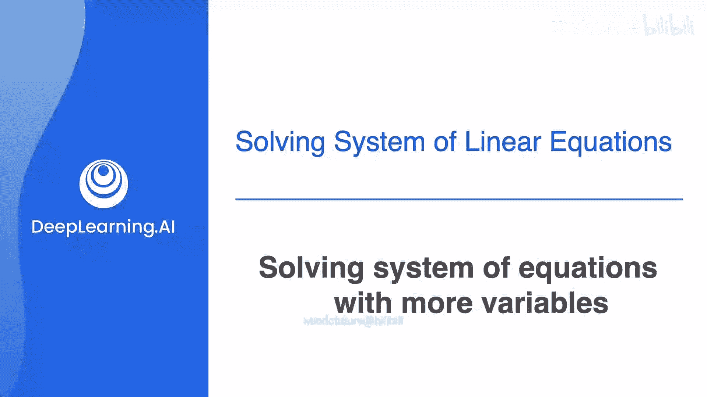
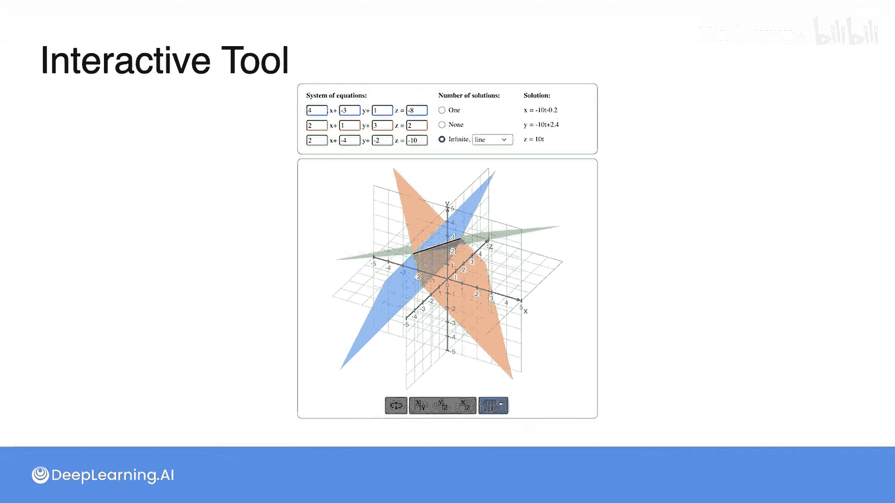

# 017：求解变量更多的方程组 🔢



在本节课中，我们将学习如何求解包含三个方程和三个未知数的方程组。我们将沿用求解二元方程组的核心思想，并将其扩展到三维空间。

## 概述 📋

上一节我们介绍了如何求解包含两个方程和两个变量的方程组。本节中，我们来看看如何将同样的方法应用于包含三个方程和三个变量的更复杂系统。核心步骤是**消元**，通过一系列操作，将复杂的方程组逐步化简为我们可以求解的简单形式。

## 求解三元方程组 🧮

我们的目标是求解以下形式的方程组：
```
a₁x + b₁y + c₁z = d₁
a₂x + b₂y + c₂z = d₂
a₃x + b₃y + c₃z = d₃
```
为了清晰，我们使用变量 `a`, `b`, `c` 代替 `x`, `y`, `z`。

### 第一步：标准化第一列（消去 `a`）

首先，我们需要**隔离变量 `a`**，确保只有第一个方程包含 `a`，而第二和第三个方程中不包含 `a`。

具体操作如下：
1.  **标准化**：将每个方程都除以 `a` 的系数，使得每个方程中 `a` 的系数都变为 `1`。
2.  **消元**：然后，用第一个方程减去第二个和第三个方程，以消除它们中的 `a` 项。

经过这些操作后，我们得到了一个新的方程组。在这个新系统中，`a` 已被成功隔离，剩下的是一个关于变量 `b` 和 `c` 的二元方程组。

### 第二步：求解剩余的二元方程组

现在，我们可以暂时忽略第一个方程，专注于解决剩下的两个方程（关于 `b` 和 `c` 的方程）。

以下是具体步骤：
1.  对这两个方程进行**标准化**，使 `b` 的系数变为 `1`。
2.  用第二个方程减去第三个方程，以消除第三个方程中的 `b` 项。
3.  这样，我们就得到了一个只包含 `c` 的简单方程，可以轻松解出 `c` 的值。例如，我们可能得到 `c = 3`。

### 第三步：回代求解所有变量

一旦我们求出了 `c` 的值，就可以通过**回代**来求解其他变量。

步骤如下：
1.  将 `c` 的值代入第二个方程，求解出 `b` 的值（例如 `b = 2`）。
2.  最后，将已知的 `b` 和 `c` 的值代入第一个方程，求解出 `a` 的值（例如 `a = 4`）。

至此，我们得到了方程组的完整解：`a = 4, b = 2, c = 3`。

## 可视化与深入理解 🛸

在掌握计算方法后，你将有机会使用一个交互式工具来探索三维空间中的方程组。

*   在该工具中，**每个方程被可视化为一个在三维空间中漂浮的平面**。
*   **方程组的解则对应为这些平面的交点**。

通过操作这个工具，你可以直观地看到消元过程在几何上的意义，从而深化对线性代数概念的理解。工具下方还会提供一些建议的练习活动。

## 总结 ✨

本节课中，我们一起学习了如何求解三元一次方程组。核心方法是**高斯消元法**，其步骤可概括为：
1.  **消元**：通过行操作，将方程组化为“阶梯形”，逐步减少未知数。
2.  **回代**：从最后一个方程解出一个未知数，然后逐一代回上一个方程，求出所有未知数。



我们还将方程组的代数解与三维空间中的几何表示（平面相交）联系了起来，这有助于建立更直观的理解。接下来，你可以通过交互工具来巩固和探索这些概念。