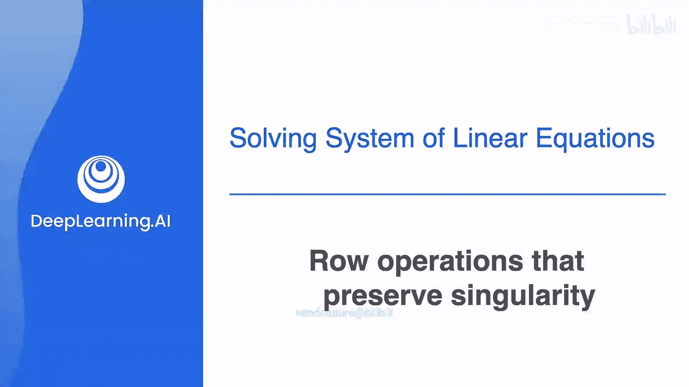
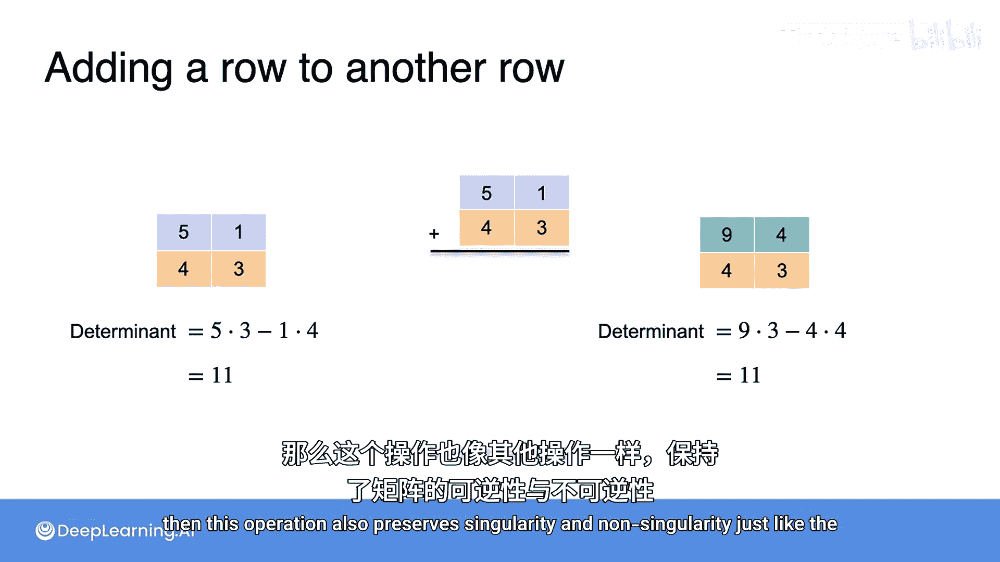

# 019：保持矩阵奇偶性的行操作 🧮



在本节中，我们将学习矩阵的三种基本行操作。这些操作是求解线性方程组和进行矩阵化简（如行阶梯形化简）的核心工具。更重要的是，我们将看到这些操作如何保持矩阵的一个关键性质——奇异性（即矩阵是否可逆）。

在深入整个行化简过程之前，需要明确一点：用于求解线性方程组的相同操作也可以应用于矩阵。这些操作被称为矩阵的行操作，它们有一个非常重要的性质：**保持矩阵的奇异性**。换句话说，如果你对一个奇异矩阵应用这些操作，得到的结果仍然是奇异矩阵；如果你对一个非奇异矩阵应用这些操作，得到的结果仍然是非奇异矩阵。

---

## 初始矩阵示例

首先，我们考虑一个具体的矩阵：
```
[5, 1]
[4, 3]
```
第一步，通过计算行列式来判断这个矩阵是奇异的还是非奇异的。
行列式的计算公式为：**det = (5 * 3) - (1 * 4) = 15 - 4 = 11**。
由于行列式不为零（11 ≠ 0），因此该矩阵是**非奇异**的。

---

## 第一种行操作：行交换

你学到的第一种行操作是交换两行的位置。
如果我们交换上述矩阵的两行，将得到新矩阵：
```
[4, 3]
[5, 1]
```
既然原矩阵是非奇异的，那么交换行后的矩阵也应该是非奇异的。如何验证呢？我们来计算新矩阵的行列式。
新行列式为：**det = (4 * 1) - (3 * 5) = 4 - 15 = -11**。
-11 同样不等于 0，因此它也是非奇异的。事实上，像这样交换行后，新矩阵的行列式总是原行列式的**相反数**。
原因在于，对角线上的元素互换了位置：原来相加的项现在变成了相减，原来相减的项现在变成了相加。所以，原本是 15 - 4，现在变成了 4 - 15，从而得到 -11。
可以想象，如果原行列式是 0，那么得到的结果也必然是 0。这意味着，如果你对一个奇异矩阵应用此操作，得到的仍是奇异矩阵。同样，如果原行列式不为 0，得到的结果也不为 0。
**因此，行交换操作保持了矩阵的奇异性或非奇异性。**

---

## 第二种行操作：行乘以非零标量

接下来是第二种操作：将某一行乘以一个**非零**标量。
我们使用同一个行列式为 11 的矩阵。现在修改第一行：保持第二行不变，将第一行乘以一个数，例如 10。
得到新的第一行：`[50, 10]`。
因此，修改后的新矩阵为：
```
[50, 10]
[ 4,  3]
```
这个新矩阵的行列式是多少？
计算如下：**det = (50 * 3) - (10 * 4) = 150 - 40 = 110**。
请注意，110 正好是 10 乘以原矩阵的行列式 11。因为在每条对角线的乘积项中，你都恰好取了第一行的一个元素并将其乘以了 10，所以整个行列式也被乘以了 10。
这里的关键是，所乘的标量必须**非零**。如果标量（如这里的 10）非零，那么此操作会将一个非零行列式变为另一个非零行列式，将一个零行列式变为零行列式。
**因此，这种行乘以非零标量的操作，同样保持了矩阵的奇异性与非奇异性。**

---

## 第三种行操作：将一行加到另一行

最后一种操作是：取一行，将其加到另一行上。
例如，取原矩阵第一行与第二行的和：`[5+4, 1+3] = [9, 4]`。
让 `[9, 4]` 作为新矩阵的顶行，底行保持不变。得到新矩阵：
```
[9, 4]
[4, 3]
```
这个新矩阵的行列式是：**det = (9 * 3) - (4 * 4) = 27 - 16 = 11**。
令人惊讶的是，进行此操作后，行列式的值与原矩阵相同（都是 11）。证明这一点稍复杂，你可以在课程资料中找到书面证明。
但最重要的部分是：**由于在此操作后行列式保持不变，那么该操作也像前两种操作一样，保持了矩阵的奇异性与非奇异性。**

---

## 本节总结

在本节课中，我们一起学习了矩阵的三种基本行操作：
1.  **行交换**：改变两行的位置，行列式变为原行列式的相反数。
2.  **行乘以非零标量**：将某一行整体乘以一个非零常数，行列式变为原行列式的相应倍数。
3.  **将一行加到另一行**：将一行的倍数加到另一行，行列式保持不变。



这三种操作共同具备一个核心性质：**它们都保持矩阵的奇异性（是否可逆）**。这意味着，在进行复杂的矩阵化简（如高斯消元法）以求解方程组或求逆矩阵时，我们可以放心使用这些操作，而不会改变矩阵解的根本性质（有唯一解、无解或无穷多解）。这是线性代数中一个非常强大且实用的概念。